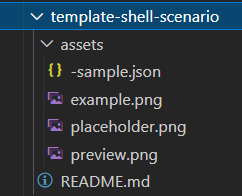

# Maintainers Guidance

This is the maintainers guide to provide a location to share knowledge about how the site works and some of the behaviors of the setup and underlying configuration.

The site uses the DocFx engine, this is the same tool that [docs.microsoft.com](https://docs.microsoft.com) uses (albeit a special version) in combination with the Material UI + UI tweaks we have made with the help and thanks for Hugo Bernier.

In addition, plugins have been developed to extend DocFx to generate the galleries.

The main goal with DocFx builds must complete with **0 warnings and errors**. The site will not publish/update if there are warnings.

## Front Matter for Gallery Pages

A small amount of front matter is used to tag the pages to inject the gallery into.

### Generate galleries

| Front Matter Example  | Action taken by Plugin  |
|-----------------------|-------------------------|
| plugin: insert-gallery | Inserts a gallery into the page that contains this marker: "*--this will be auto generated--*" the generator will replace this line with the gallery. |
| plugin: add-to-gallery | Registers the sample is ready to be added to the gallery |
| plugin-filter: product | Changes the gallery presentation mode. <br /> None = by operation, product = By Product and library = by library |

Currently, there are 3 pages that galleries are used:

* Index.md - default gallery page
* bytool.md - By Library gallery page e.g. M365 CLI, PnP PS, Graph PS SDK etc.
* byproduct.md - By Product e.g. Microsoft Product the script performs an action against

#### Initial State

Initially there are features in the sample generation that prevent it from showing in the gallery, allowing commits to be created and then readied with subsequent commits.

```markdown
---
plugin: add-to-gallery-preparation
---
```

To show in the gallery simply update to "plugin: add-to-gallery".

## Folder Structure for scripts

We have worked to keep the folder structure lean and as simple as possible when submitting scripts:



## Naming and casing

DocFx is case sensitive with the markdown files and in compilation of the site, to make this easier, all sample file paths etc. should be in lowercase to avoid any issues with linking to files.

Spaces should be replaced with hyphens as well.


## Images and previews

When creating images and previews, please follow this guidance:

* Favor the product UI change, close up of the affect element if preferred, to reduce the updates
* If delete, show a before image and indicate what is being removed.
* Terminal is less favorable because it would only show output of 1 of the three types of script that could run.
* PNG format preferred, JPG can be submitted, though these will be converted to PNG.

If only example images are shown, Paul Bullock has a tool to convert in bulk.

## Recognizing contributors

When samples are submitted it is important that contributors are recognized for their contributions as without them the library would not grow, this is done in the following ways:

* Their name on the sample. If we as a maintainer also contributes to the article, they must be the primary or first name.
* The article must list their name, company and GitHub/LinkedIn/Twitter handle - we will encourage their complete this.
* Promotion to Twitter - their sample will get promoted to Twitter for exposure.


