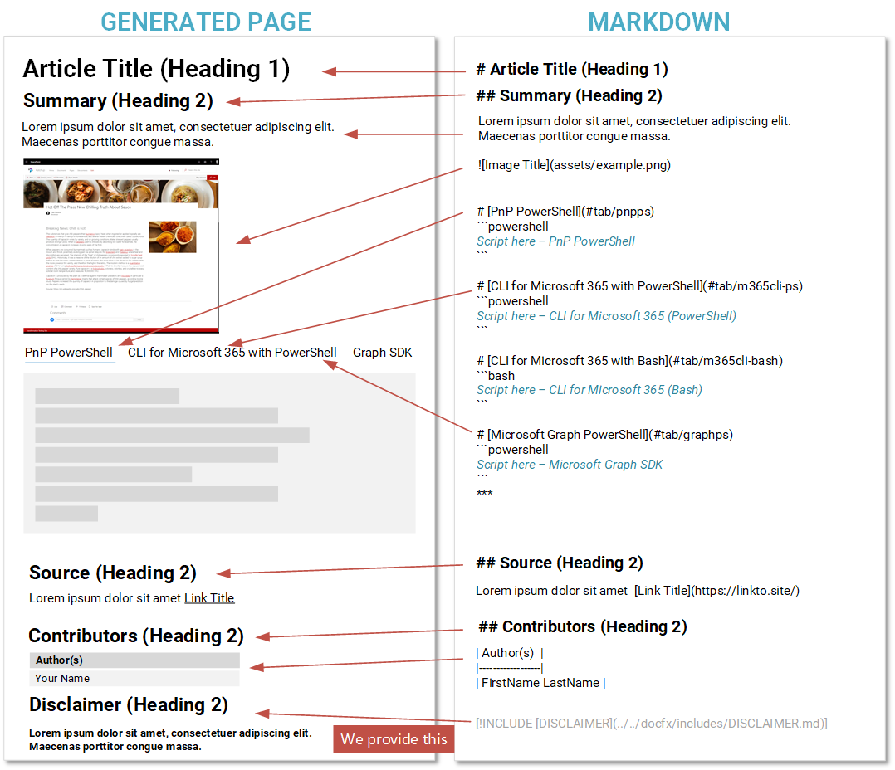

# Preparing a submission

Thank you for considering contributing to this repository. In order to help you get started, we have prepared this guide to provide you with the information you need to prepare your submission.

## Markdown

This repository uses a text based markup called "Markdown" which allows you to write articles/pages quickly without having to worry about the presentation of the page. Even this page is written using this - we use a site generator to turn this into a page automatically.

If you want to learn more about Markdown checkout this guide by Bob German on Tech Community - [What's up with Markdown?](https://techcommunity.microsoft.com/t5/microsoft-365-pnp-blog/what-s-up-with-markdown/ba-p/2323834)

## Page Structure

The page follows a standard format, we have created a graphic to explain the layout and the markdown for each section:

> [!div class="full-image-size"]
> 

The minimum we need for the submission is:

- **Article Title** - the title for your script
- **Summary** - for briefly describing what the script does
- **Image**, ideally named "example.png" in an assets folder, presenting the end result of the operation. The more visual the better.
- **Script** - minimum of at least one type. We support a wide range of script types, if this is not listed in the template file, we can add support for that type when you submit your PR.
- **Contributors** - your name, or if a joint submission those you have worked with - so that we can attribute credit for the submission.

We add the disclaimer statement at the bottom.

## Key elements of Markdown we use

```markdown

# Heading 1
## Heading 2
### Heading 3


| Table Header |
|--------------|
| Table Data   |


[Hyperlink](https://bing.co.uk)


```

### Tabs containing scripts

Each tab contains the sample for the scripts named under a specific tool. Use the following markdown to contain the script in the tab:

```markdown

# [PnP PowerShell](#tab/pnpps)
``powershell
    Your-PowerShellScript
``

# [CLI for Microsoft 365 using PowerShell](#tab/cli-m365-ps)
`` powershell
    Your-PowerShellScript
``

# [CLI for Microsoft 365 using Bash](#tab/cli-m365-bash)
``bash
    echo "your bash script"
``

# [Microsoft Graph PowerShell](#tab/graphps)
``powershell
    Your-PowerShellScript
``

```

> [!note]
> * Use three backticks around the script, not the two shown above
> * Delete the tabs you do not need


We add an additional block to provide guidance back to the tool guiding site:

```markdown
[!INCLUDE [More about CLI for Microsoft 365](../../docfx/includes/MORE-CLIM365.md)]
```

## Submission Template Files

There is a template submission folder called "_template-script-submission" in [_template-script-submission | GitHub - PnP Script Samples](https://github.com/pnp/script-samples/tree/main/scripts/_template-script-submission).

Before you can submit, you need to make sure you are setup with a "fork" of the repository in your own account, please navigate to [Submitting Pull Requests](submitting-pull-requests.md) for setup information.

The template submission folder contains:

- **README.md** - Sample Readme with the structure, remove the dummy text and update the areas for your submission
- **assets/example.png** - image for the sample, simply replace with a screenshot to show in the article

### Script Quality

In the PnP Script Samples, we do not place any specific quality requirements on the scripts themselves. To help guide you for suggested ways to present your scripts:

- Indent the scripts when encapsulating blocks in curly braces - this make it easier to read the blocks and understand the script
- Use comments, if you feel the script isn't clear by itself what it is doing. However, do not overload the script with comments either.
- Use good naming for variables to understand what is being stored
- Check the script works as you would expect it to, preferably include a screenshot of the end result, to help guide the reader.
- Remove any lines that show details of **your** tenant, e.g. usernames, passwords, URLs (replace with Contoso).


> [!note]
> If you would like an example, please refer to the following script: [Generate Demo Events for SharePoint Events List | PnP Script Samples](https://pnp.github.io/script-samples/spo-generate-demo-events/README.html) <br />
> Please note: this isn't an expected sample style, quality or format, or a gold standard just an idea if you feel you need some ideas on how to present your script. <br /><br />
> We fully understand that there any multiple styles and approaches, and __we are happy to accept the submission in your style__ 😊

### Optional files

- **assets/template.sample.json** - this is a metadata file used for the gallery views, this is optional *DO NOT HAVE TO COMPLETE THIS*
- **assets/preview.png** - we generate a preview from the example.png file, you do not have to update this.

### Folder Structure

We have worked to keep the folder structure lean and as simple as possible when submitting scripts:

```markdown

+--- script-folder-title - *folder for the script based on the title of your sample, please all lowercase and spaces as hyphens*
  |___ assets - *sub folder for any images or assets you need to support your sample*
```


