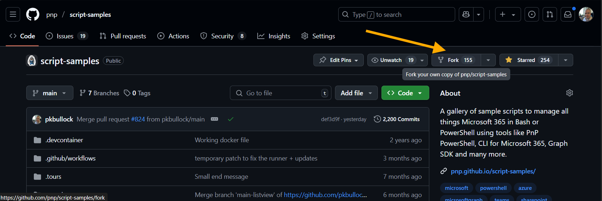
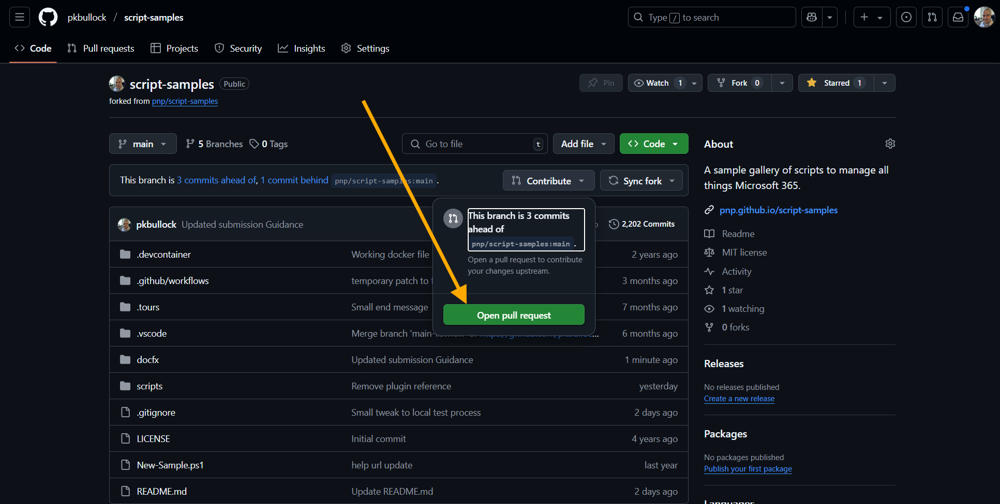
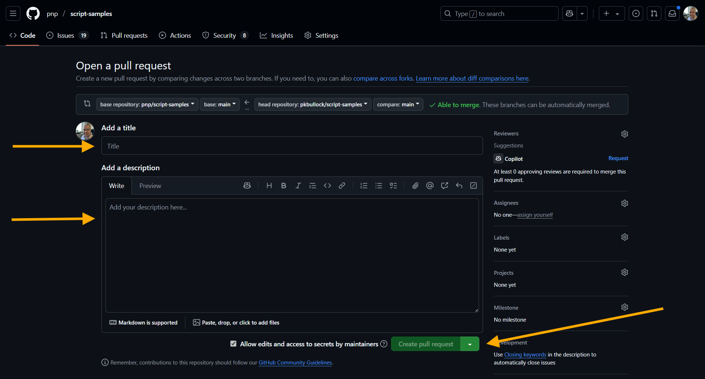

# Submitting Pull Requests

Welcome contributors, here is a guide to help you create a new sample or update an existing sample within PnP Script Samples site.

## The process

This is the process for submitting new samples or updates to existing samples to the repository.

 - Step 1 - Signing the CLA (One-time activity)
 - Step 2 - Fork the repository (One-time activity)
 - Step 3 - Preparing a submission
 - Step 4 - Create a pull request
 - Step 5 - What happens next, when the sample is submitted


## Step 1 - Signing the CLA (One-time activity)

Before we can accept your pull requests you will be asked to sign electronically Contributor License Agreement (CLA), which is a pre-requisite for any contributions all PnP repositories. This will be one-time process, so for any future contributions you will not be asked to re-sign anything. After the CLA has been signed, our PnP core team members will have a look at your submission for a final verification of the submission. **Please do not delete your development branch until the submission has been closed.**

You can find Microsoft CLA from the following address - https://cla.microsoft.com.

## Step 2 - Fork the repository (One-time activity)

In GitHub here: https://github.com/pnp/script-samples

Find the Fork button:



This will make a copy of the site code within your account, this is where you will create the submission.

We recommend you use [Visual Studio Code](https://code.visualstudio.com/), as your editor.

### Want to practice the setup?

If you feel insecure or would struggle to do this and are new to GitHub, please consider to attend the [Sharing Is Caring sessions from the PnP team](https://pnp.github.io/sharing-is-caring/#pnp-sic-events) in which the Microsoft 365 PnP team provides hands-on guidance for first time contributors -these are NOT recorded and completely safe space to ask questions.

## Step 3 - Preparing a submission

Please visit this page - [Preparing a submission](preparing-a-submission.md), to see the details of the submission, then return here to continue.

## Step 4 - Create a pull request

Ensure you commit your changes to your fork (copy of the site code) 


Then click "Sync Changes"

When you are ready to submit your sample, you will see a button to ```Open a Pull Request```



You will then be taken to a form, where you can complete:

- Title of the Pull Request e.g. ```New Sample - Saving File to SharePoint```
- Description - include some detail about the sample

When you are happy with the Pull Request, click ```Create Pull Request```



> Note: if you want to make additions or changes at this point, you can just edit and commit new changes, it will be included in the Pull Request up to the point we merge (Save into the Script Samples repository) the request.

## Step 5 - What happens next, when the sample is submitted

We will review the submission, make small tweaks if needed and provide feedback. The submission will get approved, we will merge it into the `main` branch and it will be published to the [PnP Script Samples](https://pnp.github.io/script-samples/) site within a few minutes via an automated process.

Once published, we will begin to promote the sample on social media, see our details on [Recognizing Contributors](recognition.md).

**THANK YOU! For reading this guide and taking the time to submit samples.**

If you have any issues, please create an issue here in GitHub: [Issues in PnP Script Samples](https://github.com/pnp/script-samples/issues) we would be happy to help. 

Please be aware contributors and maintainers run this repository in their spare time and response may not be immediate, although we endevour to process your submission within a few days.


