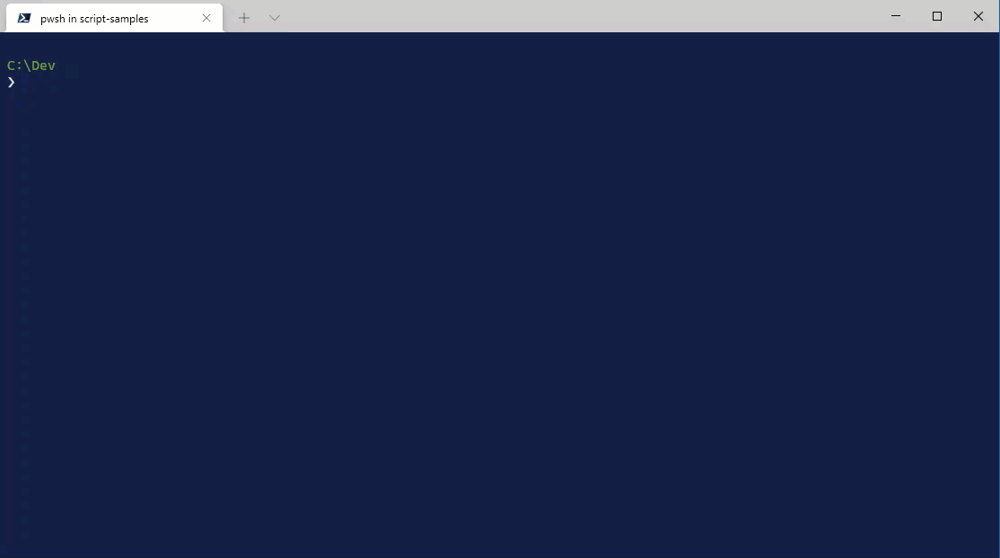

# Connected Account tooltip in PowerShell

When using PowerShell, the [Magic Tooltips module](https://www.powershellgallery.com/packages/MagicTooltips) can be installed to help determine the account that is connected to Microsoft 365 or Azure.



## Get Started with Tooltip for Connected Account

To get started with the Magic Tooltip module, perform the following steps:

1. Install and import the module

    ```
    Install-Module MagicTooltips
    Import-Module MagicTooltips -Force
    ```

    To make the module auto-load, add the Import-Module line to your [PowerShell profile](#powershell-profile).

2. Start typing a CLI command or Microsoft Graph PowerShell cmdlet.

That's it! 😊

## Tooltip Configuration

The Magic Tooltips module provides for configuring its triggers and display. Complete configuration information can be found in [the GitHub repo for the module](https://github.com/pschaeflein/MagicTooltips).
