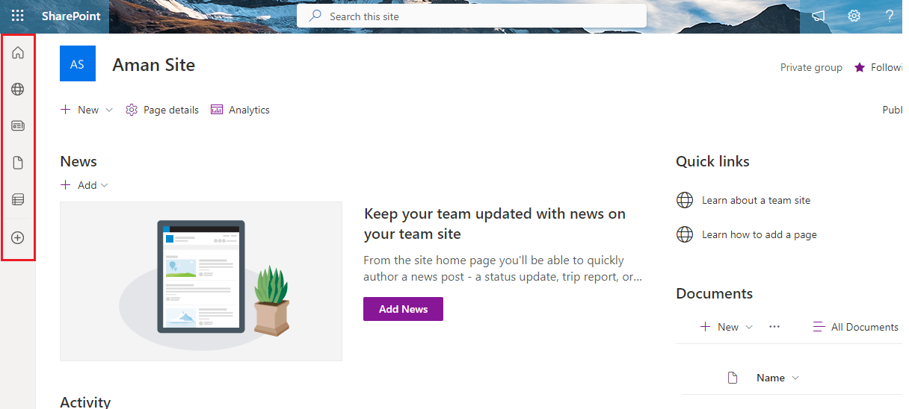

# Enable and Disable App Bar in SharePoint Online

## Summary

This script sample demonstrates how to enable and disable the App Bar on SharePoint online sites by utilizing PnP PowerShell and SPO Management Shell.




# [PnP PowerShell](#tab/pnpps)

```powershell

<your script>

```

# [SPO Management Shell](#tab/spoms-ps)

```powershell

# Connect to SPOService using Tenant URL
Connect-SPOService "https://contoso.sharepoint.com"

# Set Temporarily Disable App Bar True in Order to Disable
Set-SPOTemporarilyDisableAppBar $true

# Set Temporarily Disable App Bar True in Order to Enable
Set-SPOTemporarilyDisableAppBar $false

```

## Source Credit

Sample first appeared on [https://pnp.github.io/cli-microsoft365/sample-scripts/spo/add-app-catalog/](https://pnp.github.io/cli-microsoft365/sample-scripts/spo/add-app-catalog/)

## Contributors

| Author(s) |
|-----------|
| <-you-> |


[!INCLUDE [DISCLAIMER](../../docfx/includes/DISCLAIMER.md)]

