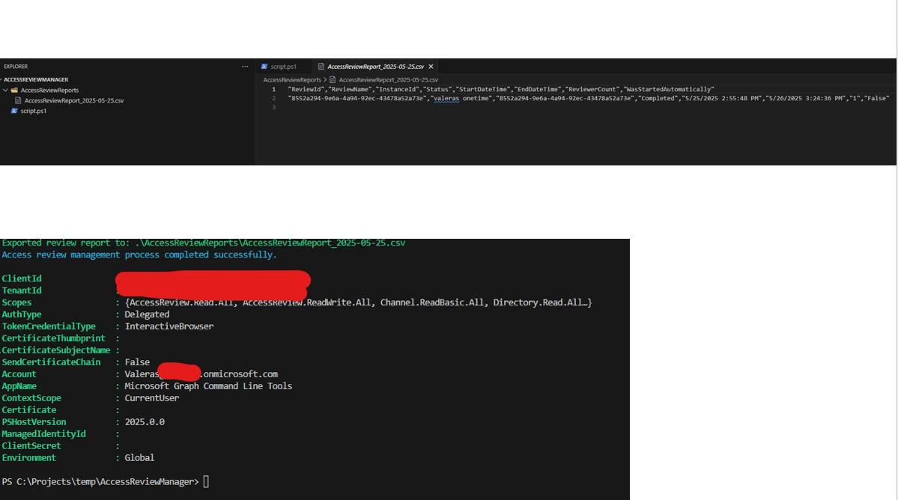

# Download Access-Review results across all groups

## Summary

This script automates the management and reporting of Access Reviews in Entra ID. It addresses the common problem where access reviews are often left uncompleted or unattended. The script:

1. Enumerates all access review definitions in your tenant
2. Identifies and triggers any overdue reviews
3. Polls for completion status of active reviews
4. Exports all decisions (accessReviewInstanceDecisionItem) to CSV for audit and record-keeping

The automation helps security and compliance teams ensure that access reviews are completed on time and provides thorough documentation of all decisions made during the review process.



## Prerequisites

- Microsoft Graph PowerShell SDK modules
- Permissions required:
  - AccessReview.Read.All (to enumerate and read access reviews)
  - AccessReview.ReadWrite.All (to start reviews and retrieve decisions)
- An account with appropriate permissions to run access reviews
- PowerShell 5.1 or higher

# [Microsoft Graph PowerShell](#tab/graphps)

```powershell
#-----------------------------------------------------------------------
# Kick-off & Download Access-Review Results Across All Groups
#
# This script will:
# 1. Connect to Microsoft Graph with the required permissions
# 2. Enumerate all access review definitions
# 3. Start any overdue reviews
# 4. Poll for completion
# 5. Export all decisions to CSV for audit purposes
#-----------------------------------------------------------------------

# Check if the required modules are installed and import them
if (!(Get-Module -Name Microsoft.Graph)) {
    Write-Host "Microsoft Graph PowerShell module not found. Installing..." -ForegroundColor Yellow
    Install-Module Microsoft.Graph -Scope CurrentUser -Force
}

# Connect to Microsoft Graph with the required permissions
Connect-MgGraph -Scopes "AccessReview.Read.All", "AccessReview.ReadWrite.All" -NoWelcome

# Set the output directory for reports
$outputDir = ".\AccessReviewReports"
if (!(Test-Path $outputDir)) {
    New-Item -ItemType Directory -Path $outputDir | Out-Null
}

# Get the current date for reporting
$currentDate = Get-Date -Format "yyyy-MM-dd"
$reportFile = Join-Path $outputDir "AccessReviewReport_$currentDate.csv"
$decisionsFile = Join-Path $outputDir "AccessReviewDecisions_$currentDate.csv"

# Function to get all access review definitions
function Get-AllAccessReviews {
    try {
        # Get all access review definitions
        $accessReviews = Invoke-MgGraphRequest -Uri "https://graph.microsoft.com/v1.0/identityGovernance/accessReviews/definitions" -Method GET
        return $accessReviews.value
    }
    catch {
        Write-Error "Error retrieving access review definitions: $_"
        return $null
    }
}

# Function to start an overdue access review
function Start-OverdueAccessReview {
    param (
        [Parameter(Mandatory = $true)]
        [string]$ReviewId
    )
    
    try {
        # Start the access review
        Invoke-MgGraphRequest -Uri "https://graph.microsoft.com/v1.0/identityGovernance/accessReviews/definitions/$ReviewId/start" -Method POST
        Write-Host "Successfully started access review: $ReviewId" -ForegroundColor Green
        return $true
    }
    catch {
        Write-Error "Error starting access review $ReviewId : $_"
        return $false
    }
}

# Function to get all instances of an access review
function Get-AccessReviewInstances {
    param (
        [Parameter(Mandatory = $true)]
        [string]$ReviewId
    )
    
    try {
        # Get all instances of the access review
        $instances = Invoke-MgGraphRequest -Uri "https://graph.microsoft.com/v1.0/identityGovernance/accessReviews/definitions/$ReviewId/instances" -Method GET
        return $instances.value
    }
    catch {
        Write-Error "Error retrieving instances for access review $ReviewId : $_"
        return $null
    }
}

# Function to get all decisions for an access review instance
function Get-AccessReviewDecisions {
    param (
        [Parameter(Mandatory = $true)]
        [string]$ReviewId,
        
        [Parameter(Mandatory = $true)]
        [string]$InstanceId
    )
    
    try {
        # Get all decisions for the access review instance
        $decisions = @()
        $uri = "https://graph.microsoft.com/v1.0/identityGovernance/accessReviews/definitions/$ReviewId/instances/$InstanceId/decisions"
        
        do {
            $response = Invoke-MgGraphRequest -Uri $uri -Method GET
            $decisions += $response.value
            $uri = $response.'@odata.nextLink'
        } while ($uri)
        
        return $decisions
    }
    catch {
        Write-Error "Error retrieving decisions for access review instance $InstanceId : $_"
        return $null
    }
}

# Main script execution
Write-Host "Starting access review management process..." -ForegroundColor Cyan

# Get all access review definitions
$allReviews = Get-AllAccessReviews
if ($null -eq $allReviews) {
    Write-Host "No access reviews found or error retrieving them. Exiting." -ForegroundColor Red
    exit
}

Write-Host "Found $($allReviews.Count) access review definitions." -ForegroundColor Green

# Create an array to store review information for reporting
$reviewReport = @()
$allDecisions = @()

# Process each access review
foreach ($review in $allReviews) {
    Write-Host "Processing Access Review: $($review.displayName)" -ForegroundColor Cyan
    
    # Check if the review is overdue to start
    $shouldStart = $false
    if ($review.status -eq "NotStarted") {
        $startDateTime = [DateTime]::Parse($review.schedule.startDateTime)
        if ($startDateTime -lt (Get-Date)) {
            $shouldStart = $true
            Write-Host "  Review is overdue to start. Attempting to start it now..." -ForegroundColor Yellow
            $started = Start-OverdueAccessReview -ReviewId $review.id
            if ($started) {
                $review.status = "InProgress"
            }
        }
    }
    
    # Get instances for this review
    $instances = Get-AccessReviewInstances -ReviewId $review.id
    if ($null -eq $instances) {
        Write-Host "  No instances found for this review." -ForegroundColor Yellow
        continue
    }
    
    Write-Host "  Found $($instances.Count) instances for this review." -ForegroundColor Green
    
    # Process each instance
    foreach ($instance in $instances) {
        # Add to the report
        $reviewInfo = [PSCustomObject]@{
            ReviewId              = $review.id
            ReviewName            = $review.displayName
            InstanceId            = $instance.id
            Status                = $instance.status
            StartDateTime         = $instance.startDateTime
            EndDateTime           = $instance.endDateTime
            ReviewerCount         = $instance.reviewers.Count
            WasStartedAutomatically = $shouldStart
        }
        $reviewReport += $reviewInfo
        
        # If the instance is completed, get all decisions
        if ($instance.status -eq "Completed") {
            Write-Host "    Getting decisions for completed instance $($instance.id)" -ForegroundColor Green
            $decisions = Get-AccessReviewDecisions -ReviewId $review.id -InstanceId $instance.id
            
            if ($null -ne $decisions -and $decisions.Count -gt 0) {
                foreach ($decision in $decisions) {
                    $decisionInfo = [PSCustomObject]@{
                        ReviewId         = $review.id
                        ReviewName       = $review.displayName
                        InstanceId       = $instance.id
                        DecisionId       = $decision.id
                        ResourceId       = $decision.resourceId
                        Decision         = $decision.decision
                        ReviewedBy       = $decision.reviewedBy.displayName
                        ReviewedByUpn    = $decision.reviewedBy.userPrincipalName
                        AppliedBy        = $decision.appliedBy.displayName
                        AppliedDateTime  = $decision.appliedDateTime
                        Justification    = $decision.justification
                    }
                    $allDecisions += $decisionInfo
                }
                Write-Host "    Retrieved $($decisions.Count) decisions." -ForegroundColor Green
            }
            else {
                Write-Host "    No decisions found for this instance." -ForegroundColor Yellow
            }
        }
    }
}

# Export the reports to CSV
if ($reviewReport.Count -gt 0) {
    $reviewReport | Export-Csv -Path $reportFile -NoTypeInformation
    Write-Host "Exported review report to: $reportFile" -ForegroundColor Green
}

if ($allDecisions.Count -gt 0) {
    $allDecisions | Export-Csv -Path $decisionsFile -NoTypeInformation
    Write-Host "Exported decision details to: $decisionsFile" -ForegroundColor Green
}

Write-Host "Access review management process completed successfully." -ForegroundColor Cyan
Disconnect-MgGraph
```
[!INCLUDE [More about Microsoft Graph PowerShell SDK](../../docfx/includes/MORE-GRAPHSDK.md)]
***


## Contributors

| Author(s) |
|-----------|
| [Valeras Narbutas](https://github.com/ValerasNarbutas) |

## Additional Information

### Key Microsoft Graph API Endpoints Used

1. List access review definitions:
   - `GET /identityGovernance/accessReviews/definitions`

2. Start an access review:
   - `POST /identityGovernance/accessReviews/definitions/{reviewId}/start`

3. Get access review instances:
   - `GET /identityGovernance/accessReviews/definitions/{reviewId}/instances`

4. Get access review decisions:
   - `GET /identityGovernance/accessReviews/definitions/{reviewId}/instances/{instanceId}/decisions`

### Sample Output

The script produces two CSV files:

1. **Access Review Report** - Lists all access review definitions and their instances with status
2. **Access Review Decisions** - Contains all decisions made across completed reviews

### Scheduling the Script

For optimal results, consider scheduling this script to run weekly to ensure that:
- New access reviews are started promptly
- Completed reviews have their decisions exported for record-keeping
- You have visibility into the overall access review health of your tenant

[!INCLUDE [DISCLAIMER](../../docfx/includes/DISCLAIMER.md)]

