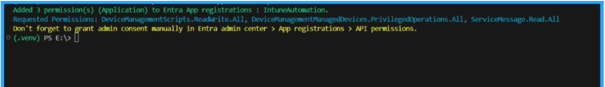

# Get Azure AD app permission info (delegated or application)

## Summary

Add-EntraAppPermission.ps1 adds requested Graph permissions to the app registration's requiredResourceAccess collection. It resolves permission names against the Microsoft Graph service principal and updates the app registration using Microsoft Graph. The script connects with Application.ReadWrite.All.



By default, the script has only registered Microsoft Graph and SharePoint Online Microsoft AAD apps (with their respective appId property). Feel free to add any other API listed [here](https://learn.microsoft.com/troubleshoot/azure/active-directory/verify-first-party-apps-sign-in#application-ids-for-commonly-used-microsoft-applications) in the `AadApis` class!


# [CLI for Microsoft 365 using PowerShell](#tab/cli-m365-ps)

```powershell

# User Input
$api = "Microsoft Graph" # Or "SharePoint"
$permission = "Sites.Read.All" # Can be "Read" if seeking more permissions

# Connect to Microsoft 365
if ($(m365 status) -match "Logged Out") {
  m365 login
}

# Configure the CLI to output as JSON on each execution
$m365output = m365 cli config get --key output
if ($m365output -notmatch "json") {
    m365 cli config set --key output --value json
}

# Get CLI commands JSON output converted as objects
function Get-CLIValue {
    [cmdletbinding()]
    param(
        [parameter(Mandatory = $true, ValueFromPipeline = $true)]
        $input
    )
    
    $output = $input | ConvertFrom-Json
    if ($null -ne $output.error) {
        throw $output.error
    }
    return $output
}

# Dedicated class to store Azure AD (AAD) Enterprise Microsoft Apps as valid param inputs 
class AadApis : System.Management.Automation.IValidateSetValuesGenerator {
    [String[]] GetValidValues() {
        $Global:aadApis = @{
            "SharePoint" = "00000003-0000-0ff1-ce00-000000000000"
            "Microsoft Graph" = "00000003-0000-0000-c000-000000000000"
        }

        return ($Global:aadApis).Keys
    }
}

# Method to get delegated or application permissions from a registered AAD MS App, based on name
function Get-AADPermission {
    [cmdletbinding()]
    param(
        [parameter(Mandatory)]
        [ValidateSet([AadApis], IgnoreCase = $false)]
        $ApiName,
        [parameter(Mandatory)]
        $PermissionName,
        [parameter(Mandatory = $false)]
        [Switch]$Delegated,
        [parameter(Mandatory = $false)]
        [Switch]$Application
    )

    try {
        $sp = m365 aad sp get --appId ($Global:aadApis)[$ApiName] | Get-CLIValue

        if ($Delegated) {
            $permissionsInfo = $sp.oauth2PermissionScopes | Where-Object { $_.value -match $PermissionName }
        }
        elseif ($Application) {
            $permissionsInfo = $sp.appRoles | Where-Object { $_.value -match $PermissionName }
        }
        else {
            throw "Please define if seeked permission is a delegated (-Scope) or an application (-Role) one"
        }

        if ($permissionsInfo) {
            Write-Host "AAD app info:"
            Write-Host ($sp | Select-Object id, appId, displayName | Format-List | Out-String)
            Write-Host "-----------"
            Write-Host "Permissions info:"

            foreach ($perm in $permissionsInfo) {
                Write-Host ($perm | Format-List | Out-String)
            }
        }
        else {
            $permissionType = (&{If($Delegated -eq $true) {"Delegated"} Else {"Application"}})
            
            Write-Warning "No $($permissionType) permission named [$($PermissionName)] found for $($ApiName) App"
        }
    }
    catch {
        Write-Error $_.Exception
    }
}

# Run the command
Get-AADPermission -ApiName $api -PermissionName $permission -Application

```
[!INCLUDE [More about CLI for Microsoft 365](../../docfx/includes/MORE-CLIM365.md)]


# [Microsoft Graph PowerShell](#tab/graphps)

```powershell
# Add-EntraAppPermission.ps1
# Adds an API permission (Application or Delegated) to an app registration in Entra ID.
# Developer: Sujin Nelladath
# LinkedIn: https://www.linkedin.com/in/sujin-nelladath-8911968a/
# Version: 1.0.0
#
# Note: this only the permission request. You still need to go click
# "Grant admin consent" in the Entra admin center afterwards.
#

param(
    [string]$TargetAppId = "Enter the AppId here",   # Replace with your app registration's AppId (not ObjectId)
    [string[]]$PermissionName,
    [string]$PermissionFile = "E:\Permissions.txt", # Path to a text file containing permission names (one per line). Lines starting with # are ignored.
    [ValidateSet("Application", "Delegated")]
    [string]$PermissionType = "Application", #change to delegated if you want to add delegated permissions instead of application permissions
    [string]$ResourceAppId = "00000003-0000-0000-c000-000000000000" # Microsoft Graph
)

$ErrorActionPreference = "Stop"

# Load permission names from the file if none were passed in directly.
if (-not $PermissionName)
{
    if (-not (Test-Path $PermissionFile))
    {
        throw "No -PermissionName given and permission file not found: $PermissionFile"
    }
    $PermissionName = Get-Content $PermissionFile | ForEach-Object { $_.Trim() } | Where-Object { $_ }
}

$PermissionName = $PermissionName | Select-Object -Unique
if (-not $PermissionName)
{
    throw "No permissions to add."
}

Connect-MgGraph -Scopes "Application.ReadWrite.All" -NoWelcome

# --- Look up the resource app (e.g. Microsoft Graph) and the permissions on it ---
$resourceApp = (Invoke-MgGraphRequest -Uri "v1.0/servicePrincipals?`$filter=appId eq '$ResourceAppId'").value[0]
if (-not $resourceApp)
{
    throw "Resource app '$ResourceAppId' not found in this tenant."
}

$isAppPermission = $PermissionType -eq "Application"
$availablePerms  = if ($isAppPermission) { $resourceApp.appRoles } else { $resourceApp.oauth2PermissionScopes }
$accessType      = if ($isAppPermission) { "Role" } else { "Scope" }

$permsToResolve = @()
foreach ($name in $PermissionName)
{
    $match = $availablePerms | Where-Object { $_.value -eq $name }
    if (-not $match)
    {
        throw "Permission '$name' ($PermissionType) not found on $($resourceApp.displayName)."
    }
    $permsToResolve += $match
}

# --- Look up the target app registration ---
$targetApp = (Invoke-MgGraphRequest -Uri "v1.0/applications?`$filter=appId eq '$TargetAppId'").value[0]
if (-not $targetApp)
{
    throw "App registration '$TargetAppId' not found."
}

# --- Work out which permissions are new, and add them ---
$access = @($targetApp.requiredResourceAccess)
$existingEntry = $access | Where-Object { $_.resourceAppId -eq $ResourceAppId }
$existingIds = @()
if ($existingEntry)
{
    $existingIds = $existingEntry.resourceAccess | ForEach-Object { $_.id }
}

$newPerms = @()
foreach ($perm in $permsToResolve)
{
    if ($existingIds -contains $perm.id)
    {
        Write-Host "'$($perm.value)' is already on $($targetApp.displayName) - skipping." -ForegroundColor Red
    }
    else
    {
        $newPerms += @{ id = $perm.id; type = $accessType }
    }
}

if ($newPerms.Count -eq 0)
{
    Write-Host "Nothing to do - all requested permissions are already there." -ForegroundColor Yellow
    return
}

if ($existingEntry)
{
    $existingEntry.resourceAccess = @($existingEntry.resourceAccess) + $newPerms
}
else
{
    $access += @{ resourceAppId = $ResourceAppId; resourceAccess = $newPerms }
}

$body = @{ requiredResourceAccess = $access } | ConvertTo-Json -Depth 10
Invoke-MgGraphRequest -Method Patch -Uri "v1.0/applications/$($targetApp.id)" -Body $body | Out-Null

Write-Host "Added $($newPerms.Count) permission(s) ($PermissionType) to Entra App registrations : $($targetApp.displayName)." -ForegroundColor Green
Write-Host "Requested Permissions: $($PermissionName -join ', ')" -ForegroundColor DarkCyan
Write-Host "Don't forget to grant admin consent manually in Entra admin center > App registrations > API permissions." -ForegroundColor Yellow

```
[!INCLUDE [More about Microsoft Graph PowerShell SDK](../../docfx/includes/MORE-GRAPHSDK.md)]
***


## Contributors

| Author(s)                                            |
|------------------------------------------------------|
| [Sujin Nelladath](https://github.com/nelladath) | (https://www.linkedin.com/in/sujin-nelladath-8911968a/)


[!INCLUDE [DISCLAIMER](../../docfx/includes/DISCLAIMER.md)]
