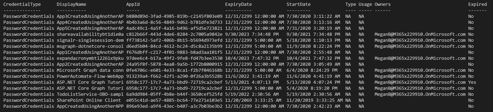

# List out all Azure AD Apps along with their KeyCredentials and PasswordCredentials along with Expiration

## Summary

This script uses Microsoft Graph PowerShell SDK. It is helpful to identify and inventorize all the Azure AD Applications registered in your tenant. The script enumerates the KeyCredentials (Certificates) and PasswordCredentials (Client Secret) keys, expiration dates, owner and other useful information.



# [Microsoft Graph PowerShell](#tab/graphps)

```powershell

Connect-MgGraph -Scopes "User.Read.All","Group.ReadWrite.All","Application.Read.All", "Application.ReadWrite.All", "Directory.Read.All", "Directory.ReadWrite.All", "Directory.AccessAsUser.All"
$Apps = Get-MgApplication -All
$today = Get-Date
$credentials = @()

$Apps | %{
    $aadAppObjId = $_.Id
    $app = Get-MgApplication -ApplicationId $aadAppObjId 
    $owner = Get-MgApplicationOwner -ApplicationId $aadAppObjId

    $app.KeyCredentials | %{
        #write-host $_.KeyId $_.DisplayName
        $credentials += [PSCustomObject] @{
            CredentialType = "KeyCredentials";
            DisplayName = $app.DisplayName;
            AppId = $app.AppId;
            ExpiryDate = $_.EndDateTime;
            StartDate = $_.StartDateTime;
            #KeyID = $_.KeyId;
            Type = $_.Type;
            Usage = $_.Usage;
            Owners = $owner.AdditionalProperties.userPrincipalName;
            Expired = (([DateTime]$_.EndDateTime) -lt $today) ? "Yes" : "No";
            }
    }


    $app.PasswordCredentials | %{
        #write-host $_.KeyId $_.DisplayName
        $credentials += [PSCustomObject] @{
            CredentialType = "PasswordCredentials";
            DisplayName = $app.DisplayName;
            AppId = $app.AppId;
            ExpiryDate = $_.EndDateTime;
            StartDate = $_.StartDateTime;
            #KeyID = $_.KeyId;
            Type = 'NA';
            Usage = 'NA';
            Owners = $owner.AdditionalProperties.userPrincipalName;
            Expired = (([DateTime]$_.EndDateTime) -lt $today) ? "Yes" : "No";
        }
    }
}

$credentials | FT -AutoSize 

# Optionally export to a CSV file
#$credentials | Export-Csv -Path "AppsInventory.csv" -NoTypeInformation 

```
[!INCLUDE [More about Microsoft Graph PowerShell SDK](../../docfx/includes/MORE-GRAPHSDK.md)]
***

## Source Credit

Sample first appeared on [List out all Azure AD Apps along with their KeyCredentials and PasswordCredentials along with Expiration](https://gist.github.com/svarukala/f23e6ee03e7516b1520469e9730a4515)

## Contributors

| Author(s) |
|-----------|
| Srinivas Varukala |


[!INCLUDE [DISCLAIMER](../../docfx/includes/DISCLAIMER.md)]

