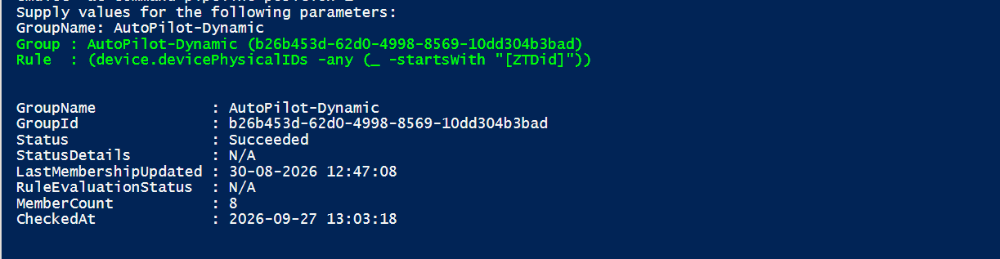

# Get Azure AD app permission info (delegated or application)

## Summary

Audit Microsoft Entra ID Dynamic Groups using Microsoft Graph PowerShell. Retrieve membership processing status, last evaluation details, and current member count for Intune and Autopilot troubleshooting. The account running the script must have Group.Read.All and GroupMember.Read.All



By default, the script has only registered Microsoft Graph and SharePoint Online Microsoft AAD apps (with their respective appId property). Feel free to add any other API listed [here](https://learn.microsoft.com/troubleshoot/azure/active-directory/verify-first-party-apps-sign-in#application-ids-for-commonly-used-microsoft-applications) in the `AadApis` class!


# [CLI for Microsoft 365 using PowerShell](#tab/cli-m365-ps)

```powershell

# User Input
$api = "Microsoft Graph" # Or "SharePoint"
$permission = "Sites.Read.All" # Can be "Read" if seeking more permissions

# Connect to Microsoft 365
if ($(m365 status) -match "Logged Out") {
  m365 login
}

# Configure the CLI to output as JSON on each execution
$m365output = m365 cli config get --key output
if ($m365output -notmatch "json") {
    m365 cli config set --key output --value json
}

# Get CLI commands JSON output converted as objects
function Get-CLIValue {
    [cmdletbinding()]
    param(
        [parameter(Mandatory = $true, ValueFromPipeline = $true)]
        $input
    )
    
    $output = $input | ConvertFrom-Json
    if ($null -ne $output.error) {
        throw $output.error
    }
    return $output
}

# Dedicated class to store Azure AD (AAD) Enterprise Microsoft Apps as valid param inputs 
class AadApis : System.Management.Automation.IValidateSetValuesGenerator {
    [String[]] GetValidValues() {
        $Global:aadApis = @{
            "SharePoint" = "00000003-0000-0ff1-ce00-000000000000"
            "Microsoft Graph" = "00000003-0000-0000-c000-000000000000"
        }

        return ($Global:aadApis).Keys
    }
}

# Method to get delegated or application permissions from a registered AAD MS App, based on name
function Get-AADPermission {
    [cmdletbinding()]
    param(
        [parameter(Mandatory)]
        [ValidateSet([AadApis], IgnoreCase = $false)]
        $ApiName,
        [parameter(Mandatory)]
        $PermissionName,
        [parameter(Mandatory = $false)]
        [Switch]$Delegated,
        [parameter(Mandatory = $false)]
        [Switch]$Application
    )

    try {
        $sp = m365 aad sp get --appId ($Global:aadApis)[$ApiName] | Get-CLIValue

        if ($Delegated) {
            $permissionsInfo = $sp.oauth2PermissionScopes | Where-Object { $_.value -match $PermissionName }
        }
        elseif ($Application) {
            $permissionsInfo = $sp.appRoles | Where-Object { $_.value -match $PermissionName }
        }
        else {
            throw "Please define if seeked permission is a delegated (-Scope) or an application (-Role) one"
        }

        if ($permissionsInfo) {
            Write-Host "AAD app info:"
            Write-Host ($sp | Select-Object id, appId, displayName | Format-List | Out-String)
            Write-Host "-----------"
            Write-Host "Permissions info:"

            foreach ($perm in $permissionsInfo) {
                Write-Host ($perm | Format-List | Out-String)
            }
        }
        else {
            $permissionType = (&{If($Delegated -eq $true) {"Delegated"} Else {"Application"}})
            
            Write-Warning "No $($permissionType) permission named [$($PermissionName)] found for $($ApiName) App"
        }
    }
    catch {
        Write-Error $_.Exception
    }
}

# Run the command
Get-AADPermission -ApiName $api -PermissionName $permission -Application

```
[!INCLUDE [More about CLI for Microsoft 365](../../docfx/includes/MORE-CLIM365.md)]


# [Microsoft Graph PowerShell](#tab/graphps)

```powershell


```
[!INCLUDE [More about Microsoft Graph PowerShell SDK](../../docfx/includes/MORE-GRAPHSDK.md)]
***
##########################################################################

#audit-aadDynamicGroup.ps1

#Author: Sujin Nelladath

#LinkedIn : https://www.linkedin.com/in/sujin-nelladath-8911968a/

############################################################################


param(

    [Parameter(Mandatory)]
    [string]$GroupName,
    [string]$ExportCsv
)

# Make sure the Graph module is available
if (-not (Get-Module -ListAvailable Microsoft.Graph.Authentication)) 

{
    Install-Module Microsoft.Graph.Authentication -Scope CurrentUser -Force
}

Import-Module Microsoft.Graph.Authentication

Connect-MgGraph -Scopes "Group.Read.All","GroupMember.Read.All" -NoWelcome

# Find the group by display name
$uri = "https://graph.microsoft.com/v1.0/groups?`$filter=displayName eq '$GroupName'&`$select=id,displayName,membershipRule"

$result = Invoke-MgGraphRequest -Method GET -Uri $uri 

if (-not $result.value) 
{
    Write-Error "Could not find a group named '$GroupName'" 
    return
}

$group = $result.value[0]
Write-Host "Group : $($group.displayName) ($($group.id))" -ForegroundColor Green
Write-Host "Rule  : $($group.membershipRule)" -ForegroundColor Green

# Get membership rule processing status
$statusUri = "https://graph.microsoft.com/beta/groups/$($group.id)?`$select=membershipRuleProcessingStatus"
$data = Invoke-MgGraphRequest -Method GET -Uri $statusUri 
$s = $data.membershipRuleProcessingStatus


# Get Member Count
try
{
    $memberUri = "https://graph.microsoft.com/v1.0/groups/$($group.id)/members/`$count"
    
    $memberCount = (Invoke-MgGraphRequest `
        -Method GET `
        -Uri $memberUri `
        -Headers @{ConsistencyLevel="eventual"})
}
catch
{
    $memberCount = "Unable to retrieve"
}


$result = [PSCustomObject]@{
    GroupName             = $group.displayName
    GroupId               = $group.id
    Status                = if ($s.status) { $s.status } else { 'N/A' }
    StatusDetails         = if ($s.statusDetails) { $s.statusDetails } else { 'N/A' }
    LastMembershipUpdated = if ($s.lastMembershipUpdated) { $s.lastMembershipUpdated } else { 'N/A' }
    RuleEvaluationStatus  = if ($s.membershipRuleEvaluationStatus) { $s.membershipRuleEvaluationStatus } else { 'N/A' }
    MemberCount           = $memberCount
    CheckedAt             = (Get-Date -Format 'yyyy-MM-dd HH:mm:ss')
}

$result | Format-List

if ($ExportCsv) 

{
    $result | Export-Csv -Path $ExportCsv -NoTypeInformation -Encoding UTF8
    Write-Host "Saved to $ExportCsv"
}

## Contributors

| Author(s)                                            |
|------------------------------------------------------|
| [Sujin Nelladath](https://github.com/nelladath) | (https://www.linkedin.com/in/sujin-nelladath-8911968a/)


[!INCLUDE [DISCLAIMER](../../docfx/includes/DISCLAIMER.md)]
