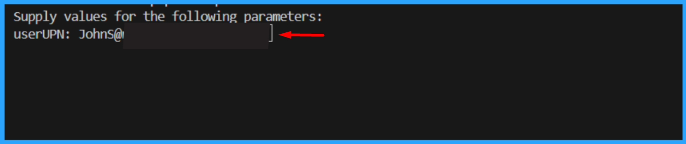

# Restore deleted Microsoft 365 Groups and Entra ID Security Groups in bulk using Microsoft Graph PowerShell. 

## Summary

Restore deleted Microsoft 365 Groups and Entra ID Security Groups in bulk using Microsoft Graph PowerShell. This script helps administrators quickly recover accidentally deleted groups from the Entra ID recycle bin by supporting bulk restoration, group type identification, validation, error handling, and detailed restoration reporting. The code runs with "Group.ReadWrite.All" permission.



By default, the script has only registered Microsoft Graph and SharePoint Online Microsoft AAD apps (with their respective appId property). Feel free to add any other API listed [here](https://learn.microsoft.com/troubleshoot/azure/active-directory/verify-first-party-apps-sign-in#application-ids-for-commonly-used-microsoft-applications) in the `AadApis` class!


# [CLI for Microsoft 365 using PowerShell](#tab/cli-m365-ps)

```powershell

# User Input
$api = "Microsoft Graph" # Or "SharePoint"
$permission = "Sites.Read.All" # Can be "Read" if seeking more permissions

# Connect to Microsoft 365
if ($(m365 status) -match "Logged Out") {
  m365 login
}

# Configure the CLI to output as JSON on each execution
$m365output = m365 cli config get --key output
if ($m365output -notmatch "json") {
    m365 cli config set --key output --value json
}

# Get CLI commands JSON output converted as objects
function Get-CLIValue {
    [cmdletbinding()]
    param(
        [parameter(Mandatory = $true, ValueFromPipeline = $true)]
        $input
    )
    
    $output = $input | ConvertFrom-Json
    if ($null -ne $output.error) {
        throw $output.error
    }
    return $output
}

# Dedicated class to store Azure AD (AAD) Enterprise Microsoft Apps as valid param inputs 
class AadApis : System.Management.Automation.IValidateSetValuesGenerator {
    [String[]] GetValidValues() {
        $Global:aadApis = @{
            "SharePoint" = "00000003-0000-0ff1-ce00-000000000000"
            "Microsoft Graph" = "00000003-0000-0000-c000-000000000000"
        }

        return ($Global:aadApis).Keys
    }
}

# Method to get delegated or application permissions from a registered AAD MS App, based on name

function Get-AADPermission {
    [cmdletbinding()]
    param(
        [parameter(Mandatory)]
        [ValidateSet([AadApis], IgnoreCase = $false)]
        $ApiName,
        [parameter(Mandatory)]
        $PermissionName,
        [parameter(Mandatory = $false)]
        [Switch]$Delegated,
        [parameter(Mandatory = $false)]
        [Switch]$Application
    )

    try {
        $sp = m365 aad sp get --appId ($Global:aadApis)[$ApiName] | Get-CLIValue

        if ($Delegated) {
            $permissionsInfo = $sp.oauth2PermissionScopes | Where-Object { $_.value -match $PermissionName }
        }
        elseif ($Application) {
            $permissionsInfo = $sp.appRoles | Where-Object { $_.value -match $PermissionName }
        }
        else {
            throw "Please define if seeked permission is a delegated (-Scope) or an application (-Role) one"
        }

        if ($permissionsInfo) {
            Write-Host "AAD app info:"
            Write-Host ($sp | Select-Object id, appId, displayName | Format-List | Out-String)
            Write-Host "-----------"
            Write-Host "Permissions info:"

            foreach ($perm in $permissionsInfo) {
                Write-Host ($perm | Format-List | Out-String)
            }
        }
        else {
            $permissionType = (&{If($Delegated -eq $true) {"Delegated"} Else {"Application"}})
            
            Write-Warning "No $($permissionType) permission named [$($PermissionName)] found for $($ApiName) App"
        }
    }
    catch {
        Write-Error $_.Exception
    }
}

# Run the command
Get-AADPermission -ApiName $api -PermissionName $permission -Application

```
[!INCLUDE [More about CLI for Microsoft 365](../../docfx/includes/MORE-CLIM365.md)]


# [Microsoft Graph PowerShell](#tab/graphps)

```powershell

############################################################################
# Restore-M365DeletedGroups.ps1

# Author : Sujin Nelladath

#Restore deleted Microsoft 365 Groups and Entra ID Security Groups in bulk using Microsoft Graph PowerShell. 
#This script helps administrators quickly recover accidentally deleted groups from the Entra ID recycle bin by supporting bulk restoration, group type identification, validation, error handling, and detailed restoration reporting.

############################################################################

# Install Microsoft Graph module (if required)

Install-Module Microsoft.Graph -Force -Scope CurrentUser

# Connect to Microsoft Graph
Connect-MgGraph -Scopes "Group.ReadWrite.All"

# Prompt user
$GroupNames = Read-Host "Enter deleted group names (comma separated)"

# Convert to array
$GroupNamesArray = $GroupNames.Split(",") | ForEach-Object { $_.Trim() }

Write-Host "Retrieving deleted groups..." -ForegroundColor Cyan

# Retrieve all deleted groups with pagination
$DeletedGroups = @()

$Uri = "https://graph.microsoft.com/v1.0/directory/deletedItems/microsoft.graph.group?`$select=id,displayName,groupTypes,securityEnabled"

do 
{
    $Response = Invoke-MgGraphRequest -Method GET -Uri $Uri

    if ($Response.value) 
    {
        $DeletedGroups += $Response.value
    }

    $Uri = $Response.'@odata.nextLink'

} while ($Uri)

Write-Host "Found $($DeletedGroups.Count) deleted groups." -ForegroundColor Green

$SuccessCount = 0
$FailedCount = 0

foreach ($GroupName in $GroupNamesArray)
{
    Write-Host ""
    Write-Host "Searching for group: $GroupName" -ForegroundColor Cyan

    $MatchedGroups = $DeletedGroups | Where-Object {
        $_.displayName -eq $GroupName
    }

    if (-not $MatchedGroups)
    {
        Write-Host "Group '$GroupName' not found in deleted items." -ForegroundColor Red
        $FailedCount++
        continue
    }

    foreach ($Group in $MatchedGroups)
    {
        # Determine group type

        if ($Group.groupTypes -contains "Unified")
        {
            $GroupType = "Microsoft 365 Group"
        }
        elseif ($Group.securityEnabled -eq $true)
        {
            $GroupType = "Security Group"
        }
        else
        {
            $GroupType = "Unknown"
        }

        Write-Host ""
        Write-Host "Group Found:" -ForegroundColor Green
        Write-Host " Name      : $($Group.displayName)"
        Write-Host " Type      : $GroupType"
        Write-Host " Object Id : $($Group.id)"

        try
        {
            Invoke-MgGraphRequest `
                -Method POST `
                -Uri "https://graph.microsoft.com/v1.0/directory/deletedItems/$($Group.id)/restore"

            Write-Host "Successfully restored '$($Group.displayName)'" -ForegroundColor Green

            $SuccessCount++
        }
        catch
        {
            Write-Host "Failed to restore '$($Group.displayName)'" -ForegroundColor Red
            Write-Host "Reason: $($_.Exception.Message)" -ForegroundColor Yellow

            $FailedCount++
        }
    }
}

Write-Host ""
Write-Host "=====================================" -ForegroundColor Cyan
Write-Host "Restore Summary" -ForegroundColor Cyan
Write-Host "=====================================" -ForegroundColor Cyan
Write-Host "Restored Successfully : $SuccessCount" -ForegroundColor Green
Write-Host "Failed                : $FailedCount" -ForegroundColor Red

```
[!INCLUDE [More about Microsoft Graph PowerShell SDK](../../docfx/includes/MORE-GRAPHSDK.md)]
***


## Contributors

| Author(s)                                            |
|------------------------------------------------------|
| [Sujin Nelladath](https://github.com/nelladath) | (https://www.linkedin.com/in/sujin-nelladath-8911968a/)


[!INCLUDE [DISCLAIMER](../../docfx/includes/DISCLAIMER.md)]
