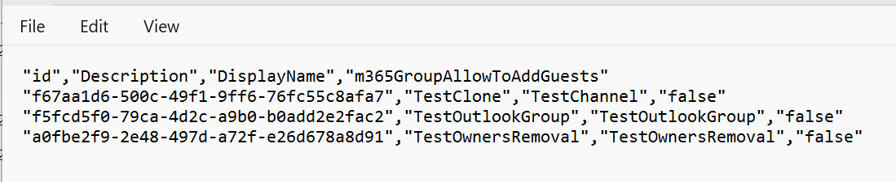

# Automate Renewal of Expiring M365 Groups or or Microsoft Teams teams

## Summary

By default, guest access for Microsoft 365 groups is enabled within the tenant. This can be controlled either to allow or block guest access at the tenant level or for individual Microsoft 365 groups / Microsoft Teams team. For more information, check out [Manage guest access in Microsoft 365 groups](https://learn.microsoft.com/en-us/microsoft-365/admin/create-groups/manage-guest-access-in-groups?view=o365-worldwide&wt.mc_id=MVP_308367).

This script will enable or disable adding guests to a Microsoft 365 Group or Microsoft Teams team.



# [PnP PowerShell](#tab/pnpps)

```powershell
param (
    [Parameter(Mandatory = $true)]
    [string] $domain,
    [Parameter(Mandatory = $true)]
    [ValidateSet("true", "false")]
    [string] $allowToAddGuests
)

$adminSiteURL = "https://$domain-Admin.SharePoint.com"
$dateTime = "_{0:MM_dd_yy}_{0:HH_mm_ss}" -f (Get-Date)
$invocation = (Get-Variable MyInvocation).Value
$directorypath = Split-Path $invocation.MyCommand.Path
$fileName = "m365_disable_addguests" + $dateTime + ".csv"
$outputPath = $directorypath + "\"+ $fileName

if (-not (Test-Path $outputPath)) {
    New-Item -ItemType File -Path $outputPath
}
Connect-PnPOnline -Url $adminSiteURL -Interactive -WarningAction SilentlyContinue
# amend as required to be the correct filter
$report =  Get-PnPMicrosoft365Group -Filter "startswith(displayName, 'test')" | ForEach-Object {
    $group = $_

    $groupSettings = Get-PnPMicrosoft365GroupSettings -Identity  $group.Id
    if (-Not $groupSettings)
    {
        $groupSettings = New-PnPMicrosoft365GroupSettings -Identity  $group.Id -DisplayName "Group.Unified.Guest" -TemplateId "08d542b9-071f-4e16-94b0-74abb372e3d9" -Values @{"AllowToAddGuests"=$allowToAddGuests}
    }
    if (($groupSettings.Values | Where-Object { $_.Name -eq "AllowToAddGuests"}).Value.ToString() -ne $allowToAddGuests)
    {
        $groupSettings = Set-PnPMicrosoft365GroupSettings -Identity $groupSettings.ID -Group  $group.Id -Values @{"AllowToAddGuests"=$allowToAddGuests}
    }

    #retrieving the details to ensure the settings are applied
    $groupSettings =  Get-PnPMicrosoft365GroupSettings -Identity  $group.Id
    $allowToAddGuestsValue = ($groupSettings.Values | Where-Object { $_.Name -eq "AllowToAddGuests"}).Value.ToString()
     [PSCustomObject]@{
        id = $group.Id
        Description = $group.Description
        DisplayName = $group.DisplayName
        m365GroupAllowToAddGuests = $allowToAddGuestsValue ?? "Default"
    }
}
$report |select *  |Export-Csv $outputPath -NoTypeInformation -Append
Disconnect-PnPOnline
```

[!INCLUDE [More about PnP PowerShell](../../docfx/includes/MORE-PNPPS.md)]

***

## Source Credit

Sample first appeared on [Prevent Guests from Being Added to a Specific Microsoft 365 Group or Microsoft Teams team using PnP PowerShell](https://reshmeeauckloo.com/posts/powershell-m365Group-disable-add-guests/)


## Contributors

| Author(s) |
|-----------|
| [Reshmee Auckloo](https://github.com/reshmee011) |


[!INCLUDE [DISCLAIMER](../../docfx/includes/DISCLAIMER.md)]


