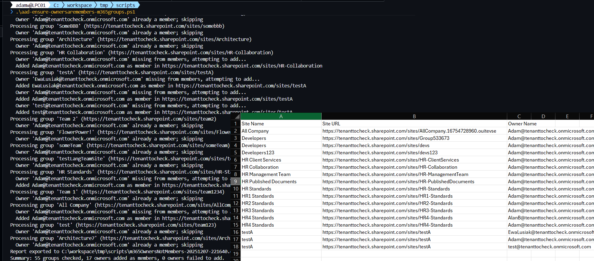

# Ensuring Owners Are Members

## Summary

It may happen that owners are not members of the m365 group because of the various methods of managing M365 group permissions, such as through the Teams admin center, Microsoft Teams, SharePoint admin center, SharePoint connected sites, Planner, or scripting using PowerShell. The script will help identify these discrepancies and ensures m365 group owners are also m365 group members.

CLI for Microsoft 365 script sample usage example:



# [PnP PowerShell](#tab/pnpps)

```powershell

$AdminCenterURL="https://contoso-admin.sharepoint.com/"# Connect to SharePoint Online admin center
Connect-PnPOnline -Url $AdminCenterURL -Interactive
$dateTime = (Get-Date).toString("dd-MM-yyyy")
$invocation = (Get-Variable MyInvocation).Value
$directorypath = Split-Path $invocation.MyCommand.Path
$fileName = "m365OwnersNotMembers-" + $dateTime + ".csv"
$OutPutView = $directorypath + "\" + $fileName
# Array to Hold Result - PSObjects
$m365GroupCollection = @()
#Write-host $"$ownerName not part of member in $siteUrl";
$m365Sites = Get-PnPTenantSite -Detailed | Where-Object { ($_.Template -eq 'GROUP#0') -and $_.Template -ne 'RedirectSite#0' }
$m365Sites | ForEach-Object {   
    $groupId = $_.GroupId;
    $siteUrl = $_.Url;
    $siteName = $_.Title
    #if owner is not part of m365 group member
    (Get-PnPMicrosoft365GroupOwner -Identity $groupId -ErrorAction Ignore) | foreach-object {
        $owner = $_;
        $ownerDisplayName = $owner.DisplayName;
        if (!(Get-PnPMicrosoft365GroupMember -Identity $groupId  -ErrorAction Ignore | Where-Object { $_.DisplayName -eq $owner.DisplayName })) {
            $ExportVw = New-Object PSObject
            $ExportVw | Add-Member -MemberType NoteProperty -name "Site Name" -value $siteName
            $ExportVw | Add-Member -MemberType NoteProperty -name "Site URL" -value $siteUrl
            $ExportVw | Add-Member -MemberType NoteProperty -name "Owner Name" -value $owner.DisplayName
            $m365GroupCollection += $ExportVw
            Add-PnPMicrosoft365GroupMember -Identity $groupId -Users $owner.Email
            Write-host "$ownerDisplayName has been added as member in $siteUrl";
      }
   }
}
# Export the result array to CSV file
$m365GroupCollection | sort-object "Site Name" | Export-CSV $OutPutView -Force -NoTypeInformation
```

[!INCLUDE [More about PnP PowerShell](../../docfx/includes/MORE-PNPPS.md)]

# [CLI for Microsoft 365](#tab/cli-m365-ps)

```powershell
[CmdletBinding()]
param(
    [Parameter(HelpMessage = "Directory path where the CSV report will be stored.")]
    [string]$OutputDirectory,

    [Parameter(HelpMessage = "Optional custom file name (with or without .csv) for the owners-not-members report.")]
    [string]$ReportFileName
)

begin {
    m365 login --ensure

    if (-not $OutputDirectory) {
        $OutputDirectory = if ($MyInvocation.MyCommand.Path) {
            Split-Path -Path $MyInvocation.MyCommand.Path
        } else {
            (Get-Location).Path
        }
    }

    if (-not (Test-Path -Path $OutputDirectory -PathType Container)) {
        New-Item -ItemType Directory -Path $OutputDirectory -Force | Out-Null
    }

    if (-not $ReportFileName) {
        $ReportFileName = 'm365OwnersNotMembers-{0}.csv' -f (Get-Date -Format 'yyyyMMdd-HHmmss')
    } elseif (-not $ReportFileName.EndsWith('.csv')) {
        $ReportFileName = "$ReportFileName.csv"
    }

    $script:ReportPath = Join-Path -Path $OutputDirectory -ChildPath $ReportFileName
    $script:ReportItems = [System.Collections.Generic.List[psobject]]::new()
    $script:Summary = [ordered]@{
        GroupsEvaluated = 0
        OwnersAdded     = 0
        OwnersFailed    = 0
    }

    Write-Host "Starting owner membership audit..."
    Write-Host "Report will be saved to $ReportPath"
}

process {
    $sites = m365 spo site list --query "[?Template == 'GROUP#0' && Template != 'RedirectSite#0'].{GroupId:GroupId, Url:Url, Title:Title}" --output json | ConvertFrom-Json

    foreach ($site in $sites) {
        $Summary.GroupsEvaluated++
        Write-Host "Processing group '$($site.Title)' ($($site.Url))"

        $groupId = $site.GroupId -replace "/Guid\((.*)\)/", '$1'
        $owners = m365 entra m365group user list --role Owner --groupId $groupId --output json | ConvertFrom-Json

        foreach ($owner in $owners) {
            $ownerUserPrincipalName = $owner.userPrincipalName
            $isMember = m365 entra m365group user list --role Member --groupId $groupId --query "[?userPrincipalName == '$ownerUserPrincipalName']" --output json | ConvertFrom-Json

            if (-not $isMember) {
                Write-Host "  Owner '$ownerUserPrincipalName' missing from members, attempting to add..."

                $ReportItems.Add([pscustomobject]@{
                    'Site Name'  = $site.Title
                    'Site URL'   = $site.Url
                    'Owner Name' = $ownerUserPrincipalName
                })

                $addResult = m365 entra m365group user add --role Member --groupId $groupId --userNames $ownerUserPrincipalName --output json 2>&1

                if ($LASTEXITCODE -ne 0) {
                    Write-Warning "Failed to add $ownerUserPrincipalName as member in $($site.Url). CLI returned: $addResult"
                    $Summary.OwnersFailed++
                    continue
                }

                Write-Host "  Added $ownerUserPrincipalName as member in $($site.Url)"
                $Summary.OwnersAdded++
            } else {
                Write-Host "  Owner '$ownerUserPrincipalName' already a member; skipping"
            }
        }
    }
}

end {
    if ($ReportItems.Count -gt 0) {
        $ReportItems | Sort-Object 'Site Name' | Export-Csv -Path $ReportPath -NoTypeInformation -Force
        Write-Host "Report exported to $ReportPath"
    } else {
        Write-Host "No discrepancies detected across the evaluated groups."
    }

    Write-Host ("Summary: {0} groups checked, {1} owners added as members, {2} owners failed to add." -f $Summary.GroupsEvaluated, $Summary.OwnersAdded, $Summary.OwnersFailed)
}

```

[!INCLUDE [More about CLI for Microsoft 365](../../docfx/includes/MORE-CLIM365.md)]

***

## Source Credit

Sample first appeared on [Ensuring Owners Are Members](https://reshmeeauckloo.com/posts/powershell_ensureownersaremembersm365group/)

## Contributors

| Author(s)                                 |
| ----------------------------------------- |
| [Reshmee Auckloo (Main author)](https://github.com/reshmee011) |
| [Michał Kornet (CLI for M365 version)](https://github.com/mkm17) |
| Adam Wójcik |


[!INCLUDE [DISCLAIMER](../../docfx/includes/DISCLAIMER.md)]

