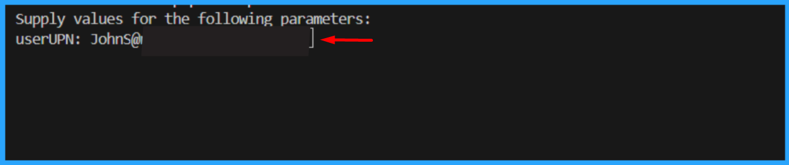

# Get Azure AD app permission info (delegated or application)

## Summary

Add-EntraAppPermission.ps1 adds requested Graph permissions to the app registration's requiredResourceAccess collection. It resolves permission names against the Microsoft Graph service principal and updates the app registration using Microsoft Graph. The script connects with Application.ReadWrite.All.



By default, the script has only registered Microsoft Graph and SharePoint Online Microsoft AAD apps (with their respective appId property). Feel free to add any other API listed [here](https://learn.microsoft.com/troubleshoot/azure/active-directory/verify-first-party-apps-sign-in#application-ids-for-commonly-used-microsoft-applications) in the `AadApis` class!


# [CLI for Microsoft 365 using PowerShell](#tab/cli-m365-ps)

```powershell

# User Input
$api = "Microsoft Graph" # Or "SharePoint"
$permission = "Sites.Read.All" # Can be "Read" if seeking more permissions

# Connect to Microsoft 365
if ($(m365 status) -match "Logged Out") {
  m365 login
}

# Configure the CLI to output as JSON on each execution
$m365output = m365 cli config get --key output
if ($m365output -notmatch "json") {
    m365 cli config set --key output --value json
}

# Get CLI commands JSON output converted as objects
function Get-CLIValue {
    [cmdletbinding()]
    param(
        [parameter(Mandatory = $true, ValueFromPipeline = $true)]
        $input
    )
    
    $output = $input | ConvertFrom-Json
    if ($null -ne $output.error) {
        throw $output.error
    }
    return $output
}

# Dedicated class to store Azure AD (AAD) Enterprise Microsoft Apps as valid param inputs 
class AadApis : System.Management.Automation.IValidateSetValuesGenerator {
    [String[]] GetValidValues() {
        $Global:aadApis = @{
            "SharePoint" = "00000003-0000-0ff1-ce00-000000000000"
            "Microsoft Graph" = "00000003-0000-0000-c000-000000000000"
        }

        return ($Global:aadApis).Keys
    }
}

# Method to get delegated or application permissions from a registered AAD MS App, based on name
function Get-AADPermission {
    [cmdletbinding()]
    param(
        [parameter(Mandatory)]
        [ValidateSet([AadApis], IgnoreCase = $false)]
        $ApiName,
        [parameter(Mandatory)]
        $PermissionName,
        [parameter(Mandatory = $false)]
        [Switch]$Delegated,
        [parameter(Mandatory = $false)]
        [Switch]$Application
    )

    try {
        $sp = m365 aad sp get --appId ($Global:aadApis)[$ApiName] | Get-CLIValue

        if ($Delegated) {
            $permissionsInfo = $sp.oauth2PermissionScopes | Where-Object { $_.value -match $PermissionName }
        }
        elseif ($Application) {
            $permissionsInfo = $sp.appRoles | Where-Object { $_.value -match $PermissionName }
        }
        else {
            throw "Please define if seeked permission is a delegated (-Scope) or an application (-Role) one"
        }

        if ($permissionsInfo) {
            Write-Host "AAD app info:"
            Write-Host ($sp | Select-Object id, appId, displayName | Format-List | Out-String)
            Write-Host "-----------"
            Write-Host "Permissions info:"

            foreach ($perm in $permissionsInfo) {
                Write-Host ($perm | Format-List | Out-String)
            }
        }
        else {
            $permissionType = (&{If($Delegated -eq $true) {"Delegated"} Else {"Application"}})
            
            Write-Warning "No $($permissionType) permission named [$($PermissionName)] found for $($ApiName) App"
        }
    }
    catch {
        Write-Error $_.Exception
    }
}

# Run the command
Get-AADPermission -ApiName $api -PermissionName $permission -Application

```
[!INCLUDE [More about CLI for Microsoft 365](../../docfx/includes/MORE-CLIM365.md)]


# [Microsoft Graph PowerShell](#tab/graphps)

```powershell

##########################################################################

#EntraUser-OffBoarding.ps1

#This PowerShell script provides a comprehensive, automated solution for securely offboarding users from an organization's Microsoft 365/Entra ID environment. It ensures that departing users lose all access to organizational resources while maintaining proper audit trails.

#Author: Sujin Nelladath, Microsoft Graph MVP

#LinkedIn : https://www.linkedin.com/in/sujin-nelladath-8911968a/

############################################################################


# ENTRA ID- FULL OFFBOARDING

# ===============================

# Define mandatory parameter for user UPN

param(
    [Parameter(Mandatory = $true)]
    [string]$userUPN
)
if (-not $userUPN) 
{
    $userUPN = Read-Host "Enter the user UPN to offboard"
}

#Set-ExecutionPolicy

Set-ExecutionPolicy -ExecutionPolicy RemoteSigned -Scope CurrentUser


# ===============================

# Connect to Microsoft Graph

Connect-MgGraph -Scopes  "User.ReadWrite.All", "Group.ReadWrite.All", "Directory.ReadWrite.All", "AppRoleAssignment.ReadWrite.All"
 

# -------------------------------

# USER TO OFFBOARD

# -------------------------------


 

# Get user with error handling
try

{
    $UserEndpoint = "https://graph.microsoft.com/v1.0/users/$userUPN"
    $user = Invoke-MgGraphRequest -Method GET -Uri $UserEndpoint
    
    Write-Host "Found user: $($user.displayName)" -ForegroundColor Green
}
catch

{
    Write-Host "Error: User not found - $userUPN" -ForegroundColor Red
    exit 1
}

 

Write-Host "Offboarding user:" $user.displayName -ForegroundColor Cyan

 

# -------------------------------

# 1. BLOCK SIGN-IN

# -------------------------------

# Block user sign-in using Graph API
$updateEndpoint = "https://graph.microsoft.com/v1.0/users/$($user.id)"
$updateBody = @{
    accountEnabled = $false
} | ConvertTo-Json

Invoke-MgGraphRequest -Method PATCH -Uri $updateEndpoint -Body $updateBody -ContentType "application/json"

Write-Host "User sign-in blocked"

 

# -------------------------------

# 2. REVOKE ACTIVE SESSIONS

# -------------------------------

# Revoke user sessions using Graph API
$revokeEndpoint = "https://graph.microsoft.com/v1.0/users/$($user.id)/revokeSignInSessions"
Invoke-MgGraphRequest -Method POST -Uri $revokeEndpoint

Write-Host "Sessions revoked"

 

# -------------------------------

# 3. REMOVE FROM ALL GROUPS

# -------------------------------

# Get user group memberships using Graph API
$groupsEndpoint = "https://graph.microsoft.com/v1.0/users/$($user.id)/memberOf"
$groupsResponse = Invoke-MgGraphRequest -Method GET -Uri $groupsEndpoint
$groups = $groupsResponse.value

 

foreach ($group in $groups) 

{
    try 
    
    {
        # Remove user from group using Graph API
        $removeGroupEndpoint = "https://graph.microsoft.com/v1.0/groups/$($group.id)/members/$($user.id)/`$ref"
        Invoke-MgGraphRequest -Method DELETE -Uri $removeGroupEndpoint -ErrorAction Stop
        Write-Host "Removed from group: $($group.displayName)" -ForegroundColor Yellow
    }
    catch 
    
    {
        Write-Host "  Warning: Could not remove from group $($group.id) - $($_.Exception.Message)" -ForegroundColor Yellow
    }
}

 

Write-Host "Removed from all groups"

 

# -------------------------------

# 4. REMOVE ALL APP ASSIGNMENTS

# -------------------------------

# Get user app role assignments using Graph API
$appAssignmentsEndpoint = "https://graph.microsoft.com/v1.0/users/$($user.id)/appRoleAssignments"
$appAssignmentsResponse = Invoke-MgGraphRequest -Method GET -Uri $appAssignmentsEndpoint
$appAssignments = $appAssignmentsResponse.value

 

foreach ($app in $appAssignments)

 {
    try
    
    {
        # Remove app role assignment using Graph API
        $removeAppEndpoint = "https://graph.microsoft.com/v1.0/users/$($user.id)/appRoleAssignments/$($app.id)"
        Invoke-MgGraphRequest -Method DELETE -Uri $removeAppEndpoint -ErrorAction Stop
        Write-Host "  Removed app assignment: $($app.resourceDisplayName)" -ForegroundColor Yellow
    }
    catch 
    
    {
        Write-Host "  Warning: Could not remove app assignment $($app.id) - $($_.Exception.Message)" -ForegroundColor Yellow
    }
}

 

Write-Host "Application access removed"

 

# -------------------------------

# 5. REMOVE ALL LICENSES

# -------------------------------

# Get user licenses using Graph API
$licensesEndpoint = "https://graph.microsoft.com/v1.0/users/$($user.id)/licenseDetails"
$licensesResponse = Invoke-MgGraphRequest -Method GET -Uri $licensesEndpoint
$licenses = $licensesResponse.value | ForEach-Object { $_.skuId }

 

if ($licenses.Count -gt 0)

 {
    try 
    
    {
        # Remove licenses using Graph API
        $assignLicenseEndpoint = "https://graph.microsoft.com/v1.0/users/$($user.id)/assignLicense"
        $licenseBody = @{
            addLicenses    = @()
            removeLicenses = $licenses
        } | ConvertTo-Json -Depth 3
        Invoke-MgGraphRequest -Method POST -Uri $assignLicenseEndpoint -Body $licenseBody -ContentType "application/json" -ErrorAction Stop
        Write-Host "Licenses removed" -ForegroundColor Yellow
    }
    catch 
    
    {
        Write-Host "Warning: Could not remove licenses - $($_.Exception.Message)" -ForegroundColor Yellow
    }
}
else 

{
    Write-Host "No licenses assigned"
}

 

# -------------------------------

# OFFBOARDING COMPLETE

# -------------------------------

Write-Host "User has NO remaining access" -ForegroundColor Green

# USER ACCESS INVENTORY (Console Output Only)
# Covers:
# Directory (Entra ID) roles
# Group memberships
# Enterprise applications (SSO access)
# App registrations owned

# ================================

# USER ACCESS INVENTORY- CONSOLE

# ================================

 


 

# -------------------------------

# Connect (Read-only scopes)

# -------------------------------


$user = Invoke-MgGraphRequest -Method GET -Uri $UserEndpoint

 

Write-Host "`n===============================" -ForegroundColor Cyan

Write-Host " USER ACCESS CHECKLIST" -ForegroundColor Cyan

Write-Host "===============================" -ForegroundColor Cyan

Write-Host "User        : $($user.displayName)"

Write-Host "UPN         : $($user.userPrincipalName)"

Write-Host "Account     : $(if ($user.accountEnabled) {'Enabled'} else {'Disabled'})"

Write-Host "--------------------------------"

 

# ===============================

# 1. DIRECTORY (ENTRA ID) ROLES

# ===============================

Write-Host "`n[1] DIRECTORY ROLES" -ForegroundColor Yellow

 

# Get directory role assignments using Graph API
$directoryRolesEndpoint = "https://graph.microsoft.com/v1.0/roleManagement/directory/roleAssignments?`$filter=principalId eq '$($user.id)'"
$directoryRolesResponse = Invoke-MgGraphRequest -Method GET -Uri $directoryRolesEndpoint
$directoryRoles = $directoryRolesResponse.value

 

if ($directoryRoles) 

{

    foreach ($role in $directoryRoles) 
    
    {

        # Get role definition using Graph API
        $roleDefEndpoint = "https://graph.microsoft.com/v1.0/roleManagement/directory/roleDefinitions/$($role.roleDefinitionId)"
        $roleDef = Invoke-MgGraphRequest -Method GET -Uri $roleDefEndpoint
        Write-Host " - $($roleDef.displayName)"

    }

}
else 

{

    Write-Host " - None"

}

 

# ===============================

# 2. GROUP MEMBERSHIPS

# ===============================

Write-Host "`n[2] GROUP MEMBERSHIPS" -ForegroundColor Yellow

 

# Get user group memberships using Graph API
$groupsEndpoint = "https://graph.microsoft.com/v1.0/users/$($user.id)/memberOf"
$groupsResponse = Invoke-MgGraphRequest -Method GET -Uri $groupsEndpoint
$groups = $groupsResponse.value

 

if ($groups)

 {

    foreach ($group in $groups) 
    
    {

        # Get group details using Graph API
        $groupEndpoint = "https://graph.microsoft.com/v1.0/groups/$($group.id)"
        $g = Invoke-MgGraphRequest -Method GET -Uri $groupEndpoint -ErrorAction SilentlyContinue
        if ($g) {
            $type = if ($g.securityEnabled) { "Security" } else { "M365 / Distribution" }
            Write-Host " - $($g.displayName) [$type]"
        }

    }

} 

else

{

    Write-Host " - None"

}

 

# ===============================

# 3. ENTERPRISE APPLICATION ACCESS

# ===============================

Write-Host "`n[3] ENTERPRISE APPLICATION ACCESS" -ForegroundColor Yellow

 

# Get user app role assignments using Graph API
$appAssignmentsEndpoint = "https://graph.microsoft.com/v1.0/users/$($user.id)/appRoleAssignments"
$appAssignmentsResponse = Invoke-MgGraphRequest -Method GET -Uri $appAssignmentsEndpoint
$appAssignments = $appAssignmentsResponse.value

 

if ($appAssignments)

{
    foreach ($app in $appAssignments) 
    
    {
        # Get service principal using Graph API
        $spEndpoint = "https://graph.microsoft.com/v1.0/servicePrincipals/$($app.resourceId)"
        $sp = Invoke-MgGraphRequest -Method GET -Uri $spEndpoint -ErrorAction SilentlyContinue
        if ($sp)
        {
            Write-Host " - $($sp.displayName)"
        }
    }
}

else
{
    Write-Host " - None"
}

 

# ===============================

# 4. APP REGISTRATIONS OWNED

# ===============================

Write-Host "`n[4] APP REGISTRATIONS OWNED" -ForegroundColor Yellow

 

# Get user owned objects using Graph API
$ownedObjectsEndpoint = "https://graph.microsoft.com/v1.0/users/$($user.id)/ownedObjects"
$ownedObjectsResponse = Invoke-MgGraphRequest -Method GET -Uri $ownedObjectsEndpoint
$ownedApps = $ownedObjectsResponse.value | Where-Object { $_.'@odata.type' -eq '#microsoft.graph.application' }

 

if ($ownedApps) 
{
    foreach ($app in $ownedApps) 
    {
        Write-Host " - $($app.displayName)"
    }
}
else 
{
    Write-Host " - None"
}

 

# ===============================


# ===============================


Write-Host "`n===============================" -ForegroundColor Green

Write-Host " CHECKLIST COMPLETE" -ForegroundColor Green


Write-Host "==============================="

```
[!INCLUDE [More about Microsoft Graph PowerShell SDK](../../docfx/includes/MORE-GRAPHSDK.md)]
***


## Contributors

| Author(s)                                            |
|------------------------------------------------------|
| [Sujin Nelladath](https://github.com/nelladath) | (https://www.linkedin.com/in/sujin-nelladath-8911968a/)


[!INCLUDE [DISCLAIMER](../../docfx/includes/DISCLAIMER.md)]
