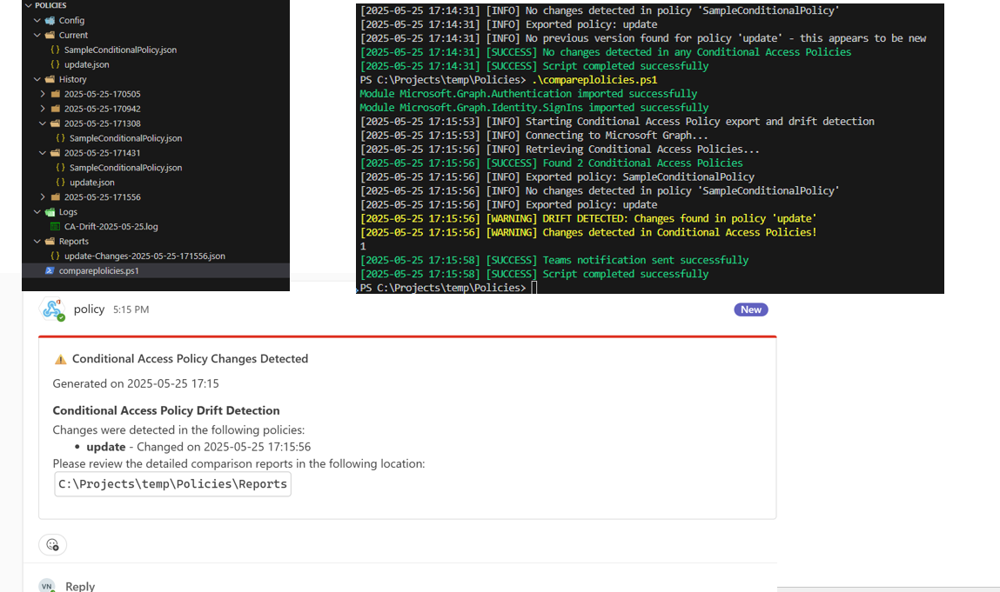

# Export & Compare Conditional-Access Policies (drift-detect)

## Summary

This script automates the export and comparison of Conditional Access Policies within an Azure AD tenant to detect configuration drift. It helps monitor changes to these critical security controls over time, ensuring they remain compliant with your organization's zero-trust baselines.

The script performs the following operations:
1. Authenticates to Microsoft Graph API
2. Exports all Conditional Access Policies to JSON format
3. Saves each policy with timestamps to establish a version history
4. Compares current policies to the previous export
5. Generates alerts for any detected changes
6. Optionally sends notifications via email or Microsoft Teams



## Prerequisites

- Microsoft Graph PowerShell SDK modules installed
- Permissions to read Conditional Access Policies (Application or delegated)
- Required permissions:
  - `Policy.Read.All` for reading Conditional Access Policies
  - `Mail.Send` (optional for email notifications)
  - Teams webhook (optional for Teams notifications)

## Implementation

This solution provides a scheduled monitoring approach for Conditional Access Policies in your tenant. By tracking policy changes, your security team can quickly identify unexpected alterations, ensuring there's no drift from your security baselines.

# [Microsoft Graph PowerShell](#tab/graphps)

```powershell
# Conditional Access Policy Export and Drift Detection Script
# Script exports all Conditional Access Policies from Azure AD, saves them to JSON files,
# and compares them with previous exports to detect any changes (drift)

#-------------------------------------------------------------
# Module Management
#-------------------------------------------------------------
# Required modules
$requiredModules = @(
    "Microsoft.Graph.Authentication", 
    "Microsoft.Graph.Identity.SignIns"
)

# Check and install required modules
foreach ($module in $requiredModules) {
    # Check if module is installed
    if (-not (Get-Module -ListAvailable -Name $module)) {
        Write-Host "Module $module is not installed. Installing..."
        try {
            Install-Module -Name $module -Force -AllowClobber -Scope CurrentUser
            Write-Host "Module $module installed successfully" -ForegroundColor Green
        }
        catch {
            Write-Host "Failed to install module $module. Error: $_" -ForegroundColor Red
            exit 1
        }
    }
    
    # Import the module
    try {
        Import-Module -Name $module -ErrorAction Stop
        Write-Host "Module $module imported successfully" -ForegroundColor Green
    }
    catch {
        Write-Host "Failed to import module $module. Error: $_" -ForegroundColor Red
        exit 1
    }
}

#-------------------------------------------------------------
# Configuration
#-------------------------------------------------------------
$ConfigPath = "$PSScriptRoot\Config"
$HistoryPath = "$PSScriptRoot\History"
$CurrentExportPath = "$PSScriptRoot\Current"
$LogPath = "$PSScriptRoot\Logs"
$ComparisonReportPath = "$PSScriptRoot\Reports"
$SendEmail = $false
$SendTeamsNotification = $true

# Email settings (if $SendEmail is $true)
$EmailFrom = "[your email address]"
$EmailTo = "[recipient email address]"
$SmtpServer = "smtp.office365.com"

# Teams webhook URL (if $SendTeamsNotification is $true)
$TeamsWebhookUrl = "https://devgods.webhook.office.com/webhookb2/"

# Create required directories if they don't exist
$Directories = @($ConfigPath, $HistoryPath, $CurrentExportPath, $LogPath, $ComparisonReportPath)
foreach ($Dir in $Directories) {
    if (!(Test-Path -Path $Dir)) {
        New-Item -ItemType Directory -Path $Dir -Force | Out-Null
    }
}

#-------------------------------------------------------------
# Functions
#-------------------------------------------------------------
function Write-Log {
    param (
        [string]$Message,
        [string]$Level = "INFO"
    )
    
    $Timestamp = Get-Date -Format "yyyy-MM-dd HH:mm:ss"
    $LogEntry = "[$Timestamp] [$Level] $Message"
    
    # Write to console
    switch ($Level) {
        "ERROR" { Write-Host $LogEntry -ForegroundColor Red }
        "WARNING" { Write-Host $LogEntry -ForegroundColor Yellow }
        "SUCCESS" { Write-Host $LogEntry -ForegroundColor Green }
        default { Write-Host $LogEntry }
    }
    
    # Write to log file
    $LogFile = Join-Path -Path $LogPath -ChildPath "CA-Drift-$(Get-Date -Format 'yyyy-MM-dd').log"
    Add-Content -Path $LogFile -Value $LogEntry
}

function Send-EmailAlert {
    param (
        [string]$Subject,
        [string]$Body
    )
    
    try {
        Send-MailMessage -From $EmailFrom -To $EmailTo -Subject $Subject -Body $Body -BodyAsHtml -SmtpServer $SmtpServer -UseSsl -Port 587 -Credential (Get-Credential -Message "Enter email credentials")
        Write-Log "Email notification sent successfully" -Level "SUCCESS"
    }
    catch {
        Write-Log "Failed to send email notification: $_" -Level "ERROR"
    }
}

function Send-TeamsAlert {
    param (
        [string]$Title,
        [string]$Message,
        [string]$Color = "#FF0000" # Red
    )
    
    try {
        $JSON = @{
            "@type" = "MessageCard"
            "@context" = "http://schema.org/extensions"
            "summary" = $Title
            "themeColor" = $Color
            "sections" = @(
                @{
                    "activityTitle" = $Title
                    "activitySubtitle" = "Generated on $(Get-Date -Format 'yyyy-MM-dd HH:mm')"
                    "text" = $Message
                }
            )
        } | ConvertTo-Json -Depth 4
        
        Invoke-RestMethod -Uri $TeamsWebhookUrl -Method Post -Body $JSON -ContentType "application/json"
        Write-Log "Teams notification sent successfully" -Level "SUCCESS"
    }
    catch {
        Write-Log "Failed to send Teams notification: $_" -Level "ERROR"
    }
}

function Compare-Policies {
    param (
        [string]$CurrentPolicyPath,
        [string]$PreviousPolicyPath,
        [string]$PolicyName
    )
    
    try {
        $CurrentPolicy = Get-Content -Path $CurrentPolicyPath | ConvertFrom-Json
        $PreviousPolicy = Get-Content -Path $PreviousPolicyPath | ConvertFrom-Json
        
        # Compare policies using Compare-Object
        $Comparison = Compare-Object -ReferenceObject ($PreviousPolicy | ConvertTo-Json -Depth 10) -DifferenceObject ($CurrentPolicy | ConvertTo-Json -Depth 10)
        
        if ($Comparison) {
            # Policies are different
            Write-Log "DRIFT DETECTED: Changes found in policy '$PolicyName'" -Level "WARNING"
            
            # Generate detailed comparison report using a more detailed approach
            $Report = @{
                PolicyName = $PolicyName
                ChangeDetected = $true
                ChangeTimestamp = Get-Date -Format "yyyy-MM-dd HH:mm:ss"
                PreviousVersion = $PreviousPolicy
                CurrentVersion = $CurrentPolicy
                Changes = @()
            }
            
            # Use PowerShell's Compare-Object to do a property-by-property comparison
            # This is a simplified approach - in reality you would recurse through nested properties
            foreach ($Property in $CurrentPolicy.PSObject.Properties.Name) {
                if ($CurrentPolicy.$Property -ne $PreviousPolicy.$Property) {
                    $Report.Changes += @{
                        Property = $Property
                        PreviousValue = $PreviousPolicy.$Property
                        CurrentValue = $CurrentPolicy.$Property
                    }
                }
            }
            
            # Save the comparison report
            $ReportFilePath = Join-Path -Path $ComparisonReportPath -ChildPath "$PolicyName-Changes-$(Get-Date -Format 'yyyy-MM-dd-HHmmss').json"
            $Report | ConvertTo-Json -Depth 10 | Out-File -FilePath $ReportFilePath
            
            return $Report
        }
        else {
            # No changes
            Write-Log "No changes detected in policy '$PolicyName'" -Level "INFO"
            return $null
        }
    }
    catch {
        Write-Log "Error comparing policies for '$PolicyName': $_" -Level "ERROR"
        return $null
    }
}

#-------------------------------------------------------------
# Main Script
#-------------------------------------------------------------
Write-Log "Starting Conditional Access Policy export and drift detection" -Level "INFO"

try {
    # Connect to Microsoft Graph
    Write-Log "Connecting to Microsoft Graph..."
    Connect-MgGraph -Scopes "Policy.Read.All" -NoWelcome
    
    # Get current date/time for timestamping
    $Timestamp = Get-Date -Format "yyyy-MM-dd-HHmmss"
    
    # Create a directory for this export in the history
    $CurrentExportDir = Join-Path -Path $HistoryPath -ChildPath $Timestamp
    New-Item -ItemType Directory -Path $CurrentExportDir -Force | Out-Null
    
    # Get all Conditional Access Policies
    Write-Log "Retrieving Conditional Access Policies..."
    $Policies = Invoke-MgGraphRequest -Uri 'https://graph.microsoft.com/v1.0/identity/conditionalAccess/policies' -Method GET
    
    if ($Policies.value.Count -eq 0) {
        Write-Log "No Conditional Access Policies found in the tenant" -Level "WARNING"
    }
    else {
        Write-Log "Found $($Policies.value.Count) Conditional Access Policies" -Level "SUCCESS"
        
        $ChangesDetected = $false
        $ChangedPolicies = @()
        
        # Process each policy
        foreach ($Policy in $Policies.value) {
            # Clean policy name for file naming (remove invalid chars)
            $SafePolicyName = $Policy.displayName -replace '[\\/*?:"<>|]', '_'
            
            # Export current policy to the Current folder
            $CurrentPolicyPath = Join-Path -Path $CurrentExportPath -ChildPath "$SafePolicyName.json"
            $Policy | ConvertTo-Json -Depth 10 | Out-File -FilePath $CurrentPolicyPath
            
            # Save to the history folder
            $HistoryPolicyPath = Join-Path -Path $CurrentExportDir -ChildPath "$SafePolicyName.json"
            $Policy | ConvertTo-Json -Depth 10 | Out-File -FilePath $HistoryPolicyPath
            
            Write-Log "Exported policy: $($Policy.displayName)" -Level "INFO"
            
            # Find the most recent previous version of this policy (if any)
            $PreviousVersions = Get-ChildItem -Path $HistoryPath -Recurse -Filter "$SafePolicyName.json" | 
                                Where-Object { $_.FullName -ne $HistoryPolicyPath } | 
                                Sort-Object LastWriteTime -Descending
            
            if ($PreviousVersions.Count -gt 0) {
                $PreviousPolicyPath = $PreviousVersions[0].FullName
                
                # Compare with previous version
                $ComparisonResult = Compare-Policies -CurrentPolicyPath $CurrentPolicyPath -PreviousPolicyPath $PreviousPolicyPath -PolicyName $Policy.displayName
                
                if ($ComparisonResult) {
                    $ChangesDetected = $true
                    $ChangedPolicies += $ComparisonResult
                }
            }
            else {
                Write-Log "No previous version found for policy '$($Policy.displayName)' - this appears to be new" -Level "INFO"
            }
        }
        
        # Handle notifications if changes were detected
        if ($ChangesDetected) {
            Write-Log "Changes detected in Conditional Access Policies!" -Level "WARNING"
            
            # Prepare notification content
            $NotificationTitle = "⚠️ Conditional Access Policy Changes Detected"
            $NotificationBody = @"
<h2>Conditional Access Policy Drift Detection</h2>
<p>Changes were detected in the following policies:</p>
<ul>
$($ChangedPolicies | ForEach-Object { "<li><strong>$($_.PolicyName)</strong> - Changed on $($_.ChangeTimestamp)</li>" })
</ul>
<p>Please review the detailed comparison reports in the following location:</p>
<p><code>$ComparisonReportPath</code></p>
"@
            
            # Send notifications if configured
            if ($SendEmail) {
                Send-EmailAlert -Subject $NotificationTitle -Body $NotificationBody
            }
            
            if ($SendTeamsNotification) {
                Send-TeamsAlert -Title $NotificationTitle -Message $NotificationBody
            }
        }
        else {
            Write-Log "No changes detected in any Conditional Access Policies" -Level "SUCCESS"
        }
    }
    
    # Disconnect from Microsoft Graph
    Disconnect-MgGraph | Out-Null
    Write-Log "Script completed successfully" -Level "SUCCESS"
}
catch {
    Write-Log "Error executing script: $_" -Level "ERROR"
    
    # Try to disconnect if connected
    try {
        Disconnect-MgGraph | Out-Null
    }
    catch {
        # Ignore disconnect errors
    }
}
```
[!INCLUDE [More about Microsoft Graph PowerShell SDK](../../docfx/includes/MORE-GRAPHSDK.md)]
***


## Contributors

| Author(s) |
|-----------|
| [Valeras Narbutas](https://github.com/ValerasNarbutas) |

## Version history

| Version | Date | Comments |
|---------|------|----------|
| 1.0 | May 25, 2025 | Initial release |

## Key learning points

1. Using Microsoft Graph PowerShell to access and export Conditional Access Policies
2. Implementing versioning for configuration tracking
3. Detecting changes (drift) between policy versions
4. Creating a notification system for security policy changes

[!INCLUDE [DISCLAIMER](../../docfx/includes/DISCLAIMER.md)]

