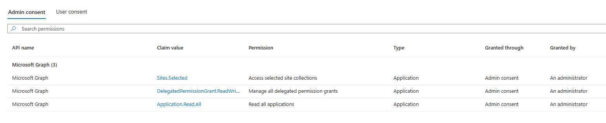

# Grant Managed Identity permissions to audit and cleanup "SharePoint Online Client Extensibility Web Application Principal" API permissions

## Summary

 This script can be used to grant System-Managed Identity used by automation (Azure Runbook, Azure Functions) API permissions and access to SPO sites,that are necessary to:
- audit API permissions assigned to the "SharePoint Online Client Extensibility Web Application Principal".
- audit permissions requested by the installed SPFx solutions (tenant-level and site-level app catalogs)
- remove unused permissions.

### Set-ManagedIdentityAPIPermissions
The `Set-ManagedIdentityAPIPermissions` function grants the following roles to the Managed Identity used for automation:
    - `Application.Read.All`,
    - `Sites.Selected`     ,
    - `DelegatedPermissionGrant.ReadWrite.All`

Once the `Lists.SelectedOperations.Selected` is available productively, the `Sites.Selected` scope can be replaced.



### Set-SiteAppCatalogPermissions
The `Set-SiteAppCatalogPermissions` function grants the Service Principal read access to 
- root level SharePoint Site
- tenant-level app catalog
- sites with site-level app catalog

> The script uses **Microsoft Graph PowerShell** (`Set-ManagedIdentityAPIPermissions`) and **PnP PowerShell** (`Set-SiteAppCatalogPermissions`)
>
> PnP PowerShell requires PowerShell 7.2 or later.

## Resources
Overview of Selected permissions in OneDrive and SharePoint: https://learn.microsoft.com/en-us/graph/permissions-selected-overview?tabs=powershell
Assigning application permissions to lists, list items, folders, or files breaks inheritance on the assigned resource, 
so be mindful of service limits for unique permissions in your solution design. Permissions at the site collection level do not break inheritance 
because this is the root of permission inheritance.

Other useful tools:
- Microsoft Graph Permissions Explorer: https://graphpermissions.merill.net/permission/
- Export-MsIdAppConsentGrantReport https://azuread.github.io/MSIdentityTools/commands/Export-MsIdAppConsentGrantReport

## Important

To assign all permissions, please execute both functions:

```powershell
param(
    [string]$spId,
    [string]$tenantName
)
Set-ManagedIdentityAPIPermissions -spId $spId 
Set-SiteAppCatalogPermissions -tenantName $tenantName -spId $spId 
```
The below tabs have different contents:
- PnP PowerShell: `Set-SiteAppCatalogPermissions` function
. Microsoft Graph PowerShell: `Set-ManagedIdentityAPIPermissions` function

# [PnP PowerShell](#tab/pnpps)

```powershell
<#
    .DESCRIPTION
    The Set-SiteAppCatalogPermissions function grants Managed Identity Read acess to the following SPO sites:
    - root site : this is required for the Azure Runbook to connect to SharePoint and request app catalogs
    - tenant level app catalog
    - all detected site level app catalogs
#>
function Set-SiteAppCatalogPermissions {
    param(
        [string]$tenantName,
        [string]$spId
    )
    $adminUrl = "https://$tenantName-admin.sharepoint.com/"

    Import-Module PnP.PowerShell
    Write-Host "Connect to SharePoint Admin site: $adminUrl "
    Connect-PnPOnline -Url $adminUrl -Interactive

    # get Service Principal to retrieve AppId
    $sp = Get-MgServicePrincipal -ServicePrincipalId $spId #script will stop if service principal does not exist

    Get-PnPSiteCollectionAppCatalog -ExcludeDeletedSites -PipelineVariable SiteAppCatalog | ForEach-Object {
        Grant-PnPAzureADAppSitePermission -AppId $sp.AppId -DisplayName $sp.DisplayName -Permissions Read -Site $SiteAppCatalog.SiteID.Guid
    }
    $tenantLevelAppCatalog = Get-PnPTenantAppCatalogUrl
    Grant-PnPAzureADAppSitePermission -AppId $sp.AppId -DisplayName $sp.DisplayName -Permissions Read -Site $tenantLevelAppCatalog
    Grant-PnPAzureADAppSitePermission -AppId $sp.AppId -DisplayName $sp.DisplayName -Permissions Read -Site "https://$tenantName.sharepoint.com/"

}
```
[!INCLUDE [More about PnP PowerShell](../../docfx/includes/MORE-PNPPS.md)]


# [Microsoft Graph PowerShell](#tab/graphps)
```powershell
<#
    .DESCRIPTION
    The Set-ManagedIdentityAPIPermissions function grants the following Microsoft Graph API permissions:
    - 'DelegatedPermissionGrant.ReadWrite.All'
    - 'Application.Read.All',
    - 'Sites.Selected'                     # once 'Lists.SelectedOperations.Selected' is released, scope can be changed

    Other permissions may be added by updating the $permissionMap array. 
    Use the following commands to retrieve information about additional applications: 
    
    Import-Module Microsoft.Graph.Applications
    Connect-MgGraph -Scopes 'Application.Read.All'

    Get-MgServicePrincipal -Search '"displayName:Team"' -CountVariable CountVar `
         -Property "displayName,appId,replyUrls,servicePrincipalType,oauth2PermissionScopes,appRoles,resourceSpecificApplicationPermissions" `
         -ConsistencyLevel eventual

    See https://learn.microsoft.com/en-us/graph/api/resources/serviceprincipal?view=graph-rest-1.0#properties
    for a currnet list of available properties and their descriptions

    .NOTES
    IMPORTANT: The DelegatedPermissionGrant.ReadWrite.All permission allows an app or a service to manage permission grants 
    and elevate privileges for any app, user, or group in your organization. Only appropriate users should access apps that 
    have been granted this permission.

    TODO: Once the 'Lists.SelectedOperations.Selected' is available productively (now in beta),
    the 'Sites.Selected' can be replaced with 'Lists.SelectedOperations.Selected'
#>
function Set-ManagedIdentityAPIPermissions {
    param(
        [string]$spId
    )
    $permissionMap = @{
        '00000003-0000-0000-c000-000000000000' = @( # Microsoft Graph
            'Application.Read.All',
            'DelegatedPermissionGrant.ReadWrite.All',
            'Sites.Selected'                     # once 'Lists.SelectedOperations.Selected' is released, scope can be changed
        )
    }
    Import-Module Microsoft.Graph.Authentication
    Import-Module Microsoft.Graph.Applications
    Connect-MgGraph  -Scopes "AppRoleAssignment.ReadWrite.All" , 'Application.Read.All'

    Get-MgServicePrincipal -All  | Where-Object { $_.AppId -in $permissionMap.Keys } -PipelineVariable SP | ForEach-Object {
        $SP.AppRoles | Where-Object { $_.Value -in $permissionMap[$SP.AppId] -and $_.AllowedMemberTypes -contains "Application" } -PipelineVariable AppRole | ForEach-Object {
            try {
                $params = @{
                    principalId = $spId
                    resourceId  = $SP.Id
                    appRoleId   = $AppRole.Id
                }
                New-MgServicePrincipalAppRoleAssignment -ServicePrincipalId $spId -BodyParameter $params -ErrorAction:SilentlyContinue
            }
            catch {
                throw $_.Exception
            }
        }
    }
}
```
[!INCLUDE [More about Microsoft Graph PowerShell SDK](../../docfx/includes/MORE-GRAPHSDK.md)]


***


## Contributors

| Author(s) |
|-----------|
| Kinga Kazala |


[!INCLUDE [DISCLAIMER](../../docfx/includes/DISCLAIMER.md)]
