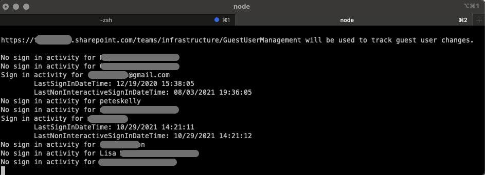
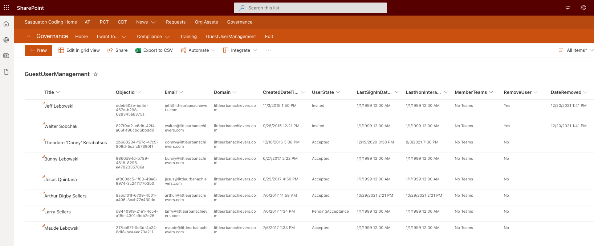

# Inventory Guest Sign-In Activity with CLI for M365 and Microsoft Graph 

## Summary

The script inventories Guest accounts from Azure Active Directory using the CLI for Microsoft 365, Microsoft Graph, and PowerShell's Invoke-RestMethod to query all Guest accounts and signInActivity.  The script can also gather Teams that the Guest account is a member of by including the -IncludeTeams switch. 

The script will also check for a SharePoint Online List name specified (with a default provided) and create the list if it does not exist.

Once the users are collected and the list is created, the script creates a list item for each user. If the script is run again, the script will update list items based on the user ObjectId property.

> [!Note]
> This script requires an Azure Active Directory Premium 1 license and requires modifying permission scopes for the CLI for Microsoft 365. [See Source Credit](#source-credit) for link to complete details.  





The images above are examples of the running script and the resulting SharePoint list created with sample data. 

# [CLI for Microsoft 365 using PowerShell](#tab/cli-m365-ps)

```powershell

#!/usr/local/bin/pwsh -File

<#
    .SYNOPSIS
    The script inventories Guest accounts and Sign In Activity from Azure AD into a SharePoint Online List.

    .DESCRIPTION
    The script inventories Guest accounts from Azure Active Directory using the CLI for Microsoft 365, Microsoft Graph, and PowerShell's Invoke-RestMethod to query all Guest accounts and signInActivity.  The script can also gather Teams that the Guest account is a member of by including the -IncludeTeams switch.

    The script will also check for a SharePoint Online List name specified (with a default provided) and create the list if it does not exist.

    Once the users are collected and the list is created, the script creates a list item for each user. If the script is run again, the script will update list items based on the user ObjectId property.

    .EXAMPLE
    Get-GuestUsers.ps1 -Weburl "https://contoso.sharepoint.com/teams/infrastructure"

    .EXAMPLE
    Get-GuestUsers.ps1 -Weburl "https://contoso.sharepoint.com/teams/infrastructure" -ListName "GuestUserManagement"

    .EXAMPLE
    Get-GuestUsers.ps1 -Weburl "https://contoso.sharepoint.com/teams/infrastructure" -ListName "GuestUserManagement" -IncludeTeams

    .PARAMETER WebUrl
    The URL of the SharePoint Online site to be inventoried.

    .PARAMETER ListName 
    The name of the list used to store Guest user information.

    .PARAMETER IncludeTeams
    Switch to collect Teams for each user. Provided as a switch since this can increase the time to run the script.
#>

[CmdletBinding()]
param(
    [parameter(Mandatory = $true)][string]$WebUrl,
    [parameter(Mandatory = $false)][string]$ListName = "GuestUserManagement",
    [switch]$IncludeTeams
)

# log file will be saved in same directory script was started from  
$LOG_FORMAT= $(get-date).ToString("yyyyMMddHHmmss")  
$LOG_FILE=".\GetUsersLog-"+$LOG_FORMAT+".log"  
$GRAPH_API_BASE="https://graph.microsoft.com"
$GRAPH_API_VERSION = "/beta"
$DEFAULT_UNACCEPTED_DATE = "1/1/1999"  # Needed to convert default value 0001-01-01:00:00:000Z for SP Online

## Start the Transcript  
Start-Transcript -Path $LOG_FILE 

# Display the current user's credentials for CLI for M365. The user MUST have access to 
# create lists in the specified site and must have the Audit Log permission for Microsoft Graph.
# See https://peteskelly.com/cli-graph-signin-actvity/ for more info.on adding permissions to the PnP App
$currentM365User = $(m365 status) | ConvertFrom-Json
Write-Host "***************************************************************"
Write-Host "*"
Write-Host "*"
Write-Host "*   Current CLI for M365 User: $($currentM365User.connectedAs)"
Write-Host "*"
Write-Host "*"
Write-Host "***************************************************************"
Write-Host ""
Write-Host ""
$response = read-host "Press a to abort, any other key to continue."
$aborted = $response -eq "a"
if ($aborted)
{
    Write-Host "Aborted by user"
    Stop-Transcript
    exit
}

##################################
##
##         Functions
##
##################################
[CmdletBinding]
function Test-GuestUserManagementList
{
    param(
        [parameter(Mandatory = $true)][string]$webUrl, 
        [parameter(Mandatory = $true)][string]$listName 
    )
    # Use M365 CLI to check if the list exists    
    $list = $(m365 spo list get --webUrl $($webUrl) --title $($listName) ) | ConvertFrom-Json
    return  (($null -ne $list) -and ($list.Title -eq $listName)) 
}

[CmdletBinding]
function New-GuestUserManagementList
{
    param(
        [parameter(Mandatory = $true)][string]$webUrl, 
        [parameter(Mandatory = $true)][string]$listName 
    )
    #  Use M365 CLI to create if the list does not exist
    $newList = $(m365 spo list add --webUrl $($webUrl) --title $($listName) --baseTemplate GenericList --enableVersioning true --majorVersionLimit 50 --onQuickLaunch $true --output json) | ConvertFrom-Json
    if ($newList.Title -eq $listName)
    {
        Write-Verbose "Created list successfully! Creating columns..." 
        m365 spo field add --webUrl $($webUrl) --listTitle $($listName) --xml "<Field Type='Text' DisplayName='ObjectId' Name='ObjectId' Title='ObjectId' Required='True'/>" --options AddFieldToDefaultView  | Out-Null    
        m365 spo field add --webUrl $($webUrl) --listTitle $($listName) --xml "<Field Type='Text' DisplayName='Email' Name='Email' Title='Email' Required='True'/>" --options AddFieldToDefaultView | Out-Null       
        m365 spo field add --webUrl $($webUrl) --listTitle $($listName) --xml "<Field Type='Text' DisplayName='Domain' Name='Domain' Title='Domain' Required='True'/>" --options AddFieldToDefaultView  | Out-Null           
        m365 spo field add --webUrl $($webUrl) --listTitle $($listName) --xml "<Field Type='DateTime' DisplayName='CreatedDateTime' Name='CreatedDateTime' Title='CreatedDateTime' Description='The createdDateTime of the user entry in Azure AD'  Required='TRUE'/>" --options AddFieldToDefaultView | Out-Null
        m365 spo field add --webUrl $($webUrl) --listTitle $($listName) --xml "<Field Type='Text' DisplayName='UserState' Name='UserState' Title='UserState' Required='True'/>" --options AddFieldToDefaultView  | Out-Null    
        m365 spo field add --webUrl $($webUrl) --listTitle $($listName) --xml "<Field Type='DateTime' DisplayName='LastSignInDateTime' Name='LastSignInDateTime' Title='LastSignInDateTime' Required='True'/>"  --options AddFieldToDefaultView | Out-Null
        m365 spo field add --webUrl $($webUrl) --listTitle $($listName) --xml "<Field Type='DateTime' DisplayName='LastNonInteractiveSignInDateTime' Name='LastNonInteractiveSignInDateTime' Title='LastNonInteractiveSignInDateTime' Required='True'/>"  --options AddFieldToDefaultView | Out-Null
        m365 spo field add --webUrl $($webUrl) --listTitle $($listName) --xml "<Field Type='Note' DisplayName='MemberTeams' Name='MemberTeams' RichText='FALSE' Title='MemberTeams' AppendOnly='FALSE' Description='Teams the user was a member of' Required='TRUE'/>" --options AddFieldToDefaultView | Out-Null
        m365 spo field add --webUrl $($webUrl) --listTitle $($listName) --xml "<Field Type='Boolean' DisplayName='RemoveUser' Name='RemoveUser' Title='RemoveUser' Description='Remove the Guest User Account. This field is used by Automation.'><Default>0</Default></Field>" --options AddFieldToDefaultView | Out-Null
        m365 spo field add --webUrl $($webUrl) --listTitle $($listName) --xml "<Field Type='DateTime' DisplayName='DateRemoved' Name='DateRemoved' Title='DateRemoved' Description='Date the user was removed from Azure AD'  Required='FALSE'/>" --options AddFieldToDefaultView | Out-Null
    } else
    {
        Write-Error "Failed to create list"
        exit
    }
}

[CmdletBinding]
function Add-GuestUserManagementListItem
{
    param(
        [parameter(Mandatory = $true)][string]$webUrl, 
        [parameter(Mandatory = $true)][string]$listName,
        [parameter(Mandatory = $true)][string]$displayName,
        [parameter(Mandatory = $true)][string]$objectId,
        [parameter(Mandatory = $true)][string]$email,
        [parameter(Mandatory = $true)][string]$domain,
        [parameter(Mandatory = $true)][string]$memberTeams,
        [parameter(Mandatory = $true)][datetime]$createdDateTime,
        [parameter(Mandatory = $true)][string]$userState,
        [parameter(Mandatory = $true)][datetime]$lastSignInDateTime,
        [parameter(Mandatory = $true)][datetime]$lastNonInteractiveSignInDateTime
    )

    # Display the bound parameters for debugging in case of issues if -Verbose is specified
    foreach ($key in $MyInvocation.BoundParameters.keys)
    {
        Write-Verbose "Parameter: $($key) -> $($MyInvocation.BoundParameters[$key])"
    }
    # Use M365 CLI to check if the listItem exists using ObjectId as the unique identifier   
    $listItem = $(m365 spo listitem list --webUrl $($webUrl) --title $($listName) --filter "ObjectId eq '$($objectId)'" --output json) | ConvertFrom-Json
    if ($null -eq $listItem)
    {
        # Add the list item
        $newListItem = $(m365 spo listitem add --webUrl $webUrl --listTitle $listName `
                --Title $displayName `
                --Email $email `
                --ObjectId $objectId `
                --Domain $domain `
                --MemberTeams $memberTeams `
                --CreatedDateTime $createdDateTime `
                --UserState $userState `
                --LastSignInDateTime $lastSignInDateTime `
                --LastNonInteractiveSignInDateTime $lastNonInteractiveSignInDateTime `
                --output json) | ConvertFrom-Json
        Write-Host "Created list item ID [$($newListItem.id)] for $($displayName) with $($objectId) successfully!" 
    } else 
    {
        #update the list item if it already exists in the list
        m365 spo listitem set --webUrl $($webUrl) --listTitle $($listName) --id $($listItem.id)  `
            --Title $displayName `
            --Email $email `
            --ObjectId $objectId `
            --Domain $domain `
            --MemberTeams $memberTeams `
            --CreatedDateTime $createdDateTime `
            --UserState $userState `
            --LastSignInDateTime $lastSignInDateTime `
            --LastNonInteractiveSignInDateTime $lastNonInteractiveSignInDateTime | Out-Null                                                                    
        Write-Host "Updated list item ID [$($listItem.id)] $($displayName) with $($objectId) successfully!" 
    }
}

[CmdletBinding]
function Get-JoinedTeams
{
    param(
        [parameter(Mandatory = $true)]
        $userObjectId
    )

    # Use CLI to get an access token to Graph API for the teams a user is a member of
    $accessToken = m365 util accesstoken get -r $($GRAPH_API_BASE)--new --output text
    $headers = @{
        Authorization = "Bearer $($accessToken)"
        'Content-Type' = "application/json"
    }    
    $memberTeams = "No Teams"  # Default value if there are no teams found for the user
    # Call Graph API to get the teams a user is a member of
    $joinedTeamsQuery = "$($GRAPH_API_BASE)$($GRAPH_API_VERSION)/users/$($userObjectId)/joinedTeams"
    $joinedTeamsResponse = Invoke-RestMethod -Uri $joinedTeamsQuery -Headers $headers -Method Get 
    if ($joinedTeamsResponse.value)
    {
        $memberTeams = $joinedTeamsResponse.value | Select-Object -ExpandProperty displayName   
        if (($memberTeams -is [array]) -and ($memberTeams.Length -gt 0))
        {
            $memberTeams = $memberTeams -join ";"            
        }    
    }
    return $memberTeams
}

[CmdletBinding]
function Get-GuestUserSignInActivity
{
    param(
        [parameter(Mandatory = $false)]
        $queryUrl = "$($GRAPH_API_BASE)$($GRAPH_API_VERSION)/users?`$filter=userType eq 'Guest'&`$select=id,displayName,mail,createdDateTime,externalUserState,signInActivity"
    )

    # Use CLI to get an access token to Graph API for the users sign in activity
    $accessToken = m365 util accesstoken get -r $($GRAPH_API_BASE) --new --output text
    $headers = @{
        Authorization = "Bearer $accessToken"
        'Content-Type' = "application/json"
    }
    $signInActivityResponse = Invoke-RestMethod -Uri $queryUrl -Headers $headers -Method Get   
    return $signInActivityResponse
}

##################################
##
##         Main Script
##
##################################

#1. Ensure the User Management List exists to contain guest entry information 
$listExists = Test-GuestUserManagementList $WebUrl $ListName
if (-not $listExists)
{
    Write-Verbose "List does not exist. Creating list..."
    New-GuestUserManagementList -webUrl $($WebUrl) -listName $($ListName)
}
Write-Host ""
Write-Host "$($WebUrl)/$($ListName) will be used to track guest user changes."
Write-Host ""

#2. Get the guest users from Graph - AuditLog.Read.All scope requires Azure AD P1 licensing
$moreEntries = $true
$guestUsers = @();
$graphResult = Get-GuestUserSignInActivity
do
{
    $graphResult.value | ForEach-Object {   
        $currentUser = [pscustomobject]@{
            ObjectId = $_.id
            DisplayName = $_.displayName
            Mail = $_.mail
            CreatedDateTime = $_.createdDateTime
            UserState = ($null -ne $_.externalUserState) ? $_.externalUserState : "Invited" # Provide a default value if the externalUserState is null
        }
        # Sanitize and add the signInActivity 
        if ($_.signInActivity -eq $null)
        {
            Write-Host "No sign in activity for $($_.displayName)"
            $currentUser | Add-Member -Type NoteProperty -Name 'LastSignInDateTime' -Value $(Get-Date 01-01-1999)
            $currentUser | Add-Member -Type NoteProperty -Name 'LastNonInteractiveSignInDateTime' -Value $(Get-Date 01-01-1999)
        } else
        {
            Write-Host "Sign in activity for $($_.displayName)`n`tLastSignInDateTime: $($_.signInActivity.lastSignInDateTime)`n`tLastNonInteractiveSignInDateTime: $($_.signInActivity.lastNonInteractiveSignInDateTime)"
            $lastSignInDateTime = ($_.signInActivity.lastSignInDateTime -lt (Get-Date $DEFAULT_UNACCEPTED_DATE)) ? $(Get-Date $DEFAULT_UNACCEPTED_DATE) : $_.signInActivity.lastSignInDateTime
            $lastNonInteractiveSignInDateTime = ($_.signInActivity.lastNonInteractiveSignInDateTime -lt (Get-Date $DEFAULT_UNACCEPTED_DATE)) ? $(Get-Date $DEFAULT_UNACCEPTED_DATE) : $_.signInActivity.lastNonInteractiveSignInDateTime
            $currentUser | Add-Member -Type NoteProperty -Name 'LastSignInDateTime' -Value $($lastSignInDateTime)
            $currentUser | Add-Member -Type NoteProperty -Name 'LastNonInteractiveSignInDateTime' -Value $($lastNonInteractiveSignInDateTime)
        }

        # add Teams if commmand line switch provided
        $teams = $includeTeams ? (Get-JoinedTeams $_.id) : "Skipped Teams Check"               
        $currentUser | Add-Member -Type NoteProperty -Name 'MemberTeams' -Value $teams                

        # Add the current user to the guestUsers to be processed
        $guestUsers += $currentUser 
    }
    # if the @odata.nextLink is not null then there are more pages of results to retrieve
    $moreEntries = ($null -ne $graphResult.'@odata.nextLink')
    if ($moreEntries)
    {
        $graphResult = Get-GuestUserSignInActivity -queryUrl $graphResult.'@odata.nextLink'
    }   
} while ($moreEntries)

# Upsert the list of users to the SP site / list
$guestUsers | ForEach-Object {
    $listParams = @{
        webUrl = $WebUrl 
        listName = $ListName
        displayName = $_.DisplayName
        objectId = $_.ObjectId
        email = $_.Mail
        domain = $_.Mail.Split('@')[1]
        memberTeams = $_.MemberTeams
        createdDateTime = $_.CreatedDateTime
        userState = $_.UserState
        lastSignInDateTime = $_.LastSignInDateTime
        lastNonInteractiveSignInDateTime = $_.LastNonInteractiveSignInDateTime
    }
    Add-GuestUserManagementListItem @listParams
}

## Stop Transcript  
Stop-Transcript  

```

[!INCLUDE [More about CLI for Microsoft 365](../../docfx/includes/MORE-CLIM365.md)]

## Source Credit

Sample first appeared on [https://peteskelly.com/cli-graph-signin-actvity/](https://peteskelly.com/cli-graph-signin-actvity/)

## Contributors

| Author(s) |
|-----------|
| [Pete Skelly](https://github.com/pkskelly) |


[!INCLUDE [DISCLAIMER](../../docfx/includes/DISCLAIMER.md)]

