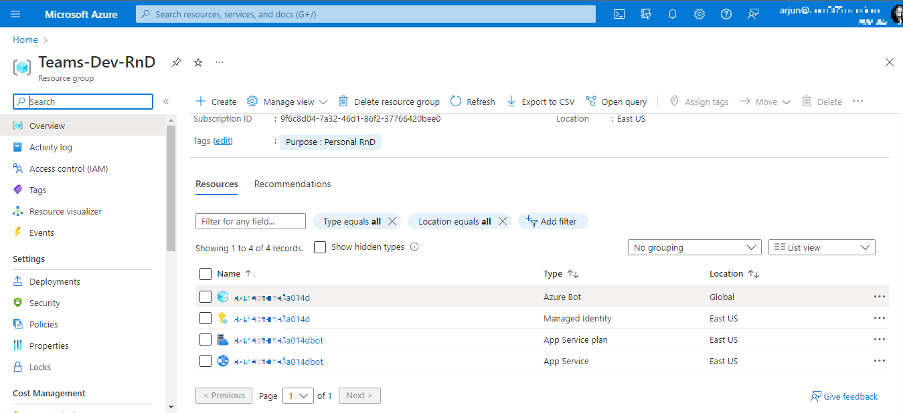
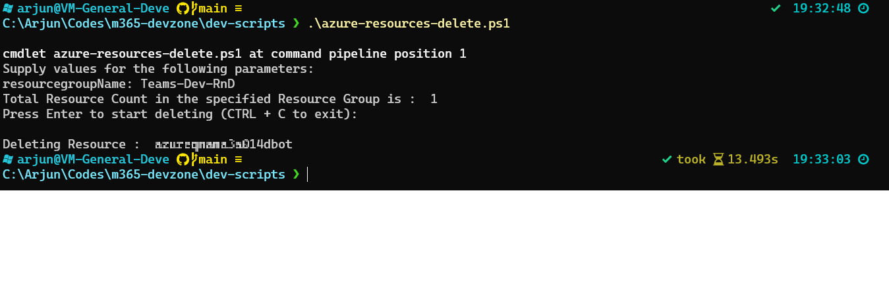

# Delete all resources from a resource group

## Summary

There will be cases where you want to delete all resources from a resource group. This would typically be used if you want to clean up the resource group after a test run.

 The below script will delete all the resources from a resource group.

Resource to be deleted from the specific resource group:



Script execution sample screen:



> [!WARNING]
> Please be aware this script contains a command that will remove or delete an artefact, ensure you test and understanding the implications of running the script.

# [Azure CLI](#tab/azure-cli)

```powershell

<#
.SYNOPSIS
Delete all the resources from a specified resource group
.DESCRIPTION
.EXAMPLE
.\azure-resources-delete.ps1 -resourcegroupName "Resourcegroup-to-delete"
Delete all the resources from a specified resource group
#>
Param(
    [Parameter(Mandatory = $true)]
    [string]$resourcegroupName
)

function executeDeleteAzureResources {

    # Getting all the resources from specified Resource group. We will be filtering the Resources group using JMESPath Query. 
    # Refer https://learn.microsoft.com/en-us/cli/azure/query-azure-cli?tabs=concepts%2Cbash for details
    $ResourceList = (az resource list --query "[?resourceGroup=='$resourcegroupName'].{ Name: name, Id: id}") | ConvertFrom-Json

    # Showing the resource count in the Resource Group
    # A confirmation prompt will be made to confirm the deletion
    Write-Host "Total Resource Count in the specified Resource Group is : "$ResourceList.Count
    Read-Host -Prompt "Press Enter to start deleting (CTRL + C to exit)"

    ForEach ($Resource in $ResourceList) {
        Write-Host "Deleting Resource :  $($Resource.Name)"
        # Deleting the resources with Resource ID
        az resource delete --ids $Resource.Id
    }
}

executeDeleteAzureResources

```

[!INCLUDE [More about Azure CLI](../../docfx/includes/MORE-AZURECLI.md)]

***

## Contributors

| Author(s) |
|-----------|
| Arjun Menon |


[!INCLUDE [DISCLAIMER](../../docfx/includes/DISCLAIMER.md)]
