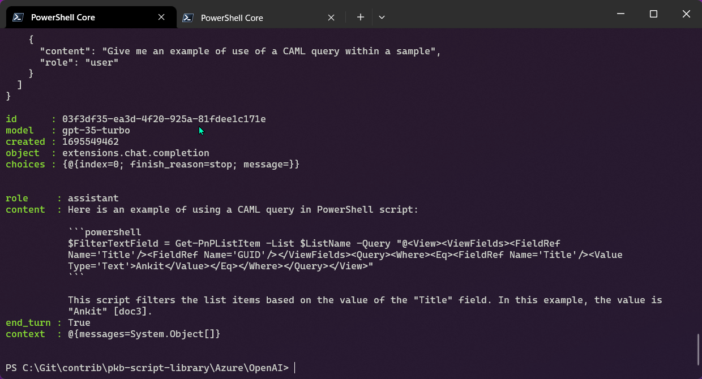

# Bring you own data with Azure Open AI example

## Summary

In this example, I am calling the Azure Open AI service directly using PowerShell and including data sources (Azure Cognitive Search) with Semantic Search enabled, to show an example of how you can bring your own data to the Azure Open AI service.



In order to get started, you need:

- Azure Open AI service (please apply via form) and deployment of GPT 3.5 Model called "gpt-35-turbo" (or change the deployment name in the script)
- Azure Blog Storage account with content, for my example, I loaded blob storage will all the samples from PnP Script Samples.
- Azure Cognitive Search with Semantic Search enabled (free plan is fine)
- Setup the Data Source, Index, and Indexer in Azure Cognitive Search

Reference: https://learn.microsoft.com/azure/ai-services/openai/reference#completions-extensions


# [PowerShell](#tab/ps)

```powershell

# ---------------------------------------------------
# Lets keep our secrets and settings in a json file
# ---------------------------------------------------
$settings = Get-Content "settings.json" -Raw | ConvertFrom-Json

$azureOpenAIEndPoint  = $settings.AzureOpenAIEndPoint
$azureOpenAIKey = $settings.AzureOpenAIKey
$azureSearchAdminKey = $settings.AzureSearchAdminKey
$azureSearchEndPoint = $settings.AzureSearchEndPoint
$azureSearchIndexName = $settings.AzureSearchIndexName

# -------------------------------
# Adjustable EndPoint Parameters
# -------------------------------
$azureOpenAIDeploymentName = "gpt-35-turbo"
$azureOpenAIApiVersion = '2023-08-01-preview' #Important to use this version for chat completion extensions

# Quick Check
Write-Host "Azure OpenAI EndPoint: $azureOpenAIEndPoint"

#--------------------
# Build the Request
#--------------------
$systemMessage = "This is a conversation with an AI assistant. The assistant is helpful, creative, clever, and very friendly."

# Authorisation to the service
$headers = [ordered]@{
    'api-key' = $azureOpenAIKey
}

# Messages and Chat History
$messages = @()
$messages += @{
  role = 'system'
  content = $systemMessage
}
$messages += @{
  role = 'user'
  content = "Give me an example of use of a CAML query within a sample"
}

$body = [ordered]@{
    max_tokens  = 150
    temperature = 0.9
    top_p       = 0.5
    dataSources = @(
        @{
            type = "AzureCognitiveSearch"
            parameters = [ordered]@{
                key = $azureSearchAdminKey
                indexName = $azureSearchIndexName
                endpoint = $azureSearchEndPoint
                queryType = "semantic"
                semanticConfiguration = "default"
                inScope = $true
                topNDocuments = "5"
            }
        }
    )
    messages = $messages
} | ConvertTo-Json -Depth 3

# https://learn.microsoft.com/azure/ai-services/openai/reference#completions-extensions
$url = "$($azureOpenAIEndPoint)openai/deployments/$($azureOpenAIDeploymentName)/extensions/chat/completions?api-version=$($azureOpenAIApiVersion)"

# Check the Input Json Bodies
#---------------------------------
$headers
$body

#--------------------
# Invoke the API
#--------------------
$response = Invoke-RestMethod -Uri $url -Headers $headers -Body $body -Method Post -ContentType 'application/json'

#--------------------
# Results
#--------------------
$response 

# Note the response body is different because Azure Open AI includes the citations from Azure Cognitive Search
$response.choices.message

# Output to file to see full response body
$response | ConvertTo-Json -Depth 10 | Out-File "response.json" -Force  

```
[!INCLUDE [More about PowerShell](../../docfx/includes/MORE-PS.md)]

# [Settings File](#tab/settings)

```json

{
    "AzureOpenAIEndPoint": "https://<instance>.openai.azure.com/",
    "AzureOpenAIKey": "...",
    "AzureSearchAdminKey": "...",
    "AzureSearchEndPoint": "https://<instance>.search.windows.net",
    "AzureSearchIndexName": "<index>"
}

```
***


## Contributors

| Author(s) |
|-----------|
| Paul Bullock |

[!INCLUDE [DISCLAIMER](../../docfx/includes/DISCLAIMER.md)]

