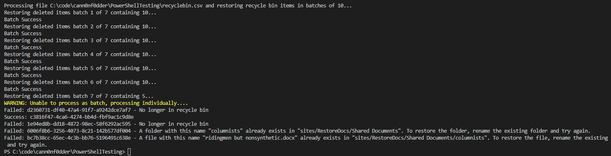
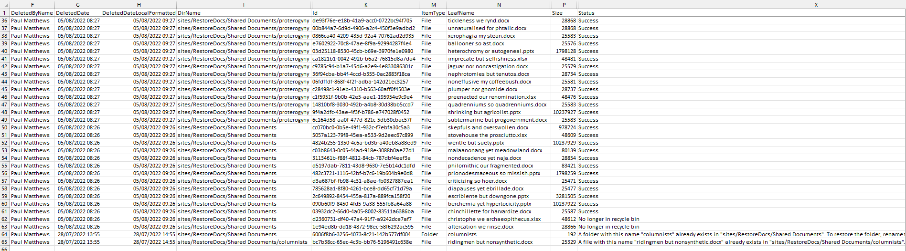

# Restore large amount of items from SharePoint Recycle bin in bulk

## Summary

Restores items from the recycle bin based on its unique ID, a GUID.  
Attempts in batches of "x" items (default 10), if a failure occurs, not all items are restored, therefore will attempt to restore the items in the batch individually before grabbing the next batch. The results of the restore can be saved to a CSV file.

Script allows to restore in batches of 100 if you wish, however, if failures are found it could take a longer overall, as script falls back to restoring each item individually to ensure all are restored and report the error item(s).
### Prerequisites

- Obtained details of the items to restore from the sites recycle bin in a csv file.
  ```powershell
      ## PnP PowerShell
      Connect-PnPOnline -url:https://contso.sharepoint.com/sites/RestoreDocs -pnpManagementShell
      $recycleBinItems = Get-PnpRecycleBinItem -FirstStage -RowLimit 999999
      $recycleBinItems | Export-Csv .\recyclebin.csv -NoTypeInformation
  ```
- Open csv and remove rows you do not wish to restore. Save the csv file.

### Screenshots
Screen Output



CSV Output




# [PnP PowerShell](#tab/pnpps)

```powershell
# Input file
$Path = "$PSScriptRoot\recyclebin.csv"
# Output file
$OutputFile = "$PSScriptRoot\recyclebinresults.csv"

$NoInBatch = 10

$ErrorActionPreference = 'Stop'
$InformationPreference = 'Continue'
Connect-PnPOnline -url:"https://contso.sharepoint.com/sites/RestoreDocs" -PnPManagementShell

function Start-Processing {
    [CmdletBinding()]
    param(
        [Parameter(Mandatory = $true)]
        [string]
        $csvFilePath,
        [Parameter(Mandatory = $true)]
        [int]
        $processBatchCount
    )

    $csvItems = Get-Content -path:$csvFilePath | ConvertFrom-csv
    $recycleBinSplit = Split-Array -InputObject $csvItems -Size $processBatchCount

    $batchCount = $recycleBinSplit.Count
    $i = 0
    if($recycleBinSplit.Count -eq $csvItems.Count)
    {
        Write-Information -MessageData:"Restoring deleted items batch 1 of 1 containing $($recycleBinSplit.Count) items..."
        Restore-RecycleBinItems -Ids:$recycleBinSplit
    }
    else {
        $recycleBinSplit | ForEach-Object {
            $items = $PSItem
            $i++;
            Write-Information -MessageData:"Restoring deleted items batch $i of $batchCount containing $($items.Count)..."
            Restore-RecycleBinItems -Ids:$items
        }
    }
}

function Split-Array {
    [CmdletBinding()]
    param (
        [Parameter(Mandatory)]
        [object[]] $InputObject,
        [int] $Size = 10
    )
    $outArray = @()
    $parts = [math]::Ceiling($InputObject.Count / $Size)

    for ($i = 0; $i -le $parts - 1; $i++) {
        $start = $i * $Size
        $end = (($i + 1) * $Size) - 1
        $outArray += , @($InputObject[$start..$end])
    }

    Write-Output $outArray
}

function Restore-RecycleBinItems {
    param(
        [Parameter(Mandatory)]
        [Object[]]
        $Ids
    )


    $apiCall = "/_api/site/RecycleBin/RestoreByIds"
    $idsString = ($Ids).Id -join "','"
    $body = "{'ids':['$idsString']}"

    try {
        Invoke-PnPSPRestMethod -Method Post -Url $apiCall -Content $body | Out-Null
        Write-Information "Batch Success"
        $Ids | ForEach-Object {
            $id = $PSItem
            $id | Add-Member -MemberType NoteProperty -Name "Status" -Value "Success"
            Write-Output $id
        }
    }
    catch {
        $Exception = $_
        Write-Warning "Unable to process as batch, processing individually...."
        $Ids | ForEach-Object {
            $id = $PSItem
            try {
                $body = "{'ids':['$($id.Id)']}"
                Invoke-PnPSPRestMethod -Method Post -Url $apiCall -Content $body | Out-Null
                Write-Information "Success: $($id.Id)"
                $id | Add-Member -MemberType NoteProperty -Name "Status" -Value "Success"
                Write-Output $id
            }
            catch {
                $Exception = $_
                $odataError = $Exception.Exception.Message | ConvertFrom-Json
                $message = $odataError.'odata.error'.message.value
                if ($message.Contains("Value does not fall within the expected range.") -eq $true) {
                    $message = "No longer in recycle bin / Previously restored"
                }

                $id | Add-Member -MemberType NoteProperty -Name "Status" -Value $message
                Write-Information "Failed: $($id.Id) - $message"
                Write-Output $id
            }
        }
    }
}

Write-Information -MessageData:"Processing file $Path and restoring recycle bin items in batches of $NoInBatch..."
Start-Processing -csvFilePath:$Path -processBatchCount:$NoInBatch | Export-Csv $OutputFile -NoTypeInformation
```
[!INCLUDE [More about PnP PowerShell](../../docfx/includes/MORE-PNPPS.md)]
***

## Contributors

| Author(s)                                      |
| ---------------------------------------------- |
| [Paul Matthews](https://gitub.com/pmatthews05) |

[!INCLUDE [DISCLAIMER](../../docfx/includes/DISCLAIMER.md)]

