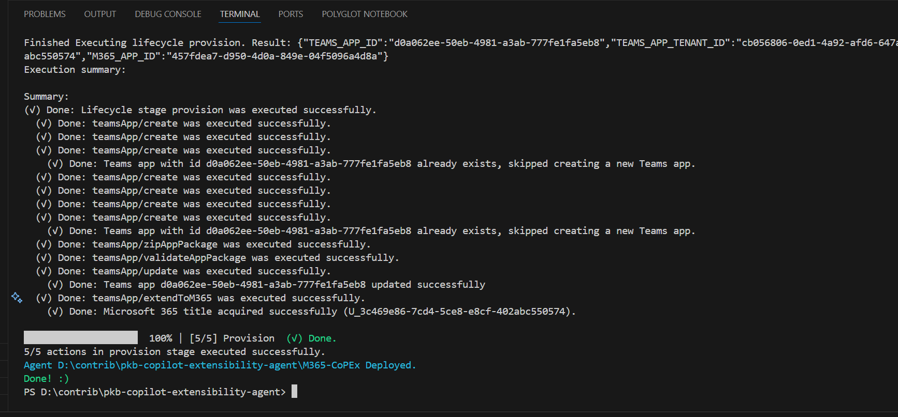

# Bulk Deployment of Teams Toolkit Declarative Agents

## Summary

This sample deploys multiple Copilot Teams Toolkit declarative agents in bulk using Teams Toolkit CLI, you will need to ensure you are logged in and installed the prerequisites. This runs thorugh a set structure (see below) and provisions the agents into Microsoft 365 Copilot - the chat experience. This is not deploying to the organisation store however this can be modified to do so.

>Note: This script is a campanion to this sample: https://pnp.github.io/script-samples/copilot-teams-toolkit-da-apply-template/README.html



## Prerequisites

This script requires the following:
- [Teams Toolkit CLI](https://learn.microsoft.com/en-us/microsoftteams/platform/toolkit/teams-toolkit-cli?pivots=version-three) installed

Install the Teams Toolkit CLI using the following command:

- npm install -g @microsoft/teamsapp-cli
- Run to test: teamsapp -h

## Folder Structure

- Base Folder
  - Copilot-Extensibility-Template
    - color.png
    - manifest.json
    - declarativeAgent.json
    - Instruction.md
    - outline.png
  - Copilot-Studio-Agent (Just create the folder, the script will populate the contents + the template)
    - appPackage
      - manifest.json
      - declarativeAgent.json
      - Instruction.md
      ...
  - Other Agent 1
  - Other Agent 2
  - Other Agent 3
  - Other Agent 4
 - Invoke-CoolScript.ps1

# [PowerShell - Teams App CLI (Single Deployment)](#tab/ps1)
```powershell

[CmdletBinding()]
param (
    $targetFolderName = "Copilot-Studio-Agent"
)
begin {

    $startingPath = Get-Location
    $targetFolder = Join-Path -Path "$(Get-Location)" -ChildPath "$($targetFolderName)"
        
    # ------------------------------------------------------------------------------
    # Introduction
    # ------------------------------------------------------------------------------

    Write-Host "*** This script will generate out all the agents ***" -ForegroundColor Green
    
    # ------------------------------------------------------------------------------

}
process {

    # ------------------------------------------------------------------------------
    # Deploying the agent
    # ------------------------------------------------------------------------------
    # Test if the target folder contains teamsapp.yml file
    $teamsAppFile = "teamsapp.yml"
    $teamsAppFilePath = Join-Path -Path $targetFolder -ChildPath $teamsAppFile
    if (Test-Path -Path $teamsAppFilePath) {
       
        Write-Host "Deploying the target agent $targetFolder" -ForegroundColor Green
        Set-Location -Path $targetFolder
        
        # Yeap, thats it. If you are not logged in, it will prompt you for logging in.
        teamsapp provision

        Write-Host "Agent $targetFolder Deployed." -ForegroundColor Cyan
    }else{
        Write-Host "File $teamsAppFile does NOT exist in the target folder." -ForegroundColor Red
    }
    
}
end{
  Set-Location -Path $startingPath
  Write-Host "Done! :)" -ForegroundColor Green
}

```

# [PowerShell - Teams App CLI (Bulk Deployment)](#tab/ps2)
```powershell

Read-Host -Prompt "This script will bulk deploy for all agents in the current directory. Press Enter to continue or Ctrl+C to cancel."

.\Set-Deploy.ps1 -targetFolderName "Copilot-Studio-Agent"
.\Set-Deploy.ps1 -targetFolderName "Other Agent 1" 
.\Set-Deploy.ps1 -targetFolderName "Other Agent 2"
.\Set-Deploy.ps1 -targetFolderName "Other Agent 3"

```
***
[!INCLUDE [More about Teams Toolkit CLI](../../docfx/includes/MORE-TEAMSTOOLKITCLI.md)]

## Source Blog Article

- [Create Microsoft 365 Copilot declarative agents with Teams Toolkit CLI | pkbullock.com](https://pkbullock.com/blog/2025/create-declarative-agent-with-teams-toolkit-cli)


## Contributors

| Author(s) |
|-----------|
| Paul Bullock |

[!INCLUDE [DISCLAIMER](../../docfx/includes/DISCLAIMER.md)]

