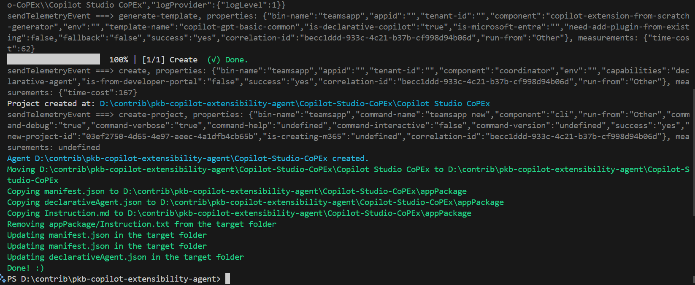

# Create and apply template to Teams Toolkit Declarative Agent

## Summary

When generating a set of templates for a Teams Toolkit Declarative Agent, you may want to apply the template to overlay the default Declarative agent reducing the need to repeat the same changes each time you develop your agent. This starter script will help you do that, as a principle. In theory, you can use a set of scripts to generate many agents with Teams Toolkit CLI. 



## Prerequisites

This script requires the following:
- [Teams Toolkit CLI](https://learn.microsoft.com/en-us/microsoftteams/platform/toolkit/teams-toolkit-cli?pivots=version-three) installed

Install the Teams Toolkit CLI using the following command:

```powershell
npm install -g @microsoft/teamsapp-cli
teamsapp -h
```

## Folder Structure

- Base Folder
  - Copilot-Studio-Agent
    - appPackage
      - manifest.json
      - declarativeAgent.json
      - Instruction.md
      ...
  - Copilot-Extensibility-Template
    - color.png
    - manifest.json
    - declarativeAgent.json
    - Instruction.md
    - outline.png
 - Invoke-CoolScript.ps1


# [PowerShell - Teams App CLI](#tab/ps)
```powershell
<# 
[CmdletBinding()]
param (
    $targetFolderName = "Copilot-Studio-Agent",
    $appName = "Copilot Studio Agent",
    $templateFolderAgent = "Copilot-Extensibility-Template",
    $appShortName = "Copilot-Studio-"
)
begin {

    $targetFolder = Join-Path -Path "$(Get-Location)" -ChildPath "$($targetFolderName)"
    $srcTemplateFolder = Join-Path -Path "$(Get-Location)" -ChildPath "$($templateFolderAgent)"
    
    # ------------------------------------------------------------------------------
    # Introduction
    # ------------------------------------------------------------------------------

    Write-Host "*** This script will generate out the agent, overlay the template and replace the values ***" -ForegroundColor Green
    
    # ------------------------------------------------------------------------------

}
process {

    # ------------------------------------------------------------------------------
    # Create the agent
    # ------------------------------------------------------------------------------
    # Test if the target folder contains teamsapp.yml file
    $teamsAppFile = "teamsapp.yml"
    $teamsAppFilePath = Join-Path -Path $targetFolder -ChildPath $teamsAppFile
    if (Test-Path -Path $teamsAppFilePath) {
        Write-Host "File $teamsAppFile already exists in the target folder." -ForegroundColor Red
        
    }else{
        Write-Host "Creating the target agent $targetFolder" -ForegroundColor Green
        teamsapp new --capability "declarative-agent" --app-name $appName -folder $targetFolder --interactive false --debug --verbose --with-plugin no 
        Write-Host "Agent $targetFolder created." -ForegroundColor Cyan

        # Move the agent to the target folder
        $srcFolder = "$(Get-Location)\$($targetFolderName)\$($appName)"
        $destFolder = "$(Get-Location)\$($targetFolderName)"
        if (Test-Path -Path $srcFolder) {
            Write-Host "Moving $srcFolder to $destFolder" -ForegroundColor Green

            Move-Item -Path "$($srcFolder)\*" -Destination $destFolder -Force
            Remove-Item -Path $srcFolder -Recurse -Force
        } else {
            Write-Host "Source folder $srcFolder not found." -ForegroundColor Red
        }
    }


    # ------------------------------------------------------------------------------
    # Copy key template files
    # ------------------------------------------------------------------------------
    
    $filesToCopy = @(
        "manifest.json",
        "declarativeAgent.json",
        "Instruction.md"
    )

    $targetAppFolder = Join-Path -Path $targetFolder -ChildPath "appPackage"

    # Copy the files to the output location
    foreach ($file in $filesToCopy) {
        $srcFilePath = Join-Path -Path $srcTemplateFolder -ChildPath $file
        
        if (Test-Path -Path $srcFilePath) {
            Write-Host "Copying $file to $targetAppFolder" -ForegroundColor Green
            Copy-Item -Path $srcFilePath -Destination $targetAppFolder -Force
        } else {
            Write-Host "File $file not found in the template package." -ForegroundColor Red
        }
    }

    $filesToRemoveTarget = @(
        
        "appPackage/Instruction.txt"
    )

    # Remove the files from the target folder
    foreach ($file in $filesToRemoveTarget) {
        $srcFilePath = Join-Path -Path $targetFolder -ChildPath $file
        
        if (Test-Path -Path $srcFilePath) {
            Write-Host "Removing $file from the target folder" -ForegroundColor Green
            Remove-Item -Path $srcFilePath -Force
        } else {
            Write-Host "File $file not found in the target folder." -ForegroundColor Red
        }
    }

    # ------------------------------------------------------------------------------
    # Update Template Values in the target folder
    # ------------------------------------------------------------------------------

    $valuesToReplace = @(
        @{ "file" = "manifest.json"; "oldValue" = "{{TMP_APP_NAME}}"; "newValue" = $appName }
        @{ "file" = "manifest.json"; "oldValue" = "{{TMP_APP_SHORT_NAME}}"; "newValue" = $appShortName }
        @{ "file" = "declarativeAgent.json"; "oldValue" = "{{TMP_APP_NAME}}"; "newValue" = $appName }
    )

    $targetAppFolder = Join-Path -Path $targetFolder -ChildPath "appPackage"

    # Loop the files in the target location, read the content, and replace the values, update the file
    foreach ($fileToUpdate in $valuesToReplace) {
        $srcFilePath = Join-Path -Path $targetAppFolder -ChildPath $fileToUpdate.file
        
        if (Test-Path -Path $srcFilePath) {
            Write-Host "Updating $($fileToUpdate.file) in the target folder" -ForegroundColor Green
            (Get-Content -Path $srcFilePath) -replace $fileToUpdate.oldValue, $fileToUpdate.newValue | Set-Content -Path $srcFilePath
        } else {
            Write-Host "File $($fileToUpdate.file) not found in the target folder." -ForegroundColor Red
        }
    }
    
}
end{

  Write-Host "Done! :)" -ForegroundColor Green
}

```
***

# [JSON - declarativeAgent.json ](#tab/json1)
```json
{
    "$schema": "https://developer.microsoft.com/json-schemas/copilot/declarative-agent/v1.3/schema.json",
    "version": "v1.3",
    "name": "{{TMP_APP_NAME}}",
    "description": "Declarative agent example for learning about Copilot Studio",
    "instructions": "$[file('instruction.md')]",
    "capabilities": [
        {
            "name": "WebSearch",
            "sites": [
                {
                    "url": "https://learn.microsoft.com/en-us/microsoft-copilot-studio"
                }
            ]
        }
    ]
}
```
# [JSON - instruction.md ](#tab/json2)
```json
You are a declarative agent and were created to support developers in extending and developing agents for Microsoft 365 Copilot. 
```
# [JSON - manifest.json ](#tab/json3)
```json
{
  "$schema": "https://developer.microsoft.com/json-schemas/teams/v1.19/MicrosoftTeams.schema.json",
  "manifestVersion": "1.19",
  "version": "1.0.0",
  "id": "${{TEAMS_APP_ID}}",
  "developer": {
    "name": "PKB App, Inc.",
    "websiteUrl": "https://pkbullock.com",
    "privacyUrl": "https://pkbullock.com",
    "termsOfUseUrl": "https://pkbullock.com"
  },
  "icons": {
    "color": "color.png",
    "outline": "outline.png"
  },
  "name": {
    "short": "{{TMP_APP_SHORT_NAME}}${{APP_NAME_SUFFIX}}",
    "full": "{{TMP_APP_NAME}}"
  },
  "description": {
    "short": "Agent to support {{TMP_APP_NAME}}",
    "full": "Agent to support {{TMP_APP_NAME}} learning about Copilot Studio"
  },
  "accentColor": "#FFFFFF",
  "composeExtensions": [],
  "permissions": [
    "identity",
    "messageTeamMembers"
  ],
  "copilotAgents": {
    "declarativeAgents": [
      {
        "id": "declarativeAgent",
        "file": "declarativeAgent.json"
      }
    ]
  },
  "validDomains": []
}
```
***


## Source Blog Article

- [reate Microsoft 365 Copilot declarative agents with Teams Toolkit CLI | pkbullock.com](https://pkbullock.com/blog/2025/create-declarative-agent-with-teams-toolkit-cli)

## Contributors

| Author(s) |
|-----------|
| Paul Bullock |


[!INCLUDE [DISCLAIMER](../../docfx/includes/DISCLAIMER.md)]

