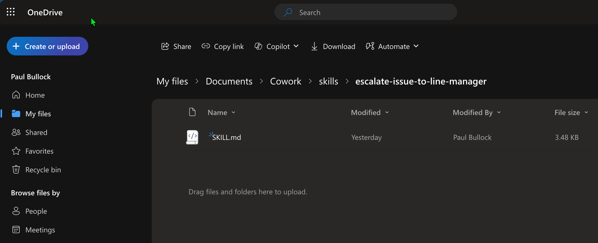

# Upload Cowork Skills to your OneDrive

## Summary

This sample uploads a custom `SKILL.md` file to a user's OneDrive `Cowork/skills` folder using PnP PowerShell.

The script:

- Connects to SharePoint and resolves the target user's personal OneDrive site.
- Ensures the target skills folder path exists under `Documents/Documents/Cowork/skills/<your-skill-folder>`.
- Uploads the local skill file into that folder.
- SKILL.md file has been tested and verified with high score from the Skills Management skill in Cowork.



# [PnP PowerShell](#tab/pnpps)

```powershell
<# 
----------------------------------------------------------------------------

Created:      Paul Bullock
Date:         04/05/2026

.Example

	./Set-CoworkAISkills.ps1 -SiteUrl "https://pkbmvp-my.sharepoint.com" -ClientId "57810d72-f1d9-4917-a271-661a4940b478" -SkillFolderName "escalate-issue-to-line-manager" -SkillFileName "SKILL.md"

.Notes

	https://pnp.github.io/powershell/cmdlets/Get-PnPFeature.html
	https://pnp.github.io/powershell/cmdlets/Resolve-PnPFolder.html
	https://pnp.github.io/powershell/cmdlets/Add-PnPFile.html

 ----------------------------------------------------------------------------
#>

[CmdletBinding()]
param (
	$SiteUrl = "https://<your-org>-my.sharepoint.com", # This should be the root of the personal site, e.g. https://tenant-my.sharepoint.com
	$ClientId = "<application-client-id-for-pnp-powershell>",
	$SkillFolderName = "escalate-issue-to-line-manager",
	$SkillFileName = "SKILL.md",
	$MyAccount = "first.last@<your-org>.onmicrosoft.com"
)
begin {

	# ------------------------------------------------------------------------------
	# Introduction
	# ------------------------------------------------------------------------------

	Write-Host " This script will set SharePoint skills into the Documents Library under Cowork folder" -ForegroundColor Green

	# ------------------------------------------------------------------------------

	$baseSkillsFolderName = "skills" # Must be lowercase
	$libraryName = "Documents"
	$coworkFolderName = "Cowork"

}
process {

	# Connect to the SharePoint site using PnP PowerShell
	Connect-PnPOnline -Url $SiteUrl -ClientId $ClientId -Interactive

	# Find my Personal OneDrive Account
	$personalProfile = Get-PnPUserProfileProperty -Account $MyAccount

	if (!$personalProfile) {
		Write-Host "Unable to find personal profile for the user. Please check the account details and try again." -ForegroundColor Red
		return
	}

	$personalSite = $personalProfile.PersonalUrl

	# Change the connection to the Personal Site
	$connPersonal = Connect-PnPOnline -Url $personalSite -ClientId $ClientId -Interactive -ReturnConnection

	# Check if the target library exists
	$library = Get-PnPList -Identity $libraryName -ErrorAction SilentlyContinue -Connection $connPersonal

	if ($library) {
		Write-Host "Document library '$libraryName' exists as expected" -ForegroundColor Cyan

		# Ensure Folder called Skills Exist
		Write-Host "Ensuring folder '$baseSkillsFolderName' exists in library '$libraryName'..." -ForegroundColor Cyan

		# It is deliberate to use the "Documents" reference twice.
		# On OneDrive its "Documents/Documents/Cowork/skills/your-custom-skill-folder" due to the way the personal site is structured.
		$targetFolderPath = "$libraryName/$libraryName/$coworkFolderName/$baseSkillsFolderName/$SkillFolderName"
		$targetFolder = Resolve-PnPFolder -SiteRelativePath $targetFolderPath -Connection $connPersonal

		if ($null -ne $targetFolder) {

			# Uploading the SKILL file to the library in the subfolder
			Write-Host "Uploading skill file '$SkillFileName' to '$targetFolderPath'..." -ForegroundColor Cyan
			Add-PnPFile -Path "$SkillFileName" -Folder $targetFolderPath -Connection $connPersonal
			Write-Host "Skill file '$SkillFileName' uploaded successfully to '$targetFolderPath'." -ForegroundColor Green

		}
		else {
			Write-Host "Folder '$targetFolderPath' does not exist. Skipping folder creation and file upload." -ForegroundColor Yellow
		}
	}
}
end {
	Write-Host "Done! :)" -ForegroundColor Green
}
```
[!INCLUDE [More about PnP PowerShell](../../docfx/includes/MORE-PNPPS.md)]

# [SKILL.md](#tab/skill)
```markdown
---
name: escalate-issue-to-line-manager
description: |
  Reports important information or incidents to your line manager via email or
  Teams. Use when user says: "report this to my manager", "escalate this",
  "escalate to [manager name]", "flag this to my boss", "notify my line manager",
  "tell my manager about [issue]", "urgent update for my manager", "let my
  manager know about [incident]". Handles three criticality levels — Notify,
  Important, Critical — and can optionally start a coordination Teams chat.

  Do NOT use for: general "who is my manager" lookups, scheduling meetings with
  your manager, replying to an existing thread from your manager, or writing
  broader updates aimed at leadership or the wider team (use stakeholder-comms
  for audience-targeted leadership/team updates).
cowork:
  category: communication
  icon: Megaphone
---

# Report Important Information to my Line Manager

Quickly notify your line manager of an issue, incident, or important update —
delivered as an email or Teams message, with an optional coordination chat.

## When NOT to Use

- General manager lookups ("who is my manager") — use people tools directly
- Scheduling a meeting with your manager — use schedule-meeting
- Replying inline to an existing thread from your manager — use Outlook reply directly
- Updates aimed at leadership broadly or the wider team — use stakeholder-comms

## Workflow

1. **Resolve the manager.** Call `GetManagerDetails` to get name and email. If
   no manager is configured, stop and tell the user.
2. **Gather context with one combined question.** Use `AskUserQuestion` to ask:
   - Channel: Email or Teams message
   - Criticality: Notify, Important, or Critical
   - Topic / what happened (free text — or reference an existing email/Teams message ID)
   - Anyone else to copy in (optional)
3. **If referencing existing content**, retrieve it first: `GetMessage` for an
   email, `GetChatMessage` for a Teams message. Quote the relevant excerpt in
   the body.
4. **Draft the message** using this template:

   - **Subject / headline:** `[CRITICAL] | [IMPORTANT] | [FYI] — <topic>`
     (only Critical and Important get a bracketed prefix; Notify uses plain subject)
   - **Body:**
     - *What happened* — one or two sentences
     - *Impact* — who/what is affected
     - *What I need from you* — explicit ask, or "for awareness, no action needed"
     - *Source* — link or quote of the underlying email/message if applicable

5. **Preview and confirm before sending.** Show the full drafted subject and
   body. Ask: "Send this now, or change anything?" Do NOT send Critical or
   Important messages without explicit confirmation. Notify-level may send
   directly if the user has already approved the draft.
6. **Send:**
   - Email mode: `SendEmailWithAttachments` to manager (CC any extra recipients).
   - Teams mode: `PostMessage` with `recipients=[manager email, ...extras]`.
7. **Optional coordination chat** — only for Important or Critical, and only
   if the user said yes in step 2: `CreateChat` (group if extras included)
   with topic = `<criticality> — <short topic>` (e.g. `Critical — Prod outage 02 May`).

## Guardrails

- Never send a Critical or Important message without showing the full draft and
  getting explicit confirmation.
- If the manager cannot be resolved, stop — do not guess or fall back to
  skip-level without asking.
- Do not create a coordination chat unless the user opted in.
- Keep the message concise — manager's time is the constraint.
```

***

## Contributors

| Author(s) |
|-----------|
| Paul Bullock |

[!INCLUDE [DISCLAIMER](../../docfx/includes/DISCLAIMER.md)]

