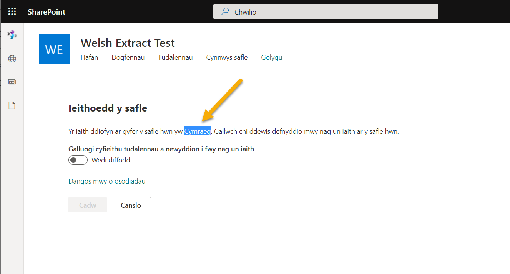

# Create Communication Sites with a specific primary language

## Summary

Do you want to create a Communication Site in another language? This script will show you how by creating a modern site with the primary language set to a language other than English.



> [!Note]
> Once you create a site in the primary language you cannot change it, however you can add support for other languages.

# [PnP PowerShell](#tab/pnpps)

```powershell

$adminUrl = "https://<tenant>-admin.sharepoint.com"
$newSiteUrl = "https://<tenant>.sharepoint.com/sites/Pensaerniaeth" 
$ownerEmail = "<your.name@your.email.com>"

$siteTitle = "Pensaerniaeth"                # Translates to "Architecture" - Bing Translator
$siteTemplate = "SITEPAGEPUBLISHING#0"      # Communication Site Template
$lcid = 1106                                # Welsh
$timeZone = 2                               # London (https://capa.ltd/sp-timezones)

Connect-PnPOnline -Url $adminUrl -NoTelemetry
New-PnPTenantSite -Template $siteTemplate -Title $siteTitle -Url $newSiteUrl `
        -Lcid $lcid -Owner $ownerEmail -TimeZone $timeZone

Write-Host "Script Complete! :)" -ForegroundColor Green

```
[!INCLUDE [More about PnP PowerShell](../../docfx/includes/MORE-PNPPS.md)]

# [SPO Management Shell](#tab/spoms-ps)

```powershell
$adminUrl = "https://<tenant>-admin.sharepoint.com"
$newSiteUrl = "https://<tenant>.sharepoint.com/sites/Pensaerniaeth" 
$ownerEmail = "<your.name@your.email.com>"

$siteTitle = "Pensaerniaeth"                # Translates to "Architecture" - Bing Translator
$siteTemplate = "SITEPAGEPUBLISHING#0"      # Communication Site Template
$lcid = 1106                                # Welsh
$timeZone = 2                               # London
$storageQuota = 1000

Connect-SPOService $adminUrl
New-SPOSite -Template $siteTemplate -Title $siteTitle -Url $newSiteUrl `
        -LocaleId $lcid -Owner $ownerEmail -TimeZoneId $timeZone -StorageQuota $storageQuota

Write-Host "Script Complete! :)" -ForegroundColor Green

```
[!INCLUDE [More about SPO Management Shell](../../docfx/includes/MORE-SPOMS.md)]

# [CLI for Microsoft 365 with PowerShell](#tab/cli-m365-ps)
```powershell

$newSiteUrl = "https://<tenant>.sharepoint.com/sites/Pensaerniaeth"
$siteTitle = "Pensaerniaeth"
$lcid = 1106

$m365Status = m365 status
if ($m365Status -match "Logged Out") {
m365 login
}
m365 spo site add --type CommunicationSite --url $newSiteUrl --title $siteTitle --lcid $lcid

Write-Host "Script Complete! :)" -ForegroundColor Green

```
[!INCLUDE [More about CLI for Microsoft 365](../../docfx/includes/MORE-CLIM365.md)]
***

To see a list of LCIDs, check out the sample [Generate Markdown Report of LCIDs](../generate-markdown-lcids/README.md) to see the full list

## Source Credit

Article first appeared on [https://www.pkbullock.com/blog/2018/create-communication-sites-with-a-specific-primary-language-using-pnp-powershell/](https://www.pkbullock.com/blog/2018/create-communication-sites-with-a-specific-primary-language-using-pnp-powershell/)

## Contributors

| Author(s) |
|-----------|
| Paul Bullock |
| Adam Wójcik |

[!INCLUDE [DISCLAIMER](../../docfx/includes/DISCLAIMER.md)]


