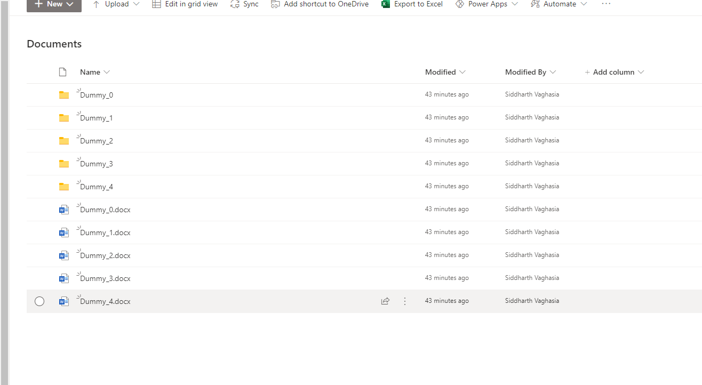

# Create bulk dummy documents in SharePoint Document library

## Summary

There are times when we have to replicate scenario to bulk upload dummy documents in large numbers for replicating 5000 items limit or testing performance of dec/test/uat enviorments. This script would help us create 'n' number of dummy documents specified as maxCount in script. Script will also provide option to create dummy folder first for each file and then upload file inside that folder. Script will use the specified file and add counter inside file name to provide uniqueness of file.

Note about two available options
- Upload the dummy files directly on the SP library, you can provide this path in "$Folder"
- Create a dummy folder first and upload the file inside that folder, you can provide the root path in "$SiteRelativeURL"


## Implementation

- Open Windows PowerShell ISE
- Create a new file
- Write a script as below,
- Change the variables to target to your enviorment, site, document library, document path, max count
- Run the script.
 
## Screenshot of Output 

 Below is the output after I have ran the script twice with maxCount set to 5, 

- Input as Folder (it has created five folder with auto incrementing folder name to get uniqueness and then added file inside each folder)
- Input as File  (it has created five files and auto incremented file name to get uniqueness)



# [PnP PowerShell](#tab/pnpps)
```powershell

#Global Variable Declaration

$pnpPowerShellModule = Get-Module PnP.PowerShell
if ($null -eq $pnpPowerShellModule) {
    Install-Module PnP.PowerShell
}

#Global Variables 
$SiteURL = "https://yourdomain.sharepoint.com/sites/mytestsite" 

#Serverrelative url of the Library, this will be used for Folder scenario
$SiteRelativeURL= "/sites/mytestsite/Shared Documents"

#Local file path where a single dummy document is available

$File= "D:\SP\repos\myscriptsamples\Dummy.docx"

#This can be used for file scenario and provide the folder path where we want to create files, it can be subfolder also
$Folder="Shared Documents"

#Read Information to get which operation need to perform
$MethodCall=Read-Host "Which Function Do you Need to Invoke ? Folder or File" 
$MethodCall=$MethodCall.ToUpper() 

#This will be max count of dummy folder or files which we have to create
$maxCount = 5


#For Sample Document Creation the file needs to be part of some location.
$FilePath= Get-ChildItem "D:\SP\repos\myscriptsamples\Dummy.docx"
$FileName = $FilePath.BaseName #Inorder to get the filename for the manipulation we used this function(BaseName)

#For Logging the Operations
$LogTime = Get-Date -Format "MM-dd-yyyy_hh-mm-ss"
$LogFile = 'D:\SP\repos\myscriptsamples\'+"FileFolderCreation_"+$LogTime+".txt"
 

 if($MethodCall -eq "FOLDER" -or $MethodCall -eq "FILE")
 {

 Try 
{
    #Connect to PnP Online
    Connect-PnPOnline -Url $SiteURL -UseWebLogin
    #To Create Folder and Files  
    if($MethodCall -eq "FOLDER")
    {
    	$FolderCnt=0
    	while($FolderCnt -lt $maxCount)
    	{
		    $FolderName= $FileName +"_"+ $FolderCnt
			write-host $FolderName
		    $SiteRelativePath=$SiteRelativeURL+"/"+$FolderName
			write-host $SiteRelativePath
		    Try
		    {
			    Add-PnPFolder -Name $FolderName -Folder $SiteRelativeURL -ErrorAction Stop
			write-host $SiteRelativePath

                Add-PnPFile -Folder $SiteRelativePath -Path $File
			   
		    }
		    catch 
		    {
    		    write-host "Folder Creation Error: $($_.Exception.Message)" -foregroundcolor Red
		    }
            $FolderCnt++
    	}
       
        write-output "New Folder and Files Created '$FolderName' Added! $($env:computername)" >> $LogFile 
         Write-host -f Green "Script execution completed...." |Out-File $LogFile -Append -Force 
          write-output "Script execution completed.... $($env:computername)" >> $LogFile -f Green
    }

    #To Create Files alone
    if($MethodCall -eq "FILE")
    {
	    $FileCnt=0
	    while($FileCnt -lt $maxCount)
	    {
		    $NewFileName= $FileName+"_"+$FileCnt+".docx"
		    try
		    {
			    Add-PnPFile -Path $File -Folder $Folder -NewFileName $NewFileName
		    }
		    catch
		    {
			    write-host "Error: $($_.Exception.Message)" -foregroundcolor Red
		    }
		    $FileCnt++
		    Write-host -f Green "New File Created '$NewFileName' Added!" |Out-File $LogFile -Append -Force 
            write-output "New File Created '$NewFileName' Added! $($env:computername)" >> $LogFile -f Green
    
	    }
            Write-host -f Green "Script execution completed...." |Out-File $LogFile -Append -Force 
            write-output "Script execution completed.... $($env:computername)" >> $LogFile -f Green
    }
}
catch 
{
    write-host "Error: $($_.Exception.Message)" -foregroundcolor Red
}

 }
 else{
 write-host "Please type either File or Folder" -foregroundcolor Red
 }

```
[!INCLUDE [More about PnP PowerShell](../../docfx/includes/MORE-PNPPS.md)]
***


## Contributors

| Author(s) |
|-----------|
| Siddharth Vaghasia|

[!INCLUDE [DISCLAIMER](../../docfx/includes/DISCLAIMER.md)]

