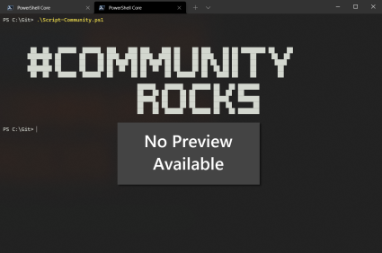

# Disable the SharePoint Online "Add Shortcut to OneDrive" Feature Using PnP PowerShell

## Summary

This PowerShell script connects to the SharePoint Online Tenant Administration site using certificate-based authentication and disables the Add Shortcut to OneDrive feature at the tenant level.

The script is designed for unattended execution using an Azure AD application and certificate, making it suitable for scheduled tasks, automation platforms, and enterprise administration. It includes execution logging, error handling, and clean session termination to support reliable operation in production environments.



## Why It Matters

The Add Shortcut to OneDrive feature blurs the line between personal storage and shared organisational content. While it can be convenient in small or simple environments, it often introduces complexity at scale. Shortcuts behave differently from traditional sync connections, and when they break - due to permission changes, site restructuring, or sync conflicts - users experience errors they don't understand and support teams inherit the fallout.

By disabling the feature, organisations reduce confusion between synced libraries and shortcuts, simplify troubleshooting, and prevent duplicate sync behaviours that frequently lead to OneDrive instability. It also supports a more consistent document access strategy, ensuring users work directly in SharePoint or Teams rather than creating ad-hoc personal views of shared content. For organisations focused on governance, compliance, or large-scale migrations, removing shortcuts eliminates a fragile layer that can undermine structure and reliability.

Ultimately, disabling this setting gives administrators greater control over how content is accessed and synced across the tenant - resulting in a cleaner user experience, fewer support tickets, and a more predictable information architecture.

## Benefits

- Uses modern certificate-based authentication (no interactive sign-in required).
- Suitable for automation and scheduled execution.
- Supports enterprise-scale Microsoft 365 tenants.
- Provides execution logging for operational visibility.
- Includes error handling and clean session disconnection.
- Eliminates manual configuration through the SharePoint Admin Center.
- Easily incorporated into tenant configuration baselines and deployment pipelines.

## Prerequisites

- PnP PowerShell installed.
- An Azure AD App Registration configured for certificate authentication.
- Certificate installed on the execution host.
- Appropriate SharePoint Online application permissions with admin consent.
- SharePoint Administrator or Global Administrator equivalent permissions for the registered application.

## Configuration

Update the following variables before execution:

| Variable          | Description                                                |
| ----------------- | ---------------------------------------------------------- |
| `$TenantAdminURL` | SharePoint Online Tenant Administration URL                |
| `$ClientID`       | Azure AD Application (Client) ID                           |
| `$ThumbPrint`     | Certificate thumbprint                                     |
| `$Tenant`         | Microsoft 365 tenant name (e.g. `contoso.onmicrosoft.com`) |

# [PnP PowerShell](#tab/pnpps)

```powershell
# ============================================================================
# Purpose:
#   Disables the "Add Shortcut to OneDrive" feature at the SharePoint Online
#   tenant level.
#
# Why:
#   Prevents users from creating OneDrive shortcuts to SharePoint folders.
#
# Run As:
#   Azure AD App Registration using certificate authentication.
# ============================================================================

# ======================================================
# Configuration 
# ======================================================

$TenantAdminURL = "https://contoso-admin.sharepoint.com"
$ClientID       = "xxxxxxxxxxxxxxxxxxxxxxxxxxxxxxxx"
$ThumbPrint     = "xxxxxxxxxxxxxxxxxxxxxxxxxxxxxxxx"
$Tenant         = "contoso.onmicrosoft.com"

# ======================================================
# Script Information 
# ======================================================

$RunDate = Get-Date -Format "yyyy-MM-dd HH:mm:ss"
$RunBy   = [System.Security.Principal.WindowsIdentity]::GetCurrent().Name

Write-Host "==================================================" -ForegroundColor Cyan
Write-Host "Disable 'Add Shortcut to OneDrive'" -ForegroundColor Cyan
Write-Host "Started : $RunDate"
Write-Host "Executed by : $RunBy"
Write-Host "==================================================" -ForegroundColor Cyan

try {
    # Connect to the SharePoint Online tenant administration site
    # using certificate-based authentication.
    Write-Host "Connecting to SharePoint Online tenant admin site..."

    Connect-PnPOnline `
        -Url $TenantAdminURL `
        -ClientId $ClientID `
        -Thumbprint $ThumbPrint `
        -Tenant $Tenant `
        -ErrorAction Stop

    # Apply the tenant setting to disable the
    # "Add Shortcut to OneDrive" feature.
    Write-Host "Applying tenant setting: DisableAddToOneDrive = True"

    Set-PnPTenant `
        -DisableAddToOneDrive $true `
        -ErrorAction Stop

    Write-Host "Tenant setting updated successfully." -ForegroundColor Green
}
catch {
    Write-Error "Script failed: $($_.Exception.Message)"
}
finally {
    Write-Host "Disconnecting from SharePoint Online..."
    Disconnect-PnPOnline -ErrorAction SilentlyContinue

    Write-Host "Completed: $(Get-Date -Format 'yyyy-MM-dd HH:mm:ss')"
}

```

[!INCLUDE [More about PnP PowerShell](../../docfx/includes/MORE-PNPPS.md)]

## Usage

1. Configure the authentication variables.
2. Execute the script using PowerShell.
3. The script connects to the SharePoint Online Admin Center.
4. The tenant setting is updated.
5. The session is disconnected automatically.

## Output

The script provides console output including:

- Script start time
- User executing the script
- Connection status
- Tenant configuration update status
- Completion time
- Error details (if applicable)

## Notes

- The setting is applied at the tenant level and affects all users.
- Changes may take time to propagate throughout Microsoft 365.
- The script is idempotent and can be executed multiple times without adverse effects.
- Certificate-based authentication is recommended for production automation over interactive authentication.

## Contributors

|Author(s)|
|-----------|
|[Josiah Opiyo](https://github.com/ojopiyo)|

*Built with a focus on automation, governance, least privilege, and clean Microsoft 365 tenants-helping M365 admins gain visibility and reduce operational risk.*

## Version history

|Version|Date|Comments|
|-------|----|--------|
|1.0|August 07, 2026|Initial release|

[!INCLUDE [DISCLAIMER](../../docfx/includes/DISCLAIMER.md)]

