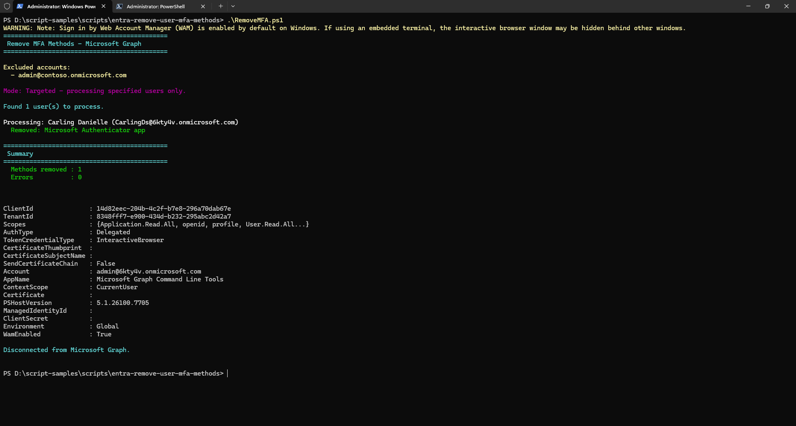

# Remove MFA Authentication Methods for Users

## Summary

This script removes all MFA (Multi-Factor Authentication) methods from user accounts in a Microsoft 365 tenant using Microsoft Graph PowerShell. It supports removing **phone**, **Microsoft Authenticator app**, and **software OATH token** methods.

The script supports two modes:

- **All users mode** — removes MFA for every user in the tenant except those in the exclusion list
- **Targeted mode** — removes MFA for specific users only by passing `-TargetUsers`

In both modes, accounts in `-ExcludedUsers` (e.g. admin or break-glass accounts) are always protected.

> [!WARNING]
> Please be aware this script contains commands that will **remove MFA authentication methods** for users in bulk. This is a **destructive and irreversible operation**. Ensure you test in a non-production environment first, and always exclude your admin and other temporary accounts.



## Compatibility

| Tool | Version |
|------|---------|
| Microsoft Graph PowerShell | v2.x+ |

## Prerequisites

The signed-in account must have the following Graph API permissions:

| Permission | Type |
|---|---|
| `UserAuthenticationMethod.ReadWrite.All` | Delegated |
| `User.Read.All` | Delegated |

```powershell
# Install required sub-modules if not already installed
Install-Module Microsoft.Graph.Authentication -Scope CurrentUser -Repository PSGallery -Force
Install-Module Microsoft.Graph.Users -Scope CurrentUser -Repository PSGallery -Force
Install-Module Microsoft.Graph.Identity.SignIns -Scope CurrentUser -Repository PSGallery -Force
```

> [!NOTE]
> Install only the three sub-modules listed above rather than the full `Microsoft.Graph` bundle.

## Script

# [Microsoft Graph PowerShell](#tab/graphps)

```powershell
#Requires -Modules Microsoft.Graph.Authentication, Microsoft.Graph.Users, Microsoft.Graph.Identity.SignIns

<#
.SYNOPSIS
    Removes MFA authentication methods for all users in a tenant using Microsoft Graph PowerShell.

.DESCRIPTION
    This script connects to Microsoft Graph and removes multi-factor authentication (MFA) methods
    for all users in the tenant, with the ability to exclude specific accounts (e.g., break-glass
    or admin accounts). It handles phone, Microsoft Authenticator app, and software OATH token methods.

    You can optionally target specific users only using -TargetUsers. If not specified, all users
    (except excluded ones) will be processed.

.PARAMETER ExcludedUsers
    An array of User Principal Names (UPNs) to exclude from MFA removal.
    Typically used to protect admin or break-glass accounts.
    These are always excluded regardless of whether -TargetUsers is used.

.PARAMETER TargetUsers
    An optional array of User Principal Names (UPNs) to target specifically.
    If provided, only these users will have their MFA methods removed (excluding any in ExcludedUsers).
    If not provided, ALL users in the tenant will be processed (except ExcludedUsers).

.EXAMPLE
    .\RemoveMFA.ps1
    Removes MFA methods from ALL users except the excluded accounts.

.EXAMPLE
    .\RemoveMFA.ps1 -TargetUsers @("john@contoso.onmicrosoft.com", "jane@contoso.onmicrosoft.com")
    Removes MFA methods for specific users only.

.EXAMPLE
    .\RemoveMFA.ps1 -ExcludedUsers @("admin@contoso.onmicrosoft.com", "breakglass@contoso.onmicrosoft.com")
    Removes MFA methods from ALL users except the specified excluded accounts.
#>

[CmdletBinding(SupportsShouldProcess)]
param (
    [Parameter(Mandatory = $false)]
    [string[]]$ExcludedUsers = @(
        "admin@contoso.onmicrosoft.com"
        # "breakglass@contoso.onmicrosoft.com"
    ),

    [Parameter(Mandatory = $false)]
    [string[]]$TargetUsers = @()
)

# ---------------------------------------------------------------------------
# Install module if needed (uncomment the line below on first run)
# Install-Module Microsoft.Graph -Scope CurrentUser -Repository PSGallery -Force
# ---------------------------------------------------------------------------

# Connect to Microsoft Graph with required scopes
Connect-MgGraph -Scopes "UserAuthenticationMethod.ReadWrite.All", "User.Read.All" -NoWelcome

Write-Host "============================================" -ForegroundColor Cyan
Write-Host " Remove MFA Methods - Microsoft Graph" -ForegroundColor Cyan
Write-Host "============================================" -ForegroundColor Cyan
Write-Host ""
Write-Host "Excluded accounts:" -ForegroundColor Yellow
$ExcludedUsers | ForEach-Object { Write-Host "  - $_" -ForegroundColor Yellow }
Write-Host ""

# ---------------------------------------------------------------------------
# Determine which users to process:
#   -TargetUsers provided     -> process only those specific users
#   -TargetUsers not provided -> process ALL users except ExcludedUsers
# ---------------------------------------------------------------------------
if ($TargetUsers.Count -gt 0) {

    Write-Host "Mode: Targeted - processing specified users only." -ForegroundColor Magenta
    Write-Host ""

    $users = [System.Collections.Generic.List[object]]::new()

    foreach ($upn in $TargetUsers) {
        if ($upn -in $ExcludedUsers) {
            Write-Host "Skipping excluded account: $upn" -ForegroundColor Yellow
            continue
        }
        $user = Get-MgUser -UserId $upn -Property Id, UserPrincipalName, DisplayName -ErrorAction SilentlyContinue
        if ($null -eq $user) {
            Write-Host "WARNING: User not found - $upn" -ForegroundColor Red
        }
        else {
            $users.Add($user)
        }
    }

}
else {

    Write-Host "Mode: All users - processing entire tenant (except excluded accounts)." -ForegroundColor Magenta
    Write-Host ""

    Write-Host "Retrieving users from tenant..." -ForegroundColor Cyan
    $users = Get-MgUser -All -Property Id, UserPrincipalName, DisplayName |
        Where-Object { $_.UserPrincipalName -notin $ExcludedUsers }

}

Write-Host "Found $($users.Count) user(s) to process." -ForegroundColor Cyan
Write-Host ""

$totalRemoved = 0
$totalErrors = 0

foreach ($user in $users) {

    Write-Host "Processing: $($user.DisplayName) ($($user.UserPrincipalName))" -ForegroundColor White

    try {
        # Retrieve all authentication methods for the user
        $authMethods = Get-MgUserAuthenticationMethod -UserId $user.Id -ErrorAction Stop

        if ($authMethods.Count -eq 0) {
            Write-Host "  No authentication methods found." -ForegroundColor Gray
            continue
        }

        foreach ($method in $authMethods) {

            $odataType = $method.AdditionalProperties["@odata.type"]

            switch ($odataType) {

                "#microsoft.graph.phoneAuthenticationMethod" {
                    if ($PSCmdlet.ShouldProcess($user.UserPrincipalName, "Remove phone authentication method")) {
                        Remove-MgUserAuthenticationPhoneMethod `
                            -UserId $user.Id `
                            -PhoneAuthenticationMethodId $method.Id `
                            -ErrorAction Stop
                        Write-Host "  Removed: Phone authentication method" -ForegroundColor Green
                        $totalRemoved++
                    }
                }

                "#microsoft.graph.microsoftAuthenticatorAuthenticationMethod" {
                    if ($PSCmdlet.ShouldProcess($user.UserPrincipalName, "Remove Microsoft Authenticator method")) {
                        Remove-MgUserAuthenticationMicrosoftAuthenticatorMethod `
                            -UserId $user.Id `
                            -MicrosoftAuthenticatorAuthenticationMethodId $method.Id `
                            -ErrorAction Stop
                        Write-Host "  Removed: Microsoft Authenticator app" -ForegroundColor Green
                        $totalRemoved++
                    }
                }

                "#microsoft.graph.softwareOathAuthenticationMethod" {
                    if ($PSCmdlet.ShouldProcess($user.UserPrincipalName, "Remove software OATH token method")) {
                        Remove-MgUserAuthenticationSoftwareOathMethod `
                            -UserId $user.Id `
                            -SoftwareOathAuthenticationMethodId $method.Id `
                            -ErrorAction Stop
                        Write-Host "  Removed: Software OATH token" -ForegroundColor Green
                        $totalRemoved++
                    }
                }

                default {
                    # Password methods and other built-in methods cannot be removed
                    Write-Host "  Skipped: $odataType (not removable via API)" -ForegroundColor Gray
                }
            }
        }
    }
    catch {
        Write-Host "  ERROR: $($_.Exception.Message)" -ForegroundColor Red
        $totalErrors++
    }
}

Write-Host ""
Write-Host "============================================" -ForegroundColor Cyan
Write-Host " Summary" -ForegroundColor Cyan
Write-Host "============================================" -ForegroundColor Cyan
Write-Host "  Methods removed : $totalRemoved" -ForegroundColor Green
Write-Host "  Errors          : $totalErrors"  -ForegroundColor $(if ($totalErrors -gt 0) { "Red" } else { "Green" })
Write-Host ""

# Disconnect from Microsoft Graph
Disconnect-MgGraph
Write-Host "Disconnected from Microsoft Graph." -ForegroundColor Cyan
```

[!INCLUDE [Check out the Microsoft Graph PowerShell SDK to learn more at:](../../docfx/includes/MORE-GRAPHSDK.md)]

---

## Contributors

| Author(s) |
|-----------|
| [Nirav Raval](https://github.com/nirav-raval) |

## Version history

| Version | Date | Comments |
|---------|------|----------|
| 1.0 | Feb 28, 2026 | Initial release |


 