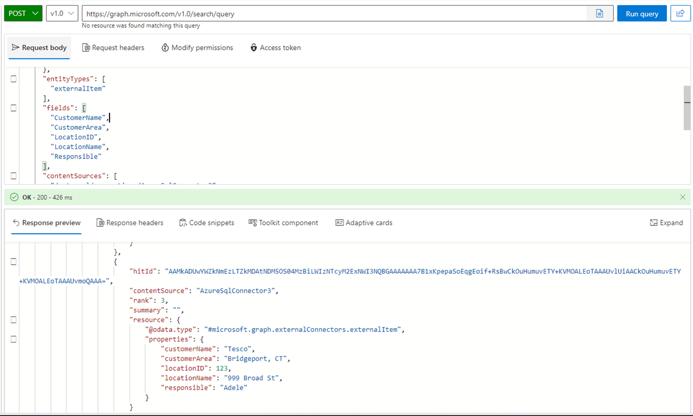

# Export data from MS Search


## Summary

When working with data imported into the Microsoft Search service using Graph Connectors, it can be useful to export the data to a format of your choice for further analysis or to import it into another system. 

[!INCLUDE [Delete Warning](../../docfx/includes/DELETE-WARN.md)]



You will have to connect just as usual, then you must specify the entity type you want , the fields (if you don't know the names of the fields, you can look in the Search And Intelligence Admin Center) or export the schema using Get-PnPSearchExternalSchema
Finally you have to provide the name of the external data source (you can get this from the Search And Intelligence Admin Center)


# [PnP PowerShell](#tab/pnpps)

```powershell

$clientId = "aaaaaa-11111-222222-bbbbb-44444444"
$portalConn = Connect-PnPOnline -Url "https://contoso.sharepoint.com" -Interactive -ClientId $clientId -ReturnConnection


$content = @{
    "Requests" = @(
        @{
            "entityTypes" = @(
                "externalItem"
            )
            "query" = @{
                "queryString" = "*"
            }
            "contentSources" = @(
                "/external/connections/AzureSqlConnector3"
            )
            "fields"= @(
                "CustomerName",
                "CustomerArea",
                "LocationID",
                "LocationName",
                "Responsible"
            )
        }
    )
}

#converting the content to json in order to use it in the Graph Explorer, which is a great way to test the queries
$json = $content | ConvertTo-Json -Depth 10
$res = Invoke-PnPGraphMethod -Url "/v1.0/search/query" -Method Post  -Content $content -Connection $portalConn


$hits = $res.value.hitsContainers.hits 
foreach($hit in $hits)
{
    $hit.resource.properties
    #do something with the data, like exporting it to a csv file
}


```
[!INCLUDE [More about PnP PowerShell](../../docfx/includes/MORE-PNPPS.md)]
***


## Contributors

| Author(s) |
|-----------|
| Kasper Larsen |

[!INCLUDE [DISCLAIMER](../../docfx/includes/DISCLAIMER.md)]

