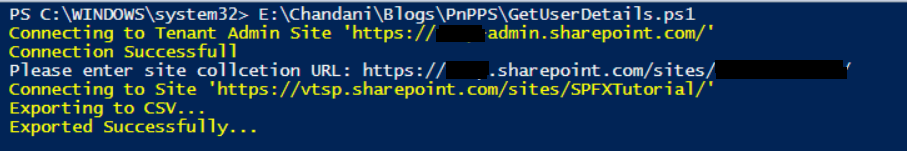

# Fetch User Profile Properties From Site Collection And Export To CSV

## Summary

Many times we have a requirement like to get users or user profile properties from any SharePoint site collection and we need it in CSV or Excel format. 



## Implementation
 
Open Windows Powershell ISE
Create a new file and write a script
 
Now we will see all the steps which we required to achieve the solution:

1. We will read the site URL from the user
2. then we will connect to the O365 admin site and then we will connect to the site which the user has entered
3. Create a function to bind a CSV
4. Create a function to get user profile properties by email d
5. In the main function we will write a logic to get web and users of site collection URL and then get all the properties and bind it to CSV

So at the end, our script will be like this,

# [PnP PowerShell](#tab/pnpps)

```powershell

$basePath = #base path where you want to save CSV file("D:\Chandani\...\")
$dateTime = "{0:MM_dd_yy}_{0:HH_mm_ss}" -f (Get-Date)
$csvPath = $basePath + "\userdetails" + $dateTime + ".csv"
$adminSiteURL = "https://****-admin.sharepoint.com/" #O365 admin site URL
$username = #user email id
$password = "********"
$secureStringPwd = $password | ConvertTo-SecureString -AsPlainText -Force 
$Creds = New-Object System.Management.Automation.PSCredential -ArgumentList $username, $secureStringPwd
$global:userDetails = @()
$index = 1;
$userInfo;
  
Function Login() {
    [cmdletbinding()]
    param([parameter(Mandatory = $true, ValueFromPipeline = $true)] $Creds)
 
    #connect to O365 admin site
    Write-Host "Connecting to Tenant Admin Site '$($adminSiteURL)'" -f Yellow | Out-File $LogFile -Append -Force
  
    Connect-PnPOnline -Url $adminSiteURL -Credentials $Creds
    Write-Host "Connection Successful" -f Yellow | Out-File $LogFile -Append -Force
   
}
Function StartProcessing {
    Login($Creds);
    ConnectionToSite($Creds)
}

Function ConnectionToSite() {
    $siteURL = Read-Host "Please enter site collection URL" 
  
    try {            
        Write-Host "Connecting to Site '$($siteURL)'" -f Yellow          
                              
        $SCWeb = Get-PnPWeb -Identity ""              
                                                     
        $getusers = Get-PnPUser -Web $SCWeb

        ForEach ($user in $getusers) { 
            $email = $user.Email
            If ($email) {
                $userInfo = GetUserProfileProperties $email        
                #creating object fro CSV
                $global:userDetails += New-Object PSObject -Property ([ordered]@{                   
                        Id            = $index
                        GUID          = $userInfo.'UserProfile_GUID'
                        FirstName     = $userInfo.FirstName
                        LastName      = $userInfo.LastName
                        WorkEmail     = $userInfo.WorkEmail 
                        PictureURL    = $userInfo.PictureURL    
                        Department    = $userInfo.Department
                        PreferredName = $userInfo.PreferredName                        
                    })
                $index++ 
            } 
        }                                                                
    }
    catch {
        Write-Host -f Red "Error in connecting to Site '$($TenantSite)'"                        
    }                                     
    BindingtoCSV($global:userDetails) 
}

Function BindingtoCSV {
    [cmdletbinding()]
    param([parameter(Mandatory = $true, ValueFromPipeline = $true)] $Global)   
    Write-Host -f Yellow "Exporting to CSV..."
    $userDetails | Export-Csv $csvPath -NoTypeInformation -Append
    Write-Host -f Yellow "Exported Successfully..."
}

Function GetUserProfileProperties($username) {
    $Properties = Get-PnPUserProfileProperty -Account $username
    $Properties = $Properties.UserProfileProperties
   
    If ($Properties) {
        $Properties = $Properties
    }
    else {
        $Properties = $null
    }
    return $Properties
}

StartProcessing

```

[!INCLUDE [More about PnP PowerShell](../../docfx/includes/MORE-PNPPS.md)]

# [CLI for Microsoft 365 with PowerShell](#tab/cli-m365-ps)

```powershell
# Usage example:
#   .\Fetch-User-Profile-Properties.ps1 -WebUrl "https://contoso.sharepoint.com/sites/Intranet"

[CmdletBinding()]
param (
  [Parameter(Mandatory = $true, HelpMessage = "Web url from which to retrieve the users, e.g. https://contoso.sharepoint.com/sites/Intranet")]
  [string]$WebUrl
)
begin {
  $m365Status = m365 status
  if ($m365Status -match "Logged Out") {
    m365 login
  }
  Write-Host "Connection Successful!" -f Green 
}
process {
  #variables
  $basePath = "D:\" #base path where you want to save CSV file("D:\Scripts\Output\...")

  $userDetailsArray = @()
  $dateTime = "{0:MM_dd_yy}_{0:HH_mm_ss}" -f (Get-Date)
  $csvPath = $basePath + "userdetails-" + $dateTime + ".csv"

  Write-Host "`nRetrieving users from web $WebUrl" -ForegroundColor Cyan
  Write-Progress -Activity "Obtaining user details" -Status "Obtaining users" -PercentComplete 0

  $users = m365 spo user list --webUrl $WebUrl | ConvertFrom-Json
  $usersWithMail = $users | Where-Object {$_.Email -ne ""}

  if ($usersWithMail.GetType().Name -eq "PSCustomObject"){
    Write-Host "Only one user found. Obtaining details for this specific user" -ForegroundColor Cyan
    $userProfile = m365 spo userprofile get --userName $usersWithMail.Email | ConvertFrom-Json

    if ($userProfile.Email) {
      $userProfileProperties = $userProfile.UserProfileProperties | ConvertFrom-Json

      $userDetailsArray += New-Object PSObject -Property ([ordered]@{                   
        Id            = $counter
        GUID          = ($userProfileProperties | Where-Object {$_.Key -eq 'UserProfile_GUID'}).Value
        FirstName     = ($userProfileProperties | Where-Object {$_.Key -eq 'FirstName'}).Value
        LastName      = ($userProfileProperties | Where-Object {$_.Key -eq 'LastName'}).Value
        WorkEmail     = ($userProfileProperties | Where-Object {$_.Key -eq 'WorkEmail'}).Value 
        PictureURL    = ($userProfileProperties | Where-Object {$_.Key -eq 'PictureURL'}).Value    
        Department    = ($userProfileProperties | Where-Object {$_.Key -eq 'Department'}).Value
        PreferredName = ($userProfileProperties | Where-Object {$_.Key -eq 'PreferredName'}).Value
      })
    } else {
      Write-Host "Details for user with mail $userMail could not be found! Possible causes are that the email address is linked to an external user or group email address." -ForegroundColor Red
    }
      
  } else {
    $usersCount = $usersWithMail.Count
    Write-Host "Users retrieved. Amount of users to process: $usersCount" -ForegroundColor Cyan

    for ($counter = 1; $counter -le $usersCount; $counter++ ) {    
      $userMail = $usersWithMail[$counter - 1].Email

      $userProfile = m365 spo userprofile get --userName $userMail | ConvertFrom-Json
      if ($userProfile.Email) {
        $userProfileProperties = $userProfile.UserProfileProperties | ConvertFrom-Json

        $userDetailsArray += New-Object PSObject -Property ([ordered]@{                   
          Id            = 1
          GUID          = ($userProfileProperties | Where-Object {$_.Key -eq 'UserProfile_GUID'}).Value
          FirstName     = ($userProfileProperties | Where-Object {$_.Key -eq 'FirstName'}).Value
          LastName      = ($userProfileProperties | Where-Object {$_.Key -eq 'LastName'}).Value
          WorkEmail     = ($userProfileProperties | Where-Object {$_.Key -eq 'WorkEmail'}).Value 
          PictureURL    = ($userProfileProperties | Where-Object {$_.Key -eq 'PictureURL'}).Value    
          Department    = ($userProfileProperties | Where-Object {$_.Key -eq 'Department'}).Value
          PreferredName = ($userProfileProperties | Where-Object {$_.Key -eq 'PreferredName'}).Value
        })
      } else {
        Write-Host "Details for user with mail $userMail could not be found! Possible causes are that the email address is linked to an external user or group email address." -ForegroundColor Red
      }
    
      Write-Progress -Activity "Obtaining user details" -Status "$counter/$usersCount users obtained, currently processing $userMail" -PercentComplete (($counter / $usersWithMail.Count) * 100)
    }
  }
  
  Write-Host "Exporting to CSV..."  -ForegroundColor Cyan
  $userDetailsArray | Export-Csv $csvPath -NoTypeInformation -Append
  Write-Host "Exported Successfully..." -ForegroundColor Cyan

  Write-Host "Script Complete! :)" -ForegroundColor Green
}
```
[!INCLUDE [More about CLI for Microsoft 365](../../docfx/includes/MORE-CLIM365.md)]
***

## Source Credit

Sample first appeared on [Fetch User Profile Properties From Site Collection And Export To CSV Using PNP PowerShell | Microsoft 365 PnP Blog](https://techcommunity.microsoft.com/t5/microsoft-365-pnp-blog/fetch-user-profile-properties-from-site-collection-and-export-to/ba-p/2232136)

## Contributors

| Author(s) |
|-----------|
| Chandani Prajapati |
| Mathijs Verbeeck |

[!INCLUDE [DISCLAIMER](../../docfx/includes/DISCLAIMER.md)]

