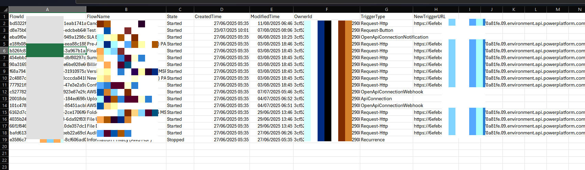

# Export HTTP Trigger Callback URLs for Power Automate Flows

## Summary
This script fetches HTTP trigger callback URLs for Power Automate flows in a specified environment and exports the results to a CSV file. It checks prerequisites, logs into Microsoft 365 CLI and Azure, retrieves flows, and collects callback URLs for each flow.



# [CLI for Microsoft 365](#tab/cli-m365-ps)

```powershell
# Check if Modules are installed.

# Ensure Az.Accounts module is available
if (-not (Get-Command m365 -ErrorAction SilentlyContinue)) {
    Write-Host "Microsoft 365 CLI not found." -ForegroundColor Yellow
    Write-Host "Please install manually using npm:" -ForegroundColor Cyan
    Write-Host "npm install -g @pnp/cli-microsoft365" -ForegroundColor Cyan
    Write-Host "(Requires Node.js: https://nodejs.org)" -ForegroundColor Cyan
    # Continue anyway, but 'm365' commands will fail if not installed
}else {
    Write-Host "Microsoft 365 CLI is available." -ForegroundColor Green
}

# Ensure Az.Accounts module is available
if (-not (Get-Module -ListAvailable Az.Accounts)) {
    Write-Host "Az.Accounts module not found. Installing..." -ForegroundColor Yellow
    try {
        Install-Module Az.Accounts -Scope CurrentUser -Force -AllowClobber
        Write-Host "Az.Accounts module installed successfully." -ForegroundColor Green
    }
    catch {
        Write-Host "Failed to install Az.Accounts. Please install manually with:" -ForegroundColor Red
        Write-Host "Install-Module Az.Accounts -Scope CurrentUser -Force" -ForegroundColor Cyan
    }
}else {
    Write-Host "Az.Accounts module already available." -ForegroundColor Green
}

# Import Az.Accounts
Import-Module Az.Accounts -ErrorAction SilentlyContinue


# ===============================
# Global Variables
# ===============================

# Environment ID
$environmentId = "6e123fe123c14-a15f-eeda-1122-d1232f712323fe09"

# API URL for Flow
$flowUrl = "https://api.flow.microsoft.com"

# Output path
$outputCsv = "C:\testpath\ProdFlows_Output.csv"

# Number of flows to process
$maxFlowsToProcess = 50

# ===============================
# Main Script
# ===============================

# Step 1: Log in to Microsoft 365 CLI (interactive)
Write-Host "Ensure you're logged into Microsoft 365 CLI (run 'm365 login' before running this script)" -ForegroundColor Cyan

# Step 2: Get all flows in environment
$allFlows = m365 flow list --environmentName $environmentId --asAdmin --output json | ConvertFrom-Json

# Step 3: Take first N flows (or less if total < N)
$flows = $allFlows | Select-Object -First $maxFlowsToProcess
Write-Host "Processing $($flows.Count) flows (max requested: $maxFlowsToProcess)" -ForegroundColor Yellow

# Step 4: Login to Azure to fetch access token
Login-AzAccount -UseDeviceAuthentication
$accessToken = (Get-AzAccessToken -ResourceUrl "https://service.flow.microsoft.com/").Token

# Step 5: Prepare results array
$results = @()

# Step 6: Loop through each flow and fetch callback URL
foreach ($flow in $flows) {
    $flowId        = $flow.name
    $flowName      = $flow.properties.displayName
    $flowState     = $flow.properties.state
    $createdTime   = $flow.properties.createdTime
    $modifiedTime  = $flow.properties.lastModifiedTime
    $ownerId       = $flow.properties.creator.userId
	
	
    # --- Fetch full flow details ---
    $flowDetails = m365 flow get --name $flowId --environmentName $environmentId --asAdmin --output json | ConvertFrom-Json
	
    $triggerKind   = $flowDetails.triggers

    Write-Host "Fetching trigger URL for Flow: $flowName ($flowId)" -ForegroundColor Cyan

    $newTriggerUrl = ""
    $path = "providers/Microsoft.ProcessSimple/environments/$environmentId/flows/$flowId/triggers/manual/listCallbackUrl?api-version=2016-11-01"

    try {
        $response = Invoke-RestMethod -Uri "$flowUrl/$path" `
            -Method POST `
            -Headers @{
                "Authorization" = "Bearer $accessToken"
                "Content-Type"  = "application/json"
            }

        # Parse response schema
        if ($response.response.value) {
            $newTriggerUrl = $response.response.value
        }
        elseif ($response.'$content') {
            $newTriggerUrl = $response.'$content'
        }
    }
    catch {
        Write-Host "Failed to fetch trigger URL for Flow: $flowId" -ForegroundColor Red
    }

    # Add new property to results
    $results += [PSCustomObject]@{
        FlowId        = $flowId
        FlowName      = $flowName
        State         = $flowState
        CreatedTime   = $createdTime
        ModifiedTime  = $modifiedTime
        OwnerId       = $ownerId
        TriggerType   = $triggerKind
        NewTriggerURL = $newTriggerUrl
    }
}

# Step 7: Export results
$results | Export-Csv -Path $outputCsv -NoTypeInformation -Force
Write-Host "Report generated at: $outputCsv" -ForegroundColor Green
# ...existing code...
```

[!INCLUDE [More about CLI for Microsoft 365](../../docfx/includes/MORE-CLIM365.md)]

***

## Contributors

| Author(s)                                   |
| ------------------------------------------- |
| [Siddharth Vaghasia](https://github.com/siddharth-vaghasia) |

[!INCLUDE [DISCLAIMER](../../docfx/includes/DISCLAIMER.md)]

