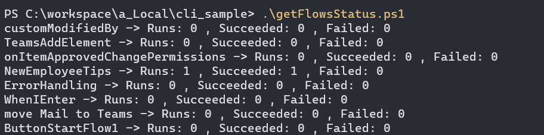
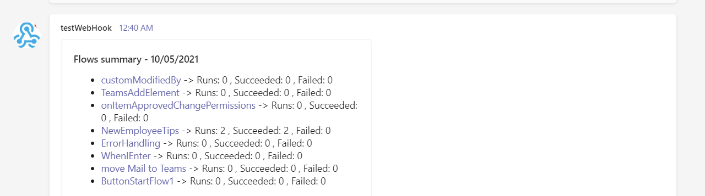

# Flow run day summary

## Summary

Powershell scripts using CLI for M365 and PnP PowerShell that could run once a day and sends a summary (for example adaptive card in teams) with list of all flows runs with total runs count for current day, number of times the flow succeeded and number of times the flow failed

result in console (CLI)



result as adaptive card in teams



Both CLI and PnP PowerShell solutions require a Microsoft Teams channel to be configured with a webhook to accept incoming messages. Follow instructions on Adam the Automators blog here ([Setting up a Webhook Connector in Microsoft Teams](https://adamtheautomator.com/teams-webhooks/#Setting_up_a_Webhook_Connector_in_Microsoft_Teams))
 

# [PnP PowerShell](#tab/pnpps)

```powershell


Connect-PnPOnline -Url https://contoso-admin.sharepoint.com -Interactive

$environment = 'Default-d2af3166-e76b-4d03-9942-fbc79d6b69f9' #Change to your Power Automate environment

#Setup an incoming webhook to a Microsoft Team channel and replace $webhook variable
#https://adamtheautomator.com/teams-webhooks/#Setting_up_a_Webhook_Connector_in_Microsoft_Teams
$webhook = 'https://leonarmstondev.webhook.office.com/webhookb2/908a4576-7946-405d-b373-0ff49b7244e1@d2af3166-e76b-4d03-9942-fbc79d6b69f9/IncomingWebhook/27f804496eb749158838186717fef3c0/08a5b26d-e908-49af-b8c6-e84d06beda87'


$currentDayDate = Get-Date
$previousDayDate = (Get-Date).AddDays(-1)
$adaptiveCardDescription = ""

$flows = Get-PnPFlow -Environment $environment
foreach ($flow in $flows) 
{
    $flowRuns = Get-PnPFlowRun -Environment $environment -Flow $flow.Name

    $displayName = $flow.Properties.DisplayName
    $id = $flow.name

    $todayRuns = $flowRuns.Where({[DateTime]$_.Properties.EndTime -le $currentDayDate -and [DateTime]$_.Properties.EndTime -gt $previousDayDate})
    
    $todayRunsCount = 0
    $todaySuccessRunsCount = 0
    $todayFailedRunsCount = 0
    if($todayRuns.Count -gt 0)
    {
        $todaySuccessRuns = $todayRuns.Where({$_.Properties.Status -eq 'Succeeded'})
        $todaySuccessRunsCount = $todaySuccessRuns.Count

        $todayFailedRuns = $todayRuns.Where({$_.Properties.Status -eq 'Failed'})
        $todayFailedRunsCount = $todayFailedRuns.Count

        $todayRunsCount = $todayRuns.Count
    }

    Write-Host "$displayName -> Runs: $todayRunsCount , Succeeded: $todaySuccessRunsCount , Failed: $todayFailedRunsCount"
    $adaptiveCardDescription = $adaptiveCardDescription + "\r- [$displayName](https://us.flow.microsoft.com/manage/environments/$environment/flows/$id/details) -> Runs: $todayRunsCount , Succeeded: $todaySuccessRunsCount , Failed: $todayFailedRunsCount"
}
$today = Get-Date -Format "dd/MM/yyyy"

$JSON = [Ordered]@{
  "type"       = "message"
  "attachments" = @(
    @{
      "contentType" = 'application/vnd.microsoft.card.adaptive'
      "content"     = [Ordered]@{
        '$schema' = "<http://adaptivecards.io/schemas/adaptive-card.json>"
        "type"    = "AdaptiveCard"
        "version" = "1.3"
        "body"    = @(
          [Ordered]@{
            "type"  = "Container"
            "items" = @(
              @{
			    "type"= "TextBlock"
			    "size"= "Medium"
			    "weight"= "Bolder"
			    "text"= "Today's Power Automate Flow Summary - $today"
              }
              @{
			    "type"= "TextBlock"
			    "text"= "${adaptiveCardDescription}"
			    "wrap"= $true
              }
            )
          }
        )
      }
    }
  )
} | ConvertTo-JSON -Depth 20

$Params = @{
  "URI"         = $webhook
  "Method"      = 'POST'
  "Body"        = [string]$json.replace("\\","\");
  "ContentType" = 'application/json'
}

Invoke-RestMethod @Params
```
[!INCLUDE [More about PnP PowerShell](../../docfx/includes/MORE-PNPPS.md)]

***

## Contributors

| Author(s) |
|-----------|
| [Leon Armston](https://github.com/LeonArmston)|


[!INCLUDE [DISCLAIMER](../../docfx/includes/DISCLAIMER.md)]

