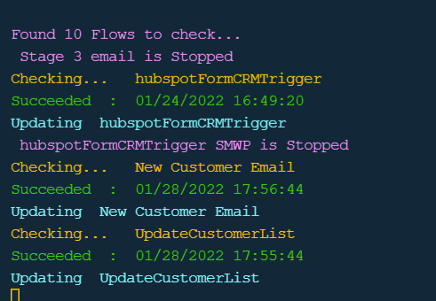
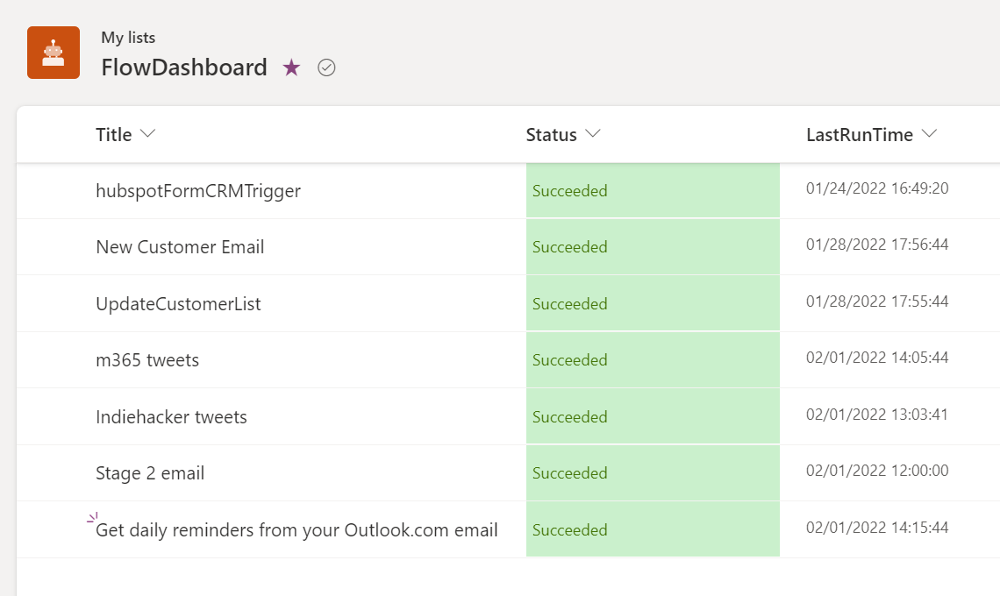

# Flow run status list dashboard

## Summary

Powershell script that reports the status of the latest run of all flows by writing to a M365 list. Shows Title, Status and last run time


Result in console



Result in the list


 
# [CLI for Microsoft 365](#tab/cli-m365-ps)
```powershell
$m365Status = m365 status
if ($m365Status -match "Logged Out") {
    m365 login
}

# get environments
$envs = m365 flow environment list --output json | ConvertFrom-JSON

# check environment data as we need to use the relavnt environment name property 
$envs

# set variable to name property - select evironement using index value
$environment = $envs[1].name

# Set url of the destination list which must be created before running
# List requires following columns = 
# Title 
# Status - single line of text
# lastRunTime - single line of text

#update url to your preferred list 
$weburl  = "https://{TenantName}.sharepoint.com/personal/{UserName/"

#set list name as per your preferred list
$listName = "FlowDashboard"
# find flows
$flows = m365 flow list --environment $environment    --output json | ConvertFrom-JSON

# display number of flows
Write-Host "Found $($flows.Count) Flows to check..." -ForegroundColor Magenta

 
# find existing itesm on the dashboard
$items = m365 spo listitem list --title  $listName  --webUrl $weburl   --output json | ConvertFrom-Json


foreach ($flow in $flows) {
   
    # for all switched on flows
    if($flow.properties.state -eq "Started"){

        # find the runs of each flows
        $flowruns  = m365 flow run list -f $flow.name -e $environment  | ConvertFrom-JSON
       
        
        if($flowruns.count -gt 0){
        
            Write-Host "Checking...   $($flow.displayName) " -ForegroundColor Yellow
            # get the latest run of the workflow
            $run = $flowruns[0]   

            # display on screen message
            If ($run.status -eq "Succeeded"){
                Write-Host "$($run.status)  :  $([DateTime] $run.starttime)" -ForegroundColor Green
            }else{
                Write-Host "$($run.status) :  $([DateTime] $run.starttime)" -ForegroundColor Red
            }

            $id = 0 

            # find list item with Title matching the flow name, if it exists and return ID
            foreach ($row in $items){
           
                if ($row.Title -eq $flow.displayName){
                    $id = $row.Id                
                }
            }      

            # create new entry in the dashboard list of update an existing one

            if($id -eq 0){
                # if a list item doesnt exist for this flow then create it
                m365 spo listitem add --contentType Item --listTitle $listName --webUrl $weburl  --Title $flow.displayName --Status $run.status  --LastRunTime $([DateTime] $run.starttime) | out-null
                
                Write-Host "Adding  $($flow.displayName)" -ForegroundColor Magenta

            }else{
                # if a list item does exist for this flow then update it
                m365 spo listitem set --contentType Item --listTitle $listName --id $id  --webUrl $weburl  --Title $flow.displayName --Status $run.status  --LastRunTime $([DateTime] $run.starttime) | out-null
                
                Write-Host "Updating  $($flow.displayName)" -ForegroundColor cyan
            }
        }
    }
    else{
        # on screen message for all flows in turned off state
        Write-Host " $($flow.displayName) is Stopped" -ForegroundColor Magenta

    }
}


```
[!INCLUDE [More about CLI for Microsoft 365](../../docfx/includes/MORE-CLIM365.md)]

## Contributors

| Author(s) |
|-----------|
| [Ryan Healy](https://github.com/Ryan365Apps)|


[!INCLUDE [DISCLAIMER](../../docfx/includes/DISCLAIMER.md)]

