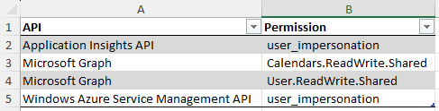
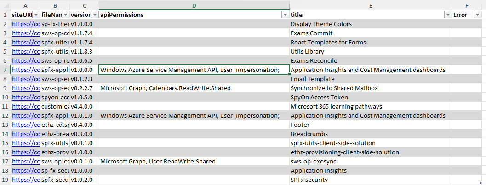
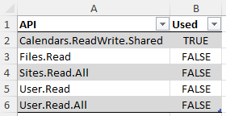

# GET API Permissions for SPFx solutions

> This script is part of [SharePoint solutions as a spyware](https://pnp.github.io/blog/post/spfx-solutions-as-spyware/) series, focusing on risks associated with installing SPFx solutions and improving security posture of your tenant.

## Summary

To enhance your tenant's security posture, it's crucial to regularly review the API permissions requested by SPFx solutions and compare them with those granted to the "SharePoint Online Client Extensibility Web Application Principal".

This script analyzes tenant-level and site-level app catalogs and extracts **API Permissions requested by SPFx solutions**. It generates two reports:

-   summary of **all API permissions requested**. This list will typically include Microsoft Graph APIs, but may also include other APIs secured with Azure AD (see [Discover available applications and permissions](https://learn.microsoft.com/en-us/sharepoint/dev/spfx/use-aadhttpclient#discover-available-applications-and-permissions) for a step-by-step instructions on how to find application name).

    

-   summary of all **SPFx extensions installed** in SPO sites, including site url, solution name and all **API permissions declared in the manifest**.

    

-   summary of **Microsoft Graph** permissions assigned to the "SharePoint Online Client Extensibility Web Application Principal", including information on whether they have been **requested by SPFx solutions**.

    

> **Important**: The site-level app catalog, from a security perspective, functions like a regular list within a SharePoint Online site. This means that Global or SharePoint administrators do NOT have automatic access. Running the script as an administrator without first granting at least read access to the site would result in INCOMPLETE data.
>
> If the current user does not have access rights to a site hosting site-level app catalog, this script grants them Admin rights for the duration of script execution. The permissions are removed as soon as API Permissions are exported
>
> Site-level app catalog must be enabled by a SharePoint administrator, which gives you a chance to discuss security and governance with the site owner, and ensure you are authorized to perform regular audits of the spfx solutions.

It's important to remember that SPFx solutions may use any API permissions granted to the "SharePoint Online Client Extensibility Web Application Principal" without explicitly requesting them. Read more: [SharePoint solutions as a spyware](https://pnp.github.io/blog/post/spfx-solutions-as-spyware/).

## Prerequisites

-   The user running the script must have SharePoint Administrator role in order to access tenant-level app catalog, and to grant themselves (temporary) Owner rights to sites with site-level app catalog
-   The user also requires `Application.Read.All` to read permissions assigned to the SharePoint Online Client Extensibility Web Application Principal.

# [PnP PowerShell](#tab/pnpps)

```powershell
param (
    [Parameter(Mandatory = $true)]
    [string] $domainName
)
Import-Module ImportExcel
Import-Module PnP.PowerShell

# Extract API Permissions requested by SPFx solutions
# Analyzes tenant-level and site-level app catalogs
# Important: site-level app catalog is, in terms of security, a regular SharePoint list within a SPO site. This means that Global/SharePoint
# administrators do NOT have read access.
# To avoid generating partial results, this script temporarily grants current user Site Admin rights (line 72) and removes them after api permissions are exported (line 93)

function Get-APIPermissions {
    param (
        [string]$siteUrl
    )

    try {
        $list = Get-PnPList -Identity "/AppCatalog"
        $files = Get-PnPListItem -List $list

        foreach ($file in $files) {
            [PSCustomObject]@{
                siteURL        = $siteUrl
                fileName       = $file["FileLeafRef"]
                version        = "v$($file["AppVersion"])"
                apiPermissions = $file["WebApiPermissionScopesNote"]
                title          = $file["Title"]
                Error          = ""
            }
        }
    }
    catch {
        [PSCustomObject]@{
            siteURL        = $siteUrl
            fileName       = ""
            version        = ""
            apiPermissions = ""
            title          = ""
            Error          = $_.Exception.Message
        }
    }
}

$adminUrl = "https://$domainName-admin.sharepoint.com/"
$fileName = ".\$($domainName)_APIPermissions.xlsx"
$currentUserEmail = (Get-PnPProperty -ClientObject (Get-PnPWeb) -Property CurrentUser).Email
$excel = @()

Clear-Host

# Connect
Write-Host "Connect to SharePoint Admin site"
Connect-PnPOnline -Url $adminUrl -Interactive

Try {
    $siteCollectionAppCatalogs = Get-PnPSiteCollectionAppCatalog -ExcludeDeletedSites

    # Get sites where current user has no access
    $sitesAccessDenied = ($siteCollectionAppCatalogs
        | Where-Object { $_.ErrorMessage -eq "Access denied." }
        | Select-Object -Property AbsoluteUrl
    ).AbsoluteUrl

    # Access denied: add current user as a site administrator
    Write-Host "You don't have access to the following sites:"
    Write-Host $sitesAccessDenied
    $sitesAccessDenied | ForEach-Object {
        Write-Host "Granting access to $_"
        Set-PnPTenantSite -Identity $_ -Owners $currentUserEmail
    }

    # Get all app catalog urls (tenant level and site level)
    $appCatalogs = ($siteCollectionAppCatalogs
        | Select-Object -Property AbsoluteUrl
    ).AbsoluteUrl
    $appCatalogs += Get-PnPTenantAppCatalogUrl

    Write-Host " $($appCatalogs.Count) app catalogs found. Evaluating permissions"

    # App Catalogs: parse solutions, get api permissions
    $appCatalogs | ForEach-Object {

        Write-Host "Connecting to $_"
        Connect-PnPOnline -Url $_ -Interactive

        $arr = Get-APIPermissions $_
        $excel += $arr

        if ($_ -in $accessDenied) {
            Remove-PnPSiteCollectionAdmin -Owners $currentUserEmail
        }
    }
    $excel | Export-Excel $fileName -WorksheetName "SPFx Solutions" -TableName "SPFx_Solutions" -TableStyle Light1

    # API Permissions: get unique permissions
    if ($excel.Count -gt 0) {
        $apiPermissions = $excel.apiPermissions | ForEach-Object { $_ -split ";" } | Where-Object { $_ -ne "" } | ForEach-Object { $_.Trim() } | Select-Object -Unique
        $uniqueAPIPermissions = $apiPermissions | ForEach-Object {
            $p = $_ -split ",";
            [PSCustomObject]@{
                API        = $p[0]
                Permission = $p[1]
            }
        } | Sort-Object API

        $uniqueAPIPermissions | Export-Excel $fileName -WorksheetName "API Permissions" -TableName "API_Permissions" -TableStyle Light1

        # Get API Permissions for SharePoint Online Client Extensibility Web Application Principal
        $spoAPI = Get-PnPAzureADAppPermission -Identity "SharePoint Online Client Extensibility Web Application Principal"

        $graphApiUsedBy = $spoAPI.MicrosoftGraph | ForEach-Object {
            Write-Host $_
            $permission = $_
            $found = ($uniqueAPIPermissions | Where-Object { $_.API -eq "Microsoft Graph" -and $_.Permission -eq $permission }).Count

            [PSCustomObject]@{
                API  = $_
                Used = $found -gt 0
            }

        } | Sort-Object API

        $graphApiUsedBy | Export-Excel $fileName -WorksheetName "Usage of API Permissions" -TableName "Usage" -TableStyle Light1
    }

}
Catch {
    Write-host -f Red "Error downloading API Permissions information:" $_.Exception.Message
}

Write-Host ("API Permissions exported") -ForegroundColor Green
Disconnect-PnPOnline
```

## Contributors

| Author(s)    |
| ------------ |
| Kinga Kazala |

[!INCLUDE [DISCLAIMER](../../docfx/includes/DISCLAIMER.md)]

