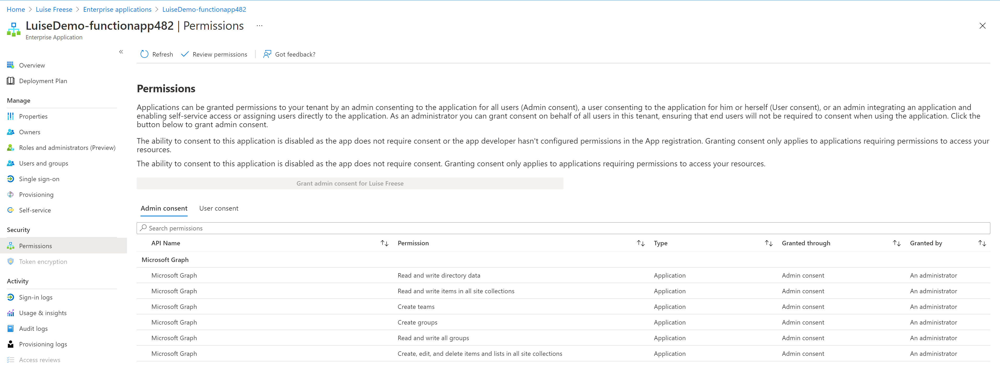

# Assign Graph permissions to a Managed Identity

## Summary

Create an Azure Functions App with and assign several permissions of Microsoft Graph API to a Managed Identity



## Scripts

# [Azure CLI](#tab/azure-cli)

```powershell
  
#Get a random number between 100 and 300 to more easily be able to distinguish between several trials
$rand = Get-Random -Minimum 300 -Maximum 500

#Set values
$resourceGroup = "DemoPlay$rand"
$location = "westeurope"
$storage = "luisedemostorage$rand"
$functionapp = "LuiseDemo-functionapp$rand"

#create group
az group create -n $resourceGroup -l $location

#create storage account
az storage account create `
    -n $storage `
    -l $location `
    -g $resourceGroup `
    --sku Standard_LRS
    
#create function
az functionapp create `
    -n $functionapp `
    --storage-account $storage `
    --consumption-plan-location $location `
    --runtime powershell `
    -g $resourceGroup `
    --functions-version 3
    
#Create system-assigned Managed identity    
az functionapp identity assign -n $functionapp -g $resourceGroup

#Get Graph Api service provider 
az ad sp list --query "[?appDisplayName=='Microsoft Graph'].{Name:appDisplayName, Id:appId}" --output table --all

#Save that as $graphID
$graphId = az ad sp list --query "[?appDisplayName=='Microsoft Graph'].appId | [0]" --all 

#Set values
$webAppName = "LuiseDemo-functionapp$rand"
$principalId = $(az resource list -n $webAppName --query [*].identity.principalId --out tsv)
$graphResourceId = $(az ad sp list --display-name "Microsoft Graph" --query [0].objectId --out tsv)

#Get appRoleIds for Team.Create, Group.ReadWrite.All, Directory.ReadWrite.All, Group.Create, Sites.Manage.All, Sites.ReadWrite.All
$appRoleIds = $(az ad sp show --id $graphId --query "appRoles[?value=='Team.Create'].id | [0]"), $(az ad sp show --id $graphId --query "appRoles[?value=='Group.ReadWrite.All'].id | [0]"), $(az ad sp show --id $graphId --query "appRoles[?value=='Directory.ReadWrite.All'].id | [0]"), $(az ad sp show --id $graphId --query "appRoles[?value=='Group.Create'].id | [0]"), $(az ad sp show --id $graphId --query "appRoles[?value=='Sites.Manage.All'].id | [0]"), $(az ad sp show --id $graphId --query "appRoles[?value=='Sites.ReadWrite.All'].id | [0]")

#Loop over all appRoleIds and assign the permissions
foreach ($appRoleId in $appRoleIds) { $body = "{'principalId':'$principalId','resourceId':'$graphResourceId','appRoleId':'$appRoleId'}"; az rest --method post --uri https://graph.microsoft.com/v1.0/servicePrincipals/$principalId/appRoleAssignments --body $body --headers Content-Type=application/json }

```
[!INCLUDE [More about Azure CLI](../../docfx/includes/MORE-AZURECLI.md)]
***

## Source Credit

Sample first appeared on  [https://github.com/LuiseFreese/PnPrincessScripts/blob/main/managedidentities.ps1](https://github.com/LuiseFreese/PnPrincessScripts/blob/main/managedidentities.ps1)

## Contributors

| Author(s) |
|-----------|
| Luise Freese |

[!INCLUDE [DISCLAIMER](../../docfx/includes/DISCLAIMER.md)]


