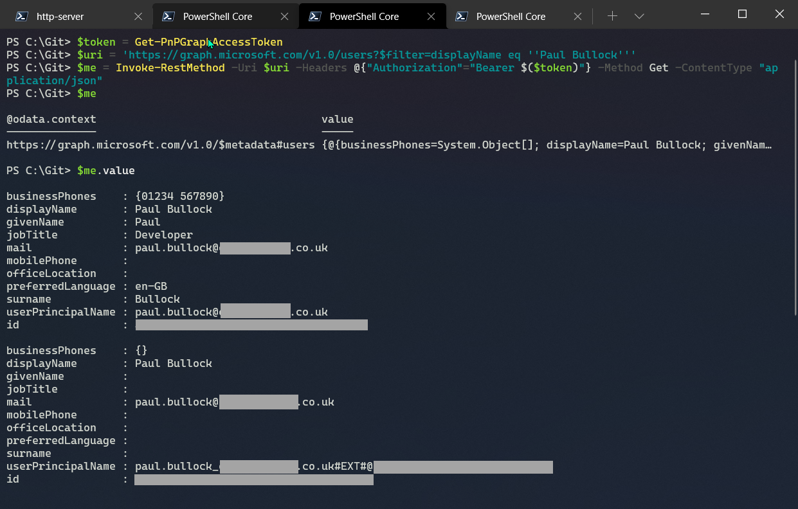

# Authenticate with and call the Microsoft Graph

## Summary

Obtain a new access token for the Microsoft Graph and use it an HTTP request, or connect to the Graph to perform operations.



## Scripts

# [CLI for Microsoft 365 using PowerShell](#tab/cli-m365-ps)

```powershell

$token = m365 util accesstoken get --resource https://graph.microsoft.com --new
$me = Invoke-RestMethod -Uri https://graph.microsoft.com/v1.0/me -Headers @{"Authorization"="Bearer $token"}
$me

```
[!INCLUDE [More about CLI for Microsoft 365](../../docfx/includes/MORE-CLIM365.md)]

# [CLI for Microsoft 365 using Bash](#tab/cli-m365-bash)
```bash
#!/bin/bash

# requires jq: https://stedolan.github.io/jq/

token=`m365 util accesstoken get --resource https://graph.microsoft.com --new`
me=`curl https://graph.microsoft.com/v1.0/me -H "Authorization: Bearer $token"`
echo $me | jq
```
[!INCLUDE [More about CLI for Microsoft 365](../../docfx/includes/MORE-CLIM365.md)]

# [PnP PowerShell](#tab/pnpps)

```powershell
#https://docs.microsoft.com/en-us/powershell/module/sharepoint-pnp/connect-pnponline?view=sharepoint-ps#example-7
Connect-PnPOnline -Url "https://contoso.sharepoint.com" -ClientId 6c5c98c7-e05a-4a0f-bcfa-0cfc65aa1f28 -Tenant 'contoso.onmicrosoft.com' -Thumbprint 34CFAA860E5FB8C44335A38A097C1E41EEA206AA

$token = Get-PnPGraphAccessToken
$uri = 'https://graph.microsoft.com/v1.0/users?$filter=displayName eq ''Paul Bullock'''
$me = Invoke-RestMethod -Uri $uri -Headers @{"Authorization"="Bearer $($token)"} -Method Get -ContentType "application/json"
$me.value
```
[!INCLUDE [More about PnP PowerShell](../../docfx/includes/MORE-PNPPS.md)]
# [Microsoft Graph PowerShell](#tab/graphps)

```powershell

Connect-MgGraph
Get-MgContext
Get-MgUser -Filter "displayName eq 'Paul Bullock'"
Disconnect-MgGraph

```
[!INCLUDE [More about Microsoft Graph PowerShell SDK](../../docfx/includes/MORE-GRAPHSDK.md)]
***

## Source Credit

Sample first appeared on  [https://pnp.github.io/cli-microsoft365/sample-scripts/graph/call-graph/](https://pnp.github.io/cli-microsoft365/sample-scripts/graph/call-graph/)

## Contributors

| Author(s) |
|-----------|
| Garry Trinder |
| Paul Bullock |

[!INCLUDE [DISCLAIMER](../../docfx/includes/DISCLAIMER.md)]


