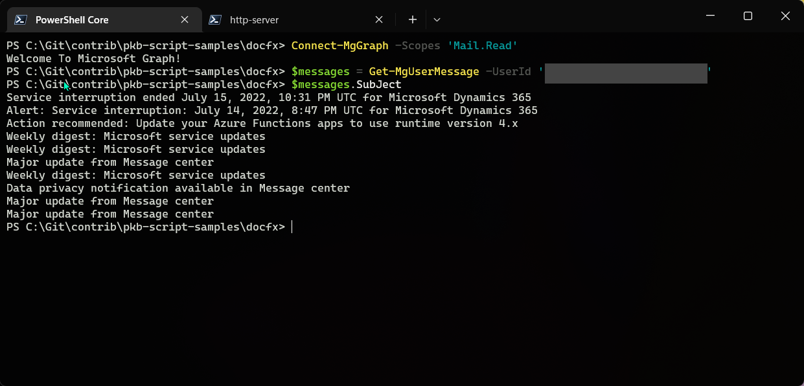

# Microsoft Graph PowerShell SDK for Common Operations

## Summary

Examples of installing specific modules, see how authentication works (both in Delegated and App-only permissions scenarios for any CRUD operation), find permissions (discover cmdlets based on URLs, identify permissions required for apps based on cmdlets used), differentiate between beta and v1 endpoints, obtain Auth sign-in information and run reports using Out-GridView that dumps results into CSV file. Gallery has 40+ PowerShell modules, 17,500+ cmdlets, and supports PowerShell 5.1 and 7+.




# [Microsoft Graph PowerShell](#tab/graphps)
```powershell

#region Find Module based on Command
Find-Module -Command 'Get-MGUserMessage'
#endregion

#region Install Modules
@('Microsoft.Graph.Authentication', 'Microsoft.Graph.Identity.DirectoryManagement', 'Microsoft.Graph.Mail', 'Microsoft.Graph.Reports', 'Microsoft.Graph.Teams', 'Microsoft.Graph.Users') | `
    % {Install-Module $_ -Force}
#endregion

#region Get Mail Delegated
Disconnect-MgGraph
Connect-MgGraph -Scopes 'Mail.Read'

$messages = Get-MgUserMessage -UserId 'user@tenant.onmicrosoft.com'
$messages.Subject

$messages = Get-MgUserMessage -UserId 'AdeleV@tenant.onmicrosoft.com'
#endregion

#region Get Mail App-Only
Disconnect-MgGraph
Connect-MgGraph -ClientId '' `
                -CertificateThumbprint '' `
                -TenantId ''

$messages = Get-MgUserMessage -UserId 'user@tenant.onmicrosoft.com'
$messages.Subject

$messages = Get-MgUserMessage -UserId 'AdeleV@tenant.onmicrosoft.com'
$messages.Subject
#endregion

#region Send Teams Chat
Disconnect-MgGraph
Connect-MgGraph -Scopes 'Chat.ReadWrite'

$admin = Get-MgUser -Filter "UserPrincipalName eq 'admin@tenant.onmicrosoft.com'"
$message = @{
    Content = "Nik Demoing PoSh Graph SDK - $([System.DateTime]::Now.ToString())!"
}
New-MgChatMessage -ChatId '19:68b82c1d-c086-4b99-9fd0-ec7c7f222941_9abce74d-d108-475f-a2cb-bbb82f484982@unq.gbl.spaces' `
                  -Body $message
#endregion

#region Find Permissions
Find-MgGraphCommand -Uri '/security/alerts'

Find-MgGraphCommand -Command 'Get-MgDirectorySetting' | select Permissions
#endregion

#region Beta Endpoint - Groups Naming Policy
Disconnect-MgGraph
Connect-MgGraph -Scopes 'Directory.ReadWrite.All'

Get-MgDirectorySetting
Get-MgProfile

Select-MgProfile -Name beta
Get-MgDirectorySetting
#endregion

#region Retrieve Basic Auth SignIn Info
Disconnect-MgGraph
Connect-MgGraph -ClientId '' `
                -CertificateThumbprint '' `
                -TenantId ''

$period = -7 # Past 7 days
$date = (get-date).AddDays($period)
$sDate = $date.ToString("yyyy-MM-dd")
$auditInfo = Get-MgAuditLogSignIn -Filter "CreatedDateTime ge $sDate and clientAppUsed ne 'Browser' and clientAppUsed ne 'Mobile Apps and Desktop clients'" -All
#endregion

#region Reports

$path = "C:\Demos\Report.csv"

# Attempt to call the Mailbox Usage Activity report cmdlet
New-Item -Path 'C:\Demos\Report.csv' -Force
Get-MgReportMailboxUsageDetail -Period "D180" `
    -OutFile $path

# Define URL to the Teams Activity report endpoint
New-Item -Path 'C:\Demos\Report.csv' -Force
$url = "https://graph.microsoft.com/v1.0/reports/getMailboxUsageDetail(period='D180')"
Invoke-MgGraphRequest -Method GET `
    -Uri $url `
    -OutputFilePath $path

Import-CSV $path | Out-GridView
#endregion

```
[!INCLUDE [More about Microsoft Graph PowerShell SDK](../../docfx/includes/MORE-GRAPHSDK.md)]


## Source Credit

Sample first appeared on [Using the Microsoft Graph PowerShell SDK for common operations | YouTube](https://www.youtube.com/watch?v=ib3BrVNQkFM&t=260s)

## Contributors

| Author(s) |
|-----------|
| Nik Charlebois |


[!INCLUDE [DISCLAIMER](../../docfx/includes/DISCLAIMER.md)]
