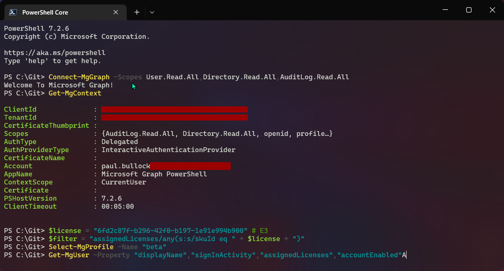

# Get users by license and review last signed in

## Summary

In this example, I had a scenario, where we (a charity) received an under utilization email from Microsoft, that 47% of the tenant was utilized and that for a charity subscription I needed to improve to 85% or unassign licenses - fair enough, this is a free offering, not going to argue this. So to obtain this information, went via the Microsoft Graph to extract the needed information so I can allow others in the organization to review the information and remove any unused users.

This way of filtering could be useful for the community where projects may request changes to licenses, you may want to query for users using a specific license.

Note: This

The Microsoft Graph returned the SKU ID, so you will need to refer to the following reference for translating this into the product you are filtering for.
[Product names and service plan identifiers for licensing - Azure AD - Microsoft Entra | Microsoft Learn](https://learn.microsoft.com/en-us/azure/active-directory/enterprise-users/licensing-service-plan-reference)





# [Microsoft Graph PowerShell](#tab/graphps)

```powershell

# Finding the Module
Find-MgGraphCommand -command Get-MgUser | Select -First 1 -ExpandProperty Permissions

# Note: Details user and application sign-in activity for a tenant (directory). You must have an Azure AD Premium P1 or P2 license to download sign-in logs using the Microsoft Graph API.
# Reference: https://learn.microsoft.com/en-us/graph/api/resources/signin?view=graph-rest-1.0

# Connect (you will need admin permissions for this)
Connect-MgGraph -Scopes User.Read.All,Directory.Read.All,AuditLog.Read.All

# Get Details about your session
Get-MgContext

# License SkuIds https://learn.microsoft.com/en-us/azure/active-directory/enterprise-users/licensing-service-plan-reference
# Some Common Ones
# E1 - 18181a46-0d4e-45cd-891e-60aabd171b4e
# E2 - 6634e0ce-1a9f-428c-a498-f84ec7b8aa2e
# E3 - 6fd2c87f-b296-42f0-b197-1e91e994b900
# E5 - c7df2760-2c81-4ef7-b578-5b5392b571df
# E5 (Without Audio Conferencing) - 26d45bd9-adf1-46cd-a9e1-51e9a5524128 

$license = "6634e0ce-1a9f-428c-a498-f84ec7b8aa2e" # E2 License (Charity)

# For more information about the filter query check out the following resource:
#   https://learn.microsoft.com/en-us/graph/filter-query-parameter?context=graph%2Fapi%2F1.0&view=graph-rest-1.0
$filter = "assignedLicenses/any(s:s/skuId eq " + $license + ")"

# Licenses
Select-MgProfile -Name "beta"

# The -All Flag returns all, so avoid whilst testing out your query
$users = Get-MgUser -Property "displayName","signInActivity","assignedLicenses","accountEnabled"
$users

# Unfiltered List
$users = Get-MgUser -Property "displayName","signInActivity","assignedLicenses","accountEnabled" | Select DisplayName,accountEnabled,signInActivity,assignedLicenses
$users

# High recommend looking at the graph explorer to help you understand the properties you can query
#   https://developer.microsoft.com/en-us/graph/graph-explorer
#   e.g. https://graph.microsoft.com/beta/users?$select=displayName,signInActivity&$filter=assignedLicenses/any(s:s/skuId eq  '6634e0ce-1a9f-428c-a498-f84ec7b8aa2e')

# Filtered List
$users = Get-MgUser -Property "displayName","signInActivity","assignedLicenses","accountEnabled" -Filter $filter -All `
    | Select DisplayName,assignedLicenses,signInActivity,accountEnabled -ExpandProperty signInActivity

# Export the list to CSV File
$users | Export-Csv -Path "users.csv" -NoTypeInformation

# Sign-out, recommended
Disconnect-MgGraph

```
[!INCLUDE [More about Microsoft Graph PowerShell SDK](../../docfx/includes/MORE-GRAPHSDK.md)]

***

## Contributors

| Author(s) |
|-----------|
| Paul Bullock |


[!INCLUDE [DISCLAIMER](../../docfx/includes/DISCLAIMER.md)]
