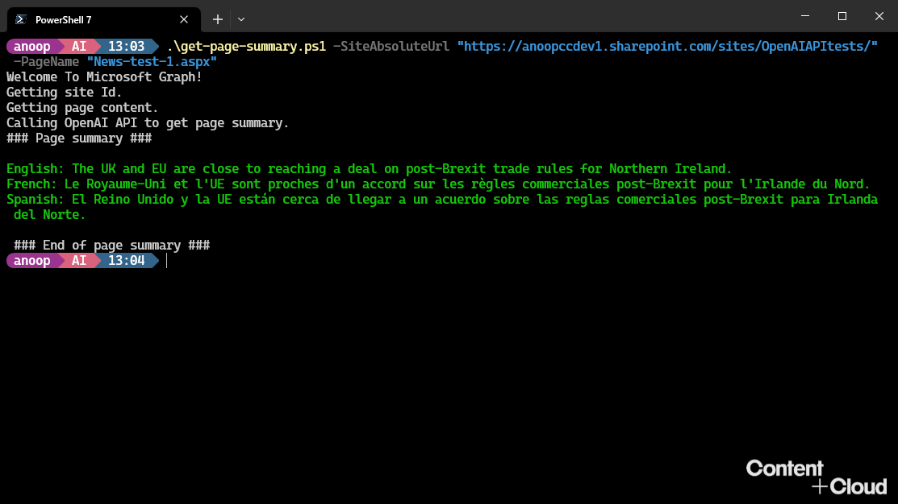

# Multilingual SharePoint Page Summarization with Open AI API and Microsoft Graph PowerShell SDK

## Summary

This sample uses the Microsoft Graph PowerShell SDK to retrieve the text content of a SharePoint page and preprocess it to remove any html tags. Then, the preprocessed text is passed to the Open AI API, which uses a machine learning algorithm to generate a summary of the content in multiple languages.

## Pre-requisites

- `Microsoft.Graph.Sites` PowerShell module
- An Open AI API key which can be done by [creating an account](https://platform.openai.com/signup/) for using Open AI API
    - Once the key is obatined, set the value of `$openai_api_key` in the script with that key




# [Microsoft Graph PowerShell](#tab/graphps)
```powershell

# A script to get summary of a SharePoint site page
# The script accepts the following parameters:
# SiteAbsoluteUrl, PageName

Param(
    [Parameter(Mandatory = $true)]
    [string]$SiteAbsoluteUrl,
    [Parameter(Mandatory = $true)]
    [string]$PageName
)

# function to connect to Microsoft Graph
# See https://learn.microsoft.com/en-us/powershell/microsoftgraph/get-started?view=graph-powershell-1.0 for more details
function Connect-Graph {

    Write-Host "Connecting to Microsoft Graph.";

    # Select Microsoft Graph beta endpoint
    Select-MgProfile -Name "beta"
    # Connect to Microsoft Graph
    Connect-MgGraph -Scopes "Sites.Read.All"
}

# function to get the site Id
function Get-SiteId {
    
    Write-Host "Getting site Id.";

    # remove trailing slash from site absolute url
    $SiteAbsoluteUrl = $SiteAbsoluteUrl.TrimEnd("/");

    # SiteAbsoluteUrl is of the form https://<tenant>.sharepoint.com/sites/<site>
    # We need to get a string of the form <tenant>.sharepoint.com:/sites/<site>
    
    $siteUri = New-Object System.Uri($SiteAbsoluteUrl);
    $siteId = $siteUri.Host + ":" + $siteUri.AbsolutePath;

    $site = Get-MgSite -SiteId $siteId;

    if($null -eq $site) {
        Write-Host "Error: Unable to get site Id. Check if the site exists." -ForegroundColor Red;
        Exit;
    }

    return $site.Id;
}

# function to get page content
function Get-PageContent {
    param(
        [Parameter(Mandatory = $true)]
        [string]$SiteId
    )

    Write-Host "Getting page content.";

    $pageContent = "";

    # Get content from all the text web parts in the page
    $page = Get-MgSitePage -SiteId $SiteId -Filter "name eq '$PageName'" `
        -ExpandProperty "webparts(`$filter=(isof('microsoft.graph.textWebPart')))";

    if($null -eq $page) {
        Write-Host "Error: Unable to get page content. Check if the page exists." -ForegroundColor Red;
        Exit;
    }

    $page.WebParts | ForEach-Object { 
        $pageContent += $_.AdditionalProperties.innerHtml 
    }

    $pageContent = $pageContent -replace "<[^>]+>", "";
    $pageContent = $pageContent -replace "&nbsp;", " ";

    return $pageContent;
}

# function to get page summary using openai api

function Get-PageSummary {
    param(
        [Parameter(Mandatory = $true)]
        [string]$PageContent
    )

    $openai_api_key = "sk-xxxxxxxxxxxxxxxxxxxxxxxxxxxxxxxxxxxxxxxxxxxx";
    $openai_api_endpoint = "https://api.openai.com/v1/completions";

    $data = @{
        "model"             = "text-davinci-003";
        "prompt"            = "1 short sentence summary in English, French and Spanish of this: {{content}}.'English: 'xxx' \n French: 'xxx' \n Spanish: 'xxx'";
        "temperature"       = 0.7;
        "max_tokens"        = 256;
        "top_p"             = 1.0;
        "frequency_penalty" = 0.0;
        "presence_penalty"  = 0.;
    }

    $data["prompt"] = $data["prompt"].Replace("{{content}}", $PageContent);

    $headers = @{
        "Content-Type"  = "application/json"
        "Authorization" = "Bearer " + $openai_api_key
    }

    Write-Host "Calling OpenAI API to get page summary.";

    $response = Invoke-WebRequest -Method Post -Uri $openai_api_endpoint -Headers $headers -Body ($data | ConvertTo-Json);

    if ($response -and $response.StatusCode -eq 200) {
        $result = $response.Content | ConvertFrom-Json | Select-Object -ExpandProperty "choices" | Select-Object -ExpandProperty "text";
    } else {
        $result = $null;
    }

    return $result;
}


# main
Connect-Graph;
$siteId = Get-SiteId;
$pageContent = Get-PageContent -SiteId $siteId;
$pageSummary = Get-PageSummary -PageContent $pageContent;

If($null -eq $pageSummary) {
    Write-Host "Error: Unable to get page summary." -ForegroundColor Red;
    Exit;
}

Write-Host "### Page summary ###"
Write-Host $pageSummary -ForegroundColor Green
Write-Host "`n ### End of page summary ###"

# end of script

<#

Example usage: .\get-page-summary.ps1 -SiteAbsoluteUrl "https://contoso.sharepoint.com/sites/teamsite" -PageName "UK-News-1.aspx"

Sample output:

Welcome To Microsoft Graph!
Getting site Id.
Getting page content.
Calling OpenAI API to get page summary.
### Page summary ###

English: UK and EU are progressing towards an agreement on post-Brexit trade rules in Northern Ireland.
French: Le Royaume-Uni et l'Union européenne progressent vers un accord sur les règles commerciales post-Brexit en Irlande du Nord.
Spanish: Reino Unido y la UE están avanzando hacia un acuerdo sobre las normas comerciales post-Brexit en Irlanda del Norte.

### End of page summary ###

#>

```
[!INCLUDE [More about Microsoft Graph PowerShell SDK](../../docfx/includes/MORE-GRAPHSDK.md)]

[More about Open AI API](https://platform.openai.com/docs/introduction)


## Contributors

| Author(s) |
|-----------|
| Anoop Tatti |


[!INCLUDE [DISCLAIMER](../../docfx/includes/DISCLAIMER.md)]
