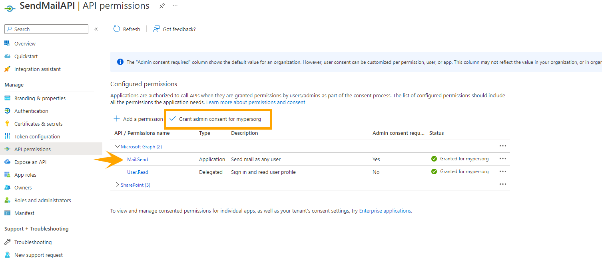

# Bulk Email Send from CSV using Microsoft Graph API

## Summary

This PowerShell script can be used to send bulk emails to multiple users from CSV file....This script is will also work to send email on behalf of user. So you can specify sender of email seperately for each email, it also also supports sending email with attachments.

# CSV file columns details
Below is table to showcase what all fields are required to add in csv and its details.

| Column Name | Details  | Comment  |
|---|---|---|
| Sender | The email sender |   This can be any email id of your own or any other user's email id |
| Receiver | Recipient email addresses | You can specify multiple email ids here separated with comma (,)   |
| CC | CC email addresses|  You can specify multiple email ids here separated with comma (,) |
| BCC| BCC email addresses|  You can specify multiple email ids here separated with comma (,) |
| Subject | Subject of email | |
| Body | Email body content | this can be plain text or HTML, this also supports inline images in base 64 format |
| AttachmentFile | path of attachment | specify full file path here |

You can download input reference file at [here](assets/EmailDetails.csv).

Please keep file in the same location as script.
Also the attachments referred in csv should match the file path of your local machine.

## Permissions
As the script use App Registration Application Permission, please make sure you are have given below permission for the Azure AD App



## Implementation

- Open Windows PowerShell ISE
- Create a new file
- Prepare the input csv file based on instruction above
- update the path in below script
- Save the file and run it
 
# [Microsoft Graph PowerShell](#tab/graphps)
```powershell


#Modules for Power Apps Powershell Commands

	Import-Module Microsoft.PowerShell.Utility
	Import-Module MSAL.PS

	$ClientId = "**************************"
	$ClientSecret = "**************************"
	$tenantID = "**************************"
	$SiteURL = "https://*****.sharepoint.com/sites/****"
	$EmailDetailsFileName = "EmailDetails.csv"
 
		
        ########################### reading CSV to get details about email ###################
        Write-Output(Get-Location)
        $EmailDetails =get-content -Path $PSScriptRoot\$EmailDetailsFileName | Out-String | ConvertFrom-Csv
        Write-Output($EmailDetails)
        ########################## send email logic #####################
 
        
	#force the cmdlet to get a new Access Token
		Clear-MsalTokenCache
        $MsalToken = Get-MsalToken -TenantId $tenantID -ClientId $ClientId -ClientSecret ($ClientSecret | ConvertTo-SecureString -AsPlainText -Force)
        # Create header with the access token

        $headers = New-Object "System.Collections.Generic.Dictionary[[String],[String]]"
        $headers.Add("Content-Type", "application/json")
        $headers.Add("Authorization", $MsalToken.CreateAuthorizationHeader())  

	#Send Mail    

        foreach($EmailDetail in $EmailDetails)
        {
            	$URLsend = "https://graph.microsoft.com/v1.0/users/"+$EmailDetail.Sender+"/sendMail"

            	$ListReceiver = $EmailDetail.Receiver.Split(",")
            	$ToinJSON =""
		foreach($receiver in $ListReceiver)
		{
			$ToinJSON = $ToinJSON + ($receiver | %{'{"EmailAddress": {"Address": "'+$_+'"}},'})
		}
		$ToinJSON = ([string]$ToinJSON).Substring(0, ([string]$ToinJSON ).Length - 1)
         
		$ListCC = $EmailDetail.CC.Split(",")
		$CCinJSON =""
		foreach($cc in $ListCC)
		{
			$CCinJSON = $CCinJSON + ($cc | %{'{"EmailAddress": {"Address": "'+$_+'"}},'})
		}
		$CCinJSON = ([string]$CCinJSON).Substring(0, ([string]$CCinJSON ).Length - 1)

		$ListBCC = $EmailDetail.BCC.Split(",")
		$BCCinJSON = ""
		foreach($bcc in $ListBCC)
		{
			$BCCinJSON = $BCCinJSON + ($bcc | %{'{"EmailAddress": {"Address": "'+$_+'"}},'})
		}
		$BCCinJSON = ([string]$BCCinJSON).Substring(0, ([string]$BCCinJSON ).Length - 1)

		$BodyJsonsend = "{`"message`": {`"subject`": `"" + $EmailDetail.Subject + "`",`"body`": {`"contentType`": `"HTML`",`"content`": `"" + $EmailDetail.Body.Replace("`"","\`"") + "`"}"

		#add below sections, only if Receiver/CC/BCC/Attachment are specified
		if($EmailDetail.Receiver.Length -ge 1)
		{
			$BodyJsonsend += ",`"toRecipients`": [" + $ToinJSON + "]"
		}
            
            	if($EmailDetail.CC.Length -ge 1)
		{
			$BodyJsonsend += ",`"ccRecipients`": [" + $CCinJSON + "]"
		}

		if($EmailDetail.BCC.Length -ge 1)
		{
			$BodyJsonsend += ",`"bccRecipients`": [" + $BCCinJSON + "]"
		}

		if($EmailDetail.AttachmentFile.Length -ge 1)
		{
			$attach = $EmailDetail.AttachmentFile
			$attachFileName = (Get-Item -Path $attach).Name
			$base64string = [Convert]::ToBase64String([IO.File]::ReadAllBytes($attach))
			$BodyJsonsend +=  ",`"attachments`": [{
			`"@odata.type`": `"#microsoft.graph.fileAttachment`"
			,`"name`": `"" + $attachFileName + "`",`"contentType`": `"text/plain`",
			`"contentBytes`": `"" + $base64string + "`"}]"
		}

		$BodyJsonsend += "}}"
		$response = Invoke-RestMethod -Method POST -Uri $URLsend -Headers $headers -Body $BodyJsonsend 
		$response 
        }
```
[!INCLUDE [More about Power Apps PowerShell](../../docfx/includes/MORE-POWERAPPS.md)]
***

## Contributors

| Author(s) |
|-----------|
| [Siddharth Vaghasia](https://github.com/siddharth-vaghasia) |

[!INCLUDE [DISCLAIMER](../../docfx/includes/DISCLAIMER.md)]


