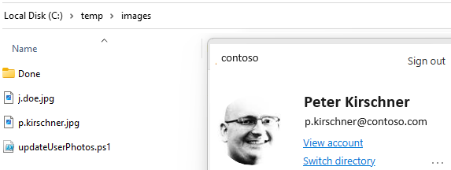

# Add or Update User Photo

## Summary

The script streamlines the process of updating user photos of images stored locally. It ensures efficient handling of both successful updates and errors, providing an organized approach to managing user photos within Microsoft 365.



## Limitations

Maximum FileSize is 4MB (REST request limit is 4MB)

# [Microsoft Graph PowerShell](#tab/graphps)

Config parameter:
```$imageSourcePath```
```$upnDomain```
name of the image file has to be the username without the domain

|Name     | Filename | UPN |
|---------|----------|-----|
|John Doe |j.doe.jpg | j.doe@contoso.com |

```powershell

$upnDomain="@contoso.com"
$imageSourcePath="c:\temp\images\"
$completeFolder="Done"
$errorFolder="Error"

Connect-MgGraph -Scopes "User.ReadWrite"

if(-not(Test-Path $imageSourcePath)){
 Write-Host "Image Source Path not exists, Please Check the ConfigValue imageSourcePath"
 exit(2)
}
$imageFiles=Get-ChildItem -Path $imageSourcePath -Filter *.jpg
Import-Module Microsoft.Graph.Users

foreach($imageFile in $imageFiles){
    $username=$imageFile.Name.Substring(0,$imageFile.Name.lastIndexof('.'));
    $content=Get-Content $imageFile.VersionInfo.FileName;
    $upn ="$username$upnDomain"
        try{
        $Error.Clear()
        Set-MgUserPhotoContent -UserId $upn -InFile $imageFile.VersionInfo.FileName
        if($Error.Count -gt 0){
            throw "Error in Set-MgUserPhotoContent"
        }
        $completePath = Join-Path -Path $imageSourcePath -ChildPath $completeFolder
            if(-not(Test-Path $completePath)){
            New-Item -ItemType Directory  -Path $completePath
            }
        Move-Item -Path $imageFile.VersionInfo.FileName -Destination $completePath -Force
        }catch{
       # Write-Host $error
        $errorPath = Join-Path -Path $imageSourcePath -ChildPath $errorFolder
            if(-not(Test-Path $errorPath)){
            New-Item -ItemType Directory  -Path $errorPath
            }
        $Error|Set-Content -Path "$errorPath\$username.error.txt" 
        Move-Item -Path $imageFile.VersionInfo.FileName -Destination $errorPath -Force
        }
}

```
[!INCLUDE [More about Microsoft Graph PowerShell SDK](../../docfx/includes/MORE-GRAPHSDK.md)]
***

## Contributors

| Author(s) |
|-----------|
| [Peter Paul Kirschner](https://github.com/petkir) |

[!INCLUDE [DISCLAIMER](../../docfx/includes/DISCLAIMER.md)]

