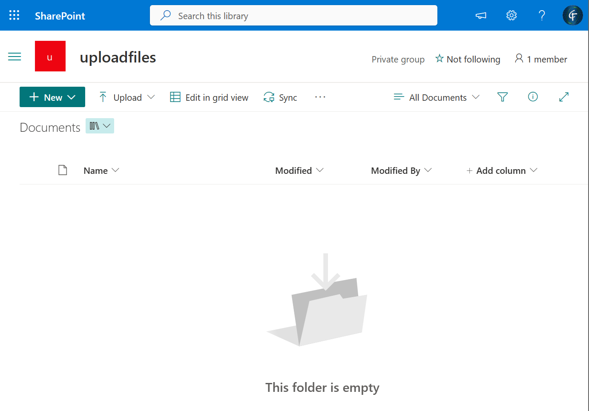
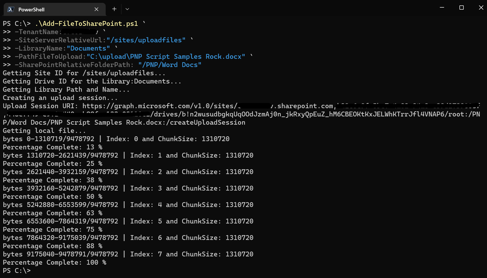
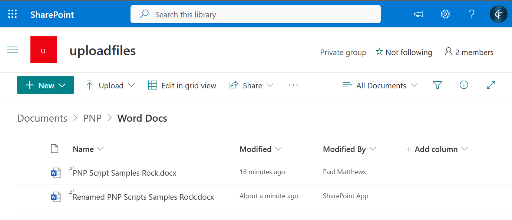

# Uploads a large file to SharePoint using MS Graph REST API and PowerShell 

## Summary

This script allows you to upload a large file to SharePoint using MS Graph API Rest Call.

The script uses [DriveItem: createUploadSession](https://learn.microsoft.com/en-us/graph/api/driveitem-createuploadsession), which uploads the file in chunks. Maximum size a chunk can be is 60 MiB, however in this example, it breaks the file into 1.31 MiB.

The script will overwrite the file if it already exists in the SharePoint library, or you can provide an alternative name for the file.

The script does not handle possible errors.

### Pre-requisites
You can use either a user account that is minimum of a member of the SharePoint site.  
Sign in:
```powershell
az login --use-device-code --allow-no-subscriptions
```

Alternatively, create an App Registration and secret with **_'Microsoft Graph - Sites.ReadWrite.All'_** Application permission. 
```powershell
az login --service-principal `
 -u <APPID> `
 -p <SECRET> `
 --tenant <TENANTID> --allow-no-subscriptions
```
### Screenshots
_Image1: Empty SharePoint Library_


_Image2: File sitting in local folder around 9 Megabytes in size._


_Image3: Uploading file to SharePoint_


_Image4: Files uploaded as user and App Registration_


# [Azure CLI](#tab/azure-cli)
- Save the following script as "Add-FileToSharePoint.ps1"
- Log into Az Cli as User or App Registration Service Principal
- Call `.\Add-FileToSharePoint.ps1` passing in the relevant parameters.

```powershell
<#
.SYNOPSIS
    Uploads/overwrite the given file to the given location in SharePoint.
.DESCRIPTION
    Uploads/overwrite the given file to the given location in SharePoint.
.PARAMETER TenantName
    The SharePoint Tenant name, before .sharepoint.com.
.PARAMETER SiteServerRelativeUrl
    RelativePath to SharePoint Site.
.PARAMETER LibraryName
    Name of the Library within the SharePoint site to upload file to.
.PARAMETER FileToUpload
    Full path of the file to Upload
.PARAMETER SharePointRelativeFolderPath
    (Optional) Relative from root library Folder, if left blank will upload to root of library.
.PARAMETER AlternativeFileName
    (Optional) To save the file with a different name.

.EXAMPLE 
    Upload file to SharePoint.
        Add-FileToSharePoint.ps1 `
            -TenantName:contso `
            -SiteServerRelativeUrl:"/sites/uploadfiles" `
            -LibraryName:"Documents" `
            -PathFileToUpload:"c:\upload\PNP Script Samples Rock.docx" `
            -SharePointRelativeFolderPath: "/PNP/Word Docs/" 

.EXAMPLE 
    Upload file to SharePoint with different name.
        Add-FileToSharePoint.ps1 `
            -TenantName:contso `
            -SiteServerRelativeUrl:"/sites/uploadfiles" `
            -LibraryName:"Documents" `
            -PathFileToUpload:"c:\upload\PNP Script Samples Rock.docx" `
            -SharePointRelativeFolderPath: "/PNP/Word Docs/" `
            -AlternativeFileName:"Renamed Script Samples Rock.docx"

.LINK
    https://learn.microsoft.com/en-us/graph/api/driveitem-createuploadsession
#>
[CmdletBinding(SupportsShouldProcess)]
param (
    [Parameter(Mandatory = $true)]
    [string]
    $TenantName,

    [Parameter(Mandatory = $true)]
    [string]
    $SiteServerRelativeUrl,

    [Parameter(Mandatory = $true)]
    [string]
    $LibraryName,

    [Parameter(Mandatory = $true)]
    [string]
    $PathFileToUpload,

    [Parameter(Mandatory = $false)]
    [string]
    $SharePointRelativeFolderPath = "",

    [Parameter(Mandatory = $false)]
    [string]
    $AlternativeFileName = ""
)

Write-Host "Getting Site ID for $SiteServerRelativeUrl..."
$siteId = $(az rest --method get --url "https://graph.microsoft.com/v1.0/sites/$TenantName.sharepoint.com:$($SiteServerRelativeUrl)?`$select=id" | ConvertFrom-Json).id

Write-Host "Getting Drive ID for the Library:$LibraryName..."
$driveId = $((az rest --method get --url "https://graph.microsoft.com/v1.0/sites/$SiteId/drives?`$select=id,name" | ConvertFrom-Json).value | Where-Object { $_.name -eq $LibraryName }).id

Write-Host "Getting Library Path and Name..."
if ($AlternativeFileName) {
    $name = $AlternativeFileName
}
else {
    $Path = $PathFileToUpload.Replace('\', '/')
    $name = $Path.Substring($Path.LastIndexOf("/") + 1)
}

$uploadPath = $SharePointRelativeFolderPath + "/$name"
if (-not $uploadPath.StartsWith('/')) {
    $uploadPath = "/" + $uploadPath
}

Write-Host "Creating an upload session..."
$uploadSessionUri = "https://graph.microsoft.com/v1.0/sites/$siteId/drives/$driveId/root:$($uploadPath):/createUploadSession"
Write-Host "Upload Session URI: $uploadSessionUri"
$uploadSession = az rest --method post --url $uploadSessionUri --headers Content-Type=application/json | ConvertFrom-Json

Write-Host "Getting local file..."
$fileInBytes = [System.IO.File]::ReadAllBytes($PathFileToUpload)
$fileLength = $fileInBytes.Length

##################################################################################
# NOTES:              
# ------                                                           
#
# You can upload the entire file, or split the file into multiple byte ranges, as 
# long as the maximum bytes in any given request is less than 60 MiB.
#
# If your app splits a file into multiple byte ranges, 
# the size of each byte range MUST be a multiple of 320 KiB (327,680 bytes). 
# Using a fragment size that does not divide evenly by 320 KiB will result in 
# errors committing some files.
#
##################################################################################
$partSizeBytes = 320 * 1024 * 4  #Uploads 1.31MiB at a time.
$index = 0
$start = 0
$end = 0

$maxloops = [Math]::Round([Math]::Ceiling($fileLength / $partSizeBytes))

while ($fileLength -gt ($end + 1)) {
    $start = $index * $partSizeBytes
    if (($start + $partSizeBytes - 1 ) -lt $fileLength) {
        $end = ($start + $partSizeBytes - 1)
    }
    else {
        $end = ($start + ($fileLength - ($index * $partSizeBytes)) - 1)
    }
    [byte[]]$body = $fileInBytes[$start..$end]
    $headers = @{    
        'Content-Range' = "bytes $start-$end/$fileLength"
    }
    Write-Host "bytes $start-$end/$fileLength | Index: $index and ChunkSize: $partSizeBytes"
    Invoke-WebRequest -Method Put -Uri $uploadSession.uploadUrl -Body $body -Headers $headers -SkipHeaderValidation | Out-Null
    $index++
    Write-Host "Percentage Complete: $([Math]::Ceiling($index/$maxloops*100)) %"
}
```
[!INCLUDE [More about Azure CLI](../../docfx/includes/MORE-AZURECLI.md)]
***

## Contributors

| Author(s)                                       |
| ----------------------------------------------- |
| [Paul Matthews](https://github.com/pmatthews05) |

[!INCLUDE [DISCLAIMER](../../docfx/includes/DISCLAIMER.md)]


