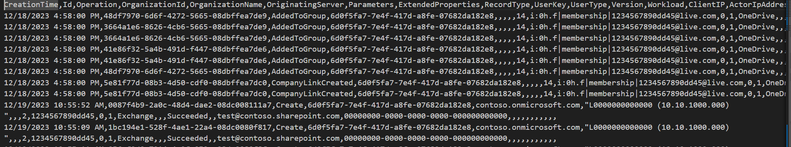

# Get Unified log for SharePoint DLP Exchange and Entra

## Summary

Understanding and tracking activities within your M365 environment is crucial for maintaining security and compliance. Audit Logs offer a wealth of information, and this script focuses on leveraging the Office 365 Management Activity API to retrieve audit logs for the last 7 days for a praticular user with flexibility to filter the data returned by activities, sharepoint site, file name, etc... It is a great alternative if you are only a SharePoint Administrator with no global admin or Purview Audit logs access.



### Prerequisites

- The user account that runs the script must have SharePoint Online tenant administrator access.

- Before running the script, edit the script and update the variable values in the Config Variables section, such as Admin Center URL, UserId , the CSV output file path. 

# [PnP PowerShell](#tab/pnpps)

```powershell
$SiteUrl = "https://contoso-admin.sharepoint.com"
Connect-PnPOnline -url $SiteUrl -Interactive
$userId = "testusero@contoso.co.uk"
$days = 7
$endDay = 0
$Operations = @()
 
# Generate a unique log file name using today's date
$dateTime = (Get-Date).toString("dd-MM-yyyy_HHmm")
$invocation = (Get-Variable MyInvocation).Value
$directorypath = Split-Path $invocation.MyCommand.Path
$fileName = "logReport-" + $dateTime + ".csv"
$OutPutView = $directorypath + "\Logs\"+ $fileName
 
$logCollection = @()
while($days -ge $endDay){
if($days -eq 0)
{
 $activities +=  Get-PnPUnifiedAuditLog -ContentType SharePoint -ErrorAction Ignore
 $activities +=  Get-PnPUnifiedAuditLog -ContentType AzureActiveDirectory -ErrorAction Ignore
 $activities +=  Get-PnPUnifiedAuditLog -ContentType DLP -ErrorAction Ignore
 $activities +=  Get-PnPUnifiedAuditLog -ContentType Exchange -ErrorAction Ignore
 $activities +=  Get-PnPUnifiedAuditLog -ContentType General -ErrorAction Ignore
 
}else {
    $activities += Get-PnPUnifiedAuditLog -ContentType AzureActiveDirectory -ErrorAction Ignore  -StartTime (Get-date).adddays(-$days) -EndTime (Get-date).adddays(-($days-1))
    $activities += Get-PnPUnifiedAuditLog -ContentType SharePoint -ErrorAction Ignore  -StartTime (Get-date).adddays(-$days) -EndTime (Get-date).adddays(-($days-1))
    $activities += Get-PnPUnifiedAuditLog -ContentType DLP -ErrorAction Ignore  -StartTime (Get-date).adddays(-$days) -EndTime (Get-date).adddays(-($days-1))
    $activities += Get-PnPUnifiedAuditLog -ContentType Exchange -ErrorAction Ignore  -StartTime (Get-date).adddays(-$days) -EndTime (Get-date).adddays(-($days-1))
    $activities += Get-PnPUnifiedAuditLog -ContentType General -ErrorAction Ignore  -StartTime (Get-date).adddays(-$days) -EndTime (Get-date).adddays(-($days-1))
 }
 
 $activities| ForEach-Object {
   
    if($activity.UserId ){#-and $activity.SiteUrl
    #the data returned is filtered by a user, amend the filter to selected activities, sharepoint site, file name, etc..
       if($activity.UserId.ToLower() -eq $userId  )    #-and $activity.SiteUrl.ToLower() -eq $SiteUrl 
         {      
            $logCollection += $activity
         }
      }
   }
   $days = $days - 1
}
$logCollection | sort-object "Operation" |Export-CSV $OutPutView -Force -NoTypeInformation
```

[!INCLUDE [More about PnP PowerShell](../../docfx/includes/MORE-PNPPS.md)]

# [CLI for Microsoft 365](#tab/cli-m365-ps)


```PowerShell
$SiteUrl = "https://contoso.sharepoint.com/sites/test"
$userId = "testusero@contoso.co.uk" 
Write-Host "Ensure logged in"
$m365Status = m365 status --output text
if ($m365Status -eq "Logged Out") {
  Write-Host "Logging in the User!"
  m365 login --authType browser
}
$startDayInthePast = 7 ## 7 or less with 1 hour margin
$endDay = 0 ##less than startDayInthePast
 
# Generate a unique log file name using today's date
$dateTime = (Get-Date).toString("dd-MM-yyyy_HHmm")
$invocation = (Get-Variable MyInvocation).Value
$directorypath = Split-Path $invocation.MyCommand.Path
$fileName = "logReport-" + $dateTime + ".csv"
$OutPutView = $directorypath + "\Logs\"+ $fileName
 

$logCollection = @()
   $activities += m365 purview auditlog list --contentType SharePoint --startTime ((Get-date).adddays(-$startDayInthePast) | Get-Date -uFormat '%Y-%m-%dT%H:%M:%SZ') --endTime ((Get-date).adddays(-($endDay)) | Get-Date -uFormat '%Y-%m-%dT%H:%M:%SZ') --output 'json' | ConvertFrom-Json
   $activities += m365 purview auditlog list --contentType AzureActiveDirectory --startTime ((Get-date).adddays(-$startDayInthePast) | Get-Date -uFormat '%Y-%m-%dT%H:%M:%SZ') --endTime ((Get-date).adddays(-($endDay)) | Get-Date -uFormat '%Y-%m-%dT%H:%M:%SZ') --output 'json'| ConvertFrom-Json
   $activities += m365 purview auditlog list --contentType DLP  --startTime ((Get-date).adddays(-$startDayInthePast) | Get-Date -uFormat '%Y-%m-%dT%H:%M:%SZ') --endTime ((Get-date).adddays(-($endDay)) | Get-Date -uFormat '%Y-%m-%dT%H:%M:%SZ') --output 'json' | ConvertFrom-Json
   $activities += m365 purview auditlog list --contentType Exchange --startTime ((Get-date).adddays(-$startDayInthePast) | Get-Date -uFormat '%Y-%m-%dT%H:%M:%SZ') --endTime ((Get-date).adddays(-($endDay)) | Get-Date -uFormat '%Y-%m-%dT%H:%M:%SZ') --output 'json' | ConvertFrom-Json
   $activities += m365 purview auditlog list --contentType General --startTime ((Get-date).adddays(-$startDayInthePast) | Get-Date -uFormat '%Y-%m-%dT%H:%M:%SZ') --endTime ((Get-date).adddays(-($endDay)) | Get-Date -uFormat '%Y-%m-%dT%H:%M:%SZ') --output 'json' | ConvertFrom-Json
 
if($activity.SiteUrl ){#-and $activity.SiteUrl
   if($activity.SiteUrl.ToLower() -eq $SiteUrl)    #-$activity.UserId.ToLower() -eq $userId
 {  
    $logCollection += $activity
 }
}

$logCollection | sort-object "Operation" |Export-CSV $OutPutView -Force -NoTypeInformation
 ```

[!INCLUDE [More about CLI for Microsoft 365](../../docfx/includes/MORE-CLIM365.md)]

> [!Note]
> SharePoint admin rights are required to run the script ,

> [!Note]
> You may encounter error Error: The permission set (ActivityFeed.Read ServiceHealth.Read) sent in the request does not include the expected permission with contentType DLP and be mindful of the amount of data returned from a large tenant which may cause memory issues or lack of disk space to save the log file.

***

## Source Credit

Sample first appeared on [Unveiling Audit Logs with PnP and Cli for M365 PowerShell](https://reshmeeauckloo.com/posts/powershell-get-log-sharepoint-dlp-exchange-entra-pnpunifiedlog/)

## Contributors

| Author(s) |
|-----------|
| [Reshmee Auckloo](https://github.com/reshmee011) |


[!INCLUDE [DISCLAIMER](../../docfx/includes/DISCLAIMER.md)]
