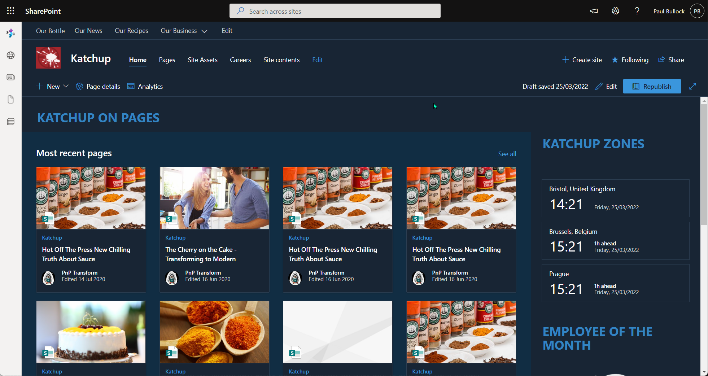

# Bulk Convert Classic Publishing Pages to Modern Pages

## Summary

The sample script converts all SharePoint online classic publishing pages in a site collection (Publishing Site) to modern pages in a modern communication site.

Sample includes:
- SharePoint Online only conversion of publishing pages
- Renaming default/welcome subsite pages to avoid overwriting the same file for each subsite
- Connecting to MFA or supplying credentials
- Includes Logging to File, log flushing into single log file
- Post Processing of file after transformation
- Suitable for lists beyond 5000 items




# [PnP PowerShell](#tab/pnpps)

```powershell
# Usage example: 
#     .\Convert-PublishingPages.ps1 -PartTenant contoso -SourceSitePartUrl mysourcesite -TargetSitePartUrl mytargetsite

[CmdletBinding()]
param (
    [Parameter(Mandatory = $true, HelpMessage = "Source e.g. Intranet-Archive")]
    [string]$SourceSitePartUrl,

    [Parameter(Mandatory = $true, HelpMessage = "Target e.g. Intranet")]
    [string]$TargetSitePartUrl,

    [Parameter(Mandatory = $false, HelpMessage = "Organisation Url Fragment e.g. contoso ")]
    [string]$PartTenant = "contoso",

    [Parameter(Mandatory = $false, HelpMessage = "Specify Mapping File")]
    [string]$WebPartMappingFile,
    
    [Parameter(Mandatory = $false, HelpMessage = "Specify Page Layout File")]
    [string]$PageLayoutMappingFile,
    
    [Parameter(Mandatory = $false, HelpMessage = "Specify log file location")]
    [string]$LogOutputFolder = "c:\temp"
)
begin{

    $baseUrl = "https://$($PartTenant).sharepoint.com"
    $sourceSiteUrl = "$($baseUrl)/sites/$($SourceSitePartUrl)"
    $targetSiteUrl = "$($baseUrl)/sites/$($TargetSitePartUrl)"

    Write-Host "Connecting to " $sourceSiteUrl
        
    $sourceConnection = Connect-PnPOnline -Url $sourceSiteUrl -ReturnConnection -Interactive
    $targetConnection = Connect-PnPOnline -Url $targetSiteUrl -ReturnConnection -Interactive

    $location = Get-Location
}
process {

    Write-Host "Converting site..." -ForegroundColor Cyan

    $web = Get-PnPWeb -Connection $sourceConnection

    # Common Transformation Parameters
    $transformParams = @{
        TargetWebUrl = $targetSiteUrl
        TargetConnection = $targetConnection
        Connection = $sourceConnection 
        LogFolder = $LogOutputFolder
        CopyPageMetadata = $true
        LogType = "File"
        LogSkipFlush = $true
        PublishingPage = $true
        SkipItemLevelPermissionCopyToClientSidePage = $true
        Overwrite = $true
        DontPublish = $true
    }

    if($WebPartMappingFile){
        $transformParams.Add("WebPartMappingFile", "$($location)\$($WebPartMappingFile)")
    }
    
    if($PageLayoutMappingFile){
        $transformParams.Add("PageLayoutMappingFile", "$($location)\$($PageLayoutMappingFile)")
    }

    $transformParams

    # Use paging (-PageSize parameter) to ensure the query works when there are more than 5000 items in the list
    $pages = Get-PnPListItem -List "Pages" -Connection $sourceConnection -PageSize 500
        
    Foreach($page in $pages){

        $targetFileName = $page.FieldValues["FileLeafRef"]

        Write-Host " Processing $($targetFileName)"

        # If Welcome Page, then Rename, 
        # typical for flattening multiple sites that contain standard page(s) e.g. Welcome.aspx or Default.aspx
        if($targetFileName -eq "Welcome.aspx"){
            $targetFileName  = "Welcome-$($web.Title.Replace(" ", "-")).aspx"
            Write-Host " - Updating Welcome.aspx page to $($targetFileName)" -ForegroundColor Yellow
        }

        if($targetFileName -eq "Default.aspx"){
            $targetFileName  = "Default-$($web.Title.Replace(" ", "-")).aspx"
            Write-Host " - Updating Default.aspx page to $($targetFileName)" -ForegroundColor Yellow
        }

        Write-Host " Modernizing $($targetFileName)..."
        
        # Use the PageID value instead of the page name in the Identity parameter as that is more performant 
        #   + it works when there are more than 5000 items in the list
        # Convert the page
        $result = ConvertTo-PnPPage -Identity $page.FieldValues["ID"] `
                                    -PublishingTargetPageName $targetFileName `
                                    @transformParams
                                
        if($result){

            # Post Processing actions on file
            $transformedItem = Get-PnPFile -Url $result -AsListItem -Connection $targetConnection

            if($transformedItem){
                Write-Host " - Post Processing $($targetFileName)..."
                # Peform changes...
            }

        }

        Write-Host " Modernized $($targetFileName)!"
    }

    # Write the logs to the folder
    Save-PnPPageConversionLog

    Write-Host "Script Complete! :)" -ForegroundColor Green
}

```
[!INCLUDE [More about PnP PowerShell](../../docfx/includes/MORE-PNPPS.md)]
***

## Contributors

| Author(s) |
|-----------|
| Paul Bullock |


[!INCLUDE [DISCLAIMER](../../docfx/includes/DISCLAIMER.md)]
