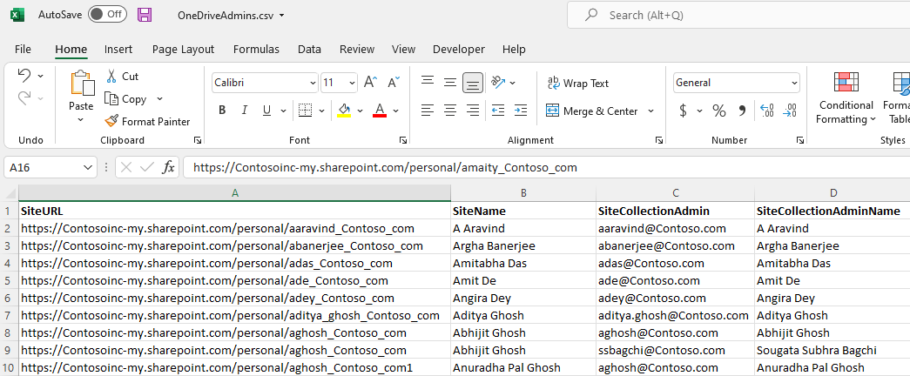

# Export OneDrive Admins

## Summary
Have you ever needed to know which Admins have added themselves to which OneDrives? This script exports every OneDrive in the tenant, and the site collection admins of the site. This helps audit which admins have unnecessary access to user OneDrives. Once you have the report, you can identify unnecessary access by filtering in Excel.



The report produces a csv file with one row per Site Collection Admin and OneDrive. This report has four columns:
SiteURL
SiteName
SiteCollectionAdmin
SiteCollectionAdminName


# [PnP PowerShell](#tab/pnpps)

```powershell

#Parameters
$AdminURL = "https://contoso-admin.sharepoint.com"
$ReportOutput = "OneDriveAdmins.csv"

#Authentication Details - If you have not registered PnP before, simply run the command Register-PnPAzureADApp to create an App
$ClientId = "xxxxxxxxx-xxxx-xxxx-xxxx-xxxxxxxxx"
$Thumbprint = "XXXXXXXXXXXXXXXXXXXXXXXXXXXXXXXXXXXXXXX"
$Tenant = "contoso.onmicrosoft.com"

#Connect to SharePoint Online Admin site
Connect-PnPOnline $AdminURL -ClientId $ClientId -Thumbprint $Thumbprint  -Tenant $Tenant 

#Get all Mysites
$MySites = Get-PnPTenantSite -IncludeOneDriveSites -Filter "Url -like '-my.sharepoint.com/personal/'"

foreach ($MySite in $MySites) {
    try{
        write-host "Processing"$Mysite.Title -ForegroundColor Green
        #Connect to the MySite
        Connect-PnPOnline $MySite.Url -ClientId $ClientId -Thumbprint $Thumbprint  -Tenant $Tenant -ErrorAction Stop
        #Get the admins
        $Admins = Get-PnPSiteCollectionAdmin -ErrorAction Stop
        
        foreach($admin in $Admins){
            #Foreach admin make a record to output to CSV   
            $Result = New-Object PSObject -Property ([ordered]@{
                SiteURL = $Mysite.Url
                SiteName = $Mysite.Title
                SiteCollectionAdmin = $admin.Email
                SiteCollectionAdminName = $admin.Title
            })
            
            #Export the results to CSV
            $Result | Export-Csv -Path $ReportOutput -NoTypeInformation -Append

        }
    }catch{
        #We encountered an error, print it to the screen
        write-host "Error with site collection"$Mysite.Title -ForegroundColor Red
    }
}

```
[!INCLUDE [More about PnP PowerShell](../../docfx/includes/MORE-PNPPS.md)]
***


## Contributors

| Author(s) |
|-----------|
| Matt Maher |


[!INCLUDE [DISCLAIMER](../../docfx/includes/DISCLAIMER.md)]
