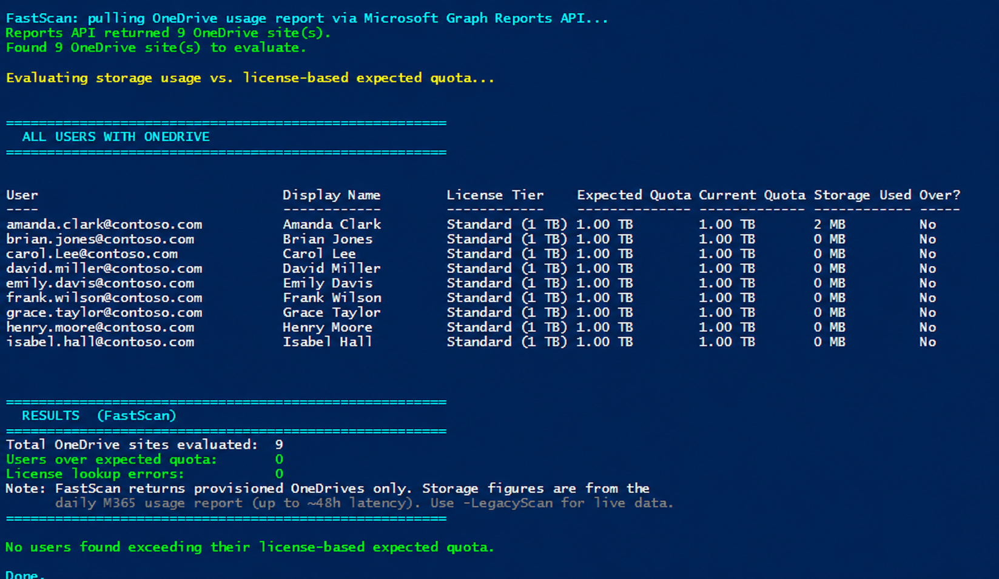

# Identify OneDrive Users Over License-Based Storage Quota

## Summary

Identifies OneDrive for Business users who are over their **expected** storage quota based on their assigned license tier, with special handling for EDU A1 enforcement (100 GB entitlement). The script uses **Microsoft Graph exclusively** — no SharePoint Online Management Shell, no PnP, no third-party modules.

OneDrive sites are provisioned with a default storage quota based on tenant settings, but the *expected* quota varies by license tier. EDU A1 users, for example, are entitled to 100 GB — but if they were provisioned before A1 enforcement, they may have a 1 TB or 5 TB allocation and be storing far more than 100 GB today. This script answers: **Which OneDrive sites are storing more data than the owner's license tier entitles them to?**

The script is **strictly read-only**. It never modifies a quota, license, or file. It only reports.

Works on Windows PowerShell 5.1+ and PowerShell 7+, on commercial, GCC Moderate, GCC High, DoD, and 21Vianet (China) tenants.



## Implementation

### Quota tiers it evaluates

The expected quota is derived from the **highest-tier OneDrive service plan** in the user's licenses (SKUs stack — the script picks the most generous):

| Tier | Expected Quota | Typical SKUs |
|---|---|---|
| Enterprise | 5 TB | E3, E5, A3, A5, Plan 2 |
| Standard | 1 TB | Plan 1, Multi-Geo |
| Lite / **A1 (EDU)** | 100 GB | OneDrive Lite, **Office 365 A1** |
| BasicP2 | 10 GB | Basic 2 |
| Viral / Basic | 5 GB | Office for the web, Basic |
| Deskless | 2 GB | F1, F3, Kiosk |

Unlicensed users with a OneDrive (e.g. retained offboarded accounts) are flagged as over quota whenever `StorageUsed > 0`.

**Enterprise tier is never flagged as over quota.** Enterprise users sit at the top of the license stack and cannot exceed their true entitlement — any usage above 5 TB is legitimate (tenant-level OneDrive storage boost up to 25 TB, an admin-raised quota, or a Microsoft Support exception). Their usage still appears in the report, but `OverQuota` is always `False` for Enterprise rows.

### Scan modes

| Mode | How invoked | Speed | Data freshness | Notes |
|---|---|---|---|---|
| **FastScan** | *default* | ~minutes on 100k-user tenants | Daily snapshot (~24-48h latency) | Uses Reports API. Returns provisioned OneDrives only. Won't work if tenant report anonymization is on. |
| **LegacyScan** | `-LegacyScan` | ~hours on 100k-user tenants | Real-time | Per-user enumeration. Works regardless of anonymization. |
| **TargetedUser** | `-UserPrincipalName` | seconds | Real-time | Looks up only the specified UPN(s). Bypasses both modes above. |

### Prerequisites

| Requirement | Notes |
|---|---|
| PowerShell 5.1+ or PowerShell 7+ | Script enforces `#Requires -Version 5.1`. |
| `Microsoft.Graph.Authentication` ≥ 2.0.0 | Auto-installable with `-InstallPrerequisites`. |
| `Microsoft.Graph.Users` ≥ 2.0.0 | Same. |
| Graph delegated scopes | `User.Read.All`, `Directory.Read.All`, `Reports.Read.All`, `Sites.Read.All`. May need Global Admin consent on first run. |
| M365 role | **Global Reader** is sufficient and recommended (least privilege). |

### CSV output

When `-ExportPath` is set, the CSV contains **every** evaluated site, sorted so over-quota rows appear first.

| Column | Description |
|---|---|
| `Owner`, `DisplayName`, `SiteUrl` | Identity and site location |
| `LicenseTier` | e.g. "Enterprise (5 TB)", "A1 (100 GB)", "Unlicensed" |
| `ExpectedQuota` / `CurrentQuota` / `StorageUsed` | Human-readable storage figures |
| `OverBy` | Amount over (blank if under) |
| `OverQuota` | **`True` / `False`** — filter on this in Excel |
| `StorageUsedMB`, `ExpectedQuotaMB`, `CurrentQuotaMB`, `OverByMB` | Numeric versions for pivots |
| `AssignedSKUs` | Comma-separated SKU part numbers |

# [Microsoft Graph PowerShell](#tab/graphps)

```powershell
<#
.SYNOPSIS
    Identifies OneDrive users who may be over their expected storage quota based on
    their license, with special handling for EDU A1 enforcement.

.DESCRIPTION
    Uses Microsoft Graph exclusively to:
    1. Discover OneDrive sites in the tenant (FastScan or LegacyScan; see below).
    2. Retrieve each owner's license SKUs via Microsoft Graph.
    3. Calculate the expected quota based on the highest license tier:
       - Enterprise (E3/E5/A3/A5): 5 TB
       - EDU A1 (highest SKU is A1): 100 GB
       - Standard (Plan 1/Plan 2 with CloudStorage): 1 TB
       - Lite (OneDrive Lite): 100 GB
       - BasicP2: 10 GB
       - Viral: 5 GB
       - Basic: 5 GB
       - Deskless (F1/F3): 2 GB
    4. Flags users where StorageUsed > expected quota via an OverQuota column.
    5. Outputs a formatted console report and (optionally) a single CSV containing
       ALL sites with an OverQuota True/False column for filtering in Excel.

    SCAN MODES
    ==========
    This script supports two ways to discover OneDrive sites in the tenant.

      FastScan  (DEFAULT — recommended for most tenants)
      --------------------------------------------------
      Uses the Microsoft Graph Reports API (getOneDriveUsageAccountDetail) to
      pull every PROVISIONED OneDrive in the tenant in a single bulk download.
      Then queries license details only for the owners of those sites.

        Pros:  Dramatically faster on large tenants. A 100,000-user tenant
               takes a few minutes instead of ~2 hours, because we don't
               iterate every user in the directory — we start from the list
               of OneDrives that actually exist.
        Cons:  Report data is refreshed daily by Microsoft 365 (up to ~48h
               latency on storage figures, which is fine for "who is over
               quota" — quota usage doesn't shift TB-level numbers minute
               to minute). Will NOT work if your tenant has "Display
               concealed user names in reports" enabled in SharePoint Admin Center — the script detects
               this and exits with instructions for how to fix it.

      LegacyScan  (opt-in via -LegacyScan)
      ------------------------------------
      Enumerates every user in the directory, checks each for a provisioned
      OneDrive, and pulls live drive quota per user.

        Pros:  Real-time storage numbers (not from a daily snapshot). Works
               regardless of report anonymization settings. Reports licensed
               users WITHOUT a provisioned OneDrive.
        Cons:  Very slow on large tenants. A 100,000-user tenant takes
               ~2 hours; FastScan on the same tenant takes under a minute.

    -UserPrincipalName bypasses BOTH modes and queries the specified users
    directly. It is not affected by the scan-mode choice.

.PARAMETER ExportPath
    Optional. CSV export path. When set, the CSV contains every evaluated site
    (not just over-quota ones), sorted so that over-quota sites appear first.
    The OverQuota column lets admins filter to over-quota users in Excel.
    Use a full path (e.g. "C:\Users\you\Downloads\report.csv") to avoid path
    resolution surprises when running PowerShell as Administrator.

.PARAMETER TenantId
    Optional. Target tenant ID (GUID) or domain. Required for multi-tenant admins
    (MSPs, CSPs, delegated admins, or guests) who need to target a specific customer
    tenant rather than their home tenant.

.PARAMETER Environment
    Optional. The Microsoft Graph national cloud to connect to. Defaults to 'Global'
    (commercial / GCC Moderate). Use 'USGov' for GCC High, 'USGovDoD' for DoD,
    or 'China' for 21Vianet.

.PARAMETER UserPrincipalName
    Optional. One or more user principal names (UPNs) to evaluate. When specified,
    only these users are checked — the full tenant is NOT enumerated. Useful for
    spot-checking a specific user or a small list. Bypasses both FastScan and
    LegacyScan.

.PARAMETER LegacyScan
    Optional. Use the original per-user enumeration method instead of the default
    FastScan. Slower but returns real-time storage numbers and works with
    anonymized tenant reports. See SCAN MODES in the description.

.PARAMETER InstallPrerequisites
    Optional. When set, the script will install any missing required modules to the
    current user scope. Without this switch, missing modules produce a clear error
    with the command to run manually. Recommended on hardened/corporate machines
    where silent installs are not desired.

.EXAMPLE
    .\Get-ODBOverQuotaUsers.ps1
    # FastScan (default) — bulk Reports API discovery

.EXAMPLE
    .\Get-ODBOverQuotaUsers.ps1 -ExportPath "C:\Reports\OneDriveQuotaReport.csv"

.EXAMPLE
    .\Get-ODBOverQuotaUsers.ps1 -LegacyScan
    # Per-user enumeration — slower but live storage figures

.EXAMPLE
    .\Get-ODBOverQuotaUsers.ps1 -TenantId "contoso.onmicrosoft.com" -Environment USGov

.EXAMPLE
    .\Get-ODBOverQuotaUsers.ps1 -UserPrincipalName alice@contoso.com

.EXAMPLE
    .\Get-ODBOverQuotaUsers.ps1 -UserPrincipalName alice@contoso.com,bob@contoso.com -ExportPath .\spotcheck.csv

.EXAMPLE
    .\Get-ODBOverQuotaUsers.ps1 -InstallPrerequisites
#>

[CmdletBinding()]
param(
    [string]$ExportPath,

    [string]$TenantId,

    [ValidateSet('Global','USGov','USGovDoD','China')]
    [string]$Environment = 'Global',

    [string[]]$UserPrincipalName,

    [switch]$LegacyScan,

    [switch]$InstallPrerequisites
)

#region --- Constants matching OdbQuotaManager.cs ---
# From OdbQuotaManager:
#   Enterprise = "Personal Site Enterprise"  -> 5 TB
#   A1 = A1QuotaInBytes = 107,374,182,400    -> 100 GB
#   Standard = "StandardQuotaTemplate"       -> 1 TB (default for CloudStorage + MySite)
#   Lite = "Personal Site Lite"              -> 100 GB
#   BasicP2 = "Personal Site Basic P2"       -> 10 GB
#   Viral = "Personal Site Viral"            -> 5 GB
#   Basic = "Personal Site Basic"            -> 5 GB
#   Deskless = "Personal Site Deskless"      -> 2 GB

$QuotaLimits = @{
    Enterprise = 5TB / 1MB   # 5,242,880 MB
    A1Edu      = 100GB / 1MB # 102,400 MB
    Standard   = 1TB / 1MB   # 1,048,576 MB
    Lite       = 100GB / 1MB # 102,400 MB
    BasicP2    = 10GB / 1MB  # 10,240 MB
    Viral      = 5GB / 1MB   # 5,120 MB
    Basic      = 5GB / 1MB   # 5,120 MB
    Deskless   = 2GB / 1MB   # 2,048 MB
    Unknown    = 5TB / 1MB   # 5,242,880 MB (safe default)
}

# Service Plan ID → OD4B Quota Tier mapping
# Source: ODSP FairUse Dashboard (sku-mapping) — all non-archived service plans with storage limits
# Tier priority: Enterprise (5TB) > Standard (1TB) > Lite (100GB) > BasicP2 (10GB) > Basic (5GB) > Deskless (2GB)
$ServicePlanOD4BMap = @{
    # --- Enterprise (5 TB) ---
    "5dbe027f-2339-4123-9542-606e4d348a72" = "Enterprise"  # SharePoint (Plan 2)
    "63038b2c-28d0-45f6-bc36-33062963b498" = "Enterprise"  # SharePoint (Plan 2) for Education
    "6b5b6a67-fc72-4a1f-a2b5-beecf05de761" = "Enterprise"  # SharePoint (Plan 1) [5TB variant]
    "afcafa6a-d966-4462-918c-ec0b4e0fe642" = "Enterprise"  # OneDrive for Business (Plan 2)
    "e8474baf-0959-45d7-b041-91407b2c358d" = "Enterprise"  # ONEDRIVE FOR BUSINESS (PLAN 2G)
    "153f85dd-d912-4762-af6c-d6e0fb4f6692" = "Enterprise"  # SharePoint Plan 2G
    "6fc31d91-cb7f-45ad-885a-bb357a2c98b5" = "Enterprise"  # SharePoint Online (Plan 2) LRG
    "3f804828-b016-40cd-be71-fb1368e8dcbb" = "Enterprise"  # SharePoint Online (Plan 2) LRG for Education
    "a361d6e2-509e-4e25-a8ad-950060064ef4" = "Enterprise"  # SharePoint for Developer (directLimit=5TB)
    "6c1e1afb-e231-4bff-abf2-5c93e271f694" = "Enterprise"  # SharePoint for Developer (directLimit=5TB)
    # --- Standard (1 TB) ---
    "c7699d2e-19aa-44de-8edf-1736da088ca1" = "Standard"    # SharePoint (Plan 1)
    "a1f3d0a8-84c0-4ae0-bae4-685917b8ab48" = "Standard"    # SharePoint (P1)
    "0a4983bb-d3e5-4a09-95d8-b2d0127b3df5" = "Standard"    # SharePoint (Plan 1) for Education
    "5dba4eee-6994-480c-88d5-44c9c1de647e" = "Standard"    # SHAREPOINT (PLAN 1) FOR EDUCATION
    "f9c43823-deb4-46a8-aa65-8b551f0c4f8a" = "Standard"    # SharePoint Plan 1G
    "13696edf-5a08-49f6-8134-03083ed8ba30" = "Standard"    # OneDrive for Business (Plan 1)
    "f0488f6e-4b1b-450c-86ec-bcef5fa9e372" = "Standard"    # ONEDRIVE FOR BUSINESS (PLAN 1)
    "1fadb9de-98e3-4026-bd66-3afa483e8565" = "Standard"    # SharePoint Online Multi-Geo
    # --- Lite (100 GB) ---
    "595b0f5e-1426-424a-9072-78737b4d9c80" = "Lite"        # ONEDRIVELITE
    "ffa8818c-1a05-44e6-a2c5-0b2a1e2f572d" = "Lite"        # SharePoint Plan 2A
    # --- BasicP2 (10 GB) ---
    "4495894f-534f-41ca-9d3b-0ebf1220a423" = "BasicP2"     # OneDrive for Business (Basic 2)
    # --- Viral (5 GB) ---
    "b4ac11a0-32ff-4e78-982d-e039fa803dec" = "Viral"       # Office for the web with OneDrive for business
    # --- Basic (5 GB) ---
    "da792a53-cbc0-4184-a10d-e544dd34b3c1" = "Basic"       # OneDrive for Business (Basic)
    "98709c2e-96b5-4244-95f5-a0ebe139fb8a" = "Basic"       # OneDrive for Business (Basic)
    "39be5b40-baea-4768-ac2f-c814be691b98" = "Basic"       # ONEDRIVE FOR BUSINESS BASIC
    "d2310dc8-4e1a-4c32-ba74-d18a378b0581" = "Basic"       # OneDrive for Business Basic
    "e51b74f5-07d8-46c2-9fad-dfc75a782427" = "Basic"       # OneDrive for Business Basic
    "93839697-a963-4cf8-9cac-fb71c4c07d7b" = "Basic"       # OneDrive for Business Basic
    "bf56428d-a479-4f5b-82cc-f788d6b5d449" = "Basic"       # OneDrive for Business (Basic 3)
    # --- Deskless (2 GB) ---
    "902b47e5-dcb2-4fdc-858b-c63a90a2bdb9" = "Deskless"    # SharePoint Kiosk
    "7c156078-6e6c-46c7-adb0-83d1a671b591" = "Deskless"    # SharePoint Kiosk
    "4f88d6a3-c0be-4854-89e0-302bacd5b1c7" = "Deskless"    # SHAREPOINT KIOSK
    "b1aeb897-3a19-46e2-8c27-a609413cf193" = "Deskless"    # SharePoint KioskG
     # --- Archived / Retired — Enterprise (5 TB) ---
    "32c173cd-bbde-4b64-a45c-6234f756e1b2" = "Enterprise"  # Archived - SHAREPOINT_S_ENTERPRISE_B_PILOT
    "ae978e94-23ef-4c3b-8cd0-ba576f9c455c" = "Enterprise"  # Archived - SHAREPOINT_S_ENTERPRISE_PILOT
    "639e4bc2-37bc-4ec9-8e4a-280d9dbf8649" = "Enterprise"  # Archived - SHAREPOINTSTANDARD_EDU_PILOT
    "828c2b6a-bf85-4103-bbc7-d22d36d7dec5" = "Enterprise"  # Archived - SHAREPOINT_S_DEVELOPER_B_PILOT (directLimit=5TB)
    "6bfc447a-7497-43af-9561-3ee81260e2b1" = "Enterprise"  # Archived - SHAREPOINT_S_DEVELOPER_PILOT (directLimit=5TB)
    # --- Archived / Retired — Standard (1 TB) ---
    "aeaf2f0f-7d48-4dd4-a498-dde2f12cc9f4" = "Standard"    # Archived - SHAREPOINT_L_PROFESSIONAL_B_PILOT
    "1876e0a3-16c9-4cd1-a75f-d40797badd78" = "Standard"    # Archived - SHAREPOINT_L_PROFESSIONAL_PILOT
}

# Tier priority for comparing service plans (higher = more storage)
$TierPriority = @{
    Enterprise = 7
    Standard   = 6
    Lite       = 5
    BasicP2    = 4
    Viral      = 3
    Basic      = 2
    Deskless   = 1
}

# Graph base URL — defined once and referenced as a simple variable everywhere a
# URL is constructed. This avoids the $(...) subexpression-in-string pattern,
# which can be fragile if the file is copy-pasted through editors that convert
# straight quotes to curly quotes.
$GraphBaseUrl = 'https://graph.microsoft.com/v1.0'
#endregion

#region --- Helper Functions ---

function Invoke-GraphRequestWithRetry {
    <#
    .SYNOPSIS
        Wraps Invoke-MgGraphRequest with throttling/retry support.
    .DESCRIPTION
        Honors the Retry-After header on HTTP 429 (throttled) and 503/504
        (transient service errors). Falls back to capped exponential backoff
        when no Retry-After header is provided. This is required for tenants
        of any meaningful size because the /users/{id}/drive and
        /users/{id}/licenseDetails endpoints throttle aggressively, and
        unhandled 429s would otherwise cause silent gaps in the report.
    #>
    param(
        [Parameter(Mandatory)]
        [string]$Uri,

        [string]$Method = 'GET',

        [int]$MaxRetries = 5
    )

    $attempt = 0
    while ($true) {
        try {
            return Invoke-MgGraphRequest -Method $Method -Uri $Uri -ErrorAction Stop
        }
        catch {
            $status = $null
            if ($_.Exception.PSObject.Properties.Name -contains 'Response' -and $_.Exception.Response) {
                try { $status = [int]$_.Exception.Response.StatusCode } catch {}
            }

            $attempt++
            if ($status -in 429, 503, 504 -and $attempt -le $MaxRetries) {
                # Prefer Retry-After header when present
                $retryAfter = $null
                try {
                    $headers = $_.Exception.Response.Headers
                    if ($headers -and $headers['Retry-After']) {
                        $retryAfter = [int]$headers['Retry-After']
                    }
                } catch {}

                if (-not $retryAfter -or $retryAfter -le 0) {
                    # Capped exponential backoff: 2, 4, 8, 16, 32 seconds (max 60)
                    $retryAfter = [int][Math]::Min([Math]::Pow(2, $attempt), 60)
                }

                Write-Verbose "Graph returned HTTP $status on $Uri. Retry $attempt/$MaxRetries in ${retryAfter}s."
                Start-Sleep -Seconds $retryAfter
                continue
            }

            throw
        }
    }
}

function Get-OneDriveUsageReportCsv {
    <#
    .SYNOPSIS
        Downloads the OneDrive usage report (CSV) from the Microsoft Graph Reports API.
    .DESCRIPTION
        Returns the report as a temp file path. The caller is responsible for
        Import-Csv'ing it and deleting the temp file when finished.
        Includes retry-on-throttle semantics matching Invoke-GraphRequestWithRetry.
    #>
    param(
        [string]$Period = 'D7',
        [int]$MaxRetries = 5
    )

    $uri      = "$GraphBaseUrl/reports/getOneDriveUsageAccountDetail(period='$Period')"
    $tempCsv  = [System.IO.Path]::Combine([System.IO.Path]::GetTempPath(),
                                          ('odb-usage-' + [Guid]::NewGuid().ToString() + '.csv'))
    $attempt = 0
    while ($true) {
        try {
            # -OutputFilePath writes the raw response body straight to disk,
            # which avoids any JSON/CSV content-type parsing surprises.
            Invoke-MgGraphRequest -Method GET -Uri $uri -OutputFilePath $tempCsv -ErrorAction Stop
            return $tempCsv
        }
        catch {
            $status = $null
            if ($_.Exception.PSObject.Properties.Name -contains 'Response' -and $_.Exception.Response) {
                try { $status = [int]$_.Exception.Response.StatusCode } catch {}
            }

            $attempt++
            if ($status -in 429, 503, 504 -and $attempt -le $MaxRetries) {
                $retryAfter = $null
                try {
                    $headers = $_.Exception.Response.Headers
                    if ($headers -and $headers['Retry-After']) {
                        $retryAfter = [int]$headers['Retry-After']
                    }
                } catch {}
                if (-not $retryAfter -or $retryAfter -le 0) {
                    $retryAfter = [int][Math]::Min([Math]::Pow(2, $attempt), 60)
                }
                Write-Verbose "Reports API HTTP $status. Retry $attempt/$MaxRetries in ${retryAfter}s."
                Start-Sleep -Seconds $retryAfter
                continue
            }

            if (Test-Path $tempCsv) { Remove-Item $tempCsv -Force -ErrorAction SilentlyContinue }
            throw
        }
    }
}

function Get-ExpectedQuotaTier {
    <#
    .SYNOPSIS
        Determines the expected OneDrive quota tier for a user based on their license SKUs.
    #>
    param(
        [Parameter(Mandatory)]
        [object[]]$LicenseDetails
    )

    # Check service plans by ID using the comprehensive OD4B mapping from the FairUse Dashboard.
    # Find the highest-tier OD4B service plan the user has provisioned.
    $bestTier = $null
    $bestPriority = 0
    foreach ($license in $LicenseDetails) {
        if ($license.servicePlans) {
            foreach ($plan in $license.servicePlans) {
                if ($plan.provisioningStatus -eq "Success" -or $plan.provisioningStatus -eq "PendingInput") {
                    $planId = $plan.servicePlanId.ToLower()
                    if ($ServicePlanOD4BMap.ContainsKey($planId)) {
                        $tier = $ServicePlanOD4BMap[$planId]
                        $priority = $TierPriority[$tier]
                        if ($priority -gt $bestPriority) {
                            $bestTier = $tier
                            $bestPriority = $priority
                        }
                    }
                }
            }
        }
    }

    if ($bestTier) {
        $desc = switch ($bestTier) {
            "Enterprise" { "Enterprise (5 TB)" }
            "Standard"   { "Standard (1 TB)" }
            "Lite"       { "Lite (100 GB)" }
            "BasicP2"    { "BasicP2 (10 GB)" }
            "Viral"      { "Viral (5 GB)" }
            "Basic"      { "Basic (5 GB)" }
            "Deskless"   { "Deskless (2 GB)" }
        }
        return @{ Tier = $bestTier; LimitMB = $QuotaLimits[$bestTier]; Description = $desc }
    }

    # Fall back to Unknown (5 TB default)
    return @{ Tier = "Unknown"; LimitMB = $QuotaLimits.Unknown; Description = "Unknown (default 5 TB)" }
}

function Format-StorageSize {
    param([long]$MB)
    if ($MB -ge 1048576) { return "{0:N2} TB" -f ($MB / 1048576) }
    if ($MB -ge 1024)    { return "{0:N2} GB" -f ($MB / 1024) }
    return "$MB MB"
}
#endregion

#region --- Prerequisites (detect + optional install) ---
# We detect required modules and either:
#   (a) install them automatically when -InstallPrerequisites is set, OR
#   (b) print a clear remediation banner and exit.

$requiredModules = @(
    @{ Name = 'Microsoft.Graph.Authentication'; MinVersion = '2.0.0' }
    @{ Name = 'Microsoft.Graph.Users';          MinVersion = '2.0.0' }
)

$missing = @()
foreach ($mod in $requiredModules) {
    $installed = Get-Module -ListAvailable -Name $mod.Name |
                 Where-Object { $_.Version -ge [version]$mod.MinVersion } |
                 Select-Object -First 1
    if (-not $installed) { $missing += $mod }
}

if ($missing.Count -gt 0) {
    if ($InstallPrerequisites) {
        Write-Host "Bootstrapping prerequisites..." -ForegroundColor Yellow

        $gallery = Get-PSRepository -Name PSGallery -ErrorAction SilentlyContinue
        if ($gallery -and $gallery.InstallationPolicy -ne 'Trusted') {
            Set-PSRepository -Name PSGallery -InstallationPolicy Trusted
        }

        if (-not (Get-PackageProvider -Name NuGet -ErrorAction SilentlyContinue)) {
            Install-PackageProvider -Name NuGet -MinimumVersion 2.8.5.201 -Force -Scope CurrentUser | Out-Null
        }

        foreach ($mod in $missing) {
            Write-Host "Installing $($mod.Name) (>= $($mod.MinVersion))..." -ForegroundColor Yellow
            Install-Module -Name $mod.Name -MinimumVersion $mod.MinVersion -Scope CurrentUser -Force -AllowClobber -ErrorAction Stop
        }
    }
    else {
        $names = ($missing | ForEach-Object { $_.Name }) -join ', '
        Write-Host ""
        Write-Host "======================================================" -ForegroundColor Red
        Write-Host "  MISSING PREREQUISITES" -ForegroundColor Red
        Write-Host "======================================================" -ForegroundColor Red
        Write-Host ""
        Write-Host "The following required PowerShell modules are missing or below the minimum version:" -ForegroundColor Yellow
        Write-Host ""
        foreach ($mod in $missing) {
            Write-Host "  - $($mod.Name) (>= $($mod.MinVersion))" -ForegroundColor Yellow
        }
        Write-Host ""
        Write-Host "FIX (recommended) - re-run this script with the install switch:" -ForegroundColor Green
        Write-Host "  .\Get-ODBOverQuotaUsers.ps1 -InstallPrerequisites" -ForegroundColor White
        Write-Host ""
        Write-Host "OR install the modules manually for the current user:" -ForegroundColor Green
        Write-Host "  Install-Module $names -Scope CurrentUser" -ForegroundColor White
        Write-Host ""
        exit 1
    }
}

foreach ($mod in $requiredModules) {
    if (-not (Get-Module -Name $mod.Name)) {
        Import-Module $mod.Name -ErrorAction Stop
    }
}
#endregion

#region --- Connect ---
Write-Host "`n======================================================" -ForegroundColor Cyan
Write-Host "  OneDrive Over-Quota Detection (License-Based)" -ForegroundColor Cyan
Write-Host "======================================================`n" -ForegroundColor Cyan

# Decide scan mode for the run (informational only — actual branching happens below)
$scanMode = if ($UserPrincipalName) { 'TargetedUser' }
            elseif ($LegacyScan)    { 'LegacyScan' }
            else                    { 'FastScan' }
Write-Host "Scan mode: $scanMode" -ForegroundColor Cyan

Write-Host "Connecting to Microsoft Graph ($Environment)..." -ForegroundColor Green
$graphParams = @{
    Scopes      = @("User.Read.All", "Directory.Read.All", "Reports.Read.All", "Sites.Read.All", "Files.Read.All")
    Environment = $Environment
    NoWelcome   = $true
}
if ($TenantId) { $graphParams['TenantId'] = $TenantId }

try {
    Connect-MgGraph @graphParams -ErrorAction Stop
}
catch {
    Write-Host ""
    Write-Host "======================================================" -ForegroundColor Red
    Write-Host "  MICROSOFT GRAPH CONNECTION FAILED" -ForegroundColor Red
    Write-Host "======================================================" -ForegroundColor Red
    Write-Host ""
    Write-Host "Error: $($_.Exception.Message)" -ForegroundColor Yellow
    Write-Host ""
    Write-Host "Common causes:" -ForegroundColor Yellow
    Write-Host "  - Authentication was cancelled, timed out, or MFA was not completed"
    Write-Host "  - Admin consent has not been granted for the required scopes"
    Write-Host "  - Wrong -Environment for your tenant"
    Write-Host "      (use 'USGov' for GCC High, 'USGovDoD' for DoD, 'China' for 21Vianet)"
    Write-Host "  - Wrong -TenantId, or your account is not a member of that tenant"
    Write-Host ""
    exit 1
}

$graphCtx = Get-MgContext
if (-not $graphCtx -or -not $graphCtx.TenantId) {
    Write-Host ""
    Write-Host "======================================================" -ForegroundColor Red
    Write-Host "  MICROSOFT GRAPH CONNECTION FAILED" -ForegroundColor Red
    Write-Host "======================================================" -ForegroundColor Red
    Write-Host ""
    Write-Host "Connect-MgGraph completed without throwing, but no valid Graph session" -ForegroundColor Yellow
    Write-Host "was established (no tenant context). Aborting to avoid an empty report." -ForegroundColor Yellow
    Write-Host ""
    exit 1
}

Write-Host "Microsoft Graph connected. [OK]" -ForegroundColor Yellow
Write-Host "Connected to Graph as: $($graphCtx.Account)" -ForegroundColor Yellow
Write-Host "Tenant:                $($graphCtx.TenantId)" -ForegroundColor Yellow
Write-Host "Environment:           $($graphCtx.Environment)" -ForegroundColor Yellow
#endregion

#region --- Validate ExportPath early (before the long-running tenant scan) ---
$ResolvedExportPath = $null
if ($ExportPath) {
    try {
        $leaf = Split-Path $ExportPath -Leaf
        if (-not $leaf) {
            throw "ExportPath '$ExportPath' has no filename. Add a file name (e.g. '\report.csv')."
        }
        if ([System.IO.Path]::GetExtension($leaf) -eq '') {
            Write-Host "Warning: ExportPath has no file extension. Treating as a CSV file." -ForegroundColor Yellow
        }

        if ([System.IO.Path]::IsPathRooted($ExportPath)) {
            $ResolvedExportPath = $ExportPath
        }
        else {
            $ResolvedExportPath = Join-Path -Path $PWD.Path -ChildPath $ExportPath
        }
        $ResolvedExportPath = [System.IO.Path]::GetFullPath($ResolvedExportPath)
        $resolvedDir        = Split-Path $ResolvedExportPath -Parent

        if (-not (Test-Path $resolvedDir)) {
            New-Item -Path $resolvedDir -ItemType Directory -Force -ErrorAction Stop | Out-Null
        }

        $probe = Join-Path $resolvedDir ([Guid]::NewGuid().ToString() + '.tmp')
        try {
            [IO.File]::WriteAllText($probe, '')
            Remove-Item $probe -Force -ErrorAction SilentlyContinue
        }
        catch {
            throw "Cannot write to '$resolvedDir'. $($_.Exception.Message)"
        }

        Write-Host "Export target validated: $ResolvedExportPath" -ForegroundColor DarkGray
    }
    catch {
        Write-Host ""
        Write-Host "======================================================" -ForegroundColor Red
        Write-Host "  CSV EXPORT PATH INVALID" -ForegroundColor Red
        Write-Host "======================================================" -ForegroundColor Red
        Write-Host ""
        Write-Host "Path requested: $ExportPath" -ForegroundColor Yellow
        if ($ResolvedExportPath) { Write-Host "Resolved to:    $ResolvedExportPath" -ForegroundColor Yellow }
        Write-Host "Error:          $($_.Exception.Message)" -ForegroundColor Yellow
        Write-Host ""
        Write-Host "Common causes and fixes:" -ForegroundColor Yellow
        Write-Host "  1. ExportPath is missing a filename. Include the .csv name at the end:"
        Write-Host "        -ExportPath ""C:\Users\$env:USERNAME\Downloads\report.csv"""
        Write-Host ""
        Write-Host "  2. Running PowerShell as Administrator: relative paths resolve to"
        Write-Host "     C:\WINDOWS\system32. Use a FULL path (drive letter and all):"
        Write-Host "        -ExportPath ""C:\Users\$env:USERNAME\Downloads\report.csv"""
        Write-Host ""
        Write-Host "  3. OneDrive Known Folder Move on Downloads can block elevated writes."
        Write-Host "     Try C:\Temp\ or run this script from a non-elevated PowerShell window"
        Write-Host "     (admin rights for this script come from your M365 account, not Windows)."
        Write-Host ""
        Write-Host "Aborting before tenant scan to avoid losing work." -ForegroundColor Red
        Write-Host ""
        exit 1
    }
}
#endregion

#region --- Discover OneDrive sites (FastScan / LegacyScan / TargetedUser) ---
# All three modes converge by populating the same $allODBSites collection with
# the same shape, so the downstream evaluation loop doesn't care which path ran.

$allODBSites    = [System.Collections.Generic.List[PSCustomObject]]::new()
$usersWithoutOD = [System.Collections.Generic.List[PSCustomObject]]::new()
$errors         = [System.Collections.Generic.List[string]]::new()

if ($scanMode -eq 'TargetedUser') {
    #---------------------------------------------------------------
    # TargetedUser: per-UPN lookup (unchanged from prior behavior)
    #---------------------------------------------------------------
    Write-Host "`nLooking up $($UserPrincipalName.Count) specific user(s)..." -ForegroundColor Cyan
    $userProps = 'id','userPrincipalName','displayName','assignedLicenses','accountEnabled'
    $targetedUsers = foreach ($upn in $UserPrincipalName) {
        try {
            Get-MgUser -UserId $upn -Property $userProps -ErrorAction Stop
        }
        catch {
            $errors.Add("[$upn] User not found or inaccessible: $($_.Exception.Message)")
        }
    }
    $targetedUsers = @($targetedUsers)

    if ($targetedUsers.Count -eq 0) {
        Write-Host ""
        Write-Host "======================================================" -ForegroundColor Red
        Write-Host "  NO USERS RETURNED" -ForegroundColor Red
        Write-Host "======================================================" -ForegroundColor Red
        Write-Host ""
        Write-Host "None of the specified users were found in tenant $($graphCtx.TenantId):" -ForegroundColor Yellow
        foreach ($upn in $UserPrincipalName) { Write-Host "  - $upn" -ForegroundColor Yellow }
        Write-Host ""
        Write-Host "Check the UPN spelling and that the user exists in this tenant." -ForegroundColor Yellow
        exit 1
    }

    foreach ($user in $targetedUsers) {
        $upn = $user.UserPrincipalName
        $hasLicense = $user.assignedLicenses.Count -gt 0
        try {
            $driveUri = "$GraphBaseUrl/users/$upn/drive"
            $drive    = Invoke-GraphRequestWithRetry -Uri $driveUri
            if ($drive.quota) {
                $allODBSites.Add([PSCustomObject]@{
                    UserId             = $user.id
                    Owner              = $user.userPrincipalName
                    DisplayName        = $user.displayName
                    HasLicense         = $hasLicense
                    SiteUrl            = $drive.webUrl
                    StorageAllocatedMB = [math]::Round([long]$drive.quota.total / 1MB, 2)
                    StorageUsedMB      = [math]::Round([long]$drive.quota.used  / 1MB, 2)
                })
            }
            else {
                $usersWithoutOD.Add([PSCustomObject]@{
                    Owner = $upn; DisplayName = $user.displayName
                    HasLicense = $hasLicense; AccountEnabled = $user.accountEnabled
                })
            }
        }
        catch {
            $errors.Add("[$upn] Error getting drive: $($_.Exception.Message)")
        }
    }
}
elseif ($scanMode -eq 'LegacyScan') {
    #---------------------------------------------------------------
    # LegacyScan: enumerate ALL users, check each for OneDrive.
    # This is the original behavior, byte-identical for compliance.
    #---------------------------------------------------------------
    Write-Host "`nLegacyScan: enumerating all users in tenant..." -ForegroundColor Cyan
    Write-Host "(This can take 1-2 hours on large tenants. Use FastScan default for speed.)" -ForegroundColor DarkGray
    $userProps = 'id','userPrincipalName','displayName','assignedLicenses','accountEnabled'
    $allUsers = Get-MgUser -All -Property $userProps

    if (-not $allUsers -or @($allUsers).Count -eq 0) {
        Write-Host ""
        Write-Host "======================================================" -ForegroundColor Red
        Write-Host "  NO USERS RETURNED" -ForegroundColor Red
        Write-Host "======================================================" -ForegroundColor Red
        Write-Host ""
        Write-Host "Get-MgUser returned 0 users for tenant $($graphCtx.TenantId)." -ForegroundColor Yellow
        Write-Host "Likely cause: the signed-in account does not have User.Read.All / Directory.Read.All consented."
        exit 1
    }

    $allUsers  = @($allUsers)
    Write-Host "Found $($allUsers.Count) users. Retrieving OneDrive info for each..." -ForegroundColor Green
    $userCount = 0

    foreach ($user in $allUsers) {
        $userCount++
        if ($userCount % 50 -eq 0) {
            Write-Host "  Checked $userCount of $($allUsers.Count) users..." -ForegroundColor DarkGray
        }

        $upn = $user.UserPrincipalName
        $mySiteUrl = $null
        try {
            $userDetail = Get-MgUser -UserId $upn -Property "mySite" -ErrorAction Stop
            $mySiteUrl  = $userDetail.MySite
        }
        catch {}

        $hasLicense = $user.assignedLicenses.Count -gt 0

        if ($null -eq $mySiteUrl) {
            $usersWithoutOD.Add([PSCustomObject]@{
                Owner = $upn; DisplayName = $user.displayName
                HasLicense = $hasLicense; AccountEnabled = $user.accountEnabled
            })
        }
        else {
            try {
                $driveUri = "$GraphBaseUrl/users/$upn/drive"
                $drive    = Invoke-GraphRequestWithRetry -Uri $driveUri
                if ($drive.quota) {
                    $allODBSites.Add([PSCustomObject]@{
                        UserId             = $user.id
                        Owner              = $user.userPrincipalName
                        DisplayName        = $user.displayName
                        HasLicense         = $hasLicense
                        SiteUrl            = $drive.webUrl
                        StorageAllocatedMB = [math]::Round([long]$drive.quota.total / 1MB, 2)
                        StorageUsedMB      = [math]::Round([long]$drive.quota.used  / 1MB, 2)
                    })
                }
            }
            catch {
                $errors.Add("[$upn] Error getting quota: $($_.Exception.Message)")
            }
        }
    }
}
else {
    #---------------------------------------------------------------
    # FastScan (default): bulk pull via Reports API, then per-owner license lookup.
    #---------------------------------------------------------------
    Write-Host "`nFastScan: pulling OneDrive usage report via Microsoft Graph Reports API..." -ForegroundColor Cyan
    $tempCsv = $null
    try {
        $tempCsv = Get-OneDriveUsageReportCsv -Period 'D7'
        $reportRows = @(Import-Csv -Path $tempCsv)
    }
    catch {
        Write-Host ""
        Write-Host "======================================================" -ForegroundColor Red
        Write-Host "  FASTSCAN: REPORTS API REQUEST FAILED" -ForegroundColor Red
        Write-Host "======================================================" -ForegroundColor Red
        Write-Host ""
        Write-Host "Error: $($_.Exception.Message)" -ForegroundColor Yellow
        Write-Host ""
        Write-Host "Common causes and fixes:" -ForegroundColor Yellow
        Write-Host "  - Reports.Read.All scope was not consented during sign-in."
        Write-Host "    Sign out (Disconnect-MgGraph) and run again so consent can be requested."
        Write-Host "  - Tenant is new and the report has not been generated yet (try again later)."
        Write-Host "  - You can fall back to per-user enumeration with: -LegacyScan"
        Write-Host ""
        if ($tempCsv -and (Test-Path $tempCsv)) { Remove-Item $tempCsv -Force -ErrorAction SilentlyContinue }
        exit 1
    }

    if (-not $reportRows -or $reportRows.Count -eq 0) {
        Write-Host ""
        Write-Host "Reports API returned no rows. The tenant may have no provisioned OneDrives," -ForegroundColor Yellow
        Write-Host "or the report has not been generated yet. Try -LegacyScan for live enumeration." -ForegroundColor Yellow
        if (Test-Path $tempCsv) { Remove-Item $tempCsv -Force -ErrorAction SilentlyContinue }
        exit 0
    }

    # Anonymization detection. When "Display concealed user names in reports" is enabled
    # in M365 admin, the Owner Principal Name column contains hashes (no '@'), and
    # license lookups will fail for every row. Detect this up front.
    $hasRealUpn = $reportRows | Where-Object { $_.'Owner Principal Name' -match '@' } | Select-Object -First 1
    if (-not $hasRealUpn) {
        Write-Host ""
        Write-Host "======================================================" -ForegroundColor Red
        Write-Host "  FASTSCAN: ANONYMIZED REPORTS DETECTED" -ForegroundColor Red
        Write-Host "======================================================" -ForegroundColor Red
        Write-Host ""
        Write-Host "The Microsoft Graph Reports API returned hashed identifiers instead of real" -ForegroundColor Yellow
        Write-Host "user principal names. License lookup is impossible without the real UPN."   -ForegroundColor Yellow
        Write-Host ""
        Write-Host "FIX: in the M365 Admin Center, go to:" -ForegroundColor Green
        Write-Host "  Settings -> Org settings -> Services -> Reports" -ForegroundColor White
        Write-Host "and TURN OFF: 'Display concealed user, group, and site names in all reports'." -ForegroundColor White
        Write-Host ""
        Write-Host "OR re-run this script with -LegacyScan to fall back to per-user enumeration" -ForegroundColor Green
        Write-Host "(which is unaffected by report anonymization, but much slower)." -ForegroundColor Green
        Write-Host ""
        if (Test-Path $tempCsv) { Remove-Item $tempCsv -Force -ErrorAction SilentlyContinue }
        exit 1
    }

    Write-Host "Reports API returned $($reportRows.Count) OneDrive site(s)." -ForegroundColor Green

    foreach ($row in $reportRows) {
        # Skip rows that don't have a usable UPN (deleted owners, anonymized strays, etc.)
        $ownerUpn = $row.'Owner Principal Name'
        if ([string]::IsNullOrWhiteSpace($ownerUpn) -or $ownerUpn -notmatch '@') { continue }
        if ($row.'Is Deleted' -eq 'True') { continue }

        # Coerce numeric columns safely
        $usedBytes  = 0L
        $allocBytes = 0L
        [void][long]::TryParse($row.'Storage Used (Byte)',      [ref]$usedBytes)
        [void][long]::TryParse($row.'Storage Allocated (Byte)', [ref]$allocBytes)

        $allODBSites.Add([PSCustomObject]@{
            UserId             = $ownerUpn   # license lookup endpoint accepts UPN
            Owner              = $ownerUpn
            DisplayName        = $row.'Owner Display Name'
            HasLicense         = $null       # determined during evaluation
            SiteUrl            = $row.'Site URL'
            StorageAllocatedMB = [math]::Round($allocBytes / 1MB, 2)
            StorageUsedMB      = [math]::Round($usedBytes  / 1MB, 2)
        })
    }

    if (Test-Path $tempCsv) { Remove-Item $tempCsv -Force -ErrorAction SilentlyContinue }
}

Write-Host "Found $($allODBSites.Count) OneDrive site(s) to evaluate." -ForegroundColor Green
#endregion

#region --- Evaluate each site against license-based expected quota ---
Write-Host "`nEvaluating storage usage vs. license-based expected quota...`n" -ForegroundColor Yellow

$allUserDetails = [System.Collections.Generic.List[PSCustomObject]]::new()
$overQuotaUsers = [System.Collections.Generic.List[PSCustomObject]]::new()
$processed      = 0

foreach ($site in $allODBSites) {
    $processed++
    if ($processed % 25 -eq 0) {
        Write-Host "  Processed $processed of $($allODBSites.Count)..." -ForegroundColor DarkGray
    }

    $owner = $site.Owner
    if ([string]::IsNullOrWhiteSpace($owner)) { continue }

    # Get user license details from Graph.
    # NOTE: copy $site.UserId into a plain local variable before string interpolation.
    # This avoids the $(...) subexpression-in-string pattern, which can be fragile if
    # the file is copy-pasted through editors that convert straight quotes to curly quotes.
    # In FastScan, UserId is set to the UPN — the licenseDetails endpoint accepts either.
    $userIdForUri = $site.UserId
    try {
        $licenseUri      = "$GraphBaseUrl/users/$userIdForUri/licenseDetails"
        $licenseResponse = Invoke-GraphRequestWithRetry -Uri $licenseUri
        $licenseDetails  = $licenseResponse.value
    }
    catch {
        $errors.Add("Could not retrieve licenses for $owner : $($_.Exception.Message)")
        continue
    }

    if (-not $licenseDetails -or $licenseDetails.Count -eq 0) {
        # Unlicensed user with OneDrive — they have no entitlement, flag as over quota
        $isOver = $site.StorageUsedMB -gt 0
        $allUserDetails.Add([PSCustomObject]@{
            Owner           = $owner
            DisplayName     = $site.DisplayName
            SiteUrl         = $site.SiteUrl
            HasOneDrive     = $true
            LicenseTier     = "Unlicensed"
            ExpectedQuota   = "0 MB"
            CurrentQuota    = Format-StorageSize -MB $site.StorageAllocatedMB
            StorageUsed     = Format-StorageSize -MB $site.StorageUsedMB
            StorageUsedMB   = $site.StorageUsedMB
            ExpectedQuotaMB = 0
            CurrentQuotaMB  = $site.StorageAllocatedMB
            OverBy          = if ($isOver) { Format-StorageSize -MB $site.StorageUsedMB } else { "" }
            OverByMB        = if ($isOver) { $site.StorageUsedMB } else { 0 }
            OverQuota       = $isOver
            AssignedSKUs    = ""
        })
        if ($isOver) {
            $overQuotaUsers.Add([PSCustomObject]@{
                Owner = $owner; DisplayName = $site.DisplayName; SiteUrl = $site.SiteUrl
                LicenseTier = "Unlicensed"; ExpectedQuota = "0 MB"; ExpectedQuotaMB = 0
                CurrentQuota = Format-StorageSize -MB $site.StorageAllocatedMB
                CurrentQuotaMB = $site.StorageAllocatedMB
                StorageUsed = Format-StorageSize -MB $site.StorageUsedMB
                StorageUsedMB = $site.StorageUsedMB
                OverBy = Format-StorageSize -MB $site.StorageUsedMB
                OverByMB = $site.StorageUsedMB; AssignedSKUs = ""
            })
        }
        continue
    }

    $quotaInfo       = Get-ExpectedQuotaTier -LicenseDetails $licenseDetails
    $expectedQuotaMB = $quotaInfo.LimitMB

    # Enterprise users are at the top of the license stack , they cannot exceed
    # their true entitlement. If they show over 5 TB, it's because the tenant has
    # OneDrive storage boost enabled (legitimately permitting up to 25 TB) or
    # Microsoft Support has granted an exception. Flagging Enterprise users
    # produces false positives, so we never mark them as over quota.
    $isOver          = if ($quotaInfo.Tier -eq 'Enterprise') { $false }
                       else { $site.StorageUsedMB -gt $expectedQuotaMB }
    $overByMB        = if ($isOver) { $site.StorageUsedMB - $expectedQuotaMB } else { 0 }
    $skuList         = ($licenseDetails | ForEach-Object { $_.skuPartNumber }) -join ", "

    $allUserDetails.Add([PSCustomObject]@{
        Owner           = $owner
        DisplayName     = $site.DisplayName
        SiteUrl         = $site.SiteUrl
        HasOneDrive     = $true
        LicenseTier     = $quotaInfo.Description
        ExpectedQuota   = Format-StorageSize -MB $expectedQuotaMB
        CurrentQuota    = Format-StorageSize -MB $site.StorageAllocatedMB
        StorageUsed     = Format-StorageSize -MB $site.StorageUsedMB
        StorageUsedMB   = $site.StorageUsedMB
        ExpectedQuotaMB = $expectedQuotaMB
        CurrentQuotaMB  = $site.StorageAllocatedMB
        OverBy          = if ($isOver) { Format-StorageSize -MB $overByMB } else { "" }
        OverByMB        = $overByMB
        OverQuota       = $isOver
        AssignedSKUs    = $skuList
    })

    if ($isOver) {
        $overQuotaUsers.Add([PSCustomObject]@{
            Owner           = $owner
            DisplayName     = $site.DisplayName
            SiteUrl         = $site.SiteUrl
            LicenseTier     = $quotaInfo.Description
            ExpectedQuota   = Format-StorageSize -MB $expectedQuotaMB
            ExpectedQuotaMB = $expectedQuotaMB
            CurrentQuota    = Format-StorageSize -MB $site.StorageAllocatedMB
            CurrentQuotaMB  = $site.StorageAllocatedMB
            StorageUsed     = Format-StorageSize -MB $site.StorageUsedMB
            StorageUsedMB   = $site.StorageUsedMB
            OverBy          = Format-StorageSize -MB $overByMB
            OverByMB        = $overByMB
            AssignedSKUs    = $skuList
        })
    }
}
#endregion

#region --- All Users Summary ---
Write-Host "`n======================================================" -ForegroundColor Cyan
Write-Host "  ALL USERS WITH ONEDRIVE" -ForegroundColor Cyan
Write-Host "======================================================`n" -ForegroundColor Cyan

if ($allUserDetails.Count -gt 0) {
    $allUserDetails | Sort-Object StorageUsedMB -Descending |
        Format-Table @(
            @{ Label = "User"; Expression = { $_.Owner }; Width = 40 }
            @{ Label = "Display Name"; Expression = { $_.DisplayName }; Width = 20 }
            @{ Label = "License Tier"; Expression = { $_.LicenseTier }; Width = 20 }
            @{ Label = "Expected Quota"; Expression = { $_.ExpectedQuota }; Width = 14 }
            @{ Label = "Current Quota"; Expression = { $_.CurrentQuota }; Width = 14 }
            @{ Label = "Storage Used"; Expression = { $_.StorageUsed }; Width = 14 }
            @{ Label = "Over?"; Expression = { if ($_.OverQuota) { "YES" } else { "No" } }; Width = 5 }
        ) -AutoSize -Wrap
}
else {
    Write-Host "No users with provisioned OneDrive found." -ForegroundColor Yellow
}
#endregion

#region --- Output ---
Write-Host "`n======================================================" -ForegroundColor Cyan
Write-Host "  RESULTS  ($scanMode)" -ForegroundColor Cyan
Write-Host "======================================================" -ForegroundColor Cyan
Write-Host "Total OneDrive sites evaluated:  $($allODBSites.Count)"
Write-Host "Users over expected quota:       $($overQuotaUsers.Count)" -ForegroundColor $(if ($overQuotaUsers.Count -gt 0) { "Red" } else { "Green" })
Write-Host "License lookup errors:           $($errors.Count)" -ForegroundColor $(if ($errors.Count -gt 0) { "Yellow" } else { "Green" })
if ($scanMode -eq 'FastScan') {
    Write-Host "Note: FastScan returns provisioned OneDrives only. Storage figures are from the"
    Write-Host "      daily M365 usage report (up to ~48h latency). Use -LegacyScan for live data." -ForegroundColor DarkGray
}
Write-Host "======================================================`n" -ForegroundColor Cyan

if ($overQuotaUsers.Count -gt 0) {
    $tierSummary = $overQuotaUsers | Group-Object LicenseTier | Sort-Object Count -Descending
    Write-Host "Breakdown by license tier (over-quota users only):" -ForegroundColor Yellow
    foreach ($group in $tierSummary) {
        $totalOverMB = ($group.Group | Measure-Object -Property OverByMB -Sum).Sum
        Write-Host ("  {0,-25} {1,5} users   ({2} total over)" -f $group.Name, $group.Count, (Format-StorageSize -MB $totalOverMB))
    }
    Write-Host ""

    $overQuotaUsers | Sort-Object OverByMB -Descending |
        Format-Table @(
            @{ Label = "Owner"; Expression = { $_.Owner }; Width = 40 }
            @{ Label = "License Tier"; Expression = { $_.LicenseTier }; Width = 20 }
            @{ Label = "Expected Quota"; Expression = { $_.ExpectedQuota }; Width = 15 }
            @{ Label = "Current Quota"; Expression = { $_.CurrentQuota }; Width = 15 }
            @{ Label = "Storage Used"; Expression = { $_.StorageUsed }; Width = 15 }
            @{ Label = "Over By"; Expression = { $_.OverBy }; Width = 12 }
        ) -AutoSize -Wrap
}
else {
    Write-Host "No users found exceeding their license-based expected quota." -ForegroundColor Green
}

if ($ResolvedExportPath) {
    if ($allUserDetails.Count -eq 0) {
        Write-Host "No data to export (no users with provisioned OneDrive)." -ForegroundColor Yellow
    }
    else {
        try {
            $allUserDetails |
                Sort-Object @{ Expression = 'OverQuota'; Descending = $true },
                            @{ Expression = 'StorageUsedMB'; Descending = $true } |
                Select-Object Owner,
                              DisplayName,
                              SiteUrl,
                              LicenseTier,
                              ExpectedQuota,
                              CurrentQuota,
                              StorageUsed,
                              OverBy,
                              OverQuota,
                              StorageUsedMB,
                              ExpectedQuotaMB,
                              CurrentQuotaMB,
                              OverByMB,
                              AssignedSKUs |
                Export-Csv -Path $ResolvedExportPath -NoTypeInformation -Encoding UTF8 -ErrorAction Stop

            Write-Host ("Full report exported to: {0}" -f $ResolvedExportPath) -ForegroundColor Green
            Write-Host ("  Sites in report: {0}   |   Over quota: {1}   |   Scan mode: {2}" -f `
                       $allUserDetails.Count, $overQuotaUsers.Count, $scanMode) -ForegroundColor Green
            Write-Host "  Tip: open the CSV in Excel and filter the OverQuota column to TRUE to see only over-quota sites." -ForegroundColor DarkGray
        }
        catch {
            Write-Host ""
            Write-Host "CSV export failed at write time: $($_.Exception.Message)" -ForegroundColor Red
            Write-Host "Target: $ResolvedExportPath" -ForegroundColor Yellow
            Write-Host "(Console results above are still valid.)" -ForegroundColor DarkGray
        }
    }
}

if ($errors.Count -gt 0) {
    Write-Host "`nErrors encountered ($($errors.Count) total):" -ForegroundColor Yellow
    $errors | Select-Object -First 10 | ForEach-Object { Write-Host "  $_" -ForegroundColor DarkYellow }
    if ($errors.Count -gt 10) {
        Write-Host "  ... and $($errors.Count - 10) more" -ForegroundColor DarkYellow
    }
}
#endregion

Write-Host "`nDone." -ForegroundColor Cyan
```

***

[!INCLUDE [More about Microsoft Graph PowerShell](../../docfx/includes/MORE-GRAPHSDK.md)]

## Parameters

| Parameter | Type | Default | Description |
|---|---|---|---|
| `-ExportPath` | string | *(none)* | Full path for CSV export. **Use a full path** (e.g. `C:\Reports\report.csv`) — relative paths in elevated shells resolve to `C:\WINDOWS\system32`. Script validates writability before scanning. |
| `-TenantId` | string | *(home tenant)* | Tenant ID (GUID) or verified domain. Required for multi-tenant admins. |
| `-Environment` | string | `Global` | `Global` (commercial / GCC Moderate), `USGov` (GCC High), `USGovDoD`, or `China`. |
| `-UserPrincipalName` | string[] | *(none)* | One or more UPNs to evaluate. Bypasses FastScan/LegacyScan. |
| `-LegacyScan` | switch | off | Use per-user enumeration instead of the Reports API. Slower but real-time. |
| `-InstallPrerequisites` | switch | off | Auto-install missing Graph modules to current-user scope. |

**Parameter precedence:** `-UserPrincipalName` wins over `-LegacyScan`. All parameters compose freely with `-TenantId` and `-Environment`.

## Source Credit

Sample first appeared on [PnP Script Samples](https://pnp.github.io/script-samples/).

## Contributors

| Author(s) |
|-----------|
| [Sam Larson](https://github.com/salarson) |
| [Jill McClenahan](https://github.com/JillTh) |

[!INCLUDE [DISCLAIMER](../../docfx/includes/DISCLAIMER.md)]

