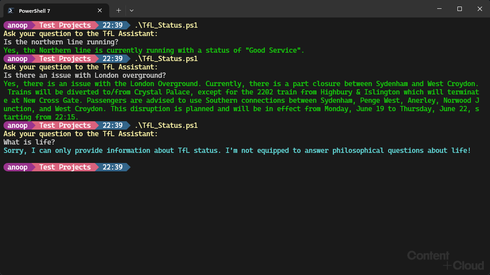

# Get TfL (Transport for London) status with OpenAI function calling feature

## Summary

This sample uses OpenAI's function calling feature to get status of a TfL (Transport for London) line and present it to the user. The response from TfL API is passed to OpenAI which then displays it in the way we need it.

## Pre-requisites

- An Open AI API key which can be done by [creating an account](https://platform.openai.com/signup/) for using Open AI API
    - Once the key is obatined, set the value of `$openai_api_key` in the script with that key




# [PowerShell](#tab/powershell)
```powershell

# A PowerShell script to get status of TfL (Transport for London) tube lines using OpenAI and TfL APIs

# A function to get status of lines from TfL API
function Get-TubeStatus {
    param(
        [Parameter(Mandatory = $true)]
        [string]$line
    )

    $tfl_api_endpoint = "https://api.tfl.gov.uk/Line/$line/Status";
    $response = Invoke-WebRequest -Uri $tfl_api_endpoint -Method Get
    return $response;

}

# A function to show funny message that is passed as parameter
function Show-FunnyMessage {
    param(
        [Parameter(Mandatory = $true)]
        [string]$message
    )

    Write-Host $message -ForegroundColor Cyan
}

# A function to call OpenAI API which accepts messages array, functions array and model
# and returns the response from OpenAI API
function Invoke-OpenAI {
    param(
        [Parameter(Mandatory = $true)]
        $messages,
        [Parameter(Mandatory = $true)]
        [string]$model
    )

    $openai_api_key = "sk-xxxxxxxxxxxxxxxxxxxxxxxxxxxxxxxxxxxx";
    $openai_api_endpoint = "https://api.openai.com/v1/chat/completions";
    
    $data = @{
        "model"      = $model;
        "messages"   = $messages;
        "functions"  = $functions;
        "max_tokens" = 256;
    }
    
    $headers = @{
        "Content-Type"  = "application/json"
        "Authorization" = "Bearer " + $openai_api_key
    }
    $response = Invoke-WebRequest -Uri $openai_api_endpoint -Method Post -Headers $headers -Body ($data | ConvertTo-Json -Depth 10)

    return $response;

}

# A function to process response from OpenAI API and return the response text. Accepts response and messages array as parameters.
function Get-Result {
    param(
        [Parameter(Mandatory = $true)]
        [object]$response,
        [Parameter(Mandatory = $true)]
        $messages
    )

    if ($response -and $response.StatusCode -eq 200) {

        $response_json_first_choice = ($response.Content | ConvertFrom-Json | Select-Object -ExpandProperty "choices")[0];
        $response_finish_reason = $response_json_first_choice.finish_reason;

        # if response_finish_reason is "function_call" then call the function which is in response["choices"][0]["message"]["function_call"]["name"]
        # and pass the arguments which is in response["choices"][0]["message"]["function_call"]["arguments"]

        if ($response_finish_reason -eq "function_call") {
            $function_name = $response_json_first_choice.message.function_call.name
            $function_arguments = $response_json_first_choice.message.function_call.arguments | ConvertFrom-Json

            # Based on the function name, call the function and pass the arguments

            switch ($function_name) {
                "getTubeStatus" {
                    $line = $function_arguments | Select-Object -ExpandProperty "line";
                    $tube_status = Get-TubeStatus -line $line;
                
                    # Compose a message of type "assistant" with function name and arguments
                    $assistant_message = @{
                        "role"          = "assistant";
                        "content"       = "";
                        "function_call" = @{
                            "name"      = $function_name;
                            "arguments" = $function_arguments | ConvertTo-Json;
                        }
                    }

                    # Push the assistant message to messages array
                    $messages += $assistant_message;

                    # Compose a message of type "function" with the response from TfL API
                    $function_message = @{
                        "role"    = "function";
                        "name"    = $function_name;
                        "content" = $tube_status.Content | ConvertFrom-Json | ForEach-Object { $_.name + ": " + ($_.lineStatuses[0] | ConvertTo-Json) } | Out-String;
                    }

                    # Push the function message to messages array
                    $messages += $function_message;

                    # Call Invoke-OpenAI function again with updated messages array
                    $second_response = Invoke-OpenAI -messages $messages -model "gpt-3.5-turbo-0613";
                    return Get-Result -response $second_response -messages $messages;
                }

                "showFunnyMessage" {
                    $message = $function_arguments | Select-Object -ExpandProperty "funnyMessage";
                    Show-FunnyMessage -message $message;
                }
            }

        }

        # if response_finish_reason is "stop" then get the response from response["choices"][0]["message"]["content"]
        # and return the response

        if ($response_finish_reason -eq "stop") {
            $result = $response.Content | ConvertFrom-Json | Select-Object -ExpandProperty choices | Select-Object -ExpandProperty message | Select-Object -ExpandProperty content;
            return $result;
        }
    } else {
        Write-Host "Error: " -ForegroundColor Red -NoNewline
        Write-Host $response.StatusCode -ForegroundColor Red
        return $null;
    }
}

# Main function
# Get user input, compose a message of type "user" and call Invoke-OpenAI function

function Start-Chat {

    $messages = @()
    
    # Add a system message to messages array
    $system_message = @{}
    $system_message["role"] = "system";
    $system_message["content"] = "You are a TfL Assistant. You need to help customers with their queries about London Underground.";

    Write-Host "Ask your question to the TfL Assistant:" -ForegroundColor Yellow
    $user_input = Read-Host
    $user_input = $user_input.Trim();

    # Compose a message of type "user" with user message
    $user_message = @{}
    $user_message["role"] = "user";
    $user_message["content"] = $user_input;

    # Push the user message to messages array
    $messages += $user_message;

    # Call Invoke-OpenAI function with messages array
    $response = Invoke-OpenAI -messages $messages -model "gpt-3.5-turbo-0613";

    # Call Get-Result function with response and messages array
    $final_response = Get-Result -response $response -messages $messages;

    Write-Host $final_response -ForegroundColor Green
}

# A global variable to store functions array
$functions = @()

# Add getTubeStatusFunction to functions array
$getTubeStatusFunction = @{
    "name"        = "getTubeStatus";
    "description" = "Get the status of a London Underground line";
    "parameters"  = @{
        "type"       = "object";
        "properties" = @{
            "line" = @{
                "type"        = "string";
                "description" = "The name of the London Underground line";
                "enum"        = @("bakerloo", "central", "circle", "district", "dlr", "elizabeth", "hammersmith-city", "jubilee", "london-overground", "metropolitan", "northern", "piccadilly", "tram", "victoria", "waterloo-city");
            }
        }
        "required"   = @("line");
    }
}
$functions += $getTubeStatusFunction;

# Add showFunnyMessage function to functions array
$showFunnyMessageFunction = @{
    "name"        = "showFunnyMessage";
    "description" = "SIf user's query is not related to TfL status then show a funny message";
    "parameters"  = @{
        "type"       = "object";
        "properties" = @{
            "funnyMessage" = @{
                "type"        = "string";
                "description" = "A funny message to say why user's query is not related to TfL. Max 20 words.";
            }
        }
        "required"   = @("funnyMessage");
    }
}

$functions += $showFunnyMessageFunction;

# Call Start-Chat function
Start-Chat

```
[!INCLUDE [More about OpenAI API](https://platform.openai.com/docs/introduction)]


## Contributors

| Author(s) |
|-----------|
| Anoop Tatti |


[!INCLUDE [DISCLAIMER](../../docfx/includes/DISCLAIMER.md)]
