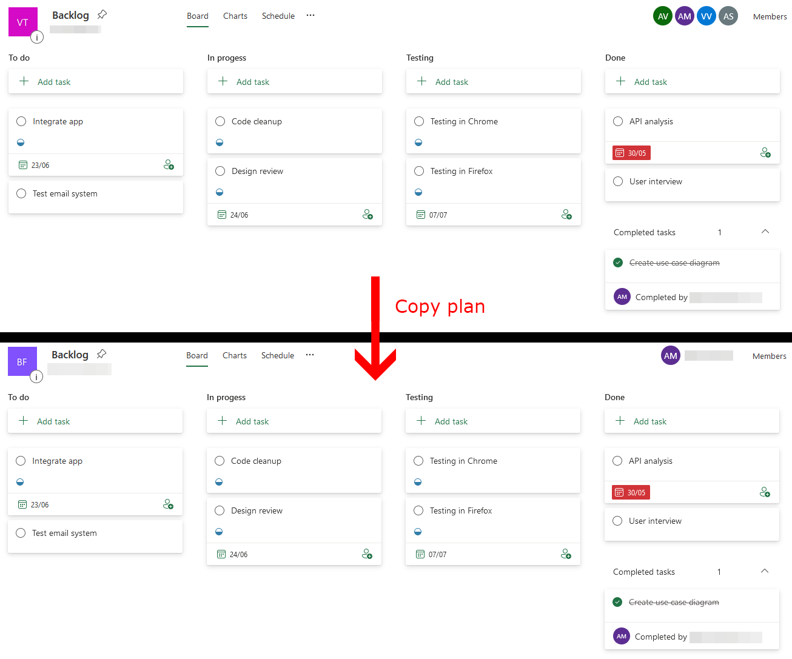

# Copy Planner plan

## Summary

With this sample, you can copy an existing Planner plan to a specific group. This script will create a new plan with the same name and copy all buckets and tasks.

Following data will be copied:
* Plan name
* Buckets
* Tasks
  * Title
  * Notes
  * Progress
  * Priority
  * Start date
  * Due date



## Script parameters

| Parameter | Mandatory | Description |
| --- | --- | --- |
| SourcePlanId | Yes | Source Planner plan to copy. |
| DestinationGroupId | Yes | Destination group ID to copy the plan to. |

# [CLI for Microsoft 365 with PowerShell](#tab/cli-m365-ps)

```powershell
# Usage example:
# .\Copy-Planner-plan.ps1 -SourcePlanId xqQg5FS2LkCp935s-FIFm2QAFkHM -DestinationGroupId 00000000-0000-0000-0000-000000000000

[CmdletBinding()]
param (
  [Parameter(Mandatory = $true, HelpMessage = "Source Planner plan to copy e.g. xqQg5FS2LkCp935s-FIFm2QAFkHM.")]
  [string]$SourcePlanId,

  [Parameter(Mandatory = $true, HelpMessage = "Destination group ID to copy the plan to e.g. 00000000-0000-0000-0000-000000000001.")]
  [guid]$DestinationGroupId
)
begin {
  Write-Host "Connecting..." -ForegroundColor Yellow   
  $m365Status = m365 status

  if ($m365Status -match "Logged Out") {
    m365 login
  }
}
process {
  Write-Host "Copying plan..." -ForegroundColor Yellow
  $ProgressActivity = "Copying Planner plan"
  Write-Progress -Activity $ProgressActivity -Status "Reading source plan data" -PercentComplete 0

  $plan = m365 planner plan get --id $SourcePlanId | ConvertFrom-Json
  $buckets = m365 planner bucket list --planId $SourcePlanId | ConvertFrom-Json
  $tasks = m365 planner task list --planId $SourcePlanId | ConvertFrom-Json

  # Buckets and tasks are fetched in reverse order
  [array]::Reverse($buckets)
  [array]::Reverse($tasks)

  Write-Progress -Activity $ProgressActivity -Status "Creating new plan at destination group" -PercentComplete 25

  $clonedPlan = m365 planner plan add --ownerGroupId $DestinationGroupId --title $plan.Title | ConvertFrom-Json

  Write-Progress -Activity $ProgressActivity -Status "Creating buckets" -PercentComplete 50

  # Create mapping object for buckets {Key: sourceId; Value: destinationId}
  $bucketMapping = @{}
  foreach ($bucket in $buckets) {
    $clonedBucket = m365 planner bucket add --planId $clonedPlan.id --name $bucket.name | ConvertFrom-Json
    $bucketMapping[$bucket.id] = $clonedBucket.id
  }

  Write-Progress -Activity $ProgressActivity -Status "Creating tasks" -PercentComplete 75

  foreach ($task in $tasks) {
    $command = "m365 planner task add --planId $($clonedPlan.id) --bucketId $($bucketMapping[$task.bucketId]) --title '$($task.title.Replace("'", "''"))' --percentComplete $($task.percentComplete)  --priority $($task.priority)"
    
    # Append optional options when needed
    if ($task.hasDescription) {
      $details = m365 planner task get --id $task.id | ConvertFrom-Json
      $command += " --description '$($details.description.Replace("'", "''"))'"
    }
    if ($null -ne $task.startDateTime) {
      $command += " --startDateTime $($task.startDateTime)"
    }
    if ($null -ne $task.dueDateTime) {
      $command += " --dueDateTime $($task.dueDateTime)"
    }

    Invoke-Expression $command | Out-Null
  }
}
end {
  Write-Progress -Activity $ProgressActivity -Status "Plan copied!" -PercentComplete 100 -Completed
  Write-Host "Script completed!" -ForegroundColor Green
}
```

[!INCLUDE [More about CLI for Microsoft 365](../../docfx/includes/MORE-CLIM365.md)]

# [PnP PowerShell](#tab/pnpps)
```powershell
# Usage example:
# .\Copy-Planner-plan.ps1 -SourcePlanId 73RAujmtbEKfwfA20Sb46ZgAB_Vi -DestinationGroupId 00000000-0000-0000-0000-000000000000 -AdminUrl https://contoso-admin.sharepoint.com

[CmdletBinding()]
param (
  [Parameter(Mandatory = $true, HelpMessage = "Source Planner plan to copy e.g. xqQg5FS2LkCp935s-FIFm2QAFkHM.")]
  [string]$SourcePlanId,

  [Parameter(Mandatory = $true, HelpMessage = "Destination group ID to copy the plan to e.g. 00000000-0000-0000-0000-000000000001.")]
  [string]$DestinationGroupId,

  [Parameter(Mandatory = $true, HelpMessage = "The Url of the SharePoint Admin Centre, e.g.https://contoso-admin.sharepoint.com  ")]
  [string]$AdminUrl
)

Begin  {
    Connect-PnPOnline -Url $AdminUrl -Interactive
}

process {
  Write-Host "Copying plan..." -ForegroundColor Yellow
  $ProgressActivity = "Copying Planner plan"
  Write-Progress -Activity $ProgressActivity -Status "Reading source plan data" -PercentComplete 0

  $plan = Get-PnPPlannerPlan -Id $SourcePlanId
  $buckets = Get-PnPPlannerBucket -PlanId $SourcePlanId 
  $tasks = Get-PnPPlannerTask -PlanId $SourcePlanId 

  # Buckets and tasks are fetched in reverse order
  [array]::Reverse($buckets)
  [array]::Reverse($tasks)

  Write-Progress -Activity $ProgressActivity -Status "Creating new plan at destination group" -PercentComplete 25

  $clonedPlan = New-PnPPlannerPlan -Group $DestinationGroupId -Title $plan.Title

  Write-Progress -Activity $ProgressActivity -Status "Creating buckets" -PercentComplete 50

  # Create mapping object for buckets {Key: sourceId; Value: destinationId}
  $bucketMapping = @{}
  foreach ($bucket in $buckets) {
    $clonedBucket = Add-PnPPlannerBucket -PlanId $clonedPlan.id -Name $bucket.name 
    $bucketMapping[$bucket.id] = $clonedBucket.id
  }

  Write-Progress -Activity $ProgressActivity -Status "Creating tasks" -PercentComplete 75

  foreach ($task in $tasks) {
    $command = "Add-PnPPlannerTask -planId $($clonedPlan.id) -bucket $($bucketMapping[$task.bucketId]) -Title '$($task.title.Replace("'", "''"))' -PercentComplete $($task.percentComplete)  -Priority $($task.priority)"
    
    # Append optional options when needed
    if ($task.hasDescription) {
      $details = Get-PnPPlannerTask -TaskId $task.id
      $command += " -Description '$($details.description.Replace("'", "''"))'"
    }
    if ($null -ne $task.startDateTime) {
      $command += " -StartDateTime '"+ $(get-date -date $task.StartDateTime -Format 'dd/MM/yyyy HH:mm') + "'"
    }
    if ($null -ne $task.dueDateTime) {
      $command += " -DueDateTime '" + $(get-date -date $task.dueDateTime -Format 'dd/MM/yyyy HH:mm') +"'"
    }

    Invoke-Expression $command | Out-Null
  }
}
end {
  Write-Progress -Activity $ProgressActivity -Status "Plan copied!" -PercentComplete 100 -Completed
  Write-Host "Script completed!" -ForegroundColor Green
}

```
[!INCLUDE [More about PnP PowerShell](../../docfx/includes/MORE-PNPPS.md)]

***
## Contributors

| Author(s) |
|-----------|
| Milan Holemans |
| [Reshmee Auckloo](https://github.com/reshmee011)|

[!INCLUDE [DISCLAIMER](../../docfx/includes/DISCLAIMER.md)]

