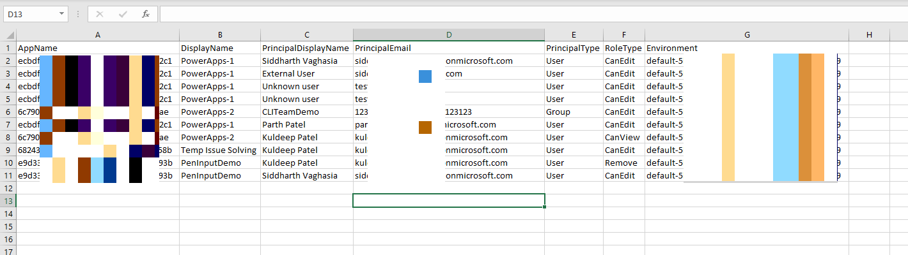
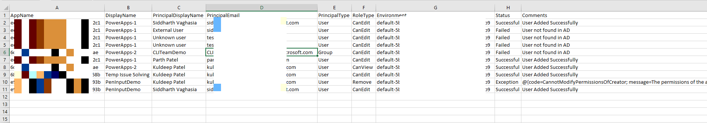

# Add/Remove users(bulk) from Power Apps from CSV file

## Summary

This PowerShell script will Add/Remove/Modify multiple(bulk) users access to/from one or multiple Power Apps from CSV file....


CSV file columns details

| Column Name   | Details  | Comment  |
|---|---|---|
| AppName  | Power Apps App Id   |   This can checking details of the app from apps.powerapps.com and selecting the app |
| PrincipalDisplayName  | User Display name   |   |
|  PrincipalEmail | Email id of user or group id or external user principal name   |   |
|  PrincipalType | User or Group  |   |
|  RoleType | CanEdit, CanView, Remove |  CanEdit will give co-owner access ~~ CanView will give user access ~~ Remove will remove user from targeted PowerApp |
|  Environment | Power Platform Environment ID  |   |
                                       
You can download input reference file at [here](assets/InputCSV.csv)

Screenshot of Input file for quick reference




Screenshot of Output file for quick reference




## Implementation

- Open Windows PowerShell ISE
- Create a new file
- Prepare the input csv file based on instruction above
- update the path in below script
- Save the file and run it
- Make sure you are Power Apps admin to so that you have access to all the apps
 
# [Power Apps PowerShell](#tab/powerapps-ps)
```powershell


#Modules for Power Apps Powershell Commands
Install-Module -Name Microsoft.PowerApps.Administration.PowerShell
Install-Module -Name Microsoft.PowerApps.PowerShell -AllowClobber

#Power Apps Connection
Add-PowerAppsAccount
$CsvPath = 'D:\SP\repos\InputCSV.csv'
$currentTime=$(get-date).ToString("yyyyMMddHHmmss");    
$outputFilePath= "D:\SP\repos\OutPutCSV"+$currentTime+".csv"   
$resultColl=@()  
write-host -ForegroundColor Green "Script Started!!"
foreach($User in (Import-Csv -Path $CsvPath))

{
    $UserAppName=$User.AppName
    $UserEnvironment=$User.Environment
    $UserEmail=$User.PrincipalEmail
    $UserType = $User.PrincipalType
    $UserRoleType=$User.RoleType
    $result = New-Object PSObject
    $result | Add-Member -MemberType NoteProperty -name "AppName" -value $user.AppName -Force
    $result | Add-Member -MemberType NoteProperty -name "DisplayName" -value $user.DisplayName -Force
    $result | Add-Member -MemberType NoteProperty -name "PrincipalDisplayName" -value $user.PrincipalDisplayName-Force
    $result | Add-Member -MemberType NoteProperty -name "PrincipalEmail" -value $user.PrincipalEmail-Force
    $result | Add-Member -MemberType NoteProperty -name "PrincipalType" -value $user.PrincipalType-Force
    $result | Add-Member -MemberType NoteProperty -name "RoleType" -value $user.RoleType-Force
    $result | Add-Member -MemberType NoteProperty -name "Environment" -value $user.Environment -Force
    #Role types in Input File
    #Owner - Owner of app
    #CanEdit - Co-Owner of App    
    #CanView - Read Access
    write-host  "Processing User $($UserEmail)..."
    if($UserRoleType -eq "Remove")
    {
        try {
            #Get Users Object ID
            $ObjectVal= Get-UsersOrGroupsFromGraph -ObjectId $UserEmail
            $Value=$ObjectVal.ObjectId
            if($Value -eq $null){
                $result | Add-Member -MemberType NoteProperty -name "Status" -value "Failed" -Force
                $result | Add-Member -MemberType NoteProperty -name "Comments" -value "User not found in AD" -Force
                $resultColl += $result 
                write-host -ForegroundColor Red "User Not found in AD"
                }else
                {
                 write-host  "Attempting to Remove $($UserEmail)..."
            $response = Remove-AdminPowerAppRoleAssignment -RoleId $Value -EnvironmentName $UserEnvironment -AppName $User.AppName
            
            #to handle if the we are trying to remove owner which is not possible.
            if($response.Code -eq "400") 
            {
                
                $result | Add-Member -MemberType NoteProperty -name "Status" -value "Exception" -Force
                $result | Add-Member -MemberType NoteProperty -name "Comments" -value $response.Error -Force
                $resultColl += $result 
                write-host -ForegroundColor Red "Exception $($response.Error)"
            }
            else{
                $result | Add-Member -MemberType NoteProperty -name "Status" -value "Successful" -Force
                $result | Add-Member -MemberType NoteProperty -name "Comments" -value "User Removed Successfully" -Force
                $resultColl += $result 
                write-host -ForegroundColor Green "$($UserEmail) removed successfully!!"
            }
            }
        }
        catch {
            $ErrorMessage = $_.Exception.Message
            $result | Add-Member -MemberType NoteProperty -name "Status" -value "Exception" -Force
                $result | Add-Member -MemberType NoteProperty -name "Comments" -value $_.Exception.Message -Force
                $resultColl += $result 
                write-host -ForegroundColor Red "Exception $($ErrorMessage)"
        }
    }
    else
    {
        try {
            #Get Users Object ID
            $ObjectVal= Get-UsersOrGroupsFromGraph -ObjectId $UserEmail
            $Value=$ObjectVal.ObjectId
            if($Value -eq $null)
        {
                $result | Add-Member -MemberType NoteProperty -name "Status" -value "Failed" -Force
              $result | Add-Member -MemberType NoteProperty -name "Comments" -value "User not found in AD" -Force
               write-host -ForegroundColor Red "User Not found in AD"
            $resultColl += $result 
                }else
                {
                
                 write-host   "Attempting to Add $($UserEmail)..."
            Set-AdminPowerAppRoleAssignment -PrincipalType $UserType -PrincipalObjectId $Value -RoleName  $UserRoleType -AppName $User.AppName -EnvironmentName $UserEnvironment
            $result | Add-Member -MemberType NoteProperty -name "Status" -value "Successful" -Force
            $result | Add-Member -MemberType NoteProperty -name "Comments" -value "User Added Successfully" -Force
            $resultColl += $result 
            write-host -ForegroundColor Green "$($UserEmail) Added successfully!!"
        }
        }
        catch {
        $ErrorMessage = $_.Exception.Message
          $result | Add-Member -MemberType NoteProperty -name "Status" -value "Exception" -Force
                $result | Add-Member -MemberType NoteProperty -name "Comments" -value $_.Exception.Message -Force
                $resultColl += $result 
                write-host -ForegroundColor Red "Exception $($ErrorMessage)" 
        }
        
    }
    
}
$resultColl | Export-Csv $outputFilePath -NoTypeInformation 
write-host -ForegroundColor Green "Successfully Script Completed"   

```
[!INCLUDE [More about Power Apps PowerShell](../../docfx/includes/MORE-POWERAPPS.md)]
***

## Contributors

| Author(s) |
|-----------|
| [Siddharth Vaghasia](https://github.com/siddharth-vaghasia) |

[!INCLUDE [DISCLAIMER](../../docfx/includes/DISCLAIMER.md)]


