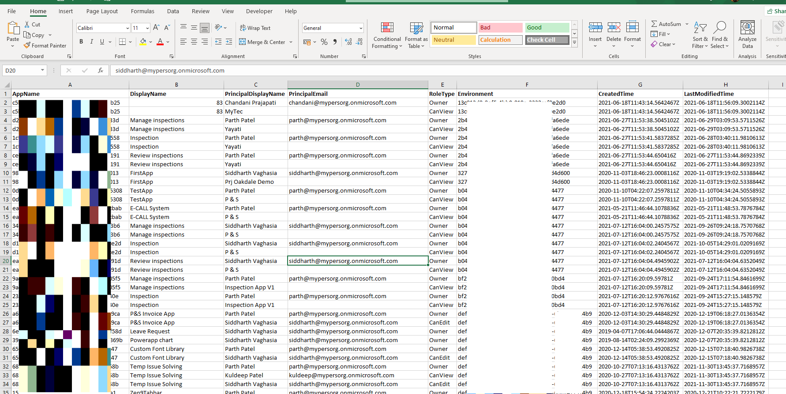

# Export all PowerApps details and its Role assigments from Tenant in CSV format

## Summary

This powershell script will export all the powerapps in a particular tenant and all its enviorment and its role assigments in csv format.


Script will export AppID, AppDisplay Name, User Display name, User Email, Role Type(Owner/CanView/CanEdit), Enviroment, App Created Time, App Modifed Time




## Implementation

- Open Windows PowerShell ISE
- Create a new file
- Save the file and run it
- Make sure you are PowerApps admin to so that you have access to all the apps
 
# [PnP PowerShell](#tab/pnpps)
```powershell

#Modules for PowerApps Powershell Commands
Install-Module -Name Microsoft.PowerApps.Administration.PowerShell
Install-Module -Name Microsoft.PowerApps.PowerShell -AllowClobber

#PowerApps Connection
Add-PowerAppsAccount

$currentTime=$(get-date).ToString("yyyyMMddHHmmss");    
$outputFilePath="D:\SP\repos\PowerAppsInventory-"+$currentTime+".csv"    
$resultColl=@()   

write-host -ForegroundColor Magenta "Getting all the PowerApp Details..."  
   
# Get all the PowerApps  
$apps=Get-AdminPowerApp 
foreach($app in $apps)  
{  
   
   foreach($user in Get-PowerAppRoleAssignment -Appname $app.Appname)
   { 
    $result = New-Object PSObject
    $result | Add-Member -MemberType NoteProperty -name "AppName" -value $app.AppName -Force
    $result | Add-Member -MemberType NoteProperty -name "DisplayName" -value $app.DisplayName  -Force
    $result | Add-Member -MemberType NoteProperty -name "PrincipalDisplayName" -value $user.PrincipalDisplayName-Force
    $result | Add-Member -MemberType NoteProperty -name "PrincipalEmail" -value $user.PrincipalEmail-Force
    $result | Add-Member -MemberType NoteProperty -name "RoleType" -value $user.RoleType-Force
    $result | Add-Member -MemberType NoteProperty -name "Environment" -value $app.EnvironmentName -Force
    $result | Add-Member -MemberType NoteProperty -Name "CreatedTime" -value $app.CreatedTime  -Force
    $result | Add-Member -MemberType NoteProperty -Name "LastModifiedTime" -value $app.LastModifiedTime  -Force
    $resultColl += $result 
   }

}  

#Export the result Array to CSV file  
$resultColl | Export-Csv $outputFilePath -NoTypeInformation 

write-host -ForegroundColor Magenta "Successful!!"  

```
[!INCLUDE [More about Powerapps PowerShell](https://docs.microsoft.com/en-us/power-platform/admin/powerapps-powershell)]
***


## Contributors

| Author(s) |
|-----------|
| Siddharth Vaghasia |

[!INCLUDE [DISCLAIMER](../../docfx/includes/DISCLAIMER.md)]

