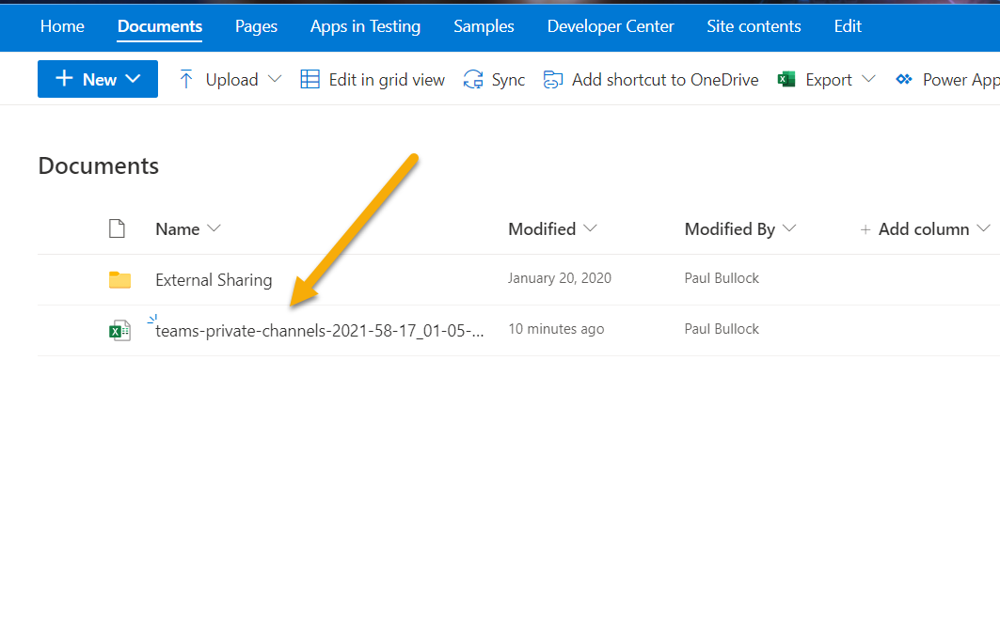

# Report of Private Teams to Excel

## Summary

This sample gathers all of the teams private channels in your tenant and produces an Excel file which is then uploaded to a SharePoint Site.
Two connections are used, one for the Admin Centre and the other to upload the file to the "Documents" location in the root site.



> [!Note]
> For this sample, you will require the [Excel PowerShell module](https://www.powershellgallery.com/packages/ImportExcel) to be installed

# [PnP PowerShell](#tab/pnpps)

```powershell

Write-Host "Running Script..."

# Connect to the standard SharePoint Site
$siteConn = Connect-PnPOnline -Url "https://contoso.sharepoint.com" -Interactive -ReturnConnection
    
# Connect to the SharePoint Online Admin Service
$adminSiteConn = Connect-PnPOnline -Url "https://contoso-admin.sharepoint.com" -Interactive -ReturnConnection

# SharePointy Adminy Stuff here
Write-Host "Connected to SharePoint Online Admin Centre"
    
#-----------------
# Gather Reporting Data
#-----------------

# Gets all Team Private Channels based on the template
$teamPrivateChannels = Get-PnPTenantSite -Template "TEAMCHANNEL#0" -Connection $adminSiteConn
    
#-----------------
# Produce and Save Reporting Data
#-----------------
$now = [System.DateTime]::Now.ToString("yyyy-mm-dd_hh-MM-ss")
$reportFileName = "teams-private-channels-$($now).xlsx"

$ExcelReportSettings = @{
    Path          = $reportFileName
    Title         = "Teams Private Channel Report"
    WorksheetName = "Teams Private Channels"
    AutoFilter    = $true 
    AutoSize      = $true
}

Write-Host "Creating Excel File $reportFileName"
$teamPrivateChannels | Select-Object Title, Url, StorageUsage, Owner, SiteDefinedSharingCapability `
| Export-Excel @ExcelReportSettings

# Save to SharePoint
$file = Add-PnPFile -Path $reportFileName -Folder "Shared Documents" -Connection $siteConn

Write-Host "Uploaded Excel File to SharePoint"

```

***

## Source Credit

Sample first appeared on [Azure Automation to the Rescue – Session at Scottish Summit 2021 | CaPa Creative Ltd](https://capacreative.co.uk/2021/02/27/azure-automation-to-the-rescue-session-at-scottish-summit-2021/)

## Contributors

| Author(s) |
|-----------|
| Paul Bullock |

[!INCLUDE [DISCLAIMER](../../docfx/includes/DISCLAIMER.md)]
