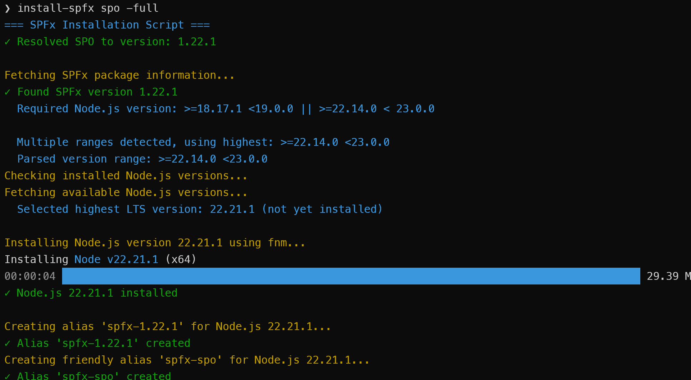
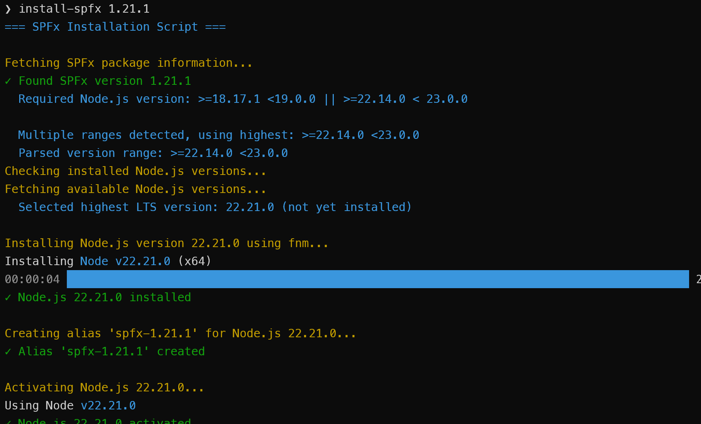
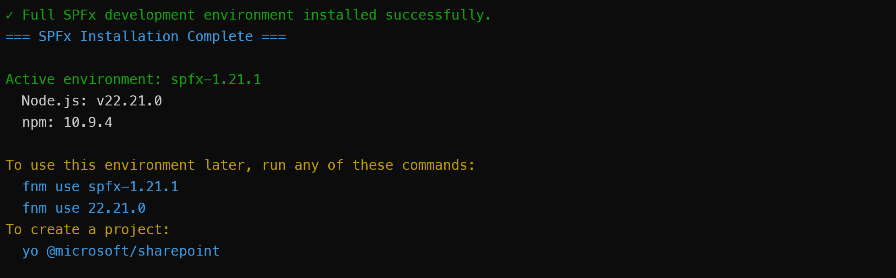

# Install SharePoint Framework Development Environment

## Summary

This Node.js script automates the installation and configuration of SharePoint Framework (SPFx) development environments with the correct Node.js versions and build tools. It uses fnm (Fast Node Manager) for Node.js version management and ensures compatibility between SPFx versions and Node.js versions based on Microsoft's official compatibility matrix.

Because the script determines the correct versions and tools automatically, it should work without modification for future versions of SPFx unless the toolchain changes.

The script supports installing specific SPFx versions or using special aliases for common scenarios:
- **SPO** - Latest GA release for SharePoint Online (default)
- **Next** - Latest beta/RC release
- **SP2016** - SharePoint 2016 on-premises (1.1.0)
- **SP2019** - SharePoint 2019 on-premises (1.4.1)
- **SSE** - SharePoint Subscription Edition (1.15.2)

Key features:
- Automatically resolves the correct Node.js version for any SPFx version. This is primarily done using the engines field in the SPFx package.json files, with a fallback compatibility matrix for older versions.
- Creates fnm aliases for easy version switching (e.g., `spfx-spo`, `spfx-1.21.1`)
- Installs build tools and optionally generators (Yeoman, @microsoft/generator-sharepoint)
- Supports force reinstall and comprehensive help documentation

## Prerequisites

- **Node.js 14 or later** - Required to run this installation script (the script itself needs Node.js 14+ to execute due to advanced javascript commands)

- **fnm (Fast Node Manager)** - Required for Node.js version management
  - Windows: `winget install Schniz.fnm` or `choco install fnm` or `scoop install fnm`
  - Linux/macOS: `curl -fsSL https://fnm.vercel.app/install | bash` or `brew install fnm`
  - More info: [https://github.com/Schniz/fnm](https://github.com/Schniz/fnm)

## Setup as a Command

You can set up this script to run as a simple command like `install-spfx` instead of typing `node /path/to/install-spfx.js` every time.

**Linux/macOS (bash/zsh):**
```bash
# Navigate to script directory and make script executable
cd /path/to/install-spfx.js
chmod +x install-spfx.js

# Add to PATH in ~/.bashrc (or ~/.zshrc if using zsh)
echo 'export PATH="$PATH:$PWD"' >> ~/.bashrc
source ~/.bashrc
```

**Windows (PowerShell):**
```powershell
# Edit PowerShell profile
notepad $PROFILE

# Add this line:
function install-spfx { node C:\path\to\install-spfx.js $args }

# Reload profile
. $PROFILE
```

## Screenshots

**Help Output**


**Installing SPO with Full Environment**


**Installing a Specific Version**


**Success Output with Usage Instructions**


# [Javascript](#tab/javascript)
```javascript
#!/usr/bin/env node

/**
 * SPFx Installation Script
 * Automates SPFx development environment setup with correct Node.js versions and build tools
 * Uses fnm (Fast Node Manager) for Node.js version management
 */

const { execSync } = require('child_process');
const https = require('https');

// ANSI color codes for terminal output
const colors = {
    reset: '\x1b[0m',
    cyan: '\x1b[36m',
    green: '\x1b[32m',
    yellow: '\x1b[33m',
    red: '\x1b[31m',
    gray: '\x1b[90m',
    white: '\x1b[37m'
};

function colorize(text, color) {
    return `${colors[color]}${text}${colors.reset}`;
}

// SPFx to Node.js compatibility matrix for versions without engines specification
// Based on Microsoft's official SPFx compatibility documentation
const COMPATIBILITY_MATRIX = {
    '1.0.0': '>=6.9.1 <7.0.0',
    '1.0.1': '>=6.9.1 <7.0.0',
    '1.0.2': '>=6.9.1 <7.0.0',
    '1.1.0': '>=6.9.1 <7.0.0',
    '1.1.1': '>=6.9.1 <7.0.0',
    '1.1.3': '>=6.9.1 <7.0.0',
    '1.2.0': '>=6.9.1 <7.0.0',
    '1.3.0': '>=8.9.4 <9.0.0',
    '1.3.1': '>=8.9.4 <9.0.0',
    '1.3.2': '>=8.9.4 <9.0.0',
    '1.3.4': '>=8.9.4 <9.0.0',
    '1.4.0': '>=8.9.4 <9.0.0',
    '1.4.1': '>=8.9.4 <9.0.0',
    '1.5.0': '>=8.9.4 <9.0.0',
    '1.5.1': '>=8.9.4 <9.0.0',
    '1.6.0': '>=8.9.4 <9.0.0',
    '1.7.0': '>=8.9.4 <9.0.0',
    '1.7.1': '>=8.9.4 <9.0.0',
    '1.8.0': '>=10.13.0 <11.0.0',
    '1.8.1': '>=10.13.0 <11.0.0',
    '1.8.2': '>=10.13.0 <11.0.0',
    '1.9.0': '>=10.13.0 <11.0.0',
    '1.9.1': '>=10.13.0 <11.0.0',
    '1.10.0': '>=10.13.0 <11.0.0',
    '1.11.0': '>=10.13.0 <13.0.0',
    '1.12.0': '>=10.13.0 <13.0.0'
};

// Parse command line arguments
function parseArgs() {
    const args = process.argv.slice(2);
    const params = {
        version: null,
        full: false,
        force: false,
        help: false
    };

    for (let i = 0; i < args.length; i++) {
        const arg = args[i].toLowerCase();
        if (arg === '-full' || arg === '--full') {
            params.full = true;
        } else if (arg === '-force' || arg === '--force') {
            params.force = true;
        } else if (arg === '-h' || arg === '--help' || arg === '-help') {
            params.help = true;
        } else if (!params.version) {
            params.version = args[i];
        }
    }

    // Default to SPO if no version specified and not help
    if (!params.version && !params.help) {
        params.version = 'SPO';
    }

    return params;
}

// Show help message
function showHelp() {
    console.log(colorize('=== SPFx Installation Script ===', 'cyan'));
    console.log('');
    console.log('Usage: node install-spfx.js [version] [-full] [-force]');
    console.log('');
    console.log('Arguments:');
    console.log('  [version]     SPFx version to install (e.g., 1.21.1, SPO, Next, SP2016, SP2019, SSE)');
    console.log('                Default: SPO (if no version specified)');
    console.log('  -full         Install full development environment (generators, Yeoman, build tools)');
    console.log('  -force        Force reinstall even if already installed');
    console.log('');
    console.log('Special version aliases:');
    console.log('  SPO           Latest GA release for SharePoint Online (default)');
    console.log('  Next          Latest beta/RC release');
    console.log('  SP2016        SharePoint 2016 on-premises (1.1.0)');
    console.log('  SP2019        SharePoint 2019 on-premises (1.4.1)');
    console.log('  SSE           SharePoint Subscription Edition (1.15.2)');
    console.log('');
    console.log('Examples:');
    console.log('  node install-spfx.js              # Installs SPO (default)');
    console.log('  node install-spfx.js -full        # Installs SPO with full environment');
    console.log('  node install-spfx.js SPO -full');
    console.log('  node install-spfx.js 1.21.1 -full');
    console.log('  node install-spfx.js Next -full -force');
}

// HTTP GET request helper
function httpGet(url) {
    return new Promise((resolve, reject) => {
        https.get(url, (res) => {
            let data = '';
            res.on('data', (chunk) => data += chunk);
            res.on('end', () => {
                try {
                    resolve(JSON.parse(data));
                } catch (e) {
                    reject(e);
                }
            });
        }).on('error', reject);
    });
}

// Execute shell command synchronously
function execCommand(command, options = {}) {
    try {
        const result = execSync(command, {
            encoding: 'utf8',
            stdio: options.silent ? 'pipe' : 'inherit',
            ...options
        });
        return { success: true, output: result, exitCode: 0 };
    } catch (error) {
        return { success: false, output: error.stdout || '', exitCode: error.status || 1 };
    }
}

// Check if fnm is installed
function checkFnmInstalled() {
    const result = execCommand('fnm --version', { silent: true });
    return result.success;
}

// Show fnm installation instructions
function showFnmInstallInstructions() {
    console.log(colorize('ERROR: fnm is not installed!', 'red'));
    console.log('');
    console.log(colorize('Please install fnm first:', 'yellow'));
    console.log('');

    if (process.platform === 'win32') {
        console.log(colorize('Windows Installation Options:', 'cyan'));
        console.log(colorize('  1. Using winget:', 'white'));
        console.log(colorize('     winget install Schniz.fnm', 'gray'));
        console.log('');
        console.log(colorize('  2. Using Chocolatey:', 'white'));
        console.log(colorize('     choco install fnm', 'gray'));
        console.log('');
        console.log(colorize('  3. Using Scoop:', 'white'));
        console.log(colorize('     scoop install fnm', 'gray'));
    } else {
        console.log(colorize('Linux/macOS Installation Options:', 'cyan'));
        console.log(colorize('  1. Using curl:', 'white'));
        console.log(colorize('     curl -fsSL https://fnm.vercel.app/install | bash', 'gray'));
        console.log('');
        console.log(colorize('  2. Using Homebrew (macOS):', 'white'));
        console.log(colorize('     brew install fnm', 'gray'));
    }
    console.log('');
    console.log(colorize('More info: https://github.com/Schniz/fnm', 'cyan'));
}

// Resolve special version aliases
async function resolveSpecialVersionAlias(version) {
    const versionLower = version.toLowerCase();
    let specialAlias = null;

    switch (versionLower) {
        case 'spo':
            specialAlias = 'spo';
            try {
                const data = await httpGet('https://registry.npmjs.org/@microsoft/sp-core-library');
                const stableVersions = Object.keys(data.versions)
                    .filter(v => !v.includes('-'))
                    .sort((a, b) => {
                        const aParts = a.split('.').map(Number);
                        const bParts = b.split('.').map(Number);
                        for (let i = 0; i < 3; i++) {
                            if (aParts[i] !== bParts[i]) return bParts[i] - aParts[i];
                        }
                        return 0;
                    });

                if (stableVersions.length === 0) {
                    console.log(colorize('ERROR: Could not find any stable GA releases', 'red'));
                    process.exit(1);
                }

                const resolved = stableVersions[0];
                console.log(colorize(`✓ Resolved SPO to version: ${resolved}`, 'green'));
                return { version: resolved, specialAlias };
            } catch (error) {
                console.log(colorize('ERROR: Failed to resolve SPO version from npm registry', 'red'));
                console.log(colorize(`Error details: ${error.message}`, 'red'));
                process.exit(1);
            }
        case 'next':
            specialAlias = 'next';
            console.log(colorize('Resolving Next (latest beta/RC)...', 'yellow'));
            try {
                const data = await httpGet('https://registry.npmjs.org/@microsoft/sp-core-library');
                const prereleaseVersions = Object.keys(data.versions)
                    .filter(v => v.includes('-'))
                    .map(v => {
                        const parts = v.split('-');
                        const baseVer = parts[0].split('.').map(Number);
                        const prerelease = parts[1];

                        let weight = 0;
                        if (prerelease.startsWith('rc')) weight = 1000;
                        else if (prerelease.startsWith('beta')) weight = 500;
                        else if (prerelease.startsWith('alpha')) weight = 100;

                        const numberMatch = prerelease.match(/\.(\d+)/);
                        const number = numberMatch ? parseInt(numberMatch[1], 10) : 0;

                        return { version: v, baseVer, weight, number };
                    })
                    .sort((a, b) => {
                        for (let i = 0; i < 3; i++) {
                            if (a.baseVer[i] !== b.baseVer[i]) return b.baseVer[i] - a.baseVer[i];
                        }
                        if (a.weight !== b.weight) return b.weight - a.weight;
                        return b.number - a.number;
                    });

                if (prereleaseVersions.length === 0) {
                    console.log(colorize('No prerelease versions found. Falling back to latest stable GA...', 'yellow'));
                    const stableVersions = Object.keys(data.versions)
                        .filter(v => !v.includes('-'))
                        .sort((a, b) => {
                            const aParts = a.split('.').map(Number);
                            const bParts = b.split('.').map(Number);
                            for (let i = 0; i < 3; i++) {
                                if (aParts[i] !== bParts[i]) return bParts[i] - aParts[i];
                            }
                            return 0;
                        });

                    if (stableVersions.length === 0) {
                        console.log(colorize('ERROR: Could not find any versions', 'red'));
                        process.exit(1);
                    }

                    const resolved = stableVersions[0];
                    console.log(colorize(`✓ Resolved Next to stable version: ${resolved}`, 'green'));
                    return { version: resolved, specialAlias };
                }

                const resolved = prereleaseVersions[0].version;
                console.log(colorize(`✓ Resolved Next to version: ${resolved}`, 'green'));
                return { version: resolved, specialAlias };
            } catch (error) {
                console.log(colorize('ERROR: Failed to resolve Next version from npm registry', 'red'));
                console.log(colorize(`Error details: ${error.message}`, 'red'));
                process.exit(1);
            }

        case 'sp2016':
            specialAlias = 'sp2016';
            console.log(colorize('Resolving SP2016 (SharePoint 2016 on-premises)...', 'yellow'));
            console.log(colorize('✓ Resolved SP2016 to version: 1.1.0', 'green'));
            return { version: '1.1.0', specialAlias };

        case 'sp2019':
            specialAlias = 'sp2019';
            console.log(colorize('Resolving SP2019 (SharePoint 2019 on-premises)...', 'yellow'));
            console.log(colorize('✓ Resolved SP2019 to version: 1.4.1', 'green'));
            return { version: '1.4.1', specialAlias };

        case 'sse':
            specialAlias = 'sse';
            console.log(colorize('Resolving SSE (SharePoint Subscription Edition)...', 'yellow'));
            console.log(colorize('✓ Resolved SSE to version: 1.15.2', 'green'));
            return { version: '1.15.2', specialAlias };

        default:
            return { version, specialAlias };
    }
}

// Check if alias exists
function checkAliasExists(aliasName) {
    const result = execCommand('fnm list', { silent: true });
    if (result.success) {
        return result.output.includes(aliasName);
    }
    return false;
}

// Helper to check if npm package is installed globally
function checkGlobalPackage(packageName) {
    try {
        const result = execCommand(`npm ls -g ${packageName} --depth=0 --json`, { silent: true });
        if (result.success && result.output) {
            const data = JSON.parse(result.output);
            const version = data.dependencies?.[packageName]?.version;
            return version ? { installed: true, version } : { installed: false };
        }
    } catch (e) {}
    return { installed: false };
}

// Check installed dev tools
async function checkInstalledDevTools() {
    //console.log(colorize('Checking for installed development tools...', 'yellow'));

    const toolsInstalled = [];
    const toolsMissing = [];

    // Check gulp-cli
    const gulpCli = checkGlobalPackage('gulp-cli');
    if (gulpCli.installed) {
        toolsInstalled.push(`gulp-cli@${gulpCli.version}`);
    }

    // Check @rushstack/heft
    const heft = checkGlobalPackage('@rushstack/heft');
    if (heft.installed) {
        toolsInstalled.push(`@rushstack/heft@${heft.version}`);
    }

    // Check yo
    const yo = checkGlobalPackage('yo');
    if (yo.installed) {
        toolsInstalled.push(`yo@${yo.version}`);
    } else {
        toolsMissing.push('yo');
    }

    // Check @microsoft/generator-sharepoint
    const generator = checkGlobalPackage('@microsoft/generator-sharepoint');
    if (generator.installed) {
        toolsInstalled.push(`@microsoft/generator-sharepoint@${generator.version}`);
    } else {
        toolsMissing.push('@microsoft/generator-sharepoint');
    }

    // Display results
    if (toolsInstalled.length > 0) {
        console.log(colorize('Installed development tools:', 'green'));
        toolsInstalled.forEach(tool => {
            console.log(colorize(`  ✓ ${tool}`, 'white'));
        });
    }

    if (toolsMissing.length > 0) {
        console.log(colorize('Missing development tools:', 'yellow'));
        toolsMissing.forEach(tool => {
            console.log(colorize(`  ✗ ${tool}`, 'white'));
        });
        console.log(colorize('Run with -full flag to install missing tools', 'yellow'));
    }
    console.log('');
}

// Determine build tool based on Heft version in sp-webpart-base
async function determineTaskRunner(version) {
    try {
        const data = await httpGet('https://registry.npmjs.org/@microsoft/sp-webpart-base');
        const versionData = data.versions[version];

        if (!versionData || !versionData.devDependencies || !versionData.devDependencies['@rushstack/heft']) {
            //console.log(colorize('Warning: Could not determine Heft version, defaulting to Gulp', 'yellow'));
            return { useHeft: false, skipGulpCli: false, heftVersion: null };
        }

        const heftVersionString = versionData.devDependencies['@rushstack/heft'];
        const heftMajor = parseInt(heftVersionString.replace(/[\^~>=<]/g, '').split('.')[0], 10);

        if (heftMajor >= 1) {
            console.log(colorize(`SPFx ${version} uses Heft (Heft version ${heftVersionString})`, 'cyan'));
            
            // Get Heft version from generator-sharepoint
            const generatorData = await httpGet('https://registry.npmjs.org/@microsoft/generator-sharepoint');
            const generatorVersionData = generatorData.versions[version];
            const heftVersion = generatorVersionData?.devDependencies?.['@rushstack/heft'] || null;

            return { useHeft: true, skipGulpCli: true, heftVersion };
        } else {
            console.log(colorize(`SPFx ${version} uses Gulp (Heft version ${heftVersionString} is pre-1.0)`, 'cyan'));
            return { useHeft: false, skipGulpCli: false, heftVersion: null };
        }
    } catch (error) {
        console.log(colorize('Warning: Could not check build tool, defaulting to Gulp', 'yellow'));
        return { useHeft: false, skipGulpCli: false, heftVersion: null };
    }
}

// Test Node engine compatibility
function testNodeEngineCompatibility(engineRange, nodeVersion) {
    if (!engineRange) return true;

    const tokens = engineRange.split(/\s+/);
    for (const token of tokens) {
        if (!token) continue;

        // >= or >
        if (token.match(/^>=?(\d+\.\d+\.\d+)$/)) {
            const ver = token.match(/^>=?(\d+\.\d+\.\d+)$/)[1].split('.').map(Number);
            const isGte = token.startsWith('>=');
            if (compareVersions(nodeVersion, ver) < (isGte ? 0 : 1)) return false;
            continue;
        }

        // < or <=
        if (token.match(/^<=?(\d+\.\d+\.\d+)$/)) {
            const ver = token.match(/^<=?(\d+\.\d+\.\d+)$/)[1].split('.').map(Number);
            const isLte = token.startsWith('<=');
            if (compareVersions(nodeVersion, ver) >= (isLte ? 1 : 0)) return false;
            continue;
        }

        // Caret ^
        const caretMatch = token.match(/^\^(\d+)\.(\d+)\.(\d+)$/);
        if (caretMatch) {
            const major = parseInt(caretMatch[1], 10);
            const lower = [major, parseInt(caretMatch[2], 10), parseInt(caretMatch[3], 10)];
            const upper = [major + 1, 0, 0];
            if (compareVersions(nodeVersion, lower) < 0 || compareVersions(nodeVersion, upper) >= 0) return false;
            continue;
        }

        // Tilde ~
        const tildeMatch = token.match(/^~(\d+)\.(\d+)\.(\d+)$/);
        if (tildeMatch) {
            const major = parseInt(tildeMatch[1], 10);
            const minor = parseInt(tildeMatch[2], 10);
            const lower = [major, minor, parseInt(tildeMatch[3], 10)];
            const upper = [major, minor + 1, 0];
            if (compareVersions(nodeVersion, lower) < 0 || compareVersions(nodeVersion, upper) >= 0) return false;
            continue;
        }

        // Exact version
        if (token.match(/^(\d+\.\d+\.\d+)$/)) {
            const ver = token.split('.').map(Number);
            if (compareVersions(nodeVersion, ver) !== 0) return false;
            continue;
        }
    }

    return true;
}

// Compare version arrays
function compareVersions(a, b) {
    for (let i = 0; i < 3; i++) {
        if (a[i] !== b[i]) return a[i] - b[i];
    }
    return 0;
}

// Determine compatible Yeoman version
async function determineYeomanVersion(nodeVersion) {
    try {
        // For Node.js v6.x, use yo@1.8.5 (last version compatible with Node.js v6)
        const activeNodeVersion = nodeVersion.replace(/^v/, '').split('.').map(Number);
        if (activeNodeVersion[0] === 6) {
            return '1.8.5';
        }

        const data = await httpGet('https://registry.npmjs.org/yo');

        const candidates = Object.keys(data.versions)
            .filter(v => {
                const engines = data.versions[v].engines?.node;
                if (!engines) return true;
                return testNodeEngineCompatibility(engines, activeNodeVersion);
            })
            .sort((a, b) => {
                const aParts = a.replace(/-.*/, '').split('.').map(Number);
                const bParts = b.replace(/-.*/, '').split('.').map(Number);
                for (let i = 0; i < 3; i++) {
                    if (aParts[i] !== bParts[i]) return bParts[i] - aParts[i];
                }
                return 0;
            });

        if (candidates.length > 0) {
            return candidates[0];
        } else {
            return data['dist-tags'].latest;
        }
    } catch (error) {
        return 'latest';
    }
}

// Determine compatible Gulp CLI version
async function determineGulpCliVersion(nodeVersion) {
    try {
        const data = await httpGet('https://registry.npmjs.org/gulp-cli');
        const activeNodeVersion = nodeVersion.replace(/^v/, '').split('.').map(Number);

        const candidates = Object.keys(data.versions)
            .filter(v => {
                const engines = data.versions[v].engines?.node;
                if (!engines) return true;
                return testNodeEngineCompatibility(engines, activeNodeVersion);
            })
            .sort((a, b) => {
                const aParts = a.replace(/-.*/, '').split('.').map(Number);
                const bParts = b.replace(/-.*/, '').split('.').map(Number);
                for (let i = 0; i < 3; i++) {
                    if (aParts[i] !== bParts[i]) return bParts[i] - aParts[i];
                }
                return 0;
            });

        if (candidates.length > 0) {
            return candidates[0];
        } else {
            return data['dist-tags'].latest;
        }
    } catch (error) {
        return 'latest';
    }
}

// Install task runner tools (gulp-cli or heft)
async function installTaskRunnerTool(version, force, nodeVersion) {
    console.log(colorize('Installing task runner tool...', 'yellow'));

    // Determine build tool
    const { useHeft, skipGulpCli, heftVersion } = await determineTaskRunner(version);

    // Install Gulp CLI or Heft (mutually exclusive based on SPFx version)
    if (!skipGulpCli) {
        const gulpCli = checkGlobalPackage('gulp-cli');

        if (!force && gulpCli.installed) {
            console.log(colorize('✓ gulp-cli already installed; skipping (use -force to update)', 'green'));
        } else {
            const msg = force ? 'Force (re)installing gulp-cli' : 'Installing Gulp CLI';
            console.log(colorize(`${msg}...`, 'yellow'));
            
            // Determine compatible gulp-cli version
            const gulpCliVersion = await determineGulpCliVersion(nodeVersion);
            console.log(colorize(`  Using gulp-cli@${gulpCliVersion}`, 'cyan'));
            
            const forceFlag = force ? ' --force' : '';
            const result = execCommand(`npm install -g gulp-cli@${gulpCliVersion}${forceFlag}`);
            if (!result.success) {
                console.log(colorize('ERROR: Failed to install Gulp CLI', 'red'));
                process.exit(1);
            }
            console.log(colorize('✓ Gulp CLI installed', 'green'));
        }
    } else {
        // Install Heft when Gulp CLI is not needed
        const heft = checkGlobalPackage('@rushstack/heft');

        if (!force && heft.installed) {
            console.log(colorize('✓ @rushstack/heft already installed; skipping (use -force to update)', 'green'));
        } else {
            const msg = force ? 'Force (re)installing @rushstack/heft' : 'Installing @rushstack/heft';
            const pkg = heftVersion ? `@rushstack/heft@${heftVersion}` : '@rushstack/heft';
            console.log(colorize(`${msg} ${heftVersion ? heftVersion : '(latest)'}...`, 'yellow'));
            
            const forceFlag = force ? ' --force' : '';
            const result = execCommand(`npm install -g ${pkg}${forceFlag}`);
            if (!result.success) {
                console.log(colorize('ERROR: Failed to install Heft', 'red'));
                process.exit(1);
            }
            console.log(colorize('✓ @rushstack/heft installed', 'green'));
        }
    }
    console.log('');
}

// Install generators and dev tools
async function installGenerators(version, force, nodeVersion) {
    console.log(colorize('This may take a few minutes...', 'gray'));
    console.log('');

    // Install SPFx generator
    const generator = checkGlobalPackage('@microsoft/generator-sharepoint');
    const generatorInstalled = generator.installed && generator.version === version;

    if (!force && generatorInstalled) {
        console.log(colorize(`✓ SPFx generator ${version} already installed; skipping (use -force to update)`, 'green'));
    } else {
        const msg = force ? `Force (re)installing SPFx generator version ${version}` : `Installing SPFx generator version ${version}`;
        console.log(colorize(`${msg} ...`, 'yellow'));
        
        const forceFlag = force ? ' --force' : '';
        const result = execCommand(`npm install -g @microsoft/generator-sharepoint@${version}${forceFlag}`);
        if (!result.success) {
            console.log(colorize('ERROR: Failed to install SPFx generator', 'red'));
            process.exit(1);
        }
        console.log(colorize('✓ SPFx generator installed', 'green'));
    }
    console.log('');

    // Determine compatible Yeoman version
    const yoSelectedVersion = await determineYeomanVersion(nodeVersion);

    // Install Yeoman
    const yo = checkGlobalPackage('yo');

    if (!force && yo.installed && yo.version === yoSelectedVersion) {
        console.log(colorize(`✓ Yeoman ${yo.version} already installed; skipping (use -force to update)`, 'green'));
    } else {
        const msg = force ? `Force (re)installing Yeoman ${yoSelectedVersion}` : `Installing Yeoman version ${yoSelectedVersion}`;
        console.log(colorize(`${msg}...`, 'yellow'));
        
        const forceFlag = force ? ' --force' : '';
        const result = execCommand(`npm install -g yo@${yoSelectedVersion}${forceFlag}`);
        if (!result.success) {
            console.log(colorize(`ERROR: Failed to install Yeoman ${yoSelectedVersion}`, 'red'));
            process.exit(1);
        }
        console.log(colorize(`✓ Yeoman ${yoSelectedVersion} installed`, 'green'));
    }
    console.log('');

    console.log(colorize('✓ Full SPFx development environment installed successfully.', 'green'));
}

// Main installation logic
async function main() {
    const params = parseArgs();

    if (params.help) {
        showHelp();
        process.exit(0);
    }

    console.log(colorize('=== SPFx Installation Script ===', 'cyan'));

    // Check fnm
    if (!checkFnmInstalled()) {
        showFnmInstallInstructions();
        process.exit(1);
    }

    // Resolve version
    const { version, specialAlias } = await resolveSpecialVersionAlias(params.version);
    console.log('');

    // Check if alias exists
    const aliasName = `spfx-${version}`;
    const aliasExists = checkAliasExists(aliasName);

    if (aliasExists) {
        console.log(colorize(`✓ Alias '${aliasName}' found. Activating...`, 'green'));

        // Create friendly alias if needed
        if (specialAlias) {
            const friendlyAlias = `spfx-${specialAlias}`;
            if (!checkAliasExists(friendlyAlias)) {
                console.log(colorize(`Creating friendly alias '${friendlyAlias}'...`, 'yellow'));
                const listOutput = execCommand('fnm list', { silent: true }).output;
                const match = listOutput.match(new RegExp(`v(\\d+\\.\\d+\\.\\d+).*\\b${aliasName}\\b`));
                if (match) {
                    execCommand(`fnm alias ${match[1]} ${friendlyAlias}`);
                    console.log(colorize(`✓ Alias '${friendlyAlias}' created`, 'green'));
                }
            }
        }

        // Activate alias
        execCommand(`fnm use ${aliasName}`);
        const nodeVersionActual = execCommand('node --version', { silent: true }).output.trim();
        let npmVersionActual = execCommand('npm --version', { silent: true }).output.trim();
        console.log(colorize(`  Active Node.js: ${nodeVersionActual}`, 'cyan'));
        console.log(colorize(`  Active npm: ${npmVersionActual}`, 'cyan'));
        
        // Upgrade npm if it's an older version (< v4) to avoid installation issues
        const npmMajorVersion = parseInt(npmVersionActual.split('.')[0], 10);
        if (npmMajorVersion < 4) {
            console.log(colorize('Upgrading npm to avoid installation issues with older versions...', 'yellow'));
            // Clear npm cache first to avoid corruption issues
            execCommand('npm cache clean', { silent: true });
            // Use npm 5.6.0 which is stable with Node.js v6.x
            const npmUpgradeResult = execCommand('npm install -g npm@5.6.0', { silent: false });
            if (npmUpgradeResult.success) {
                npmVersionActual = execCommand('npm --version', { silent: true }).output.trim();
                console.log(colorize(`✓ npm upgraded to ${npmVersionActual}`, 'green'));
            } else {
                console.log(colorize('Warning: Failed to upgrade npm, continuing with current version', 'yellow'));
            }
        }
        console.log('');

        // Install task runner tools (always)
        await installTaskRunnerTool(version, params.force, nodeVersionActual);

        // Check or install full environment
        if (!params.full) {
            await checkInstalledDevTools();
        } else {
            console.log(colorize('Installing generators and build tools...', 'yellow'));
            await installGenerators(version, params.force, nodeVersionActual);
        }

        // Show completion message
        console.log(colorize('=== SPFx Installation Complete ===', 'cyan'));
        console.log('');
        console.log(colorize(`Active environment: ${aliasName}`, 'green'));
        console.log(colorize(`  Node.js: ${nodeVersionActual}`, 'white'));
        console.log(colorize(`  npm: ${npmVersionActual}`, 'white'));
        console.log('');

        const allAliases = [];
        if (specialAlias) allAliases.push(`spfx-${specialAlias}`);
        allAliases.push(aliasName);

        console.log(colorize('To use this environment later, run any of these commands:', 'yellow'));
        allAliases.forEach(alias => {
            console.log(colorize(`  fnm use ${alias}`, 'cyan'));
        });
        const nodeVersionNumber = nodeVersionActual.replace(/^v/, '');
        console.log(colorize(`  fnm use ${nodeVersionNumber}`, 'cyan'));

        if (params.full) {
            console.log(colorize('To create a project:', 'yellow'));
            console.log(colorize('  yo @microsoft/sharepoint', 'cyan'));
        }

        return;
    }

    // New installation
    console.log(colorize('Fetching SPFx package information...', 'yellow'));
    try {
        const data = await httpGet('https://registry.npmjs.org/@microsoft/sp-core-library');

        if (!data.versions[version]) {
            console.log(colorize(`ERROR: SPFx version ${version} not found in npm registry!`, 'red'));
            const recentVersions = Object.keys(data.versions).slice(-5).join(', ');
            console.log(colorize(`Available versions include: ${recentVersions}`, 'yellow'));
            process.exit(1);
        }

        const versionData = data.versions[version];
        let nodeVersion = versionData.engines?.node;

        console.log(colorize(`✓ Found SPFx version ${version}`, 'green'));

        if (!nodeVersion) {
            // Try compatibility matrix fallback
            if (COMPATIBILITY_MATRIX[version]) {
                nodeVersion = COMPATIBILITY_MATRIX[version];
                console.log(colorize(`  Required Node.js version: ${nodeVersion} (from compatibility matrix)`, 'cyan'));
            } else {
                console.log(colorize('  Required Node.js version: (none specified in engines)', 'yellow'));
                console.log(colorize('  ERROR: Could not determine Node.js version requirement', 'red'));
                console.log(colorize('  This version is not in the compatibility matrix. Please specify manually.', 'red'));
                process.exit(1);
            }
        } else {
            console.log(colorize(`  Required Node.js version: ${nodeVersion}`, 'cyan'));
        }
        console.log('');

        // Parse Node version range
        let minVersion = null;
        let maxVersion = null;

        if (nodeVersion.includes('||')) {
            const ranges = nodeVersion.split('||').map(r => r.trim());
            const parsedRanges = ranges.map(range => {
                let min = null, max = null;
                const minMatch = range.match(/>=\s*(\d+\.\d+\.\d+)/);
                const maxMatch = range.match(/<\s*(\d+\.\d+\.\d+)/);
                if (minMatch) min = minMatch[1];
                if (maxMatch) max = maxMatch[1];
                return { min, max, minVer: min ? min.split('.').map(Number) : null };
            }).filter(r => r.min);

            const selected = parsedRanges.sort((a, b) => compareVersions(b.minVer, a.minVer))[0];
            minVersion = selected.min;
            maxVersion = selected.max;
            console.log(colorize(`  Multiple ranges detected, using highest: >=${minVersion}${maxVersion ? ` <${maxVersion}` : ''}`, 'cyan'));
        } else {
            const minMatch = nodeVersion.match(/>=\s*(\d+\.\d+\.\d+)/) || 
                            nodeVersion.match(/\^\s*(\d+\.\d+\.\d+)/) || 
                            nodeVersion.match(/~\s*(\d+\.\d+\.\d+)/) || 
                            nodeVersion.match(/(\d+\.\d+\.\d+)/);
            if (minMatch) minVersion = minMatch[1];

            const maxMatch = nodeVersion.match(/<\s*(\d+\.\d+\.\d+)/);
            if (maxMatch) maxVersion = maxMatch[1];
        }

        if (!minVersion) {
            console.log(colorize(`ERROR: Failed to parse Node.js version requirement: ${nodeVersion}`, 'red'));
            process.exit(1);
        }

        console.log(colorize(`  Parsed version range: >=${minVersion}${maxVersion ? ` <${maxVersion}` : ' (no upper limit)'}`, 'cyan'));

        // Get installed Node versions
        console.log(colorize('Checking installed Node.js versions...', 'yellow'));
        const installedResult = execCommand('fnm list', { silent: true });
        const installedVersions = installedResult.success 
            ? [...new Set([...installedResult.output.matchAll(/v(\d+\.\d+\.\d+)/g)].map(m => m[1]))]
            : [];

        // Get available versions
        console.log(colorize('Fetching available Node.js versions...', 'yellow'));
        const availableResult = execCommand('fnm list-remote', { silent: true });
        const allVersionsWithLTS = [];
        if (availableResult.success) {
            const lines = availableResult.output.split('\n');
            for (const line of lines) {
                const match = line.match(/v(\d+\.\d+\.\d+)/);
                if (match) {
                    const ver = match[1];
                    // LTS versions have a codename in parentheses, e.g., "v22.21.0 (Jod)"
                    const isLTS = /\([A-Z][a-z]+\)/.test(line);
                    allVersionsWithLTS.push({
                        version: ver,
                        isLTS,
                        versionParts: ver.split('.').map(Number)
                    });
                }
            }
        }

        // Filter eligible versions
        const minVer = minVersion.split('.').map(Number);
        const maxVer = maxVersion ? maxVersion.split('.').map(Number) : null;

        const eligibleVersions = allVersionsWithLTS
            .filter(v => {
                const notInstalled = !installedVersions.includes(v.version);
                const meetMin = compareVersions(v.versionParts, minVer) >= 0;
                const meetMax = !maxVer || compareVersions(v.versionParts, maxVer) < 0;
                return v.isLTS && notInstalled && meetMin && meetMax;
            })
            .sort((a, b) => compareVersions(b.versionParts, a.versionParts));

        let nodeVersionToInstall = null;
        if (eligibleVersions.length > 0) {
            nodeVersionToInstall = eligibleVersions[0].version;
            console.log(colorize(`  Selected highest LTS version: ${nodeVersionToInstall} (not yet installed)`, 'cyan'));
        } else {
            console.log(colorize('  No LTS versions found matching requirements. Checking all versions...', 'yellow'));
            const fallbackVersions = allVersionsWithLTS
                .filter(v => {
                    const notInstalled = !installedVersions.includes(v.version);
                    const meetMin = compareVersions(v.versionParts, minVer) >= 0;
                    const meetMax = !maxVer || compareVersions(v.versionParts, maxVer) < 0;
                    return notInstalled && meetMin && meetMax;
                })
                .sort((a, b) => compareVersions(b.versionParts, a.versionParts));

            if (fallbackVersions.length > 0) {
                nodeVersionToInstall = fallbackVersions[0].version;
                console.log(colorize(`  Selected highest non-LTS version meeting requirements: ${nodeVersionToInstall}`, 'yellow'));
            } else {
                console.log(colorize('ERROR: No suitable Node.js version found!', 'red'));
                process.exit(1);
            }
        }

        console.log('');
        console.log(colorize(`Installing Node.js version ${nodeVersionToInstall} using fnm...`, 'yellow'));

        // Install Node
        const installResult = execCommand(`fnm install ${nodeVersionToInstall}`);
        if (!installResult.success) {
            console.log(colorize(`ERROR: Failed to install Node.js version ${nodeVersionToInstall}`, 'red'));
            process.exit(1);
        }

        console.log(colorize(`✓ Node.js ${nodeVersionToInstall} installed`, 'green'));
        console.log('');

        // Create aliases
        console.log(colorize(`Creating alias '${aliasName}' for Node.js ${nodeVersionToInstall}...`, 'yellow'));
        execCommand(`fnm alias ${nodeVersionToInstall} ${aliasName}`);
        console.log(colorize(`✓ Alias '${aliasName}' created`, 'green'));

        if (specialAlias) {
            const friendlyAlias = `spfx-${specialAlias}`;
            console.log(colorize(`Creating friendly alias '${friendlyAlias}' for Node.js ${nodeVersionToInstall}...`, 'yellow'));
            execCommand(`fnm alias ${nodeVersionToInstall} ${friendlyAlias}`);
            console.log(colorize(`✓ Alias '${friendlyAlias}' created`, 'green'));
        }
        console.log('');

        // Activate Node
        console.log(colorize(`Activating Node.js ${nodeVersionToInstall}...`, 'yellow'));
        execCommand(`fnm use ${nodeVersionToInstall}`);
        console.log(colorize(`✓ Node.js ${nodeVersionToInstall} activated`, 'green'));
        console.log('');

        const nodeVersionActual = execCommand('node --version', { silent: true }).output.trim();
        let npmVersionActual = execCommand('npm --version', { silent: true }).output.trim();
        console.log(colorize(`Active Node.js: ${nodeVersionActual}`, 'cyan'));
        console.log(colorize(`Active npm: ${npmVersionActual}`, 'cyan'));
        
        // Upgrade npm if it's an older version (< v4) to avoid installation issues
        const npmMajorVersion = parseInt(npmVersionActual.split('.')[0], 10);
        if (npmMajorVersion < 4) {
            console.log(colorize('Upgrading npm to avoid installation issues with older versions...', 'yellow'));
            // Clear npm cache first to avoid corruption issues
            execCommand('npm cache clean', { silent: true });
            // Use npm 5.6.0 which is stable with Node.js v6.x
            const npmUpgradeResult = execCommand('npm install -g npm@5.6.0', { silent: false });
            if (npmUpgradeResult.success) {
                npmVersionActual = execCommand('npm --version', { silent: true }).output.trim();
                console.log(colorize(`✓ npm upgraded to ${npmVersionActual}`, 'green'));
            } else {
                console.log(colorize('Warning: Failed to upgrade npm, continuing with current version', 'yellow'));
            }
        }
        console.log('');

        // Install build tools (always)
        await installTaskRunnerTool(version, params.force, nodeVersionActual);

        // Install full environment if requested
        if (params.full) {
            await installGenerators(version, params.force, nodeVersionActual);
        } else {
            console.log(colorize(`✓ Node.js environment ready for SPFx ${version}`, 'green'));
            console.log(colorize('  (Use -full to install SPFx generators, Yeoman, and Gulp CLI)', 'white'));
        }

        console.log('');
        console.log(colorize('=== Installation Complete ===', 'cyan'));
        console.log('');

        // Show usage instructions
        console.log(colorize('To use this SPFx version:', 'yellow'));
        const allAliases = [];
        if (specialAlias) allAliases.push(`spfx-${specialAlias}`);
        allAliases.push(aliasName);
        console.log(colorize(`  1. Run: fnm use ${allAliases.join(' or fnm use ')}`, 'cyan'));
        console.log(colorize(`     Or: fnm use ${nodeVersionToInstall}`, 'cyan'));
        if (params.full) {
            console.log(colorize('  2. Create a new project: yo @microsoft/sharepoint', 'cyan'));
        }
        console.log('');

    } catch (error) {
        console.log(colorize('ERROR: Failed to fetch package information from npm registry', 'red'));
        console.log(colorize(`Error details: ${error.message}`, 'red'));
        process.exit(1);
    }
}

// Run main function
main().catch(error => {
    console.error(colorize('Unexpected error:', 'red'), error);
    process.exit(1);
});
```
***
## Contributors

| Author(s) |
|-----------|
| [Don Kirkham](https://github.com/donkirkham) |

[!INCLUDE [DISCLAIMER](../../docfx/includes/DISCLAIMER.md)]
